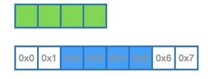
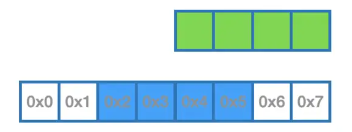
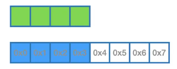
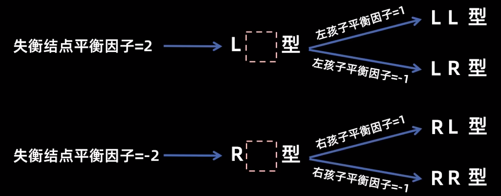
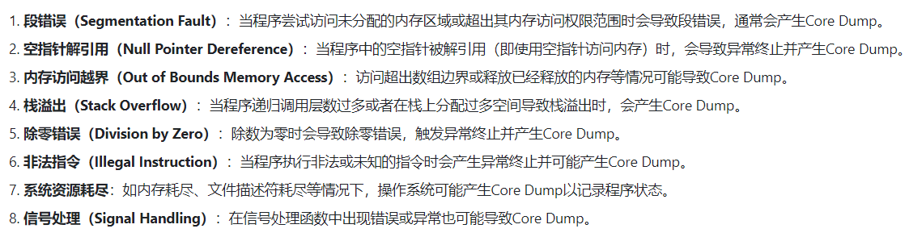
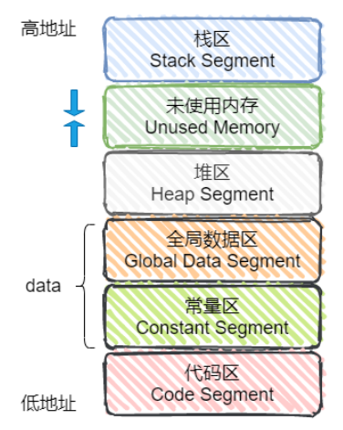
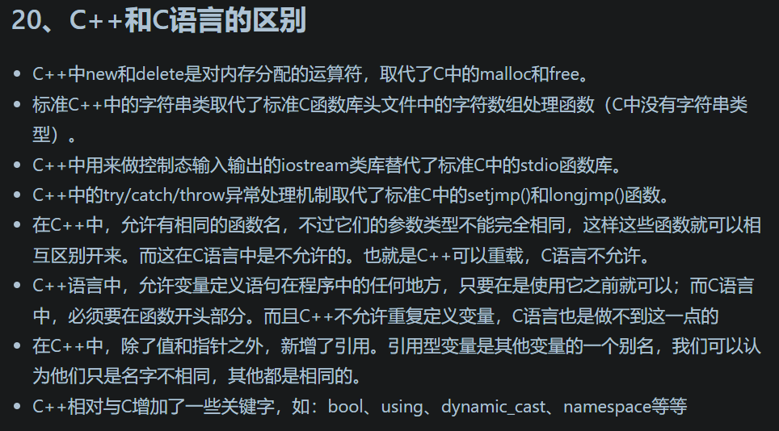

# 1 在main执行之前和之后执行的代码可能是什么？

**main函数执行之前执行的代码**

- 全局对象初始化，在main之前调用构造函数

```c++
class A
{
public:
    A()
    {
        cout << __FUNCTION__ << endl;
    }
};

A a;　　//调用构造函数

int main()
{
    cout << __FUNCTION__ << endl;
    return 0;　
}
//输出结果
A
main
```

- 将main函数的参数argc、argv传给main函数，才算真正调用main函数

```c++
int main() { 函数体 }  //写法1
int main(int argc, char* argv[]) { 函数体 } //写法2
```

- `__attribute__((constructor))` 

```c++
int main()
{ 
    cout << __FUNCTION__ << endl;
    return 0;
}

__attribute__((constructor)) void beforeMainToRun()
{
    cout << __FUNCTION__ << endl;
}

//执行结果
beforeMainToRun  
main
```


**main函数执行之后执行的代码**

- 可以注册一个`atexit`函数，注册的函数会在main之后运行

```c++
void func()
{
    cout << __FUNCTION__ << endl;
}

int main()
{ 
    cout << __FUNCTION__ << endl;
    atexit(func);
    return 0;
}

//执行结果
main
func

```

- `__attribute__((destructor))`

```c++
__attribute__((destructor)) void afterMainToRun()
{
    cout << __FUNCTION__ << endl;
}

int main()
{ 
    cout << __FUNCTION__ << endl;
    return 0;
}
```

- 其它，如全局对象的析构函数


# 2 内存对齐问题？

## **1 什么是内存对齐**

元素是按照声明顺序一个一个放到内存中去的，但并不是紧密排列的。元素放置的地址一定会在自己宽度的整数倍上开始，即内存对齐。

> 如果结构体是按8字节对齐的，处理器在读取这个结构体的数据时就是按8字节读取的。如果下一个结构体是按4字节对齐的，那么处理器读取下一个结构体时就是按4字节读取的。

## **2 为什么需要内存对齐？**

**结论：**

- 对齐与否会影响读取效率。
- 合理地利用对齐规则可以节省空间


**a. 处理器是如何读取内存的？**

如果把内存看做是简单的字节数组，比如在C语言中，char *就可表示一块内存。那么它的内存读取方式可以按照1byte顺序读取：


然而，尽管内存是以字节为单位，但是大部分处理器并不是按字节块来存取内存的，这取决于数据类型和处理器的设置；它一般会以双字节,4字节,8字节,16字节甚至32字节的`块`来存取内存，这些存取单位称为`内存存取粒度`

**b. 内存对齐、内存不对齐对比**

现在假设一个整型变量(4字节)不是自然对齐的，它的起始地址落在0x00000002（图中蓝色区域），处理器想要访问它的值，按照4字节的块进行读取，从图中的0x0起读，读取4字节大小，读到0x3



这样的一次读取之后，并不能取到要访问的整型数据，紧接着处理器会继续再往下读，偏移4个字节，从0x4开始，读到0x7



到这里，处理器才能读取到了需要访问的内存数据，这中间还存在剔除与合并的过程，读了两次才读到想要的数据。

如果是自然对齐的：



读取一次就能读到想要的数据。**对齐与否会影响读取效率。**

**c. 合理地利用对齐规则可以节省空间**

比如下列情况，结构体所占的字节数为24

```c++
struct test {
  int   a;  //4
  double  b;  //8
  short c;  //2
};

int main() 
{
    test t;
    cout << sizeof(t) << endl;  // 24
    return 0;
}
```

如果把b和c交换一下位置，那么结构体所占的字节数为16

```c++
struct test {
  int   a;  //4
  short c;  //2
  double  b;  //8
};

int main() 
{
    test t;
    cout << sizeof(t) << endl;  // 16
    return 0;
}
```

## 3 内存对齐规则

- 各成员变量存放的起始地址， 相对于结构体的起始地址的偏移量 ，必须为该变量的类型所占用的字节数的倍数；
- 各成员变量在存放的时候根据在结构体中声明的顺序依次申请空间， 同时按照上面的对齐方式调整位置， 空缺的字节自动填充
- 同时为了确保结构的大小为结构体的size最大成员的倍数，所以在为最后一个成员变量申请空间后 还会根据需要自动填充空缺的字节

## 4 影响内存对齐的因素

**1.`#pragma pack(n)`**

程序员可以通过预编译命令`#pragma pack(n)`，n=1,2,4,8,16来改变这一系数，其中的n就是要指定的“对齐系数”。这里规定的是上界，只影响对齐单元大于n的成员，对于对齐字节不大于n的成员没有影响。

通过预编译命令`#pragma pack()`取消自定义字节对齐方式。

```c++
#pragma pack(2) //让编译器对这个结构作2字节对齐
struct test
{
char x1;  //1
short x2; //2
float x3; //4
char x4; //1
};
#pragma pack() //取消1字节对齐，恢复为默认4字节对齐

int main() 
{
    test t;
    cout << sizeof(t) << endl; // 10

    return 0;
}
```

**2.alignas**

- C++11以后引入两个关键字 `alignas`与 `alignof`。其中`alignof`可以计算出类型的对齐方式，`alignas`可以指定结构体的对齐方式。

```c++
struct Info {
  int a;
  double b;
  int c;
};

// alignas生效的情况：设置的值大于等于size最大成员所占的字节数
struct alignas(16) Info2 {
  int a;
  double b;
  int c;
};

// alignas失效的情况：设置的值小size最大成员所占的字节数
struct alignas(4) Info3 {
  int a;
  double b;
  int c;
};

int main()
{
    std::cout << sizeof(Info) << std::endl;   // 24  8 + 8 + 8
    std::cout << alignof(Info) << std::endl;  // 8

    std::cout << sizeof(Info2) << std::endl;   // 32  16 + 16
    std::cout << alignof(Info2) << std::endl;  // 16
    
    std::cout << sizeof(Info3) << std::endl;   // 24  8 + 8 + 8
    std::cout << alignof(Info3) << std::endl;  // 8
    return 0;
}
//输出结果
24
8
32
16
24
8

```

参考：

> https://juejin.cn/post/6870162226032934926

# 3 指针和引用的区别

- 指针是一个变量，存储的是一个地址；引用跟原来的变量实质上是同一个东西，是原变量的别名
- 指针可以为空，而引用在定义的时候必须初始化
- 指针可以有多级，引用只有一级
- 指针在初始化之后可以改变指向，而引用在初始化之后不可改变
- sizeof指针得到的是本指针的大小，sizeof引用得到的是引用所指向变量的大小

```c++
void test(int *p)
{
　　int a=1;
　　p=&a;
　　cout<<p<<" "<<*p<<endl;
}

int main(void)
{
    int *p=NULL;
    test(p);
    if(p==NULL)
    cout<<"指针p为NULL"<<endl;
    return 0;
}
//运行结果为：
//0x61fddc 1
//指针p为NULL


void testPTR(int* p) {
	int a = 12;
	p = &a;

}

void testREFF(int& p) {
	int a = 12;
	p = a;

}
int main()
{
	int a = 10;
	int* b = &a;
    cout << "before: " <<  b << endl; // before: 0x61fe14
	testPTR(b); //相当于值传递，函数外实际上没改变指针
	cout << a << endl;// 10
	cout << *b << endl;// 10
    cout << "after: " <<  b << endl; // after: 0x61fe14

	a = 10;
	testREFF(a);
	cout << a << endl;//12
}

```


# 4 在传递函数参数时，什么时候该使用指针，什么时候该使用引用呢？

- 需要返回函数内局部变量的内存的时候用指针。使用指针传参需要开辟内存，用完要记得释放指针，不然会内存泄漏。而返回局部变量的引用是没有意义的

```c++
int* createArray(int size) {
    int* myArray = new int[size];  // 在堆上分配内存
    for (int i = 0; i < size; ++i) {
        myArray[i] = i * i;  // 初始化数组
    }
    // 返回一个指向堆内存的指针
    return myArray;
}

int main() {
    int* squareArray = createArray(5);

    for (int i = 0; i < 5; ++i) {
        std::cout << squareArray[i] << ' ';  // 输出数组
    }
    std::cout << std::endl;

    delete[] squareArray;  // 释放数组所占的内存

    return 0;
}

// 输出
0 1 4 9 16
```

- 类对象作为参数传递的时候使用引用，这是C++类对象传递的标准方式，传引用有以下特点：
  - **避免拷贝**：使用引用可以避免当对象作为参数传递时的潜在的拷贝操作，特别是对于大型对象，这可以显著提高性能。
  - **保持对原始对象的修改**：如果需要在函数内部修改类对象并反映到外部的原始对象，使用引用允许你直接在原始对象上操作，而不是在其副本上操作。
  - **语义清晰**：当通过引用传递参数时，它告诉使用函数的开发者，这个函数可能会修改传入的对象。
- 对栈空间大小比较敏感（比如递归）的时候使用引用。使用引用传递不需要创建临时变量，开销要更小

```c++
void recursiveFunction(const std::vector<int>& vec, int index) {
    if (index < 0 || index >= vec.size()) {
        return; // 基线条件
    }
    // 做一些处理...
    recursiveFunction(vec, index + 1); // 递归调用
}

int main() {
    std::vector<int> largeVector(1000, 42); // 大型向量
    recursiveFunction(largeVector, 0); // 通过引用传递
    return 0;
}
```


# 5 堆和栈的区别

- 申请方式不同
  - 栈是由系统自动分配
  - 堆是自己申请的，比如new对象 int myArray = new int[size];
- 申请大小限制不同
  - 栈顶和栈底是之前预设好的，栈是向栈底扩展，大小固定，可以通过ulimit -a查看，由ulimit -s修改。
  - 堆向高地址扩展，是不连续的内存区域，大小可以灵活调整。
- 申请效率不同。
  - 栈由系统分配，速度快，不会有碎片。
  - 堆由程序员分配，速度慢，且会有碎片。

|                  | 堆                                                           | 栈                                                           |
| ---------------- | ------------------------------------------------------------ | ------------------------------------------------------------ |
| **管理方式**     | 堆中资源由程序员控制（容易产生memory leak）                  | 栈资源由编译器自动管理，无需手工控制                         |
| **内存管理机制** | 系统有一个记录空闲内存地址的链表，当系统收到程序申请时，遍历该链表，寻找第一个空间大于申请空间的堆结点，删 除空闲结点链表中的该结点，并将该结点空间分配给程序（大多数系统会在这块内存空间首地址记录本次分配的大小，这样delete才能正确释放本内存空间，另外系统会将多余的部分重新放入空闲链表中） | 只要栈的剩余空间大于所申请空间，系统为程序提供内存，否则报异常提示栈溢出。（这一块理解一下链表和队列的区别，不连续空间和连续空间的区别，应该就比较好理解这两种机制的区别了） |
| **空间大小**     | 堆是不连续的内存区域（因为系统是用链表来存储空闲内存地址，自然不是连续的），堆大小受限于计算机系统中有效的虚拟内存（32bit 系统理论上是4G），所以堆的空间比较灵活，比较大 | 栈是一块连续的内存区域，大小是操作系统预定好的，windows下栈大小是2M（也有是1M，在 编译时确定，VC中可设置） |
| **碎片问题**     | 对于堆，频繁的new/delete会造成大量碎片，使程序效率降低       | 对于栈，它是有点类似于数据结构上的一个先进后出的栈，进出一一对应，不会产生碎片。（看到这里我突然明白了为什么面试官在问我堆和栈的区别之前先问了我栈和队列的区别） |
| **生长方向**     | 堆向上，向高地址方向增长。                                   | 栈向下，向低地址方向增长。                                   |
| **分配方式**     | 堆都是动态分配（没有静态分配的堆）                           | 栈有静态分配和动态分配，静态分配由编译器完成（如局部变量分配），动态分配由alloca函数分配，但栈的动态分配的资源由编译器进行释放，无需程序员实现。 |
| **分配效率**     | 堆由C/C++函数库提供，机制很复杂。所以堆的效率比栈低很多。    | 栈是其系统提供的数据结构，计算机在底层对栈提供支持，分配专门 寄存器存放栈地址，栈操作有专门指令。 |

**形象的比喻**

栈就像我们去饭馆里吃饭，只管点菜（发出申请）、付钱、和吃（使用），吃饱了就走，不必理会切菜、洗菜等准备工作和洗碗、刷锅等扫尾工作，他的好处是快捷，但是自由度小。

堆就像是自己动手做喜欢吃的菜肴，比较麻烦，但是比较符合自己的口味，而且自由度大。


# 6 堆快还是栈快

栈快 

- 操作系统会在底层对栈提供支持，会分配专门的寄存器存放栈的地址，栈的入栈出栈操作也十分简单，并且有专门的指令执行，所以栈的效率较高也比较快。

- 而堆的操作是由C/C++函数库提供的，在分配堆内存的时候需要一定的算法寻找合适大小的内存。并且获取堆的内容需要两次访问，第一次访问指针，第二次根据指针保存的地址访问内存，因此堆比较慢。


# 7 区别以下指针类型？

```c++
int *p[10] //指针数组，强调数组概念，一共有10个变量，每个数组元素都是一个指向 int 类型数据的指针
int (*p)[10] //数组指针，强调指针概念，只有一个变量，是指针类型， 它指向一个具有10个整数的数组
int *p(int) // 函数声明，函数名是p，参数类型是int类型，返回值是int*类型
int (*p)(int) // 函数指针，强调是指针，该指针指向的函数具有int类型参数，返回值也是int类型
```


# 8 new/delete 与 malloc/free的异同

相同点：

- 都可用于内存的动态申请和释放

不同点：

- malloc仅仅分配内存空间，free仅仅回收空间，不具备调用构造函数和析构函数功能，用malloc分配空间存储类的对象存在风险；new和delete除了分配回收功能外，还会调用构造函数和析构函数。

- new会先调用operator new函数，申请足够的内存（通常底层使用malloc实现）。然后调用类型的构造函数，初始化成员变量，最后返回自定义类型指针。delete先调用析构函数，然后调用operator delete函数释放内存（通常底层使用free实现）。malloc/free是库函数，只能动态的申请和释放内存，无法强制要求其做自定义类型对象构造和析构工作。

- 使用new操作符申请内存分配时无须指定内存块的大小，编译器会根据类型信息自行计算。而malloc则需要显式地指出所需内存的尺寸。

- new操作符内存分配成功时，返回的是对象类型的指针，类型严格与对象匹配，无须进行类型转换，所以new是类型安全的。而malloc内存分配成功则是返回void * ，需要通过强制类型转换将void*指针转换成我们需要的类型。

  


# 9 new和delete是如何实现的？

- new的实现：
  - 首先调用名为**operator new**的标准库函数，分配足够大的原始为类型化的内存，以保存指定类型的一个对象；
  - 接下来运行该类型的一个构造函数，用指定初始化构造对象；
  - 最后返回指向新分配并构造后的的对象的指针
- delete的实现：
  - 销毁对象：对指针指向的对象运行适当的析构函数；（编译器会自动选择合适的析构函数，析构函数可以被重载，但不建议）
  - 释放对象对应的内存：通过调用名为**operator delete**的标准库函数释放该对象所用内存
  - delete的作用：销毁给定的指针指向的对象；释放对应的内存


# 10 被free回收的内存是立即返还给操作系统吗？

不是的，内存通常会被添加到可用内存池中，并由程序的内存管理系统维护。

这些内存可能在之后的内存分配中再次被使用，以避免频繁地向操作系统请求内存。

当程序结束时，这些内存才会被彻底返回给操作系统。

同时，ptmalloc会尝试把小块的内存合并，避免过多的内存碎片

# 11 x++和++x的过程

```c++
// x++
int tmp = x;
x = x + 1;
return tmp;

// ++x
x = x + 1;
return x;
```


# 12 vector和list的区别

```bash
查找效率：
vector：内部封装了数组，内存空间连续，支持随机访问，查找效率O(1)
list：内部封装了链表，内存空间不连续，通过指针进行数据的访问，查找数据需要遍历，时间复杂度O(n)
插入/删除效率：
vector：需要移动数据，时间复杂度为O(n)
list：底层实现是双向链表，时间复杂度为O(1)
```


# 13 define和函数有何区别？

- 处理时机不同
  - 宏在预处理阶段完成替换，运行时不存在函数调用，执行起来更快
  - 函数需要等待后面的编译--汇编--链接操作，最终变成可执行文件

```c++
//替换前
#define p() printf("macro\n")
int main() 
{
    p();
    return 0;
}

//替换后
int main() 
{
    printf("func\n");
    return 0;
}
```

- 安全性不同
  - 有参宏函数在传参的时候也只是简单的参数替换，不涉及类型
  - 不同函数的形参有类型限制，所以更加安全一点，如果参数不合法，编译的时候就会体现
- 宏定义属于在结构中插入代码，没有返回值，函数调用具有返回值


# 14 define、const、typedef、inline的使用方法？他们之间有什么区别？

**define和typedef区别**

- typedef主要用于类型别名，#define不只是可以为类型取别名，还可以定义常量、变量等。

```c++
// 有两种方法可以定义类型别名：
//方法一：typedef
typedef double wages;	// wages 是 double的同义词
typedef wages base;		// base 是double 的同义词

//方法二（新标准）：别名声明
using SI = int	// SI 是 int 的同义词
    
// 类型别名和类型的名字等价，有类型的名字出现的地方，都可以替换为别名
wages hourly, weekly // 等价于 double houtly, weekly
SI item		//等价于 int item

    
// 宏定义
#define MAX_NUM 99
```

- 宏替换发生在预处理阶段，而typedef发生在编译阶段
- 宏定义不检查数据类型，typedef要检查数据类型
- 作用域不同，#define没有作用域的限制，只要是之前预定义过的宏，在以后的程序中都可以使用。而typedef有自己的作用域。
- 宏不是语句，不在最后面添加分号，typedef是语句，要以分号结束

**define和const的区别**

编译阶段

- define是在编译的**预处理**阶段起作用，而const是在编译、链接的时候起作用

安全性

- define只做替换，不做类型检查和计算，也不求解，容易产生错误，一般最好加上一个大括号包含住全部的内容，要不然很容易出错
- const常量有数据类型，编译器可以对其进行类型安全检查

内存占用

- define只是将宏名称进行替换，在内存中会产生多分相同的备份。const在程序运行中只有一份备份

const不能重定义，而define可以通过#undef取消某个符号的定义，进行重定义；

**define和inline的区别**

- 宏在预编译时进行，只做简单的字符串替换，内联函数可以做参数类型检查
- 内联函数在编译时直接将函数代码嵌入到函数调用处，省去了函数调用的开销来提高执行效率，可以实现重载


# 15 声明变量和定义的区别

- 变量只能在一处定义，但是可以在多处声明
  - 声明：一个文件如果想使用其它地方定义的变量，就必须声明它
  - 定义：定义负责创建与名字关联的实体

```c++
extern int i // 声明i并非定义i
int j		// 声明并定义j
```

- 任何包含了显示初始化的声明即成为了定义，能给 `extern`修饰的变量赋一个初始值，但这也抵消了`entern`的作用，将其变成了一个定义

```c++
extern int i = 1;	// 定义
```


# 16 strlen和sizeof的区别

- `sizeof`是运算符不是函数，`strlen`是字符处理的库函数

```c++
// sizeof用法
// sizeof运算符返回一条表达式或一个类型名字所占的字节数
sizeof(type)  
sizeof express   // 返回表达式结果类型的大小
int main() 
{
    char a, *p;
    cout << sizeof(char) << endl; // 1
    cout << sizeof a << endl; // 1
    cout << sizeof p << endl; // 8  指针p的大小
    cout << sizeof *p << endl; // 1  p所指向的对象的类型大小，即char的大小
}
    
// strlen用法
// strlen 是一个用来计算字符串长度的函数
int main() {
    const char *str = "Hello!";
    printf("%d\n", sizeof(str)); //8
    printf("%d\n", strlen(str)); //6 取的是这个字符串的长度，不包含结尾的 \0。大小是6
    printf("%d\n", sizeof("Hello!")); // 7 ，包含结尾的\0

    return 0;
}

```

- `sizeof`参数可以是任何数据类型或者数据；`strlen` 的参数只能是字符指针

- `sizeof`的值在编译时确定。


# 17 一个指针占多少字节？

- 64位的编译环境下的指针的占用大小为8字节
- 32位的编译环境下的指针的占用大小为4字节


# 18 常量指针和指针常量的区别

- 常量指针：指针本身是不可变的，即指向的地址不能改变，但指向的内容可以改变。

```c++
int value = 5;
int* const ptr = &value; // ptr是一个常量指针
*ptr = 6; // 合法，可以改变ptr指向的值
ptr = &some_other_value; // 非法，ptr的值不能改变
```

- 指针常量：指针指向的内容是不可变的，即指向的值不能改变，但指针本身可以改变指向其他内容。

```c++
const int value = 5;
int* ptr_to_const = &value; // ptr_to_const是一个指针常量
*ptr_to_const = 6; // 非法，不能改变指向的内容
ptr_to_const = &some_other_value; // 合法，可以改变ptr_to_const的值
```


# 19 a和&a有什么区别

- `a` 是一个变量，代表该变量存储的值。
- `&a` 是取地址操作符，用于获取变量 `a` 的内存地址。

```c++
int a = 5;
// a是变量名，值为5
// &a是a在内存中的地址
```


# 20 C++中struct和class的区别

**相同点**

- 两者都拥有成员函数、公有和私有部分

**不同点**

- 两者中如果不对成员不指定公私有，struct默认是公有的，class则默认是私有的
- class默认是private继承， 而struct默认是public继承


# 21


# 22 C++的顶层const和底层const

- 顶层const：指针本身是一个常量（常量指针，就是 * 号的右边），指针本身不能修改指向别的地址，但是所指的对象的值可以修改
- 底层const：指针所指的对象是一个常量（指针常量，就是 * 号的左边），指针所指的对象不能修改，但是指针可以指向别的地址


# 23 static关键字

**static成员变量：**

- 类的所有对象共用一份数据

- 在编译阶段分配内存

- 在类内声明，类外初始化

  - 原因：因为静态成员属于整个类，而不属于某个对象，如果在类内进行初始化，会导致每个对象都包含该静态成员，这是矛盾的

  ```c++
  class Base
  {
  
  public:
      static int m_num;
  };
  
  int Base::m_num = 1;
  
  
  int main(int argc, char *argv[])
  {
      Base b;
      printf("base: %d", b.m_num);
  }
  ```

**static成员常量：**

可以在类内声明，类外初始化。也可以在类内定义的时候直接初始化（因为是常量，在类内初始化时对象也无法改变其值），但是不能使用成员初始化列表进行初始化

```c++
// 类内声明，类外初始化
class Base
{

public:
    static const int m_num; // 类内声明
};

const int Base::m_num = 1; // 类外初始化

int main(int argc, char *argv[])
{
    Base b;
    printf("base: %d", b.m_num);
}

// 类内直接初始化
class Base
{

public:
    static const int m_num = 1;
};

int main(int argc, char *argv[])
{
    Base b;
    printf("base: %d", b.m_num);
}
```

**static成员函数：**

- static成员函数只能访问static成员变量，访问不了非静态成员变量
- 类的所有对象都可以访问static成员函数


# 24 C++从代码到可执行程序经历了什么

**预编译**

主要处理源代码文件中的以“#”开头的预编译指令。处理规则见下：

- 删除所有的#define，展开所有的宏定义。
- 处理所有的条件预编译指令，如“#if”、“#endif”、“#ifdef”、“#elif”和“#else”。
- 处理“#include”预编译指令，将文件内容替换到它的位置，这个过程是递归进行的，文件中包含其他文件。
- 删除所有的注释，“//”和“/**/”。
- 保留所有的#pragma 编译器指令，编译器需要用到他们，如：#pragma once 是为了防止有文件被重复引用。
- 添加行号和文件标识，便于编译时编译器产生调试用的行号信息，和编译时产生编译错误或警告是 能够显示行号。

**编译**

把预编译之后生成的xxx.i或xxx.ii文件，进行一系列词法分析、语法分析、语义分析及优化后，生成相应的汇编代码文件。

- 语法分析：语法分析器对由扫描器产生的记号，进行语法分析，产生语法树。由语法分析器输出的 语法树是一种以表达式为节点的树。
- 语义分析：语法分析器只是完成了对表达式语法层面的分析，语义分析器则对表达式是否有意义进 行判断，其分析的语义是静态语义——在编译期能分期的语义，相对应的动态语义是在运行期才能确定的语义。
- 优化：源代码级别的一个优化过程。
- 目标代码生成：由代码生成器将中间代码转换成目标机器代码，生成一系列的代码序列——汇编语言 表示。
- 目标代码优化：目标代码优化器对上述的目标机器代码进行优化：寻找合适的寻址方式、使用位移来替代乘法运算、删除多余的指令等。

**汇编**

将汇编代码转变成机器可以执行的指令(机器码文件)。 汇编器的汇编过程相对于编译器来说更简单，没有复杂的语法，也没有语义，更不需要做指令优化，只是根据汇编指令和机器指令的对照表一一翻译过来，汇编过程有汇编器as完成。经汇编之后，产生目标文件(与可执行文件格式几乎一样)xxx.o(Linux 下)、xxx.obj(Window下)。

**链接**

将不同的源文件产生的目标文件进行链接，从而形成一个可以执行的程序。链接分为静态链接和动态链接：

- 静态链接

函数和数据被编译进一个二进制文件。在使用静态库的情况下，在编译链接可执行文件时，链接器从库中复制这些函数和数据并把它们和应用程序的其它模块组合起来创建最终的可执行文件。

空间浪费：因为每个可执行程序中对所有需要的目标文件都要有一份副本，所以如果多个程序对同一个目标文件都有依赖，会出现同一个目标文件都在内存存在多个副本；

更新困难：每当库函数的代码修改了，这个时候就需要重新进行编译链接形成可执行程序。

运行速度快：但是静态链接的优点就是，在可执行程序中已经具备了所有执行程序所需要的任何东西，在执行的时候运行速度快

- 动态链接

动态链接的基本思想是把程序按照模块拆分成各个相对独立部分，在程序运行时才将它们链接在一起形成一个完整的程序，而不是像静态链接一样把所有程序模块都链接成一个单独的可执行文件。

共享库：就是即使需要每个程序都依赖同一个库，但是该库不会像静态链接那样在内存中存在多分，副本，而是这多个程序在执行时共享同一份副本；

更新方便：更新时只需要替换原来的目标文件，而无需将所有的程序再重新链接一遍。当程序下一次运行时，新版本的目标文件会被自动加载到内存并且链接起来，程序就完成了升级的目标。

性能损耗：因为把链接推迟到了程序运行时，所以每次执行程序都需要进行链接，所以性能会有一定损失。

**视频中看到的资料：**

- 预编译（预处理）：在这个阶段主要做了三件事：`展开头文件`、`宏替换`、`去掉注释行`

  - 这个阶段需要GCC调用预处理器来完成，最终得到的还是源文件，文本格式，只不过头文件、宏、注释相关的内容发发生了变化

- 编译：这个阶段需要GCC调用`编译器`对文件进行编译，最终得到一个汇编文件

- 汇编：这个阶段需要GCC调用`汇编器`对文件进行汇编，最终得到一个二进制文件

- 链接：这个阶段需要GCC调用`链接器`对程序需要调用的库进行链接，最终得到一个可执行的二进制文件

  | 过程   | 说明                                                      | gcc参数 | 得到的文件名后缀 |
  | ------ | --------------------------------------------------------- | ------- | ---------------- |
  |        | 源文件                                                    | 无      | `.c`             |
  | 预编译 | 预处理后得到C文件（还是源文件，只是宏、注释、头文件变了） | `-E`    | `.i`             |
  | 编译   | 编译之后得到汇编语言的源文件                              | `-S`    | `.s`             |
  | 汇编   | 汇编后得到二进制文件                                      | `-c`    | `.O`             |
  | 链接   | 链接后得到可执行文件                                      | 无      | 无               |

  举例：

  Demo.cpp文件

  ```c++
  #include <iostream>
  using namespace std;
  #define MAX_COUNT 3
  int main()
  {
      // 这是一个注释
      for(int i = 0; i < MAX_COUNT; i++)
      {
        cout << __cplusplus << endl;
      }
      return 0;
  }
  ```

  预编译：`g++ Demo.cpp -E -o Demo.i`，生成`Demo.i`文件

  ```c++
  // Demo.i的一部分
  # 1 "Demo.cpp"
  # 1 "<built-in>"
  # 1 "<command-line>"
  # 1 "/usr/include/stdc-predef.h" 1 3 4 	//头文件展开，从根目录开始
  # 1 "<command-line>" 2
  # 1 "Demo.cpp"
  # 1 "/usr/include/c++/4.8.2/iostream" 1 3
  # 36 "/usr/include/c++/4.8.2/iostream" 3
  ...
  int main()
  {
  								// 去掉注释
      for(int i = 0; i < 3; i++) // 宏替换
      {
        cout << 199711L << endl;
      }
      return 0;
  }
  ```

  编译：`g++ Demo.i -S -o Demo.s`，生成汇编文件

  ```c++
  // 汇编文件一部分
  	.file	"Demo.cpp"
  	.local	_ZStL8__ioinit
  	.comm	_ZStL8__ioinit,1,1
  	.text
  	.globl	main
  	.type	main, @function
  main:
  .LFB971:
  	.cfi_startproc
  ...
  ```

  汇编：`g++ Demo.s -c -o Demo.o`，生成二进制文件（打不开）

  链接：`g++ Demo.o -o Demo`，生成可执行文件，执行后结果：
  
  ```
199711
  199711
199711
  ```
  
  


# 25 构造函数与析构函数

**构造函数：**主要作用在于创建对象时为对象的成员属性赋值，构造函数由编译器自动调用，无须手动调用

**析构函数：**主要作用在于对象销毁前系统自动调用，执行一些清理工作

**构造函数的语法：**`类名(){}`

- 构造函数没有返回值也不写`void`
- 函数名称与类型相同
- 构造函数可以有参数，因此可以发生重载
- 程序在创建对象时候会自动调用构造函数，无须手动调用，而且只会调用一次

**析构函数的语法：**`~类名(){}`

- 析构函数，没有返回值也不写void
- 函数名称与类型相同，在名称前面加上符号 `~`
- 析构函数不可以有参数，因此不可以发生重载
- 程序在对象销毁前会自动调用析构函数，无须手动调用，而且只会调用一次

```c++
class Person
{
public:
    Person()
    {
        cout << "constructor" << endl;
    }

    ~Person()
    {
        cout << "destructor" << endl;
    }
};

int main() 
{
    Person p;   // 创建对象调用构造函数
    system("pause");
    				// return 0 之前也就是函数结束之前也就是对象销毁前，调用析构函数
    return 0;
}

// 输出结果：
constructor
请按任意键继续. . . 
destructor 

```

# 26  vector中的resize和reserve的区别

`void resize(size_type n, value_type val = value_type())`

- 如果n<当前容器的size，则将元素减少到前n个，移除多余的元素(并销毁）
- 如果n>当前容器的size，则在容器中追加元素，如果val指定了，则追加的元素为val的拷贝，否则，默认初始化
- 如果n>当前容器容量，内存会自动重新分配

`void reserve(size_type n)`

- 如果n>容器的当前capacity，该函数会使得容器重新分配内存使capacity达到n
- 任何其他情况，该函数调用不会导致内存重新分配，并且容器的capacity不会改变
- 该函数不会影响size而且不会改变任何元素
- reverse预留出来的内存空间没有被初始化，所以不可被访问

# 27 深拷贝和浅拷贝的区别

在有指针的情况下，

- 浅拷贝只是增加了一个指针指向已经存在的内容

- 深拷贝就是增加一个指针，并且申请一块新的内存，使这个增加的指针指向这个新的内存

采用深拷贝的情况下，释放内存的时候就不会出现在浅拷贝时重复释放同一内存的错误。

```c++
class Person
{
public:
    // 有参构造
    Person(int age, int height)
    {
        m_Age = age;
        m_height = new int(height);  // 在堆区开辟的内存，由程序员手动开辟和释放（在析构函数中释放）
        cout << "Parametric construction" << endl;
    }
    
    // 自己实现拷贝构造，解决浅拷贝带来的问题
    Person(const Person &p)  
    {
        m_Age = p.m_Age;
        // m_height = p.m_height;  不写这行
        // 深拷贝操作
        m_height = new int(*p.m_height); // 自己的成员m_height 指向新开辟的内存，存放的内容就是解引用之后*p.m_height的值
    }

    // 析构函数
    ~Person()
    {
        // 析构代码，将堆区开辟的数据做释放操作
        if(m_height != nullptr)
        {
            delete m_height;
            m_height = nullptr;
        }
        cout << "destructor" << endl;
    }

    int m_Age;
    int *m_height;
};

int main() 
{
    Person p1(18, 160);
    cout << "p1 age: " << p1.m_Age << ", height: " << *p1.m_height << endl;

    Person p2(p1); 
    cout << "p2 age: " << p2.m_Age << ", height: " << *p2.m_height << endl;

    return 0;
}

// 运行结果：
Parametric construction
p1 age: 18, height: 160
p2 age: 18, height: 160
destructor  
// 程序在调用完第一个析构函数后崩溃，原因是 p2调用的是默认的拷贝构造函数，也就是相当于下面的代码：
Person(const Person &p)
{
    m_Age = p.m_Age;
    m_height = p.m_height;  // 本行会导致指向堆区开辟的指针与原指针p1的m_height指向同一个地址，那么一个指针执行了释放操作后，就会导致另一个指针指向空。
}
```


# 28 vector相关

注：

1、对于形如`vector<int> vec`这样的声明，vector其实就是调用了这个基类的无参构造函数，**此时也没有申请动态内存**。

无参构造为什么没有申请动态内存：涉及到节约资源的原则，假设申请了一块动态内存，但是后面却没有使用这个vector，那这个申请和释放这块动态内存的动作就产生了时间和空间的浪费。

2、如果vector在构造的时候给基类传入元素大小n，这时就会调用成员函数`_M_create_storage`，申请动态内存和给成员变量赋值。

## 在最后插入一个元素: push_back()

**对空的vector最后插入一个元素**

空的vector没有申请动态内存，使用pop_back()插入元素流程如下：

- 得到一个长度，这个长度第一次插入时为1，后续如果超出容器所申请的空间，则在之前基础上乘以2，然后申请新的内存空间；
- 把待插入的元素插入到相应的位置；
- 把原来旧内存中元素全部拷贝到新的内存中来；
- 调用旧内存中所有元素的析构，并销毁旧的内存

根据以上逻辑，也就是说，对一个无空间的vector插入一个元素实际上是会先申请1个元素的空间，并把这个元素插入到vector。

> 根据以上，其实如果能确定vector必定会被使用且有数据时，我们应该在声明的时候指定元素个数，避免最开始的时候多次申请动态内存消耗资源，进而影响性能。

**vector当前内存用完时在最后插入插入元素**

- 当前空间基础上乘以2
- 把原来内存空间中所有数据拷贝到新的内存中
- 最后把当前要插入的数据插入到最后一个元素的下一个位置。
- 调用旧内存中所有元素的析构，并销毁旧的内存

## 在中间插入一个元素: insert()

**在空间足够时插入元素**

把当前要插入元素的位置后面的元素向后移动，然后把待插入元素插入到相应的位置。

**在空间不足时插入元素**

先申请内存，把元素放到新内存中，再执行插入

## **删除元素**

**从容器最后删除：pop_back()**

直接把最后一个元素位置向前移一位，然后把最后一个元素销毁掉即可。

**从中间删除：**

- **erase(const_iterator pos)**   删除迭代器指向的元素：把这个元素后面的所有元素向前移动一位，且这是一个拷贝的动作，然后把容器结束位置向前移动一位，并返回指向当前位置的迭代器。
- **erase(const_iterator start, const_iterator end)**  删除迭代器从start到end之间的元素

> **删除元素不会释放现有已经申请的动态内存。**

## 修改元素

vector只能先删除，然后再插入，这样干，效率会很低。

## 读取元素

**at(int idx);**	返回索引idx所指的数据。at函数就是调用的operator[]函数，只是多了一个检查是否越界的动作

**operator[];**   重载的中括号，返回中括号中所指的数据。直接跳转位置访问元素，所以速度是很快的，从时间复杂度看，是O(1)

## 释放vector内存

什么情况下vector大小为0呢，就是作为一个空容器的时候，所以要想快速的释放内存，可以参考swap函数机制，用一个空的vector与当前vector进行交换，使用形如`vector<int>().swap(v)`这样的代码，将v这个vector变量所代表的内存空间与一个空vector进行交换，这样v的内存空间等于被释放掉了，而这个空vector因为是一个临时变量，它在这行代码结束以后，会自动调用vector的析构函数释放动态内存空间，这样，一个vector的动态内存就被迅速的释放掉了。

- 不能使用reverse(0)进行释放内存。这个函数只有在传入大小比原有内存大时才会有动作，否则不进行任何动作。
- 也不能通过resize或者clear函数释放内存。这些函数都只会对当前已保存在容器中的所有元素进行析构，但对容器本身所在的内存空间是不会进行释放的。

## 使用场景

- 当不确定数据集的大小，或者数据集的大小会随时间变化时。例如，在处理用户输入或读取文件数据时，`vector` 可以根据需要动态地增长。
- 替代数组：在 C++ 编程中，`vector` 通常被用来替代传统的固定大小数组，因为它更加灵活，自动管理内存，并提供了许多便利的功能（如自动扩容、迭代器支持等）。

## 总结

vector是一个动态数组，它维护了一段连续的动态内存空间，然后有三个成员变量分别保存开始位置、当前已使用位置、申请的动态内存的最后一个位置的下一个位置，每当当前所申请的动态内存已经使用完时，它按照原有空间大小双倍重新申请，并把原来的元素都拷贝过去。

对于vector操作的时间复杂度：

- 访问元素，时间复杂度为O(1);
- 在末尾插入或者删除元素，时间复杂度也为O(1);
- 在中间插入或者删除元素，时间复杂度为O(n)


## == == == ==

## 构造函数

- 默认构造
- 通过区间方式构造
- 指定n个元素及其值构造
- 拷贝构造
- 还有其它的

```c++
#include<vector>

int main() 
{
    // 默认构造
    vector<int> v1;

    // 通过区间方式构造
    vector<int> v2(v1.begin(), v1.end());

    // 指定n个元素及其值构造
    vector<int> v3(10, 100);

    // 拷贝构造
    vector<int> v4(v3);

    return 0;
}
```

## 赋值操作

- 用操作符 `=` 赋值
- assign(begin, end);
- assign(n, elem);

```c++
int main() 
{
    vector<int> v;
    for(int i = 0; i < 10; i++)
    {
        v.push_back(i);
    }
    printVector_Int(v);

    // 使用操作符 = 赋值
    vector<int> v1;  
    v1 = v; // 0 1 2 3 4 5 6 7 8 9 

    // assign(begin, end)赋值
    vector<int> v2;
    v2.assign(v.begin(), v.end()); // 0 1 2 3 4 5 6 7 8 9 

    // assign(n, elem)赋值
    vector<int> v3;
    v3.assign(10, 100);  // 100 100 100 100 100 100 100 100 100 100

    return 0;
}
```


## 容量和大小

- `empty();`		判断容器是否为空
- `capactiy()`     容器的容量
- `size()`            返回容器中元素的个数
- `resize(num)`   重新指定容器的长度为num，如果容器变长，则以默认值填充新位置，如果容器变短，则末尾超出容器长度num的元素被删除
- `resize(int num, elem)`   重新指定容器的长度为num，如果容器变长，则以elem值填充新位置，如果容器变短，则末尾超出容器长度num的元素被删除

```c++
int main() 
{

    vector<int> v;
    for(int i = 0; i < 10; i++)
    {
        v.push_back(i);
    }

    // empty();	// 判断容器是否为空
    cout << v.empty() << endl;  // 0

    // capacity()  // 返回容器的容量
    cout << v.capacity() << endl;  // 10

    // 重新指定容器的长度为num，如果容器变长，则以默认值填充新位置，如果容器变短，则末尾超出容器长度num的元素被删除
    v.resize(5);
    cout << v.capacity() << endl;  // 16
    cout << v.size() << endl;  // 5
    printVector_Int(v); // 0 1 2 3 4

    v.resize(8);
    cout << v.capacity() << endl;  // 16
    cout << v.size() << endl;  // 8
    printVector_Int(v); // 0 1 2 3 4 0 0 0

	// 重新指定容器的长度为num，如果容器变长，则以elem值填充新位置，如果容器变短，则末尾超出容器长度num的元素被删除
    v.resize(10, 1);
    cout << v.capacity() << endl;  // 16
    cout << v.size() << endl;  // 8
    printVector_Int(v); // 0 1 2 3 4 0 0 0 1 1

    return 0;
}
```


## 插入和删除

`push_back(ele)`		// 尾部插入元素ele

`pop_back()`				// 删除最后一个元素

`insert(const_iterator pos, ele)`		// 迭代器指向位置pos插入元素ele

`insert(const_iterator pos, int count, ele)` 	// 迭代器指向位置pos插入count个元素ele

`erase(const_iterator pos)`	// 删除迭代器指向的元素

`erase(const_iterator start, const_iterator end)`		// 删除迭代器从start到end之间的元素

`clear()` // 删除容器中所有的元素

```c++
int main() 
{
    vector<int> v;
    for(int i = 0; i < 10; i++)
    {
        v.push_back(i);
    }
    printVector_Int(v); // 0 1 2 3 4 5 6 7 8 9 

    v.pop_back();
    printVector_Int(v); // 0 1 2 3 4 5 6 7 8

    v.insert(v.begin(), 88);
    printVector_Int(v); // 88 0 1 2 3 4 5 6 7 8 

    v.insert(v.end(), 99);
    printVector_Int(v); // 88 0 1 2 3 4 5 6 7 8 99

    v.insert(v.begin(), 2, 100);
    printVector_Int(v); // 100 100 88 0 1 2 3 4 5 6 7 8 99

    v.insert(v.begin() + 5, 2, 100);
    printVector_Int(v); // 100 100 88 0 1 100 100 2 3 4 5 6 7 8 99

    v.erase(v.begin());
    printVector_Int(v); // 100 88 0 1 100 100 2 3 4 5 6 7 8 99

    v.erase(v.begin() + 2);
    printVector_Int(v); // 100 88 1 100 100 2 3 4 5 6 7 8 99 


    return 0;
}
```


## 数据存取

`at(int idx);` 	//返回索引idx所指的数据

`operator[];`		//重载的中括号，返回索引idx所指的数据

`front();`			// 返回容器中第一个元素

`back()` 				// 返回容器中最后一个元素

```c++
int main() 
{

    vector<int> v;
    for(int i = 0; i < 10; i++)
    {
        v.push_back(i);
    }
    printVector_Int(v); // 0 1 2 3 4 5 6 7 8 9 

    //返回索引idx所指的数据
    cout << v.at(1) << endl; // 1

    // 重载的中括号，返回索引idx所指的数据
    cout << v[2] << endl; // 2

    // 返回容器中第一个元素
    cout << v.front() << endl; // 0

    // 返回容器中最后一个元素
    cout << v.back() << endl; // 9

    return 0;
}
```


## 互换容器

`swap(vec)` 	// 将vec与本身的元素互换，用途可以收缩内存空间

```c++
int main() 
{

    vector<int> v;
    for(int i = 0; i < 10000; i++)
    {
        v.push_back(i);
    }
    cout << "before: " << endl;
    cout << "capacity: " << v.capacity() << ", size: " << v.size() << endl; // capacity: 16384, size: 10000

    v.resize(3);

    cout << "after resize: " << endl;
    cout << "capacity: " << v.capacity() << ", size: " << v.size() << endl; // capacity: 16384, size: 3

    vector<int>(v).swap(v);  // vector<int>(v) 匿名对象  .swap(v) 容器交换，之后匿名对象的内存空间被自动释放
    cout << "after swap: " << endl;
    cout << "capacity: " << v.capacity() << ", size: " << v.size() << endl; // capacity: 3, size: 3  


    return 0;
}
```


## 预留空间

`reserve(int len);` 	容器预留len个元素长度，预留位置不初始化，元素不可访问

```c++
int main() 
{
    vector<int> v;
    int num = 0; // 开辟内存空间的次数
    int *p = nullptr; 
    for(int i = 0; i < 100000; i++)
    {
        v.push_back(i);
        if(p != &v[0])
        {
            p = &v[0];
            num++;
        }
    }

    cout << "num: " << num << endl; // num = 18;
    return 0;
}

int main() 
{
    vector<int> v;
    v.reserve(100000);
    int num = 0; // 开辟内存空间的次数
    int *p = nullptr; 
    for(int i = 0; i < 100000; i++)
    {
        v.push_back(i);
        if(p != &v[0])
        {
            p = &v[0];
            num++;
        }
    }
     
    cout << "num: " << num << endl;  // num = 1
    return 0;
}
```

# 29 map相关

## 一、map介绍
map是一种关联容器，是一个个键值对的集合（key-value），每个元素都包含一个键和一个值。
map的底层是红黑树实现，这颗树能对节点自动排序，因此map中的数据都是有序的。
> 什么是关联容器？
> C++容器有序列式容器和关联式容器。
> 关联式容器将值与键关联在一起，并使用键来查找值，键在容器中是唯一的，通过键找到对应的值可以实现快速查找元素的目的。
> 序列式容器会根据元素插入的顺序来存储元素。关联式容器会根据各元素的键的大小进行有序存储。
> 关联容器类型

> 关联容器类型

| 按关键字有序保存元素 |                                   |
| -------------------- | --------------------------------- |
| map                  | 关联数组：保存关键字-值对         |
| set                  | 关键字即值，即只保存关键字的容器  |
| multimap             | 关键字可重复出现的map             |
| multiset             | 关键字可重复出现的set             |
| **无序集合**         |                                   |
| unordered_map        | 用哈希函数组织的map               |
| unordered_set        | 用哈希函数组织的set               |
| unordered_multimap   | 哈希组织的map：关键字可以重复出现 |
| unordered_multiset   | 哈希组织的set：关键字可以重复出现 |

> 关联容器中的类型别名

| key_type    | 此容器类型的关键字类型：对于map来说，就是key的类型           |
| ----------- | ------------------------------------------------------------ |
| mapped_type | 只适用于map，每个关键字关联的类型：map中value的类型          |
| value_type  | 对于map：为 pair<const key_type, mapped_type><br />对于set：与key_type相同 |


## 二、map的增删查

### map增加元素
关联容器的insert函数向容器中添加一个元素或一个元素范围。对一个map进行insert，必须记住元素类型是pair。通常对于想要插入的数据并没有一个现成的pair对象，可以在insert的参数列表中创建一个pair：

定义一个map：`map<string, size_t> myMap`

向`myMap`插入数据的方法：

```c++
myMap.insert({word, 1});
myMap.insert(make_pair(word, 1));
myMap.insert(pair<string, size_t>(word, 1));
myMap.insert(map<string, size_t>::value_type(word, 1));
```

### map删除元素

关联容器中定义了三个版本的`earse`：

```c++
使用迭代器删除：
iter = myMap.find("word");
myMap.earse(iter);

使用关键字删除：
myMap.earse("word");

使用迭代器，删除区间内的数据：
myMap.earse(myMap.begin(), myMap.end());
```

### map的下标操作

`map`和`unordered_map`容器提供了下标运算符和`at`函数

| 操作        | 说明                                                         |
| ----------- | ------------------------------------------------------------ |
| myMap[k]    | 返回关键字为k的元素，如果k不在myMap中，添加一个关键字为k的元素，对其进行值初始化 |
| myMap.at(k) | 访问关键字为k的元素，带参数检查；若k不在myMap中，抛出一个out_of_range异常 |

两者区别：如果下标越界，则`at`函数会抛出异常，而下标运算符不会有任何输出或直接运行崩溃。

注意：下标和at操作只适用于非const的map和unorder_map。

原因：由于下标和at有可能插入一个新元素（如果关键字不存在的话），所以只适用于非const

由于multimap可能会有多个值对应同一个关键字，所以下标和at操作不适用于const的multimap和unorder_multimap

### map访问元素


| 函数         | 说明                                                         |
| ------------ | ------------------------------------------------------------ |
| map.find(k)  | 返回一个迭代器，指向第一个关键字为k的元素，若k不在容器中，返回尾后迭代器 |
| map.count(k) | 返回关键字等于k的元素的数量。对于不允许重复关键字的容器，返回值永远是或 |

举例：

```c++
iter = mapStudent.find(1);
if(iter != mapStudent.end())
{
	cout << iter->second() << endl;
}
```

## 三、红黑树

BST二叉查找树->AVL平衡二叉树->RBT红黑树

### 二叉查找树

**特点**：对于任何子树，所有的左子树小于根，所有的右子树大于根。

查找、插入都是找到后即可。删除分三种情况：

- 删除叶子结点：找到后直接删掉就可以
- 删除只有左子树/右子树的节点：删除该结点后让它的左子树/右子树代替它即可
- 删除既有左子树又有右子树的结点：找到该结点左子树中最大的结点或者右子树中最小的结点去代替要删除的结点，然后再删除刚刚找到的左子树中最大的结点或右子树中最小的结点。

**时间复杂度：**

- 在树比较均衡的情况下：查找、插入、删除的时间复杂度为O(logn)
- 在数据本来就有序的情况下，树成了链表形态，查找、插入、删除的时间复杂度为O(n)，这种情况需要使用到**平衡二叉树**避免。

### 平衡二叉树

特点：

- 它首先是一颗二叉查找树
- 所有结点的：(左子树高度-右子树高度) 的绝对值小于等于1

查找、插入、构建和删除的过程和二叉查找树一样，只是失衡的失衡需要调整。

如何调整：

- 左旋（逆时针）：向左旋转，冲突的左孩变右孩
- 右旋（顺时针）：向右旋转，冲突的右孩变左孩

失衡状态：

- LL（插入的位置是在失衡结点的左孩子的左子树上）：右旋
- RR（插入的位置是在失衡结点的右孩子的右子树上）：左旋
- LR（插入的位置是在失衡结点的左孩子的右子树上）：左旋失衡结点的左孩子，右旋失衡结点
- RL（插入的位置是在失衡结点的右孩子的左子树上）：右旋失衡结点的右孩子，左旋失衡结点

如果插入结点的时候导致多个结点失衡，那么只需要调整距离插入结点最近的失衡结点即可，其它失衡结点会自然平衡

删除结点后需要依次对每个祖先进行检查和调整，删除的失衡使用失衡因子判断更合适（失衡因子：左子树高度-右子树高度）

失衡因子判断方法：



时间复杂度：

插入、删除、查找的时间复杂度都是O(logn)

### 红黑树

和平衡二叉树一样，也是平衡了二叉查找树，只是和二叉平衡树平衡的策略不一样

特点：需要同时满足

- 它首先是一颗二叉查找树（**左根右**）
- 根和叶子结点（特指空结点NULL）都是黑色（**根叶黑**）
- 不存在连续的两个红色结点（**不红红**）
- 任一结点到空结点所有路径黑结点数相同（**黑路同**）

根据上述特征，导致红黑树的任一结点左右子树的高度相差不超过两倍。因此，红黑树和平衡二叉树相比：

- 平衡二叉树比红黑树更加平衡，所以查询时平衡二叉树更快一点，但两者都是同一个数量级（O(logn)）
- 平衡二叉树需要进行的左旋/右旋更多保持其平衡，所以插入和删除上面，红黑树更快一点。

插入结点：

- 插入的结点默认为红色：相对于插入结点为黑色的情况对红黑树的影响更小

插入结点之后，如果红黑树的性质被破坏，分三种情况进行调整：

- 插入结点是根节点：直接变黑
- 插入结点的叔叔是红色：对插入结点的爷爷、父亲、叔叔三个结点进行变色，然后让爷爷变插入结点，判断是否需要调整
- 插入结点的叔叔是黑色：判断（LL，RR，LR，RL）对结点旋转，然后对旋转点和旋转中心点变色

> https://www.bilibili.com/video/BV1tZ421q72h/?spm_id_from=333.788&vd_source=79a47c5035e6336414e7ccb0cf2a076d

# 30 vector和map是线程安全的吗

C++标准模板库（STL）的容器本身不是线程安全的。这意味着在没有适当的外部同步机制的情况下，从多个线程同时访问同一个STL容器可能会导致数据竞争和不可预测的行为。

- **并发读取**：如果多个线程仅仅是读取STL容器的数据，而没有任何写入操作，通常是安全的。
- **读写操作**：如果至少有一个线程在修改容器（如添加、删除元素），而其他线程正在读取或写入同一个容器，则必须使用适当的同步机制（如互斥锁）来保护对容器的访问。

# 31 拷贝初始化和直接初始化

- 如果不使用等号，则执行的是直接初始化。直接初始化直接调用与实参匹配的构造函数
- 如果使用等号(=)初始化一个变量，实际上执行的是拷贝初始化。拷贝初始化首先使用指定构造函数创建一个临时对象，然后用拷贝构造函数将那个临时对象拷贝到正在创建的对象上

> 拷贝初始化是依靠拷贝构造函数或移动构造函数来完成的


# 32 赋值和初始化的区别

初始化：创建变量时赋予其一个初始值

赋值：把对象的当前值擦除，并且以一个新值来替代


# 33 虚函数和纯虚函数

**虚函数：**

为什么要有虚函数：对于某些函数，基类希望它的派生类各自定义合适自身的版本，基类就可以将这些函数声明为虚函数。实现动态绑定，也就是在程序运行时，函数根据传入的实参确定调用基类还是某个派生类中被重写过的虚函数。

> 理解：定义一个函数为virtual虚函数是为了在函数运行进行调用时，根据传入的实参确定要调用基类的函数还是派生类的函数

伪代码：场景：购买书籍，超过一定数量时打折

```c++
class Quote
{
public:
    std::string isbn() const; // 返回书籍的ISBN号。该操作不涉及派生类的特殊性，因此只定义在基类中
    virtual double net_price(std::size_t n) const; // 返回书籍的实际价格，前提是用户购买该书的数量达到一定标准，这个操作是类型相关的
};

class Bulk_Quote : public Quote
{
public:
    double net_price(std::size_t n) const override;
};

double print_total(const Quote& item, size_t n)
{
    double ret = item.net_price(n);  // 父类的引用指向子类的对象
    return ret;
}

int main()
{
    Quote basic;
    Bulk_Quote bulk;
    //发生了动态绑定，函数直到运行时根据具体传入的实参知道要调用基类还是派生类的函数
    print_total(basic, 20);
    print_total(bulk, 20);
    return 0;
}
```

> 派生类必须在其内部对所有覆盖的函数进行声明

- 任何构造函数以外的非静态函数都可以是虚函数
- 虚函数一般都是要被重写的，如果没被重写，则该虚函数在基类中类似于其它的普通成员，派生类会直接继承其在基类中的版本（这种情况下，就没必要写成虚函数了）
- 虚函数需要在基类中加上`virtual`修饰符，因为`virtual`会被隐式继承，所以子类中相同的函数都是虚函数当一个成员函数被声明为虚函数之后，其派生类中同名函数自动成为虚函数，在派生类中重新定义此函数时要求函数名、返回值类型、参数个数和类型全部与基类函数相同。

**纯虚函数**

定义一个函数为纯虚函数是为了实现一个接口，起到一个规范的作用。

纯虚函数首先是虚函数，其次它没有函数体，取而代之的是用`=0`。

既然是虚函数，它的函数指针会被存放在虚函数表中，由于纯虚函数并没有具体的函数体，因此它在虚函数表中的值就为0，而具有函数体的虚函数则是函数的具体地址。

纯虚函数语法：`virtual 返回值类型 函数名（参数列表）= 0；`

当类有了一个纯虚函数，这个类也称为抽象类

抽象类特点：

- 无法实例化对象
- 子类必须重写抽象类中的纯虚函数，否则也属于抽象类

引入原因：

- 为了方便使用多态特性，我们常常需要在基类中定义纯虚函数。

- 在很多情况下，基类本身生成对象是不合情理的。例如，动物作为一个基类可以派生出老虎、孔雀等子类，但动物本身生成对象明显不合常理。

```c++
class Base
{
public:
    virtual void func() = 0; // 纯虚函数
};

class Son : public Base
{
public:


};


int main() 
{
    // 报错，不允许使用抽象类类型Son对象，即Base为抽象类的话，其子类继承Base，如果不重写父类中的纯虚函数的话，自己也变成了抽象类，无法实例化
    Base * b = new Son;
    b->func();

    return 0;
}

// ==========正确的写法============
class Base
{
public:
    virtual void func() = 0; // 纯虚函数
};

class Son : public Base
{
public:
    virtual void func()
    {
        cout << "func()" << endl;
    }

};

int main() 
{
    // 父类指针指向子类对象
    Base * b = new Son;
    b->func();

    return 0;
}

```


# 34 友元

友元的目的就是让一个函数或者类访问另一个类中私有成员，实现数据共享，节省开销

友元的三种实现：

- 全局函数做友元（非成员函数）
- 类做友元：如果一个类指定了友元类，则友元类的成员函数可以访问此类包括非公有成员在在内的所有成员
- 成员函数做友元

注意点：

- 友元关系不能被继承
- 友元关系是单向的，不具有交换性。若类B是类A的友元，类A不一定是类B的友元，要看在类中是否有相应的声明。
- 友元关系不具有传递性。若类B是类A的友元，类C是B的友元，类C不一定是类A的友元，同样要看类中是否有相应的申明

**全局函数做友元：**

```c++
class Building
{
friend void func(Building * build);  // 将func声明为友元函数
public:
    Building()
    {
        livingRoom = "living_room";
        bedRoom = "bed_room";
    }

public:
    string livingRoom;

private:
    string bedRoom;

};

void func(Building * build)
{
    cout << "visit " << build->livingRoom << endl;
    cout << "visit " << build->bedRoom << endl; // 报错，不可访问， 如果想让全局函数func访问Building类的私有成员，需要将func设置为友元函数
}

int main() 
{
    Building build;
    func(&build);

    return 0;
}
```

**类做友元：**

```c++
class Building
{
friend class Visit; // 将Visit类作为Building的友元类
public:
    Building()
    {
        livingRoom = "living_room";
        bedRoom = "bed_room";
    }
public:
    string livingRoom;

private:
    string bedRoom;
};

class Visit
{
public:
    Visit() // 构造函数
    {
        building = new Building();
    }
public:
    void visit();
    Building * building;
};

void Visit::visit()
{
    cout << "visit " << building->livingRoom << endl;
    cout << "visit " << building->bedRoom << endl;  // 报错，不可访问，如果想访问需要将Visit类作为Building的友元类
}


int main() 
{
    Visit visit;
    visit.visit();

    return 0;
}

```

**成员函数做友元**

```c++
class Building;
class Visit
{
public:
    Visit(); // 构造函数
public:
    void visit();
    void visit2();
    Building * building;
};

class Building
{
friend void Visit::visit();  // 友元函数
public:
    Building()
    {
        livingRoom = "living_room";
        bedRoom = "bed_room";
    }
public:
    string livingRoom;

private:
    string bedRoom;
};

Visit::Visit() // Visit的构造函数
{
    building = new Building();
}

void Visit::visit()
{
    cout << "visit " << building->livingRoom << endl;
    cout << "visit " << building->bedRoom << endl;  // 报错，不可访问，如果想访问需要将成员函数visit作为Building的友元函数
}

void Visit::visit2()
{
    cout << "visit2 " << building->livingRoom << endl;
    // cout << "visit2 " << building->bedRoom << endl; // 报错，不可访问，如果想访问需要将成员函数visit2作为Building的友元函数
}


int main() 
{
    Visit visit;
    visit.visit();
    visit.visit2();

    return 0;
}
```


# 36 重载、重写

- 重载：指函数名相同，参数列表不同
- 重写：是指派生类重写基类的函数
  - 与基类有相同的参数个数
  - 与基类有相同的参数类型
  - 与基类有相同的返回值类型


# 37


# 38 public、protected和private访问权限

- public的变量和函数在类的内部外部都可以访问。
- protected的变量和函数只能在类的内部和其派生类中访问。
- private修饰的元素只能在类内访问。

| 访问权限  | 外部 | 派生类 | 内部 |
| --------- | ---- | ------ | ---- |
| public    | √    | √      | √    |
| protected | ×    | √      | √    |
| private   | ×    | ×      | ×    |

```c++
class A
{
public:
    int a;
protected:
    int b;
private:
    int c;
public:
    void func()  // 类内访问
    {
        a = 1;
        b = 2;
        c = 3;
        cout << "func called" << endl;
        cout << "a: " << a << ", b: " << b << ", c: " << c << endl;
    }
};

int main()
{
    A a;
    a.func();  // 类外只能访问func()和成员变量a
    cout << "a: " << a.a << endl;
    return 0;
}
```


# 39 public、protected和private继承权限

**public继承**

基类的公有成员成员和保护成员成员作为派生类的成员时，都保持原有的状态，而基类的私有成员仍然是私有的，不能被这个派生类及其子类访问

**protected继承**

基类的公有成员和保护成员都作为派生类的保护成员，而基类的私有成员仍然是私有的，不能被这个派生类及其子类访问

**private继承**

基类的公有成员和保护成员都作为派生类的私有成员，并不被它的派生类访问，而基类的私有成员仍然是私有的，不能被这个派生类及其子类访问


# 40 野指针和悬空指针

都是指向无效内存区域(这里的无效指的是"不安全不可控")的指针，访问行为将会导致未定义行为。

- 野指针：指的是未初始化过的指针，未初始化就被调用
  - 产生原因：指针变量未初始化
  - 解决方法：将指针变量初始化或者置空
- 悬空指针：指针最初指向的内存已经被释放的一种指针
  - 产生原因：指针free或者delete之后没有及时置空，指针仍然保存着已经释放了的内存的地址
  - 解决方法：释放操作后立即置空


# 41 静态变量什么时候初始化

- 全局变量、静态类成员变量在编译时进行前初始化；
- 局部变量中的静态变量在第一次运行到对象定义语句时初始化，并且直到程序终止才被销毁，再次期间即使对象所在的函数执行结束也不会对它有影响。


# 42 数据类型所占的字节数

| 类型      | 32位操作系统（字节数） | 64位操作系统（字节数） |
| --------- | ---------------------- | ---------------------- |
| char      | 1                      | 1                      |
| short     | 2                      | 2                      |
| int       | 4                      | 4                      |
| long      | 4                      | 8                      |
| long long | 8                      | 8                      |
| char*     | 4                      | 8                      |
| float     | 4                      | 4                      |
| double    | 8                      | 8                      |


# 43 const关键字的作用有哪些?


- 修饰变量。防止一个变量的值被改变
- 修饰指针。对指针来说，如果指针本身为const，那么指针便不能改变其指向
- 修饰形参。在一个函数声明中，const可以修饰形参，表示该参数在函数中不能被改变

注意点：

- 由于const对象一旦创建后其值就不能再改变，所以const对象必须初始化

- const int 和普通的int一样都能参与算术运算，也都能转换成一个布尔值

- 默认状态下，const对象仅在文件内有效，如果想在多个文件之间共享const对象，必须在变量的定义之前添加extern关键字


# 44 全局对象/局部对象/局部静态对象的生命周期

**全局对象：**在程序启动时分配，在程序结束时销毁

**局部对象：**当进入其定义所在的程序块时被创建，在离开块时销毁

**局部static对象：**在第一次使用前分配，在程序结束时销毁


# 45 成员初始化列表的概念，为什么用它会快一些？

**概念**

在类的构造函数中，不存在函数体内对成员赋值，而是在函数名的后面、花括号的前面使用`:`和成员初始化列表对成员赋值

**效率**

对于内置类型，效率没有差别

对于其它类型，使用成员初始化列表会少一次调用构造函数的过程；而在函数体内使用直接赋值会多一次调用默认构造函数的过程（先初始化再赋值）

如果没有在构造函数的初始值列表中显式地初始化成员，则该成员将在构造函数体之前执行默认初始化

**注意点**

如果成员是`const`、引用、或者属于某种未提供默认构造函数的类类型，必须使用初始化列表为这些成员提供初值

> 随着构造函数体一开始执行，初始化就完成了，构造函数体内是赋值的操作

```c++
class A
{
public:
    A()
    {
        cout << "default constructor" << endl;
    }
    A(int a)
    {
        value = a;
        cout << "a: " << a << endl;
    }
    int value;
};

class B
{
public:
    B():a(1)
    {
        b = A(2);
        c = 3;
    }

    A a;
    A b;
    int c;
};


int main()
{
    B b;
    return 0;
}

// 输出结果
a: 1
default constructor
a: 2C
```

- 对于`a`，使用成员列表初始化，对a直接赋值
- 对于`b`，在进入构造函数之前，会先调用一次默认构造函数，再进行一次赋值操作(对象已存在)

- 对于`c`，为基本类型，直接对`c`进行赋值

# 46 值传递、指针传递、引用传递的区别和效率

- 值传递：有形参向函数所属的栈拷贝数据的过程，如果值传递的对象是类对象或是大的结构体对象，耗费时间和空间比较大。
- 指针传递：本质上是值传递。向函数所属的栈拷贝指针，指针指向是实参的地址
- 引用传递：被调函数的形参也作为局部变量在栈中开辟了内存空间，但是这时存放的是由主调函数放进来的实参变量的地址。

```c++
// 值传递
void valuePass(int x) {
    x = 100;
}
int main() {
    int num = 50;
    valuePass(num);
    cout << num;  // 输出为 50，因为值传递不会改变原始变量的值
    return 0;
}

// 指针传递
void pointerPass(int* x) {
    *x = 100;
}
int main() {
    int num = 50;
    pointerPass(&num);
    cout << num;  // 输出为 100，因为指针传递会改变原始变量的值
    return 0;
}

// 引用传递
void referencePass(int& x) {
    x = 100;
}
int main() {
    int num = 50;
    referencePass(num);
    cout << num;  // 输出为 100，因为引用传递会改变原始变量的值
    return 0;
}
```


# 47 形参与实参？

- 形参变量只有在被调用时才分配内存单元，在调用结束时， 即刻释放所分配的内存单元。因此，形参只有在函数内部有效。 
- 实参和形参在数量上，类型上，顺序上应严格一致。
- 值传递时，形参和实参是不同的变量，他们在内存中位于不同的位置，形参将实参的内容复制一份，在该函数运行结束时形参被释放，实参内容不会改变。
- 实参是形参的初始值

```c++
// 二者等价，空形参列表
void f1();
void f2(void);
```


# 48 创建对象时内存区发生了什么

C++中利用`new`操作符在堆区开辟内存

堆区开辟的数据，由程序员手动开辟，手动释放，释放操作符`delete`

语法：`new 数据类型`

利用`new`创建的数据，会返回该数据类型对应类型的**指针**

```c++
int main()
{
    int *a = new int(10);    // 创建一个整型变量，返回一个整型指针。在堆区开辟一块内存，用于存放10，在栈种开辟一块内存，存放指针，指向堆区的内存
    cout << *a << endl; // 10， 对指针解引用，堆区内存种的值
    cout << a << endl; // 0x1e1600，	指针保存的值，即指针所指向的堆中的地址
	cout << &a << endl; // 0x61fe18， 指针本身在栈中的地址
    
    delete a;	// delete 释放的是堆中的内存
    cout << &a << endl; // 0x61fe18， 指针本身在栈中所栈的内存没有变，也没有释放，
    cout << a << endl; // 0x1e1600， 指针所指向的堆中的内存地址没有变，只是现在被释放了
    
    a =nullptr;
    cout << a << endl; // 0  ，现在指针所指向的堆中的内存为0
    cout << &a << endl; // 0x61fe18， 指针所在的栈中的内存没有变，也没有释放，栈中的内存会在程序运行结束后系统自动释放
    return 0;
}
```


# 49 类成员初始化方式？

- 直接初始化、拷贝初始化、成员列表初始化
- 赋值初始化，即构造函数内赋值，如果`x`和`y`是内置类型，二者没区别，如果是其它自定义类类型，在进入构造函数之前，会先调用该类的默认构造函数，再进行一次赋值的操作

```c++
class MyClass {
private:
    int x;
    int y;
public:
    MyClass(int a, int b) 
    {
        x = a;
        y = b;
    }
};
```

- 列表初始化，纯粹的赋值操作

```c++
class MyClass {
private:
    int x;
    int y;
public:
    MyClass(int a, int b) : x(a), y(b){}
};
```


# 50 const char* 与string之间的关系

`string`是c++标准库里面其中一个，封装了对字符串的操作，实际操作过程我们可以用`const char*`给`string`类初始化

`string`可以进行动态扩展，在每次扩展的时候另外申请一块原空间大小两倍的空间`(2*n)`，然后将原字符串拷贝过去，并加上新增的内容。

转换方式如下：转成`char*` 的时候都是用`char*` 指向一个字符数组，转成 `const char*`的时候，就是一个字符串

**string 转 const char***：使用`c_str()`

```c++
string s = "abc";
const char* c = s.c_str();
```

**const char* 转string**：直接转

```c++
const char* c = "abc";
string s(c);
```

**string 转 char***

```c++
string s = "abc";
const int len = s.length();
char* c = new char[len + 1];
strcpy(c, s.c_str());
```

**char*转 string**

```c++
char* c = "abc";
string s(c);
```

**const char* 转 char***

```c++
const char* cpc = "abc"; 
char* pc = new char[strlen(cpc)+1]; 
strcpy(pc,cpc);
```

**char* 转 const char***

```c++
 char* pc = “abc”; 
 const char* cpc = pc;
```


# 51 什么是内存泄露，如何避免

**内存泄漏：**

一般常说的内存泄漏是指堆内存的泄漏。如果程序中分配了内存空间但未释放，失去了对该段内存的控制，这些内存空间将被程序持有，直到程序结束时才会被释放，这可能导致系统中的可用内存逐渐减少，最终耗尽系统资源。这称为内存泄漏。

```c++
void memoryLeakExample() {
    int *ptr = new int(5); // 分配内存空间
    // 这里发生了某些条件下的提前返回或异常，导致未释放内存
}
```

使用 `new` 运算符为 `ptr` 分配了内存，但在函数返回之前未使用 `delete` 运算符释放这块内存。如果函数在中间的某个点提前返回，那么这块内存将无法被释放，从而导致内存泄漏。

**内存泄漏的后果**

性能下降到内存逐渐用完

**避免内存泄漏**

- 对象数组的释放一定要用`delete []`
- 有`new`就有`delete`，有`malloc`就有`free`，保证它们一定成对出现
- 使用智能指针


# 52 面向对象的三大特征

封装、继承、多态

**封装**

封装是指将对象的状态（数据）和行为（方法）捆绑在一起，通过接口对外部提供访问权限。对象的内部细节对外部是隐藏的，外部程序只能通过对象的公共接口来与对象进行交互。封装可以帮助保护对象的数据，防止外部直接访问对象的内部数据，提高了代码的可维护性和可重用性。

> 举例：操作系统封装了对硬件的访问方式，向应用程序或者用户提供了简单的访问方式，即接口，接口内部的实现应用程序和用户不可见

**继承**

让某种类型对象获得另一个类型对象的属性和方法。它可以使用现有类的所有功能，并且可以增加新的成员变量和成员函数。

- 子类对象可以当作父类对象使用，也就是调用子类的对象调用父类的方法

如果子类中自己定义了析构函数，那么在销毁对象时会调用自己的析构函数。

如果子类中没有定义析构函数，那么子类会自动继承父类的析构函数，这样，子类在销毁对象时会先调用自己的析构函数，再调用父类的析构函数

**多态**

多态是指同一操作作用于不同的对象，可以产生不同的行为。即一个函数在不同的对象上拥有不同的行为。

多态有两种形式：

- 静态多态，重载：是指函数名相同，参数列表不同
- 动态多态，覆盖（重写）：是指子类重新定义父类的虚函数。

多态的条件：

- 有继承关系
- 子类重写父类的虚函数
- 使用条件：父类指针指向子类对象

多态如何实现？

在基类的函数前加上 `virtual`关键字，在派生类中重写该函数，运行时将会根据所指对象的实际对象类型（基类/派生类）来调用相应的函数，如果对象类型是派生类，就调用派生类的函数，如果对象类型是基类，就调用基类的函数。如果基类没有重写基类的虚函数，会调用父类的虚函数

```c++
#include <iostream>
using namespace std;

class Base{
public:
	virtual void fun(){
		cout << " Base::func()" <<endl;
	}
};

class Son1 : public Base{
public:
	virtual void fun() override{
		cout << " Son1::func()" <<endl;
	}
};

class Son2 : public Base{

};

int main()
{
	Base* base = new Son1;
	base->fun(); // Son1::func()
	base = new Son2;
	base->fun();	// Base::func()
	delete base;
	base = NULL;
	return 0;
}
// 运行结果
// Son1::func()
// Base::func()

```

# 53 多态的底层原理

**虚函数表（虚表 vtable**）：类中含有virtual关键字修饰的方法时，编译器会自动生成虚表。虚表是一个一维数组，存储了虚函数的入口地址。

**虚表指针（vptr）**：在含有虚函数的类实例化对象时，对象地址的前4个或8个字节存储的指向虚表的指针。在构造时，根据对象的类型区初始化须知真vptr，从而让vptr指向正确的虚表，从而在调用虚函数时，能找到正确的函数。

> 虚函数表不是对象的一部分，虚表指针是对象的一部分

**多态的底层原理：**多态使用有前提条件：（1）有继承关系（2）子类重写父类的虚函数（3）父类指针或引用指向子类对象。当派生类创建对象时，会先调用父类的构造函数，创建父类的虚表指针指向父类的虚函数地址。然后再调用子类的构造函数，子类会继承父类的虚表指针，这时候子类的虚表指针还是指向父类的虚表地址。当子类重写父类的虚函数时，子类的虚表指针就会指向自己的虚函数地址。这种情况下，如果父类的指针或引用指向子类的对象时，就会根据不同的对象调用当前对象的虚函数，实现多态。

**基类的虚函数表存放在内存的什么区？**

内存一般分为5个区域：栈区、堆区、代码区（存放函数体等二进制代码）、全局静态区、常量区

虚函数表的特征：

- 虚函数表是全局共享的元素，即全局仅有一个，在编译时就构造完成
- 虚函数表类似一个数组，类对象存储虚表指针，指向虚函数表，即虚函数表不是函数，不是程序代码，不可能存储在代码区
- 虚函数表存储的是虚函数的地址，即虚函数表的元素是指向类成员函数的指针，而类中虚函数的个数在编译时期可以确定，即虚函数表的大小是在编译时期确定，不必动态分配内存空间存储虚函数表，因此不在堆中。

根据以上特征推断，虚函数表类似于类中静态成员变量，静态成员变量也是全局共享，大小确定。因此最有可能存在全局数据区。

> **虚函数表在Linux/Unix存放在可执行文件的只读数据段中(.rodata)，也就是C++内存模型的常量区，而虚函数位于代码段(.text)，也就是C++内存模型中的代码区**

**虚表指针vptr的初始化时间**

对函数虚表的类进行初始化时，在构造函数执行时会对虚表指针进行初始化，并且存在对象内存布局的最前面。

# 54 C++函数调用的压栈过程

**代码层面**

```c++
#include <iostream>
using namespace std;

int f(int n) 
{
	cout << n << endl;
	return n;
}

void func(int param1, int param2)
{
	int var1 = param1;
	int var2 = param2;
	printf("var1=%d,var2=%d", f(var1), f(var2));//如果将printf换为cout进行输出，输出结果则刚好相反
}

int main(int argc, char* argv[])
{
	func(1, 2);
	return 0;
}
//输出结果
//2
//1
//var1=1,var2=2

```

（1）当函数入口函数main函数开始执行时，编译器会将我们操作系统的运行状态，main函数的返回地址、main的参数、mian函数中的变量、进行依次压栈；

（2）当main函数开始调用func()函数时，编译器此时会将main函数的运行状态进行压栈，再将func()函数的返回地址、func()函数的参数从右到左、func()定义变量依次压栈；

（3）当func()调用f()的时候，编译器此时会将func()函数的运行状态进行压栈，再f()将的返回地址、f()函数的参数从右到左、f()定义变量依次压栈

从代码的输出结果可以看出，函数f(var1)、f(var2)依次入栈，而后先执行f(var2)，再执行f(var1)，最后打印整个字符串，将栈中的变量依次弹出，最后主函数返回。

**文字描述**

函数的调用过程

（1）从栈空间分配存储空间

（2）从实参的存储空间复制值到形参栈空间

（3）进行运算

形参在函数未调用之前都是没有分配存储空间的，在函数调用结束之后，形参弹出栈空间，清除形参空间。

数组作为参数的函数调用方式是地址传递，形参和实参都指向相同的内存空间，调用完成后，形参指针被销毁，但是所指向的内存空间依然存在，不会被销毁也不能被销毁。

当函数有多个返回值的时候，不能用普通的 return 的方式实现，需要通过传回地址的形式进行，即地址/指针传递。


# 55  GDB

## GDB能做什么事情

- 调试：当程序停止运行后，调试bug
- 启动程序：设置参数启动程序
- 暂停程序：让程序在特定情况下暂停执行
- 修改程序：让程序修复了某个bug后可以继续执行，寻找其它bug


## 什么情况下会产生core dump

- 段错误（segmentation fault）：使用空指针：访问未分配的内存区域
- 内存访问越界（Out of Bounds Memory Access）：访问超出数组边界，或释放已经释放的内存
- 堆栈溢出（Stack Overflow）：使用大量的局部变量


## 什么是符号信息

core文件：包含了程序运行时的内存，寄存器状态，堆栈指针，内存管理信息还有各种函数调用堆栈信息


## 程序崩溃时如何生成core文件

使用`ulimit -a`可以查看core文件的限制大小，默认为0

使用`ulimit -c unlimited`不限制core文件的大小

这样，程序崩溃时就会生成core文件

调试时，使用`gdb ./a.out core.1111`


## 没有生成符号信息怎么调试

反汇编


## 说一个之前GDB调试的例子

段错误：使用空指针

调试思路：

- 查看调用堆栈，寻找崩溃原因
- 根据崩溃点，查找代码，分析原因
- 修复bug




core文件会包含了程序运行时的内存，寄存器状态，堆栈指针，内存管理信息还有各种函数调用堆栈信息

**常用指令：**

- l(list) ，显示源代码，并且可以看到对应的行号；
- b(break)x，x是行号，表示在对应的行号位置设置断点；
- p(print)x，x是变量名，表示打印变量x的值
- r(run)，启动程序或重新开始程序的执行
- s(step)，逐行执行代码（遇到函数进入）
- n(next)，逐行执行代码（遇到函数不进入）
- finish，跳出当前函数
- c(continue)，跳过当前断点，继续程序执行，直到遇到下一个断点或程序结束
- q(quit)，表示退出gdb

## 1 调试准备

**调试程序：**

```c++
#include <stdio.h>
#include <stdlib.h>
#include <unistd.h>
#include <string.h>

#define NUM 10

// argc, argv 是命令行参数
// 启动应用程序的时候
int main(int argc, char* argv[])
{
    printf("参数个数: %d\n", argc);
    for(int i=0; i<argc; ++i)
    {
        printf("%d\n", NUM);
        printf("参数 %d: %s\n", i, argv[i]);
    }
    return 0;
}
```

**命令行传参**

- 第一步: 编译出带调试信息的可执行程序，如果不加`-o`，会默认输出`a.out`可执行程序

```bash
g++ GdbDebug.cpp -o app -g
```

- 第二步: 启动gdb进程, 指定需要gdb调试的应用程序名称

```bash
gdb app
(gdb) 
```

- 第三步: 在启动应用程序 app之前设置命令行参数。gdb中设置参数的命令叫做set args ...，查看设置的命令行参数命令是 show args。 语法格式如下：

```bash
# 设置的时机: 启动gdb之后, 在应用程序启动之前
(gdb) set args 参数1 参数2 .... ...
# 查看设置的命令行参数
(gdb) show args
```

**gdb中启动程序**

两种方式：在整个 gdb 调试过程中，启动应用程序的命令只能使用一次。

- run: 可以缩写为 r, 如果程序中设置了断点会停在第一个断点的位置, 如果没有设置断点, 程序就执行完了
- start: 启动程序, 最终会阻塞在main函数的第一行，等待输入后续其它 gdb 指令

```bash
# 两种方式
# 方式1: run == r 
(gdb) run  

# 方式2: start
(gdb) start
```

## 2 查看代码

**当前文件**：（main函数对应的文件）

- 从第一行开始显示：(gdb) list
- 列值这行号对应的上下文代码, 默认情况下只显示10行内容：(gdb) list 行号
- 显示这个函数的上下文内容, 默认显示10行：(gdb) list 函数名

`l`和`list`等价

**切换文件**

在list命令后边将要查看的文件名指定出来就可以了，切换命令执行完毕之后，这个文件就变成了当前文件（多个文件要一起编译，生成可执行程序）

```bash
# 切换到指定的文件，并列出这行号对应的上下文代码, 默认情况下只显示10行内容
(gdb) l 文件名:行号

# 切换到指定的文件，并显示这个函数的上下文内容, 默认显示10行
(gdb) l 文件名:函数名
```

**设置显示的行数**

默认通过list只能一次查看10行代码，如果想显示更多，可以通过set listsize设置, 同样如果想查看当前显示的行数可以通过 show listsize查看, 这里的listsize可以简写为 list。具体语法格式如下: 

```bash
# 以下两个命令中的 listsize 都可以写成 list
(gdb) set listsize 行数

# 查看当前list一次显示的行数
(gdb) show listsize
```

## 3 断点操作

想要通过gdb调试某一行或者得到某个变量在运行状态下的实际值，就需要在在这一行设置断点，程序指定到断点的位置就会阻塞，就可以通过gdb的调试命令得到我们想要的信息了。

设置断点的命令叫做break可以缩写为b。

**设置断点**

设置断点有两种方式：

- 普通断点：程序只要运行到这个位置就会被阻塞
- 条件断点：只有指定的条件被满足了程序才会在断点处阻塞

调试程序的断点可以设置到某个具体的行, 也可以设置到某个函数上，具体的设置方式如下：

设置普通断点到当前文件：

```bash
# 在当前文件的某一行上设置断点
# break == b
(gdb) b 行号
(gdb) b 函数名		# 停止在函数的第一行
```

设置普通断点到非当前文件：

```bash
# 在非当前文件的某一行上设置断点
(gdb) b 文件名:行号
(gdb) b 文件名:函数名		# 停止在函数的第一行
```

设置条件断点：

```bash
# 必须要满足某个条件, 程序才会停在这个断点的位置上
# 通常情况下, 在循环中条件断点用的比较多
(gdb) b 行数 if 变量名==某个值
```

**查看断点**

断点设置完毕之后，可以通过 info break命令查看设置的断点信息，其中info可以缩写为i

```bash
# info == i
# 查看设置的断点信息
(gdb) i b   #info break

# 举例
Num     Type           Disp Enb Address            What
1       breakpoint     keep y   0x000000000040056c in main(int, char**)
                                                   at GdbDebug.cpp:14
2       breakpoint     keep y   0x000000000040056c in main(int, char**)
                                                   at GdbDebug.cpp:14
```

断点属性信息：

- Num: 断点的编号, 删除断点或者设置断点状态的时候都需要使用
- Enb: 当前断点的状态, y表示断点可用, n表示断点不可用
- What: 描述断点被设置在了哪个文件的哪一行或者哪个函数上

**删除断点**

- delete 断点编号

删除断点的方式有两种: 删除(一个或者多个)指定断点或者删除一个连续的断点区间：

```bash
# delete == del == d
# 需要 info b 查看断点的信息, 第一列就是编号
(gdb) d 断点的编号1 断点编号2 ...
# 举例: 
(gdb) d 1          # 删除第1个断点
(gdb) d 2 4 6      # 删除第2,4,6个断点

# 删除一个范围, 断点编号 num1 - numN 是一个连续区间
(gdb) d num1-numN
# 举例, 删除第1到第5个断点
(gdb) d 1-5
```

**设置断点状态**

如果某个断点只是临时不需要了，可以将其设置为不可用状态, 设置命令为disable 断点编号，当需要的时候再将其设置回可用状态，设置命令为 enable 断点编号。

- 设置断点无效

```bash
# 让断点失效之后, gdb调试过程中程序是不会停在这个位置的
# disable == dis
# 设置某一个或者某几个断点无效
(gdb) dis 断点1的编号 [断点2的编号 ...]

# 设置某个区间断点无效
(gdb) dis 断点1编号-断点n编号

```

- 让无效的断点生效

```bash
# enable == ena
# 设置某一个或者某几个断点有效
(gdb) ena 断点1的编号 [断点2的编号 ...]

# 设置某个区间断点有效
(gdb) ena 断点1编号-断点n编号
```

## 4 调试命令

**继续运行gdb**

如果调试的程序被断点阻塞了又想让程序继续执行，这时候就可以使用continue命令。程序会继续运行, 直到遇到下一个有效的断点。continue可以缩写为 c。

```bash
# continue == c
(gdb) continue
```

**手动打印信息**

当程序被某个断点阻塞之后, 可以通过一些命令打印变量的名字或者变量的类型，并且还可以跟踪打印某个变量的值。

- 打印变量值

在gdb调试的时候如果需要打印变量的值， 使用的命令是 print, 可缩写为 p。如果打印的变量是整数还可以指定输出的整数的格式, 格式化输出的整数对应的字符表如下：

| 格式化字符(/fmt) | 说明                                 |
| ---------------- | ------------------------------------ |
| /x               | 以十六进制的形式打印出整数。         |
| /d               | 以有符号、十进制的形式打印出整数。   |
| /u               | 以无符号、十进制的形式打印出整数。   |
| /o               | 以八进制的形式打印出整数。           |
| /t               | 以二进制的形式打印出整数。           |
| /f               | 以浮点数的形式打印变量或表达式的值。 |
| /c               | 以字符形式打印变量或表达式的值。     |

```bash
# print == p
(gdb) p 变量名

# 如果变量是一个整形, 默认对应的值是以10进制格式输出, 其他格式请参考上表
(gdb) p/fmt 变量名
```

- 打印变量类型

如果在调试过程中需要查看某个变量的类型, 可以使用命令ptype, 语法格式如下:

```bash
# 语法格式
(gdb) ptype 变量名
```

**自动打印信息**

- 设置变量名自动显示

和 print 命令一样，display 命令也用于调试阶段查看某个变量或表达式的值，它们的区别是，使用 display 命令查看变量或表达式的值，每当程序暂停执行（例如单步执行）时，GDB 调试器都会自动打印出来，而 print 命令则不会。因此，当想频繁查看某个变量或表达式的值从而观察它的变化情况时，使用 display 命令可以一劳永逸。display 命令没有缩写形式，常用的语法格式如下 2 种：

```bash
# 在变量的有效取值范围内, 自动打印变量的值(设置一次, 以后就会自动显示)
(gdb) display 变量名

# 以指定的整形格式打印变量的值, 关于 fmt 的取值, 请参考 print 命令
(gdb) display/fmt 变量名

```

- 查看自动显示列表

对于使用 display 命令查看的目标变量或表达式，都会被记录在一张列表（称为自动显示列表）中。通过执行info dispaly命令，可以打印出这张表：

```bash
# info == i
(gdb) info display
Auto-display expressions now in effect:
Num Enb Expression
1:   y  i
2:   y  array[i]
3:   y  /x array[i]
```

在展示出的信息中, 每个列的含义如下:

Num : 变量或表达式的编号，GDB 调试器为每个变量或表达式都分配有唯一的编号
Enb : 表示当前变量（表达式）是处于激活状态还是禁用状态，如果处于激活状态（用 y 表示），则每次程序停止执行，该变量的值都会被打印出来；反之，如果处于禁用状态（用 n 表示），则该变量（表达式）的值不会被打印。
Expression ：被自动打印值的变量或表达式的名字。

- 取消自动显示

对于不需要再打印值的变量或表达式，可以将其删除或者禁用。

删除自动显示列表中的变量或表达式

```bash
# 命令中的 num 是通过 info display 得到的编号, 编号可以是一个或者多个
(gdb) undisplay num [num1 ...]
# num1 - numN 表示一个范围
(gdb) undisplay num1-numN

(gdb) delete display num [num1 ...]
(gdb) delete display num1-numN
```

- 禁用自动显示

```bash
# 命令中的 num 是通过 info display 得到的编号, 编号可以是一个或者多个
(gdb) disable display num [num1 ...]
# num1 - numN 表示一个范围
(gdb) disable display num1-numN
```

- 启用已禁用的自动显示

```bash
# 命令中的 num 是通过 info display 得到的编号, 编号可以是一个或者多个
(gdb) enable  display num [num1 ...]
# num1 - numN 表示一个范围
(gdb) enable display num1-numN
```

**单步调试**

- step

step命令可以缩写为s, 命令被执行一次代码被向下执行一行，如果这一行是一个函数调用，那么程序`会`进入到函数体内部。

- next

next命令和step命令功能是相似的，只是在使用next调试程序的时候`不会`进入到函数体内部，next可以缩写为 n

- finish

如果通过 s 单步调试进入到函数内部, 想要跳出这个函数体， 可以执行finish命令。如果想要跳出函数体必须要保证函数体内不能有有效断点，否则无法跳出。

- until

通过 until 命令可以直接跳出某个循环体，这样就能提高调试效率了。如果想直接从循环体中跳出, 必须要满足以下的条件，否则命令不会生效：

要跳出的循环体内部不能有有效的断点
必须要在循环体的开始/结束行执行该命令

coredump程序

```c++
#include <stdio.h>
int func(int *p)
{
    int y = *p;
    return y; //使用空指针
}
int main()
{
    int *p = NULL;
    return func(p);
}

```

## 5 多进程调试

使用 GDB 调试的时候，GDB 默认只能跟踪一个进程，可以在 fork 函数调用之前，通过指令设置 GDB 调试工具跟踪父进程或者是跟踪子进程，默认跟踪父进程。 

设置调试父进程或者子进程：`set follow-fork-mode [parent（默认）| child] `

设置调试模式：`set detach-on-fork [on | off] `

默认为 on，表示调试当前进程的时候，其它的进程继续运行，如果为 off，调试当前进程的时候，其它进程被 GDB 挂起。 

查看调试的进程：`info inferiors`

切换当前调试的进程：`inferior id `

使进程脱离 GDB 调试：`detach inferiors id`

## 6 多线程调试

- `info threads`查询存在的线程

- `thread id`实现不同线程之间的切换

- `thread apply [thread-id-list] [all] args`在一系列线程上执行命令，例如：`thread apply all bt` 所有的线程打印调用栈信息。

- `set print thread-events`控制打印线程启动或结束时的信息

- `set scheduler-locking off|on|step`

  - `on`：只有当前被调试程序会执行
  - `off`：off 不锁定任何线程，也就是所有线程都执行，这是默认值
  - step 在单步的时候，除了next过一个函数的情况以外，只有当前线程会执行。

  

## 7 调试core文件

- 生成core文件：首先需要确认当前会话的ulimit –a，若为0，则不会产生对应的core文件
- 如果为0：ulimit -c unlimied
- 更改core dump生成路径（echo命令）：echo /coredump/core.%e.%p> /proc/sys/kernel/core_pattern
- 编译程序，生成.core文件，然后：gdb core.12345

# 56 移动构造函数

**移动构造函数的初衷：**

使用对象`a`初始化对象`b`后对象`a`就不在使用了，但是对象`a`的内存还在，如果是拷贝构造函数的话，是将对象`a`的内容复制一份到对象`b`中，那么能否直接使用对象`a`的内存呢，这样就避免了内存的重新分配，降低了构造的成本。

**规则：**

对于拷贝构造函数，是采用深拷贝，对于移动构造函数，采用浅拷贝，但是就会有一个问题，浅拷贝之后两个指针`a`、`b`指向同一块内存，如果在析构函数中把a释放掉，那么访问`b`的时候就会出现异常，解决方法就是将指针`a`置为`null`，这样在调用析构函数的时候，由于有判断指针是否为空的语句，析构`a`的时候并不会回收`a`指向的内存。

```c++
~Person()
{
    // 析构代码，将堆区开辟的数据做释放操作
    if(m_height != nullptr)
    {
        delete m_height;
        m_height = nullptr;
    }
}
```

**参数**

拷贝构造函数的参数是一个左值引用，但是移动构造函数的初值是一个右值引用。

move语句，就是将一个左值变成一个右值。

```c++
class demo{
public:
    demo():num(new int(0)){ cout << "construct!" << endl; }
    ~demo(){}

    /// 拷贝构造
    demo(const demo &rhs) : num(new int(*rhs.num)){ 
        cout << "copy construct!" << endl; 
    }

    /// 移动构造（指针进行浅拷贝，内部重置num为null）
    demo(demo &&rhs) : num(rhs.num){
        rhs.num = NULL;
        cout << "move construct!" << endl;
    }
private:
    int *num;
};

demo GetDemo(){
    return demo();
}


int main(){
    demo a = GetDemo();  // 普通构造
    demo b(a);	// 拷贝构造
    demo c(move(a)); // 移动构造
    return 0;
}

// 输出结果：
construct!     
copy construct!
move construct!
```


# 57 C++中将临时变量作为返回值时的处理过程

**函数返回值存在的位置**

- 在C语言中，函数返回值通常会被**存储在寄存器中**（如ax、eax等），而不是堆栈中。这样设计的目的是为了提高执行效率，避免频繁的堆栈操作。
- 在函数调用结束后，返回值**仍然保留在寄存器中**，并且在函数退出时不会被销毁。这意味着返回值可以被调用函数使用，即使临时变量已经被销毁。

**临时变量的生命周期**

临时变量在函数调用过程中是被压到程序进程的栈中的，当函数退出时，临时变量出栈，即临时变量已经被销毁，临时变量占用的内存空间没有被清空，但是可以被分配给其他变量，所以有可能在函数退出时，该内存已经被修改了，对于临时变量来说已经是没有意义的值了

**函数返回值的使用**

如果需要返回值，一般使用赋值语句就可以。


# 58 程序的内存模型

## 1 内存分区模型

C++程序在执行时，将**内存**大方向划分为4个区域

- 代码区：存放函数体的二进制代码，由操作系统进行管理的
- 全局区：存放全局变量和静态变量以及常量
- 栈区：由编译器自动分配释放，存放函数的参数值，局部变量等
- 堆区：由程序员分配和释放，若程序员不释放，程序结束时由操作系统回收

内存分区的意义：

不同区域存放的数据，赋予不同的生命周期，可以更灵活的进行编程

## 2 程序运行前

在程序编译后，生成了`exe`可执行程序，**未执行该程序前**分为两个区域

**代码区：**

- 存放CPU执行的机器指令
- 代码区是共享的，共享的目的是对于频繁被执行的程序，只需要在内存中有一份代码即可
- 代码区是只读的，使其只读的原因是防止程序意外地修改了它的指令

**全局区**

- 存放全局变量、静态变量、字符串常量、const修饰的全局变量
- 该区域的数据在程序结束后由操作系统释放

## 3 程序运行后

**栈区**

由编译器自动分配释放，存放函数的形参，局部变量，返回值等

注意：尽量不要返回局部遍量的地址

```c++
int* func()
{
    int a = 1;
    return &a;   // warning: address of local variable 'a' returned
}

int main(){
    int* b = func();
    cout << *b << endl;
    return 0;
}
```

**堆区**

由程序员分配释放，若程序员不释放，程序结束时由操作系统回收

```c++
int* func()
{
    int *a = new int(1);
    return a;
}

int main(){
    int *a = func();
    cout << *a << endl;
    return 0;
}
```


# 59 全局变量和局部变量有什么区别

**生命周期不同：**全局变量随主程序创建而创建，随主程序销毁而销毁；局部变量在局部函数内部，甚至局部循环体等内部存在，退出就不存在；

**使用方式不同：**通过声明后全局变量在程序的各个部分都可以用到；局部变量分配在堆栈区，只能在局部使用。


# 60 怎样判断两个浮点数是否相等

对两个浮点数判断大小和是否相等不能直接用==来判断，会出错。

对于两个浮点数比较只能通过相减并与预先设定的精度比较，记得要取绝对值.

浮点数与0的比较也应该注意。与浮点数的表示方式有关


# 61


# 62


# 63 


# 64 C++中的组合？它与继承相比有什么优缺点？

组合也就是设计类的时候把要组合的类的对象加入到该类中作为自己的成员变量。

```c++
class Engine {
    // Engine 类的定义
};

class Car {
private:
    Engine carEngine; // Car 类包含 Engine 类的对象作为成员
public:
    // 其他成员和方法
};
```

**组合的优点：**

- 当前对象只能通过所包含的那个对象去调用其方法，所以所包含的对象的内部细节对当前对象时不可见的。
- 当前对象与包含的对象是一个低耦合关系，如果修改包含对象的类中代码不需要修改当前对象类的代码。
- 当前对象可以在运行时动态的绑定所包含的对象。可以通过set方法给所包含对象赋值。

**组合的缺点：**

- 容易产生过多的对象。

- 为了能组合多个对象，必须仔细对接口进行定义。


# 65 函数指针

函数指针是指向函数的指针变量。 

函数也是有地址的，函数指针指向函数的地址。


# 66 结构体变量比较是否相等

**重载操作符 ==**

- 元素一个一个比
- 指针直接比较，如果保存的是同一个地址，则相等

```c++
struct s
{
	int a;
	int b;
    int* p;
	bool operator == (const s &rhs);
};

bool s::operator == (const s &rhs)
{
	return ((a == rhs.a) && (b == rhs.b) && p == (rhs.p));
}

int main()
{
	struct s s1, s2;
	s1.a = 1;
	s1.b = 2;
	s2.a = 1;
	s2.b = 2;
    int a = 10;
    int* p1 = &a;
    int* p2 = &a;
    s1.p = p1;
    s2.p = p2;
	if (s1 == s2)
		cout << "两个结构体相等" << endl;
	else
		cout << "两个结构体不相等" << endl;
	return 0;
}
// 输出结果：
两个结构体相等
```


# 67 memcmp和memset

**memcmp**

memcmp是比较内存区域`str`1和`str2`的前`count`个字节。该函数是按字节比较的，根据字节的`ascII`码值进行比较

ASCII码的大小规则：**0~9<A~Z<a~z**

语法：`int memcmp(const void *str1, const void *str2, size_t n)`

返回值：

- 如果返回值 > 0 ，则表示  str1 > str2；
- 如果返回值 < 0 ，则表示  str1 < str2；
- 如果返回值 = 0 ，则表示  str1 = str2；

实例：

```c++
int main ()
{
   char str1[15];
   char str2[15];
   int ret;

   memcpy(str1, "abcdef", 6);
   memcpy(str2, "ABCDEF", 6);

   ret = memcmp(str1, str2, 5);

   if(ret > 0)
   {
      printf("str2 小于 str1");
   }
   else if(ret < 0) 
   {
      printf("str1 小于 str2");
   }
   else 
   {
      printf("str1 等于 str2");
   }
   
   return(0);
}
// 输出结果
str2 小于 str1
```

**memset**

作用：memset是一个初始化函数，作用是将某一块内存中的值设置为指定的值

声明：`void *memset(void *s, int c, size_t n);`

- s指向要填充的内存块。
- c是要被设置的值。c的实际范围应该在0~255，因为memset函数只能取c的后八位给所输入范围的每个字节。也就是说无论c多大只有后八位二进制是有效的。
- n是要被设置该值的字符数。
- 返回类型是一个指向存储区s的指针。

实例1：

```c++
int main ()
{
    char str[4];
    memset(str,'1',sizeof(str));
    for(int i=0; i<4; i++)
    {
        cout<<str[i]<<" ";
    }
    cout << endl;
    printf("sizeof(str): %d", sizeof(str));

    return 0;
}
// 输出结果
1 1 1 1
4
```

实例2：

```c++
int main(){
    int a[4];
    memset(a,1,sizeof(a));
    for(int i=0; i<4; i++){
        cout<<a[i]<<" ";
    }
    cout << endl;
    printf("sizeof(a): %d", sizeof(a));
    return 0;
}
// 输出结果
16843009 16843009 16843009 16843009
sizeof(a): 16
```

为什么输出结果是 16843009而不是预期的 1？

因为memset是以字节为单位进行赋值的，int一般占4个字节，1的二进制表示是 00000001，也就是对于每一个a中的元素，它的4个字节都被赋值成了00000001 ， 结果就变成了 00000001 00000001 00000001 00000001，转换为10进制就是16843009。如果用memset初始化非char型的数组要特别注意用法

**具体用法实例**

- 初始化数组

```c++
char str[100];
memset(str,0,100);
```

- 清空结构体类型的变量

```c++
struct Stu
{
	char name[20];
	int cno;
}Stu;
Stu stu1; 
memset(&stu1, 0 ,sizeof(Stu));

Stu stu2[10]; //数组
memset(stu2, 0, sizeof(Stu)*10);
```


# 68


# 69 重载运算符是什么

**定义：**

重载运算符是通过对运算符的重新定义，使得其支持特定数据类型的运算操作。C++ 自带的运算符，最初只定义了一些基本类型的运算规则。当我们要在用户自定义的数据类型上使用这些运算符时，就需要定义运算符在这些特定类型上的运算方式

- 引入重载运算符，是为了实现类的多态性

**限制：**

- 只能对现有的运算符进行重载，不能自行定义新的运算符
- 以下运算符不能被重载：`::`（作用域解析），`.`（成员访问），`.*`（通过成员指针的成员访问），`?:`（三目运算符）。

**实现：**

有两种重载方式：重载为成员函数或非成员函数

- 重载为成员函数：`Box operator+(const Box&);`，隐含一个指向当前成员的`this`指针作为参数
- 重载为非成员函数：`Box operator+(const Box&, const Box&);`


# 70 当程序中有函数重载时，函数的匹配原则和顺序是什么？

1. 确定候选函数。候选函数有两个特征：
   - 与被调用的函数同名
   - 其声明在调用点可见

2. 确定可行函数：考察本地函数调用提供的实参，然后从候选参数中选出能被这些实参调用的函数，可行函数也具备两个特征
   - 形参数量与提供的实参数量相同
   - 每个实参类型与形参的类型相同，或者能转换成对应的形参的类型
3. 最佳匹配：逐一检查函数调用提供的实参，寻找实参类型和形参类型最匹配的那个参数。编译器将实参类型到形参类型的转化划分成几个等级（从 1 到 5 匹配度逐步降低）
   - 精确匹配，包括以下情况(它们具有相同且最高的匹配度)：
     - 实参类型和形参类型相同。
     - 实参从数组类型或函数类型转换成对应的指针类型
     - 向实参添加顶层const或者从实参中删除顶层const（形参的顶层cosnt是可以直接忽略掉的）
   - 通过const转化实现匹配(底层const的转换)
   - 通过类型提升实现的匹配
   - 通过算术类型转换实现的匹配
   - 通过类类型转换实现的匹配


# 71 全局变量和static变量的区别

全局变量（外部变量）的说明之前再加上`static`就构成了静态的全局变量。全局变量本身就是静态存储方式，静态全局变量也是静态存储方式。

**作用域不同：**

- 全局变量：全局对象在程序启动时创建，在程序结束时销毁。全局变量在整个程序文件内可见和可用，其他文件如果使用 extern 关键字声明后也可以访问。
- 静态变量：静态变量可以有多种作用域：
  - 当静态变量定义在函数内部时（局部静态对象），在第一次使用前分配，它在函数调用结束后不会被销毁，在程序结束时销毁，但作用域只限于该函数内部。
  - 当静态变量定义在全局范围内时，它与全局变量类似，但作用域仅限于定义它的文件，可以避免在其他源文件中引起错误


# 72 普通函数和static函数的区别

**作用域不同**

- 用static修饰的函数，本限定在本源码文件中，不能被本源码文件以外的代码文件调用
- 而普通的函数，默认是extern的，也就是说，可以被其它代码文件调用该函数。

**存在位置**

static函数在内存中只有一份，普通函数在每个被调用中维持一份拷贝。程序的局部变量存在于（堆栈）中，全局变量存在于（静态区）中，动态申请数据存在于（堆）


# 73 普通成员与static成员的区别是什么？

**生命周期**

- 静态成员变量从类被加载开始到类被卸载，一直存在；
- 普通成员变量只有在类创建对象后才开始存在，对象结束，它的生命期结束；

**共享方式**

- 静态成员变量是全类共享；普通成员变量是每个对象单独享用的；

**定义位置**

- 普通成员变量存储在栈或堆中（存在于包含它们的对象中，取决于对象是怎么创建的，如果对象是作为局部对象创建，存在栈上，如果是通过new创建，存在堆上），而静态成员变量存储在静态全局区；

**初始化位置**

- 普通成员在类内初始化
- 静态成员变量在类外初始化

**默认实参**

- 可以使用静态成员变量作为默认实参

```c++
class MyClass {
public:
    static int defaultValue;  // 静态成员变量

    void myFunction(int x = defaultValue) {
        cout << "The value is: " << x << endl;
    }
};

int MyClass::defaultValue = 100;  // 静态成员变量的定义和初始化

int main() {
    MyClass obj1;
    MyClass obj2;

    obj1.myFunction();  // 将使用静态成员变量的默认值
    obj2.myFunction(200);  // 显式提供参数值
    return 0;
}
// 输出结果：
The value is: 100
The value is: 200
```


# 74 ifdef endif代表着什么？

一般情况下，源程序中所有的行都参加编译。但是有时希望对其中一部分内容只在满足一定条件才进行编译，也就是对一部分内容指定编译的条件，这就是“条件编译”。有时，希望当满足某条件时对一组语句进行编译，而当条件不满足时则编译另一组语句。

形式：

```bash
#ifdef 标识符
程序段1  
#else  
程序段2  
#endif
```

它的作用是：当标识符已经被定义过(一般是用#define命令定义)，则对程序段1进行编译，否则编译程序段2。 其中#else部分也可以没有

常见的预处理指令：

```bash
#空指令，无任何效果
#include包含一个源代码文件
#define定义宏
#undef取消已定义的宏
#if如果给定条件为真，则编译下面代码
#ifdef如果宏已经定义，则编译下面代码
#ifndef如果宏没有定义，则编译下面代码
#elif如果前面的#if给定条件不为真，当前条件为真，则编译下面代码
#endif结束一个#if……#else条件编译块
#error停止编译并显示错误信息
```


# 75 隐式转换，如何消除隐式转换？

- C++的基本类型中并非完全的对立，部分数据类型之间是可以进行隐式转换的。所谓隐式转换，是指不需要用户干预，编译器私下进行的类型转换行为。
- C++面向对象的多态特性，就是通过父类的类型实现对子类的封装。通过隐式转换，可以直接将一个子类的对象使用父类的类型进行返回。再比如，数值和布尔类型的转换，整数和浮点数的转换等。

- 基本数据类型的转换以取值范围作为转换基础（保证精度不丢失）。隐式转换发生在从小->大的转换中。比如从char转换为int。从int->long。自定义对象 子类对象可以隐式的转换为父类对象。

-  C++中提供了explicit关键字，在构造函数声明的时候加上explicit关键字，能够禁止隐式转换。

```c++
explicit Entity(const int age) : m_age(age){};
```


# 76 C++如何处理多个异常的？

**C++中的异常情况：**

- 语法错误（编译错误）：比如变量未定义、括号不匹配、关键字拼写错误等等编译器在编译时能发现的错误，这类错误可以及时被编译器发现，而且可以及时知道出错的位置及原因，方便改正。
- 运行时错误：比如数组下标越界、系统内存不足等等。这类错误不易被程序员发现，它能通过编译且能进入运行，但运行时会出错，导致程序崩溃。为了有效处理程序运行时错误，C++中引入异常处理机制来解决此问题。

**C++异常处理机制：**

异常处理基本思想：执行一个函数的过程中发现异常，可以不用在本函数内立即进行处理， 而是抛出该异常，让函数的调用者直接或间接处理这个问题。 C++异常处理机制由3个模块组成：try(检查)、throw(抛出)、catch(捕获) 抛出异常的语句格式为：throw 表达式；如果try块中程序段发现了异常则抛出异常。

```c++
try 
{ 
可能抛出异常的语句；（检查） 
} 
catch（类型名[形参名]）//捕获特定类型的异常 
{ 
//处理1； 
} 
catch（类型名[形参名]）//捕获特定类型的异常 
{ 
//处理2； 
} 
catch（…）//捕获所有类型的异常 
{ 
}

```


# 77 如何在不使用额外空间的情况下，交换两个数？有几种方法

算术：有溢出风险

```c++
x = x + y;
y = x - y;
x = x - y;
```

异或：

```c++
x = x ^ y; 
y = x ^ y;
x = x ^ y;
```


# 78 strcpy和memcpy的区别

**操作对象不同**

- strcpy的两个操作对象均为字符串
- memcpy的两个对象就是两个任意可操作的内存地址，并不限于何种数据类型。

**复制的方法不同**

- strcpy不需要指定长度，它遇到被复制字符的串结束符"\0"才结束，所以容易溢出。
- memcpy则是根据其第3个参数决定复制的长度

**实现功能不同**

-  strcpy主要实现字符串变量间的拷贝
- memcpy主要是内存块间的拷贝

**memcpy**

声明：`void *memcpy(void*dest, const void *src, size_t n);`

作用：由src指向地址为起始地址的连续n个字节的数据复制到以dest指向地址为起始地址的空间内。

实例：

```c++
// 将字符串复制到数组 dest 中
int main ()
{
   const char src[50] = "http://www.runoob.com";
   char dest[50];
 
   memcpy(dest, src, strlen(src)+1);  // +1 是因为src是c语言风格字符串，以'\0'结尾，这样可以保证完整复制
   printf("dest = %s\n", dest);

   return(0);
}
// 输出结果：
dest = http://www.runoob.com
```


**strcpy**

声明：`char* strcpy(char* dest, const char* src);`

作用：把 **src** 所指向的字符串复制到 **dest**。

注意：如果目标数组`dest`不够大，而源字符串的长度又太长，可能会造成缓冲溢出的情况。

个人理解：使用的时候相当于先把`dest`清空，再把`src`的内容复制到`dest`上，直到遇到`src`的`'\0'`为止

实例：

```c++
int main() 
{
    char src[] = "a";
    char dest[] = "bbb";

    printf("%s \n", src); // a
    printf("%s \n", dest); // bbb

    strcpy(dest, src);
   
    printf("%s \n", src); // a
    printf("%s \n", dest); // a

    return 0;
}

```


# 79 size_t

`size_t`是**无符号**的长整型，一般用来表示字节数的多少。常用于如sizeof返回值的类型。

**与`int`类型相比，主要的特点为**

- `size_t`是无符号的，`int`是有符号的。
- `size_t`是一种跟具体的平台有关联的类型，会具体调整其能表示的范围，因此其可移植性会更好。
- `size_t`能保证可以存储任何类型理论上可能的对象的最大值，包括数组类型。而`int`类型则只能保证**16**位或 **32**位的长度，且`int`为有符号的类型，其能存储的范围就更小了。对于存储超过该范围的数值时，就会出现问题，而`size_t`则没有此问题。

常见用法：

- 当表示或计算字节数的大小时，用`size_t`，如计算 sizeof 返回值时。
- 当用于数组索引和循环计数时，推荐使用`size_t`。尤其对于循环中的索引值递减时，由于`int`可以为负值，`unsigned int`不可以为0，此时递减的循环很容易出问题


# 80 C++中标准库是什么

C++ 标准库可以分为两部分：

**标准函数库**：这个库是由通用的、独立的、不属于任何类的函数组成的。函数库继承自 C 语言。

- 输入/输出 I/O
- 字符串和字符处理
- 数学
- 时间、日期和本地化
- 动态分配
- 其他
- 宽字符函数

**面向对象类库**：这个库是类及其相关函数的集合。

- 标准的 C++ I/O 类
- String 类
- 数值类
- STL 容器类
- STL 算法
- STL 函数对象
- STL 迭代器
- STL 分配器
- 本地化库
- 异常处理类
- 杂项支持库


# 81 静态绑定和动态绑定

当使用基类的引用（或者指针）调用一个虚函数时将发生动态绑定。

函数的运行版本由实参决定，即在函数运行时选择函数的版本，所以动态绑定又称为运行时绑定。


# 82 如何设计一个计算仅单个子类的对象个数？

1、为类设计一个static静态变量count作为计数器；

2、类定义结束后初始化count;

3、在构造函数中对count进行+1;

4、 设计拷贝构造函数，在进行拷贝构造函数中进行count +1，操作；

5、设计赋值构造函数，在进行赋值函数中对count+1操作；

6、在析构函数中对count进行-1；


# 83 成员初始化列表会在什么时候用到？

**非静态常量成员必须使用成员初始化列表进行初始化**

```c++
class Base
{
public:
    Base(): m_num(1){}

public:
    const int m_num;
};

int main(int argc, char *argv[])
{
    Base b;
    printf("base: %d", b);
}
```

**引用成员的初始化**

```c++
class Test
{
public:
    int &t;
public:
    Test(int &t):t(t){}  //必须使用初始化列表
};

int main()
{
    int x = 22;
    Test t1(x);
    cout << t1.t << endl;
    x = 33;
    cout << t1.t << endl;
    return 0;
}
```

**初始化没有默认构造函数的成员对象**

类`B` 的数据成员`a`是类`A`的一个对象, 并且`A`没有默认构造函数，则`B`必须使用初始化列表来对`a`进行初始化

```c++
class A  
{  
  int i;  
public:  
  A(int);  
};  
  
A::A(int arg)  
{  
  i = arg;  
  cout << "A's Constructor called: Value of i: " << i << endl;  
}  
  
// 类B包含A的一个对象  
class B  
{  
  A a;  
public:  
  B(int);  
};  
  
B::B(int x) : a(x)   //必须使用初始化列表  
{  
  cout << "B's Constructor called";  
}  
  
int main()  
{  
  B obj(10);  
  return 0;  
} 
//输出结果：
A's Constructor called: Value of i: 10
B's Constructor called
```

**基类数据成员的初始化**

如果想要带参数的构造函数初始化基类，则子类必须使用初始化列表

```c++
class A  
{  
  int i;  
public:  
  A(int);
};  
  
A::A(int arg)  
{  
  i = arg;  
  std::cout << "A's Constructor called: Value of i: " << i << std::endl;  
}  
  
// Class B 继承自Class A  
class B : A  
{  
public:  
  B(int);  
};  
  
B::B(int x) :  A(x)  
{ //必须使用初始化列表  
  std::cout << "B's Constructor called";  
}  
  
int main()  
{
  B obj(10);  
  return 0;  
}  
```

**当调用一个成员类的构造函数，而他拥有一组参数**


# 84 静态/非静态、常量/变量初始化方式

初始化方式：成员列表初始化、定义时直接初始化、类内声明类外初始化、构造函数内初始化

**静态成员常量**：定义时直接初始化、类内声明类外初始化

```c++
// 定义时直接初始化
class Base
{

public:
    static const int m_num = 1;
};

// 类内声明类外初始化
class Base
{
public:
    static const int m_num;
};
const int Base::m_num = 1
```

**静态成员变量**：类内声明类外初始化

```c++
// 类内声明类外初始化
class Base
{
public:
    static int m_num;
};
int Base::m_num = 1;
```

**非静态成员常量**：成员列表初始化、定义时直接初始化

```c++
//成员列表初始化
class Base
{
public:
    Base(): m_num(1){}
public:
    const int m_num;
};

// 定义时直接初始化
class Base
{
public:
    const int m_num = 1;
};
```

**非静态成员变量**：成员列表初始化、定义时直接初始化、构造函数内初始化

```c++
// 成员列表初始化
class Base
{
public:
    Base(): m_num(1){}
public:
     int m_num;
};

// 定义时直接初始化
class Base
{
public:
     int m_num = 1;
};

// 构造函数内初始化
class Base
{
public:
    Base()
    {
        m_num = 1;
    }
public:
     int m_num;
};
```


# 85 在进行函数参数以及返回值传递时，可以使用引用或者值传递，其中使用引用的好处有哪些？

对比值传递，引用传参的好处：

- 在函数内部可以对此参数进行修改
- 提高函数调用和运行的效率（因为没有了传值和生成副本的时间和空间消耗）

函数的参数实质就是形参，不过这个形参的作用域只是在函数体内部，也就是说实参和形参是两个不同的东西，要想形参代替实参，肯定有一个值的传递。函数调用时，值的传递机制是通过“形参=实参”来对形参赋值达到传值目的，产生了一个实参的副本。即使函数内部有对参数的修改，也只是针对形参，也就是那个副本，实参不会有任何更改。函数一旦结束，形参生命也宣告终结，做出的修改一样没对任何变量产生影响。

用引用作为返回值最大的好处就是在内存中不产生被返回值的副本

但是有以下的限制：

- 不能返回局部变量的引用。因为函数返回以后局部变量就会被销毁，没有意义
- 不能返回函数内部new分配的内存的引用，当函数执行完毕时，函数内部使用`new`分配的内存将会被释放，从而使得引用变为悬空引用


# 86 将引用作为函数参数有哪些好处？

- 使用引用传递函数的参数，在内存中并没有产生实参的副本，它是直接对实参操作；

而使用一般变量传递函数的参数，当发生函数调用时，需要给形参分配存储单元，形参变量是实参变量的副本；

如果传递的是对象，还将调用拷贝构造函数。因此，当参数传递的数据较大时，用引用比用一般变量传递参数的效率和所占空间都好。

- 传递引用给函数与传递指针的效果是一样的

被调函数的形参就成为原来主调函数中的实参变量或对象的一个别名来使用，所以在被调函数中对形参变量的操作就是对实参的操作。


# 87 数组和指针的区别

**概念**

数组：存储连续多个相同类型的数据

指针：变量，存的是地址

**赋值**

同类型的指针变量可以相互赋值，数组不行，只能一个一个元素的赋值或拷贝

**存储方式**

数组：连续内存空间。

指针：就是一个变量，指向一个地址，可以指向任意类型的数据。

**sizeof**

数组的sizeof求的是占用的空间（字节）。

在32位平台下，无论指针的类型是什么，sizeof（指针名）都是4，在64位平台下，无论指针的类型是什么，sizeof（指针名）都是8。

**传参**

作为参数时，数组名退化为常量指针


# 88 如何阻止一个类被实例化？有哪些方法？

- 将类定义为抽象基类，抽象类是不能被实例化的，只能被继承
- 将构造函数声明为private
- 抛出异常


# 89 如何禁止程序自动生成拷贝构造函数？

**将这些函数声明为删除的函数，在函数参数的后面加上**=delete**来指示出我们定义的删除的函数**

```c++
class MyClass
{  
public:  
    // 禁用默认的拷贝构造函数  
    MyClass(const MyClass&) = delete;  
      
    // 禁用默认的拷贝赋值函数  
    MyClass& operator=(const MyClass&) = delete;  
  
};
```

**将这些函数声明为**private**,并且不提供函数定义，如果只声明不定义，会产生链接错误，也就无法生成拷贝构造函数了**

```c++
class MyClass 
{
private:
    MyClass(const MyClass&);  // 声明私有拷贝构造函数  
    MyClass& operator=(const MyClass&);  // 声明私有赋值运算符  
    // 其他成员和方法  
};
```


# 90 strcpy函数和strncpy函数的区别？哪个函数更安全？

**strcpy**

函数声明：`char* strcpy(char* strDest, const char* strSrc)`

`strcpy`是覆盖拷贝，将`strSrc`全部覆盖拷贝到`strDest`，也会把`'\0'`拷贝进去，且必须考虑`strDest`的空间够不够（`strDest`的空间必须 ≥ `strSrc`的空间）

**strncpy**

函数声明：`char *strncpy(char *dest, const char *src, size_t len);`

- 第一个参数是指向目标空间的起始地址 `char *dest`
- 第二个参数是源字符串的起始地址 `char *src`
- 第三个字符串是无符号整数 `len`，表示源字符串向目标字符串写入的字符数

函数作用：表示源字符串向目标字符串拷贝`len`个字符

- 如果源字符串长度小于`len`，那么目标空间会以`'\0'`填充到`len`个长度
- 如果源字符串长度大于等于`len`，那么将会只有`len`个字符填充到目标空间，且不会以`'\0'`结尾

使用场景：

- 源字符串长度 ＞ 目标字符串长度

  - 源字符串长度 < `len`

  错误，溢出，但可能有输出

  ```c++
  int main()
  {
  	char str[] = { '1', '2', '3' };
  	const char* src = "abcd";
  
  	strncpy(str, src, 5);
  
  	printf("%s\n", str);
  	return 0;
  }
  ```

  - 源字符串长度 ≥ `len`

  错误

  ```c++
  int main()
  {
  	char str[] = { '1', '2', '3' };
  	const char* src = "abcd";
  
  	strncpy(str, src, 3);
  
  	printf("%s\n", str);
  
  	system("pause");
  	return 0;
  }
  // 输出
  ab怈
  ```

- 源字符串长度 ≤ 目标字符串长度

  - 源字符串长度 < `len`

  将 `src`字符串全部拷贝到目标空间中，超过`src`长度小于`len`的以 `'\0'`补充，剩余保持原状态

  ```c++
  int main()
  {
  	char str[] = { '1', '2', '3', '4', '5', '6', '7', '8' };
  	const char* src = "abcd";
  
  	strncpy(str, src, 5);
  
  	printf("%s\n", str);
      printf("%c\n", str[0]);
      printf("%c\n", str[1]);
      printf("%c\n", str[2]);
      printf("%c\n", str[3]);
      printf("%c\n", str[4]);
      printf("%c\n", str[5]);
      printf("%c\n", str[6]);
      printf("%c\n", str[7]);
  
  	return 0;
  }
  // 输出结果
  abcd
  a   
  b   
  c   
  d   
      
  6   
  7   
  8 
  ```

  - 源字符串长度 ≥ `len`

  ```c++
  int main()
  {
  	char str[] = { '1', '2', '3', '4', '5', '6', '7', '8' };
  	const char* src = "abcd";
  
  	strncpy(str, src, 3);
      str[3] = '\0';  // 手动加'\0'
  
  	printf("%s\n", str);
      printf("%c\n", str[0]);
      printf("%c\n", str[1]);
      printf("%c\n", str[2]);
      printf("%c\n", str[3]);
      printf("%c\n", str[4]);
      printf("%c\n", str[5]);
      printf("%c\n", str[6]);
      printf("%c\n", str[7]);
  
  	return 0;
  }
  ```

**安全性**

- strcpy函数: 如果参数 dest 所指的内存空间不够大，可能会造成缓冲溢出(buffer Overflow)的错误情况，在编写程序时请特别留意，或者用strncpy()来取代。

`strncpy`比`strcpy`更安全的原因如下：

- 目标字符串大小限制：`strncpy`函数接受一个目标字符串的大小限制参数，这可以确保复制的字符数不会超过目标字符串的容量。因此，即使源字符串的长度超过了目标字符串的大小，也只会发生部分复制，从而避免了缓冲区溢出的问题。
- 源字符串长度不确定：在某些情况下，源字符串的长度是未知的，或者无法通过其他方式确定。使用`strncpy`函数可以避免在不知道源字符串长度的情况下使用`strcpy`导致的潜在风险。
- 内存安全性：由于`strncpy`可以指定复制的字符数，因此可以避免在目标字符串中复制不必要的字符，从而避免了潜在的内存越界问题。


# 91


# 92


# 93 成员函数里memset(this,0,sizeof(*this))会发生什么

有时候类里面定义了很多int,char,struct等c语言里的那些类型的变量，我习惯在构造函数中将它们初始化为0，但是一句句的写太麻烦，所以直接就`memset(this, 0, sizeof *this);`将整个对象的内存全部置为0，但是下面场景是不能用的：

- 类含有虚函数表：这么做会破坏虚函数表，后续对虚函数的调用都将出现异常
- 类中含有C++类型的对象：例如，类中定义了一个list的对象，由于在构造函数体的代码执行之前就对list对象完成了初始化，假设list在它的构造函数里分配了内存，那么我们这么一做就破坏了list对象的内存


# 94 


# 95 delete和delete[]区别？

- delete只会调用一次析构函数。
- delete[]会调用数组（如果是对象的数组）中每个元素的析构函数

```c++
class A *pAa = new class A[3];
delete pAa;
```


# 96 为什么不能把所有的函数写成内联函数?

内联函数以代码复杂为代价，它以省去函数调用的开销来提高执行效率。所以一方面如果内联函数体内代码执行时间相比函数调用开销较大，则没有太大的意义；另一方面每一处内联函数的调用都要复制代码，消耗更多的内存空间，因此以下情况不宜使用内联函数

- 函数体内的代码比较长，将导致内存消耗
- 函数体内有循环，函数执行时间要比函数调用开销大


# 97 C++11新特性

## nullptr替代NULL

C++中NULL和nullptr的区别

- NULL来自C语言，一般由宏定义实现，而nullptr是C++11新增的关键字
- 在C语言中，NULL被定义为`(void*)0`，在C++语言中，NULL被定义为整数0。编译器一般对其实际定义如下：

```c++
// C中NULL的定义
#define NULL 0


// C++中NULL的定义
#ifdef __cplusplus
#define NULL 0
#else
#define NULL ((void *)0)
#endif
```

如果函数重载成整型和指针间的版本，传入NULL会被匹配到整型形参版本的函数，而不是预期的指针版本。`nullptr`在C++11中被引入用于解决一问题，`nullptr`可以明确区分整型和指针类型，能够根据环境自动转换成响应的指针类型，但不会被转换为任何整型，所以不会造成参数传递错误的情况。

```c++
void f(int)
{
    cout << "f(int)" << endl;
}
void f(char*)
{
    cout << "f(char*)" << endl;
}

int main()
{
    f(0);
    f(nullptr);

    return 0;
}
```

但使用`nullptr`仍会出现一种问题：如果函数在不同指针之间转换，那么传入`nullptr`仍然无法匹配到函数，会报错，这时需要显式调用函数

```c++
void f(int)
{
    cout << "f(int)" << endl;
}

void f(char*)
{
    cout << "f(char*)" << endl;
}

void f(int*)
{
    cout << "f(int*)" << endl;
}

int main()
{
    f(0);
    f(nullptr); // 报错，不知道匹配哪个函数
    f((int*)nullptr);  // 显示调用函数

    return 0;
}
```

## 引入了auto和decltype这两个关键字实现了类型推导

auto：auto让编译器通过初始值来进行类型推演，从而获得定义变量的类型，所以`auto`定义的变量必须有初始值。

decltype：有时需要获取表达式的类型，但又不希望实际执行表达式，使用decltype关键字来解决这个问题。

```c++
int func()
{
    cout << "func" << endl;
    return 0;
}

int main()
{
    decltype(func()) sum = 5;
    return 0;
}
```

## final和override


## Lambda表达式


## 基于范围的for循环

## 类和结构体的初始化列表

## 右值引用和move语义

## 智能指针


# 98 内存分区



**栈：**存放函数内部局部非静态变量。函数执行结束时这些存储单元自动被释放，栈内存分配运算内置于处理器的指令集中，效率很高，但是分配的内存容量有限

**堆：**就是那些由`new`分配的内存块（动态分配的对象，即那些在程序运行时分配的对象），由程序员管理内存的释放，如果程序没有被释放掉，那么在程序结束后，由操作系统回收。但在程序结束前，会造成内存泄漏。

**全局/静态存储区：**静态变量（局部static对象、类static数据成员）、全局变量

**常量存储区：**存放的是常量，不允许修改

**代码区：**存放函数体的二进制代码


# 99 智能指针

## 背景

指针的使用时确保在正确的时间释放内存很容器出错：

- 没有释放内存，会产生内存泄漏（在堆中使用new创建一块内存，函数提前返回，内存不用了之后没有及时释放掉（delete））。
- 使用已经释放掉的对象

智能指针它负责自动释放所指向的对象。

- `shared_ptr`允许多个指针指向同一个对象
- `unique_ptr`则独占所指向的对象

`share_ptr`和`unique_ptr`都支持的操作

| 操作                                   | 说明                                                         |
| -------------------------------------- | ------------------------------------------------------------ |
| shared_ptr<T> sp<br />unique_ptr<T> up | 空智能指针，可以指向类型为T的对象                            |
| p                                      | 将p用作一个条件判断，若p指向一个对象，则为true               |
| *p                                     | 解引用p，获得它指向的对象                                    |
| p->mem                                 | 等价于(*p).mem                                               |
| p.get()                                | 返回p中保存的指针。要小心使用，如果智能指针释放了其对象，返回的指针所指向的对象也就消失了 |
| swap(p，q)<br />p.swap(q)              | 交换p和q中的指针                                             |


## shared_ptr类（共享指针）

**使用场景：**在对象所有权需要共享的时候用

- 容器中管理：容器中保存对象，如果容器中保存的是普通指针，当我们在清空某个容器时，先要释放容器中指针所指向的资源，然后才能清空容器。使用指针指针时可以直接清空容器。

- 函数传参：也可以传裸指针，但是传裸指针后如果在函数调用期间提前返回，导致指针没有delete，资源没有释放，内存泄漏

**创建`shared_ptr`指针**：`make_shared`函数

`make_shared`函数：在动态内存中分配一个对象并初始化它，返回指向此对象的`shared_ptr`（最安全的分配和使用动态内存的方式）

```c++
shared_ptr<int> p3 = make_shared<int>(42); // 指向一个值为42的int的shared_ptr
shared_ptr<string> p4 = make_shared<string>(3, '9'); // 指向一个值为"999"的string的shared_ptr
shared_ptr<int> p5 = make_shared<int>(); // 指向一个值初始化的int，即值为0
auto p6 = make_shared<vector<string>>; // p6指向一个动态分配的空vector<string>
```

**`shared_ptr`的拷贝和赋值**

当进行拷贝或者赋值操作时，每个`shared_ptr`都会记录有多少个其它`shared_ptr`指向相同的对象。可以认为每个`shared_ptr`都有一个关联的计数器，通常称其为`引用计数`

```c++
auto p = make_shared<int>(42); // p的指向放到对象只有p一个引用者
auto q(p); // p和q指向相同的对象，此对象有两个引用者
```

**计数器增加的情况**：拷贝一个`shared_ptr`

- 当用一个`shared_ptr`初始化另一个`shared_ptr`
- 将一个`shared_ptr`作为参数传递给一个函数
- 作为函数的返回值

**计数器减少的情况：**

- 当给`shared_ptr`赋予一个新值
- `shared_ptr`被销毁（例如一个局部的`shared_ptr`离开作用域）

```c++
auto q = make_shared<int>(41);
auto r = make_shared<int>(42); // r指向的int只有一个使用者
//给r赋值，令它指向另一个地址
//递增q指向的对象的引用计数
//递减r原来指向的对象的引用计数
//r原来指向的对象已经没有引用者,会自动释放
r = q; 
```

> 到底是用一个计数器还是其它数据结构来记录有多少个指针共享对象，完全由标准库的具体实现来决定。关键是智能指针类能记录由多少个 shared_ptr 指向相同的对象，并能在恰当的时候自动释放对象

**shared_ptr自动销毁所管理的对象**

当指向一个对象的最后一个`shared_ptr`被销毁时，`shared_ptr`类会自动销毁此对象。它是通过析构函数完成销毁工作的。

`shared_ptr`的析构函数会递减它所指向的对象的引用计数。如果引用计数变为0，`shared_ptr`的析构函数就会销毁对象，并释放它占用的内存。

**shared_ptr自动释放相关联的内存**

当动态对象不再被使用时，`shared_ptr`类会自动释放动态对象

**引用计数存在哪里？**

在堆中，原因是引用计数器的生命周期需要与它所管理的对象（也通常位于堆上）保持一致，而不受任何特定函数或作用域的限制。这样，多个指针就可以共同使用同一个引用计数器了。如果在栈上，就会有很多个引用计数器，相当于每创建一个指针，就多了一个引用计数器


## unique_ptr类（独占指针）

**使用场景：**

内存需要独享时。

**注意事项：**

- 由于一个`unique_ptr`独占它指向的对象，因此`unique_ptr`不支持普通的拷贝或赋值操作

**独占指针怎么实现自动管理内存**

- 普通裸指针在离开作用域时**不会自动释放**其所指向的内存。这是因为C++不会自动管理裸指针所指向的内存。当你使用`new`操作符动态分配内存时，你必须显式地使用`delete`操作符来释放这块内存，否则会导致内存泄漏。即使指针变量离开了它的作用域，它所指向的内存也不会被自动回收，除非显式地调用`delete`。

对于独占指针，指针实例离开其作用域时（例如，函数返回或代码块结束），它的析构函数会自动被调用。这个析构函数会释放它所指向的内存，从而防止了内存泄漏。

**既然数据不能共享，使用全局的变量不行吗？**

- 全局变量的内存存在于整个程序运行。
- 独占指针使用的内存，只在独占指针存在的期间占用内存。

**含义：**某个时刻只能有一个`unique_ptr`指向一个给定对象

**特点：**

- 由于一个`unique_ptr`拥有它指向的对象，因此`unique_ptr`不支持普通的拷贝或赋值操作

```c++
    unique_ptr<string> p1(new string("111"));
    unique_ptr<string> p2(p1); // 错误，unique_ptr不能拷贝
    unique_ptr<string> p3;
    p3 = p1;// 错误，unique_ptr不支持赋值
```

**如何在函数间传递unique_ptr？**

- 传递unique_ptr的指向的对象（解引用）
- 传递裸指针：.get()函数获取unique_ptr的裸指针

```c++
auto up = make_unique<int>(123);
func(*up); // 传递unique_ptr的指向的对象（解引用）
func1(up.get()); // 传递裸指针：.get()函数获取unique_ptr的裸指针
```

上述两种方式只能访问unique_ptr指向的资源，如果希望改变unique_ptr本身可以用下述方法：

- 需要把函数的参数，设置为unique_ptr的引用

```c++
func(unique_ptr<int>& up);
```

**创建方式：**

- 通过已有指针创建

```c++
int *p = new int(40);
unique_ptr<int> p2(p); //如果p2释放，那么p指针就不能用了
```

- 通过`new`来创建

```c++
unique_ptr<int> p(new int(42));
```

**使用：**

- 通过`release`或`reset`将指针的所有权从一个（非`const`）`unique_ptr`转移给另一个`unique_ptr`

```c++
// release成员返回unique_ptr当前保存的指针并将其置为空，因此p2被初始化为p1原来保存的指针，而p1被置为空
unique_ptr<string> p1(new string("Stegosaurus"));
unique_ptr<string> p2(p1.release()); 

// reset接受一个可选的指针参数，令unique_ptr重新指向给定的指针。如果unique_ptr不为空，它原来指向的对象被释放
// 因此，对p2调用释放了用"Stegosaurus"初始化的string所使用的内存，将p3的使用权交给了p2，并将p3置空
unique_ptr<string> p3(new string("Trex"));
p2.reset(p3.release());
```

> 调用release会切断unique_ptr和它原来管理的对象间的联系。release返回的指针通常被用来初始化另一个智能指针或给另一个智能指针赋值。

## weak_ptr

weak_ptr专门用于解决`share_ptr`循环引用的问题。`weak_ptr`不会修改引用计数。循环引用就是：两个对象互相使用一个`shared_ptr`成员变量指向对方。弱引用并不对对象的内存进行管理，在功能上类似于普通指针，与普通指针比较大的区别是，弱指针能检测到所管理的对象是否已经释放，从而避免访问非法内存。

> 即A内部有指向B，B内部有指向A，这样对于A，B必定是在A析构后B才析构，对于B，A必定是在B析构后才析构A，这就是循环引用问题，导致内存泄露

当创建一个`weak_ptr`时，要用一个`shared_ptr`来初始化它

```c++
auto p = make_shared<int>(42);
weak_ptr<int> wp(p);
```

| 用法             | 说明                                                         |
| ---------------- | ------------------------------------------------------------ |
| wak_ptr<T> w     | 空wak_ptr可以指向类型为T的对象                               |
| wak_ptr<T> w(sp) | 与shared_ptr sp指向相同对象的wak_ptr。T必须能够转换为sp指向的类型 |
| w=p              | p可以是一个sharead_ptr或一个weak_ptr。赋值后w与p共享对象     |
| w.reset()        | 将w置为空                                                    |
| w.use_count()    | 与w共享对象的shared_ptr的数量                                |
| w.expired()      | 若w.use_count()为0，返回true，否则返回false                  |
| w.lock()         | 如果expired为true，返回一个空shared_ptr；否则返回一个指向w的对象的shared_ptr |

**用法：**weak_ptr怎么解决循环引用

- 有一个全局的`weak_ptr wp`
- 使用`share_ptr`创建对象
- 使用`weak_ptr wp`接管
- 使用对象的时候，用wp.lock()获取临时`share_ptr`对象，作用域结束之后，临时share_ptr销毁

> 不能直接通过weak_ptr来访问资源。那么如何通过weak_ptr来间接访问资源呢？
>
> 在需要访问资源的时候weak_ptr为你生成一个shared_ptr，shared_ptr能够保证在shared_ptr没有被释放之前，其所管理的资源是不会被释放的。创建shared_ptr的方法就是lock()方法。

# 100 


# 101 左值引用和右值引用

**区分左值和右值：**

- 左值
  - 可以在等号左边
  - 能够取地址
  - 具名
- 右值
  - 只能在等号右边
  - 不能取地址
  - 不具名

**左值和右值举例：**

左值：

- 变量名
- 返回左值引用的函数调用
- 前置自增/自减
- 赋值运算
- 解引用等等

右值：

- 纯右值
  - 字面值
  - 返回非引用类型的函数调用
  - 后置自增/自减
  - 算术表达式
  - 逻辑表达式
  - 比较表达式
- 将亡值

**左值引用的含义**：是对左值的引用

**右值引用的含义：**是对右值的引用

**两者的功能及差异：**

- 使用左值引用避免对象的拷贝
  - 函数传参
  - 函数返回值
- 使用右值引用为了实现移动语义、实现完美转发

# 102 C++中类的数据成员和成员函数的内存分布

**一个类的对象的地址就是类所包含的这一片内存的首地址，这个首地址就对应某一个成员变量的地址**

- 对象的大小和对象中数据成员的大小是一致的，也就是成员函数不占用内存。这是因为所有的函数都是存放在代码区的，不管是全局函数还是成员函数。包括静态函数（静态函数不存放在全局区）

举例：

```c++
class Person
{
public:
    Person()
    {
        this->age = 23;
    }
    void printAge()
    {
        cout << this->age <<endl;
    }
    ~Person(){}
public:
    int age;
};

int main()
{
    Person p;
    cout << "对象地址："<< &p <<endl;
    cout << "age地址: "<< &(p.age) <<endl;
    cout << "对象大小："<< sizeof(p) <<endl;
    cout << "age大小: "<< sizeof(p.age) <<endl;
    return 0;
}

// 输出结果：
对象地址：0x61fe0c
age地址: 0x61fe0c
对象大小：4
age大小: 4
```

# 103 this指针

`this`指针是类的指针，指向对象的首地址，因此`this`指针只能在非静态成员函数中使用，在静态函数、全局函数中都不能用（不属于某个对象）

**`this`指针的作用**

- 一个对象的`this`指针并不是对象本身的一部分，不会影响sizeof(对象)的结果。

- `this`作用域是在类内部，当在类的非静态成员函数中访问类的非静态成员的时候，编译器会自动将对象本身的地址作为一个隐含参数传递给函数。也就是说，即使没有显示地写this指针，编译器在编译的时候也是加上`this`的，它作为非静态成员函数的隐形形参，对各成员的访问均通过`this`进行

**`this`指针的使用**

- 在类的非静态成员函数中返回类对象本身的时候，直接使用`return *this`
- 当形参与成员变量名相同时用于区分，如`this->n = n`（不能写成n = n，相当于形参给形参自己赋值）

**`this`指针的特点**

- this指针不占用类的大小

- this**只能**在成员函数中使用，全局函数、静态函数都不能使用`this`。原因：

  - 因为this指针指向对象的首地址，而静态成员函数是先于对象存在的（就算没有对象也能访问静态成员函数），所以静态/全局函数都没有this指针

  传入参数为当前对象地址，成员函数第一个参数为`T *const this`，比如：

  ```c++
  class A
  {
  public:	
      int func(int p)
      {
      } 
  };
  ```

  对于func函数，在编译器看来应该是

  ```c++
  int func(A *const this, int p)
  {
  }
  ```

- 由上可见，`this`在成员函数前构造，在成员函数的结束后清除。这个生命周期同任何一个函数的参数是一样的，没有任何区别。当调用一个类的成员函数时，编译器将类的指针作为函数的`this`参数传递进去

举例：

```c++
// this指针的使用：
// 用法1：在类的非静态成员函数中返回类对象本身的时候，直接使用`return *this`
// 用法2：当形参与成员变量名相同时用于区分，如`this->n = n`（不能写成n = n，相当于形参给形参自己赋值）
class Student
{
public:
    int getAge()
    {
        return age;
    }

    void setAge1(int age)
    {
        // age = age; //此时，相当于形参给形参自己赋值，并没有给成员age赋值，对应用法2
        this->age = age; // 正确写法，给成员赋值
    }

    Student setAge2(int age) // 在类的非静态成员函数中返回类对象本身的时候，直接使用`return *this`，对应用法1
    {
        this->age = age;
        return *this;
    }

    // 静态函数
    static void lazy()
    {
        cout << "i want to sleep " << endl;
        // 报错：“this”只能用于非静态成员函数内部。原因：因为this指针指向对象的首地址，而静态成员函数是先于对象存在的，所以静态/全局函数都没有this指针
        // cout << this->age << endl; 
    }

    void printf_func()
    {
        cout << "this 指针指向的地址：" << this << endl;
        cout << "成员age的地址: " << &age << endl; 
    }

private:
    int age;
};

int main()
{
    Student s;
    s = s.setAge2(18);
    cout << "age: " << s.getAge() << endl;

    // this指针指向的地址=第一个成员的地址=对象的首地址(如果再创建一个对象2，则对象2的this指针的指向的地址就是对象2的首地址)
	// this 指针指向的地址：0x61fe0c
    // 成员age的地址: 0x61fe0c 
    s.printf_func(); 
    cout << "对象的地址：" << &s << endl; // 对象的地址：0x61fe0c

    return 0;
}
```

# 104 在成员函数中调用delete this会出现什么问题

在类对象的内存空间中，只有数据成员和虚函数表指针，并不包含代码内容，类的成员函数单独放在代码段中。在调用成员函数时，隐含传递一个`this`指针，让成员函数知道当前是哪个对象在调用它。当调用`delete this`时，类对象的内存空间被释放。在delete this之后进行的其它任何函数调用，只要不涉及到this指针的内容，都能够正常运行。一旦涉及到this指针，如操作数据成员，调用虚函数等，就会出现不可预期的问题。

**为什么会出现不可预期的问题，delete之后释放了类的内存空间了，那么这段内存应该已经还给系统，不再属于这个进程。按照这个逻辑，应该发生指针错误，无访问权限之类的令系统崩溃的问题才对啊？**

这个问题牵涉到操作系统的内存管理策略。delete this释放了类对象的内存空间，但是内存并不是马上被回收到系统中，可能是缓冲或者其它什么原因，导致这段内存暂时并没有被系统回收，此时这段内存是可以访问的, 但是其中的值可能是不确定的。当获取数据成员，可能得到的是一串很长的未初始化的随机数, 访问虚函数表, 指针可能无效, 造成系统崩溃。

# 105 在类的析构函数中调用delete this会出现什么问题

会导致堆栈溢出。

delete的本质是“为即将释放的内存调用一个或多个析构函数”，然后释放内存，如果在析构函数中调用了delete this，那么this会调用本对象的析构函数，而析构函数中又调用delete this，造成无线递归，最终导致堆栈溢出，系统崩溃。

# 106 this指针调用成员变量时，堆栈会发生什么变化

this指针首先入栈，然后成员函数的参数从右到左进行入栈，最后函数返回地址入栈

# 107 如果有一个空类，它会默认添加哪些函数、大小是多少

- 默认构造函数：`Empty(); `
- 拷贝构造函数：`Empty(const Empty&);`：如果没有为一个类定义拷贝构造函数，那么编译器会自己定义一个。即使定义了其它构造函数，编译器也会定义一个拷贝构造函数
- 析构函数：`~Empty();`
- 赋值运算符：`Empty& operator=( const Empty& );`

**空类的大小是多少？**

空类的大小是1。

**为什么是1？**

这时为了让对象的实例能够相互区别。C++标准指出，不允许一个对象（包括类对象）的大小为0，不同的对象不能具有相同的地址，空类同样可以被实例化，并且每个实例在内存中都独一无二的地址。因此，编译器会给空类隐含加上一个字节，这样空类实例化之后就会拥有独一无二的地址。当该空类作为基类时，该类的大小就优化为0了，子类的大小就是子类本身的大小。

```c++
class A
{
};

int main()
{
    cout << sizeof(A) << endl; // 1

    return 0;
}
```


# 108 类对象的大小受哪些因素影响

- 类的非静态成员变量。（静态成员不占据类的空间，成员函数也不占用类的空间）
- 内存对齐另外分配的空间大小。

- 有虚函数的话，会在类对象插入vptr指针，加上指针大小
- 当该类是某类的派生类，那么派生类继承的基本部分的数据成员也会存在于派生类的空间中。（如果基类是一个空类，派生类的大小就是派生类本身的大小）

# 109 为什么析构函数一般写成虚函数

**多态情况下，对象的析构顺序**：由于类的多态性，基类指针可以指向派生类的对象，如果删除该基类的指针，就会调用该指针指向的派生类析构函数，而派生类的析构函数又自动调用基类的析构函数，这样整个派生类的对象完全被释放。

如果基类的析构函数不被声明称虚函数，那么在删除基类指针时，只会调用基类的析构函数而不调用派生类析构函数，这样就会造成派生类对象析构不完全，造成内存泄漏。

**为什么只会调用基类的析构函数而不调用派生类析构函数？**

在C++中，当调用非虚函数时，编译器会根据指针或引用的类型进行静态绑定（早期绑定），而不是动态绑定（晚期绑定）。这意味着如果基类的析构函数不是虚函数，即使通过基类指针指向派生类对象，调用的仍然是基类的析构函数。

```c++
Animal *animal = new Cat;
delete animal; // 通过基类指针删除派生类对象
```

**析构函数可以是纯虚函数吗？**

可以。含有纯虚函数的类是抽象类，此时不能被实例化。但派生类中可以根据自身需求重写基类中的纯虚函数。

# 110 构造函数可以是虚函数吗？

不可以。虚函数对应一个vtabe(虚函数表)，类中存储一个虚表指针(vptr)指向这个vtable。如果构造函数是虚函数，就需要通过虚函数表调用，但是对象没有初始化就没有虚表指针，无法找到虚函数表，所以构造函数不能是虚函数。

# 111 派生类重写基类的虚函数/非虚函数有什么区别

- 重写非虚函数时，非虚函数的调用是基于指针或引用的静态类型来确定的，而不是动态类型

```c++
class Base {
public:
    virtual void display() {
        std::cout << "Base class\n";
    }
};

class Derived : public Base {
public:
    virtual void display() {  // 重写基类的 display 函数
        std::cout << "Derived class\n";
    }
};

int main() {
    Base *basePtr = new Derived();  // 基类指针指向派生类对象
    basePtr->display();  // 如果display是虚函数的话，调用的是子类的display，否则调用的是基类的display函数

    delete basePtr;  // 注意：删除指向派生类对象的基类指针需要虚析构函数

    return 0;
}

```

# 112 构造函数和析构函数能调用虚函数吗

**不要在构造函数和析构函数中调用虚函数**

对于构造函数：

- 基类的析构函数如果调用自己的虚函数，可以调用但不建议。此时在执行构造函数的过程中，对象还未初始化完成，对象对应的虚函数表尚未初始化，如果调用虚函数，虚函数机制并不会再按照预期工作。
- 同时，基类也无法调用到派生类的虚函数，因为此时派生类对象还未创建。

对于析构函数：

- 基类的析构函数调用派生类的虚函数：析构函数是用来销毁对象的，在销毁对象时，先调用派生类的析构函数，再调用基类的析构函数。在调用基类的析构函数时，子类对象已经被销毁，调用不了。
- 基类的析构函数调用自己的虚函数：可以，但没必要。虚函数是为了实现运行时多态，这样调用没意义。

# 113 类什么时候会析构

- 对象生命周期结束，被销毁时
- delete指向对象的指针时，或delete指向对象的基类类型指针，而其基类析构函数是虚函数时
- 对象a是对象b的成员，b的析构函数被调用时，对象a的析构函数也被调用

# 114 构造函数、拷贝构造函数和赋值运算符的区别

**构造函数**：对象不存在，没用别的对象进行初始化，在创建一个新的对象时调用构造函数

**拷贝构造函数**：对象不存在，使用别的已经存在的对象进行初始化

**赋值运算符**：对象存在，用别的对象给它赋值，这属于重载`=`号运算符的范畴，`=`号两侧的运算对象都是存在的

```c++
class A
{
public:
	A()
	{
		cout << "我是构造函数" << endl;
	}
	A(const A& a)
	{
		cout << "我是拷贝构造函数" << endl;
	}
	A& operator = (A& a)
	{
		cout << "我是赋值操作符" << endl;
		return *this;
	}
	~A() {};
};

int main()
{
	A a1; //调用构造函数
	A a2 = a1; //调用拷贝构造函数
	a2 = a1; //调用赋值操作符
    A a3(a1);
	return 0;
}
//输出结果
我是构造函数
我是拷贝构造函数
我是赋值操作符
我是拷贝构造函数

```

# 115 静态成员函数可以定义是虚函数吗？

不可以。

静态成员函数不属于类对象，与非静态成员函数一个重要的区别就是静态成员函数没有this指针。

虚函数依靠vptr和vtable来处理，vptr是一个指针，在类的构造函数中创建生成，并且只能用this指针来访问它，因为它是类的一个成员，并且vptr指向保存虚函数表地址的vtable。对于静态成员函数，它没有this指针，所以无法访问vptr。

因此，静态函数不能是虚函数。虚函数的调用关系：this->vptr->vtable->virtual function

# 116 构造函数、析构函数和虚函数能否为内联函数

在语法上没有错误，但编译器不一定真正的内联。

构造函数、析构函数声明为内联函数没有意义：编译器并不真正对声明为内联函数构造和析构函数进行内联操作，因为编译器会在构造函数和析构函数中添加额外的操作（申请/释放内存，构造/析构对象等）。其次，calss中的函数默认是inline型的，编译器也只是有选择性的Inline，将构造函数和析构函数声明为内联函数没有意义。

对于虚函数：当是指向派生类的指针（多态性）调用声明为内联的虚函数时，不会内联展开（因为此时调用哪个虚函数是运行时知道的）。当是对象本身调用虚函数时，会内联展开，不过前提是函数不复杂

```c++

class Base {
public:
    virtual inline void display() {
        std::cout << "Base class\n";
    }
};

class Derived : public Base {
public:
    inline void display() override {
        std::cout << "Derived class\n";
    }
};

int main() {
    Derived obj;
    obj.display();  // 直接调用虚函数 display

    return 0;
}
```

# 117


# 118 哪些函数不能是虚函数？

- 构造函数：如果构造函数是虚函数，那么需要对象的虚表指针对构造函数进行调用，但构造函数就是用来构建对象的，此时还没有对象，也就无法调用构造函数，所以构造函数不能是虚函数
- 内联函数：内联函数表示在编译阶段进行函数体的替换操作，而虚函数意味着在运行期间进行类型确定。当是指向派生类的指针（多态性）调用声明为内联的虚函数时，不会内联展开（因为此时调用哪个虚函数是运行时知道的）。当是对象本身调用虚函数时，会内联展开，不过前提是函数不复杂
- 静态函数：静态函数不属于类，静态成员函数没有this指针，无法调用虚表指针，所以静态函数不能是虚函数
- 友元函数：友元函数不属于类的成员函数，不能被继承。对于没有继承特性的函数没有虚函数的说法

# 119 构造函数

## 默认构造函数

**定义**：如果类中没有显式地定义一个构造函数，那么编译器就会隐式地定义一个默认构造函数（也叫合成的默认构造函数）。

**使用场景**：当我们没有为类显式定义构造函数的时候。

**使用合成的默认构造函数初始化类的规则：**

- 如果存在类内的初始值，用初始值来初始化成员
- 否则，默认初始化该成员

> 类内初始值：直接在类内定义的时候给变量一个初始值，而不需要在构造函数中进行初始化。如果对象被默认构造，这些值将生效。
>
> 默认构造函数有两种：合成的默认构造函数、我们自己定义的默认构造函数
>
> 默认构造函数没有形参

**使用合成的默认构造函数的限制：**某些类不能依赖于合成的默认构造函数，原因有三个：

- 原因1：编译器只有在发现类不包含任何构造函数的情况下才会生成一个默认的构造函数。一旦我们定义了一些其它的构造函数，那么除非我们再定义一个默认的构造函数，否则`类将没有默认构造函数`。
- 原因2：对于某些类来说，合成的默认构造函数可能执行错误的操作。含有内置类型或复合类型（比如数组和指针）成员的类应该在类的内部初始化这些成员，或者定义一个自己的默认构造函数，否则用户在创建类的对象时就可能得到未定义的值。

> 如果类包含有内置类型或者复合类型的成员，则只有当这些成员全都被赋予了类内的初始值时，这个类才适合使用合成的默认构造函数

- 原因3：有时候编译器不能为某些类合成默认的构造函数。比如：如果类中包含一个其它类类型的成员且这个成员的类型没有默认构造函数，那么编译器将无法初始化该成员，并且会导致编译错误。（因为编译器在生成默认构造函数时需要调用所有成员的默认构造函数，如果其中一个成员的类型没有默认构造函数，编译器无法保证类的完整成员都能被正确初始化）

**= default**

default关键字可以显式要求编译器生成默认构造函数，目的：我们既需要其它形式的构造函数，也需要默认的构造函数。这个作用完全等同于合成默认构造函数。

> 即使有其它构造函数，我们也应该提供一个默认构造函数

## 成员初始化列表

```c++
class Base {
public:
    Base(): a(2){} // 成员初始化列表
    
private:
    int a = 1;
};
```

## 拷贝构造函数

**定义**：如果一个构造函数的第一个参数是自身类类型的引用，且任何额外参数都有默认值，则此构造函数是拷贝构造函数

> 如果我们没有为一个类定义拷贝构造函数，编译器会自动定义一个。

**声明**：Foo(const Foo&)

**为什么拷贝构造函数的第一个参数必须是一个引用类型？**

因为拷贝构造函数用来初始化非引用类型参数。如果拷贝构造函数的参数不是引用类型，则调用永远也不会成功：为了调用拷贝构造函数，必须拷贝它的实参，但为了拷贝实参，又需要调用拷贝构造函数，如此循环，最终导致内存耗尽。

**使用拷贝构造函数时各成员的初始化原则：**

- 类类型成员：使用其拷贝构造函数来拷贝
- 内置类型的成员：直接拷贝  int a = b;

**原理：**一般情况下，拷贝构造函数会将其参数的成员逐个拷贝到正在创建的对象中。

```c++
拷贝赋值
total = trans;
等价于
total.bookNo = trans.bookNo;
total.revenue = trans.revenue;
```

**说明：**

- 如果没有为一个类定义拷贝构造函数，那么编译器会自己定义一个。即使定义了其它构造函数，编译器也会定义一个拷贝构造函数

## 移动构造函数


## 委托构造函数


# 120 初始化

## 类内初始值初始化

在类内为成员变量指定初始值。这是 C++11 引入的一个特性，允许在类内为成员变量赋初值。

```c++
class Base {
public:
    void func()
    {
        cout << a << endl;
    }
private:
    int a = 1; //类内初始值初始化
};
```

## 默认初始化

**默认初始化：**如果定义变量时没有指定初值，也没有其它的构造函数进行初始化，则变量被默认初始化。

**默认初始化的规则：**如果是内置类型的变量未被显示初始化，它的值由定义的位置决定。

- 定义于任何函数体之外的变量被初始化为0。
- 定义在函数体内部的内置类型变量将不被初始化。一个未被初始化的内置类型变量的值是未定义的，如果试图拷贝或以其它形式访问此类值将引发错误。（定义局部变量的时候要给它一个初始值）

> 当给带符号类型一个超出它表示范围的值时，结果是未定义的。此时，程序可能继续工作、可能崩溃，也可能生成垃圾数据。

```c++
class Base {
public:
    void func()
    {
        // b和c都是未定义的，有值可能是编译器优化
        int b;
        string c;
    }
};
```

## 成员初始化列表初始化

```c++
class Base {
public:
    Base(): a(2){} // 成员初始化列表
    
private:
    int a = 1;
};
```

下面这种写法是赋值操作，并非初始化

```c++
class Base {
public:
    Base(int b)
    {
        a = b;
    }
    void func()
    {
        cout << a << endl;
    }

private:
    int a = 1;
};
```

上面这两种写法：第一个版本是初始化了它的数据成员，第二个版本是对数据成员执行了先初始化再赋值操作。这两种写法的差异有时可以忽略，但如果成员是`const`或引用的话，必须将其初始化，而不是赋值的写法（因为`const`不能修改值，引用定义的时候也必须初始化）。另外，如果成员属于某种类类型，且该类没有定义默认构造函数时，也必须将这个成员初始化。例如：

```c++
class Base {
public:
    Base(int b):a(b), ci(b), ri(a) // 显示地初始化引用和const成员
    {
    }
    void func()
    {
        cout << a << endl;
        cout << ri << endl;
    }
private:
    int a;
    const int ci;
    int &ri;
};
```

> 随着构造函数体一开始执行，初始化就完成了，函数体内是赋值操作

**成员初始化顺序：**成员的初始化顺序于它们在类定义中的出现顺序一致。

```c++
class Base {
public:
    Base(int b): ci(a), a(b){}
    void func()
    {
        cout << "ci: " << ci << endl;
        cout << "a: " << a << endl;
    }
private:
    const int ci;
    int a;
};
int main() {
    Base b(2);
    b.func();

    return 0;
}
//输出结果：ci在类中先出现，用a来初始化，但初始化ci的时候a是未定义的值，此时值为0，所以ci就被初始化为0，如果把ci和a定义的顺序调换一下，就都是2了。
ci: 0
a: 2
```

## 直接初始化

使用圆括号进行初始化

```c++
string s6("abc");
string s7(10, 'c');
```

## 拷贝初始化

使用等号进行初始化。当将一个对象赋值给另一个对象或使用等号进行初始化时，会发生拷贝初始化。理解：等号右侧应该是个左值

```c++
string s5 = "abc";
```

```c++
// 直接初始化（在函数中）、拷贝初始化（在函数中）、类内初始值初始化（在类中）

class MyClass {
public:
    MyClass(int x) : data(x) {
        std::cout << "Constructor called" << std::endl;
    }

    MyClass(const MyClass &other) : data(other.data) {
        std::cout << "Copy constructor called" << std::endl;
    }

    void display() {
        std::cout << "Data: " << data << std::endl;
    }

private:
    int data;
};

int main() {
    // 直接初始化
    MyClass obj1(20);
    
    // 拷贝初始化
    MyClass obj2 = obj1;

    // 类内初始值初始化
    class Base {
    public:
        void func() {
            std::cout << a << std::endl;
        }
    private:
        int a = 1; // 类内初始值初始化
    };

    Base obj3;
    obj3.func();

    return 0;
}
```

**什么情况下会发生拷贝初始化**

- 用等号`=`定义变量，用类的一个实例化对象去初始化另外一个对象的时候
- 将一个对象作为实参传递给一个非引用类型的形参
- 从一个返回类型为非引用类型的函数返回一个对象，返回值会被用来初始化调用方的结果
- 用花括号列表初始化一个数组中的元素

```c++
class A
{
public:
	A() {};  // 默认构造函数
	A(const A& a)  // 拷贝构造函数
	{
		cout << "copy constructor is called" << endl;
	};
	~A() {};  // 析构函数
};

void useClassA(A a) {}

int main()
{
	A a1;
	A a2 = a1;  //调用拷贝构造函数,对应情况1
	useClassA(a1);//调用拷贝构造函数，对应情况2
    return 0;
}
```

> 拷贝初始化是依靠拷贝构造函数或移动构造函数来完成的 

1. **编程范式**:
   - **C**: 主要是一种过程式编程语言，强调函数调用和顺序执行。
   - **C++**: 支持面向对象编程（OOP），允许使用类和对象，从而促进代码的封装、继承和多态。
2. **数据抽象**:
   - **C**: 通过结构体（struct）支持基本的数据抽象，但没有封装规则。
   - **C++**: 提供类（class）作为数据结构的增强版，支持更强的封装和访问控制（public、protected、private）。
3. **标准库**:
   - **C**: 标准库相对简单，主要提供基础数据处理和输入输出功能。
   - **C++**: 拥有更丰富的标准库，包括STL（标准模板库），提供模板、容器（如向量、列表、集合）、算法等功能。
4. **内存管理**:
   - **C**: 通过malloc、calloc、realloc和free手动管理内存。
   - **C++**: 使用new和delete进行动态内存管理，并支持构造函数和析构函数自动管理资源。
5. **名称空间**:
   - **C**: 没有名称空间的概念，所有符号都在全局范围内。
   - **C++**: 引入了名称空间（namespace），允许在同一程序中定义同名的函数和类。
6. **函数重载和默认参数**:
   - **C**: 不支持函数重载和默认参数。
   - **C++**: 支持函数重载，允许定义多个同名函数，只要其参数列表不同，同时支持默认参数。
7. **模板编程**:
   - **C**: 不支持模板，函数和数据结构通常需要为不同类型重复定义。
   - **C++**: 支持模板编程，允许编写通用的、类型安全的代码，例如函数模板和类模板。
8. **异常处理**:
   - **C**: 通过返回值和全局变量检测错误，缺乏结构化的异常处理机制。
   - **C++**: 提供异常处理机制（try、catch、throw），使得错误处理更为优雅。
9. **兼容性**:
   - **C**: C++是对C的扩展，但并不是C的超集。在C++中，有些C代码可能无法直接编译，如某些不符合类型安全的用法。
   - **C++**: 支持对C的代码的兼容性，但不支持所有C的特性。
10. **使用场景**:
    - **C**: 常用于系统编程、嵌入式开发和需要高性能的底层开发。
    - **C++**: 常用于开发大型软件应用、游戏、图形界面应用和需要对象导向的程序。


# 121 C和C++的区别



# 122 各种排序算法的思路

排序算法是计算机科学中一个非常重要的主题。不同的排序算法有不同的工作原理和适用场景。以下是一些常见的排序算法及其思路：

### 1. 冒泡排序（Bubble Sort）

**思路**：通过重复遍历待排序数组，比较相邻元素并交换顺序不正确的元素。每经过一轮遍历，最大（或最小）的元素会“冒泡”到数组的一端。

- 最坏和平均时间复杂度：𝑂(𝑛2)
- 空间复杂度：𝑂(1)

### 2. 选择排序（Selection Sort）

**思路**：每次遍历数组，找到最小（或最大）的元素，将其放置在已排序部分的末尾。逐步扩大已排序区域，直到整个数组被排序。

- 最坏和平均时间复杂度：𝑂(𝑛2)
- 空间复杂度：𝑂(1)

### 3. 插入排序（Insertion Sort）

**思路**：将数组分为已排序和未排序两部分。每次取出未排序部分的第一个元素，将其插入到已排序部分的正确位置。适合小规模数据或者基本有序的数据。

- 最坏和平均时间复杂度：𝑂(𝑛2)
- 空间复杂度：𝑂(1)*O*(1)

### 4. 快速排序（Quick Sort）

**思路**：选择一个“基准”（通常取数组的第一个、最后一个或中间的元素），将数组分成两部分：一部分比基准小，另一部分比基准大。然后递归对子数组进行快速排序。

- 最坏时间复杂度：𝑂(𝑛2)*O*(*n*2)（当选择的基准非常不理想时）
- 平均时间复杂度：𝑂(𝑛log⁡𝑛)*O*(*n*log*n*)
- 空间复杂度：𝑂(log⁡𝑛)*O*(log*n*)（递归栈消耗）

### 5. 归并排序（Merge Sort）

**思路**：采用分治法的思想，将数组分为两半，递归排序两半，然后合并已排序的两部分。合并时使用额外的存储空间来存储中间结果。

- 时间复杂度：𝑂(𝑛log⁡𝑛)*O*(*n*log*n*)
- 空间复杂度：𝑂(𝑛)*O*(*n*)

### 6. 堆排序（Heap Sort）

**思路**：利用堆的数据结构，将数组构建成一个最大堆（或最小堆），然后反复取出根节点（最大或最小元素），重建堆直至完成排序。

- 时间复杂度：𝑂(𝑛log⁡𝑛)*O*(*n*log*n*)
- 空间复杂度：𝑂(1)*O*(1)

### 7. 计数排序（Counting Sort）

**思路**：适用于范围有限的整数数组。计算每个元素的出现次数，然后根据计数结果直接将元素放到正确的位置。是稳定排序算法。

- 时间复杂度：𝑂(𝑛+𝑘)*O*(*n*+*k*)（𝑘*k*是元素范围）
- 空间复杂度：𝑂(𝑘)*O*(*k*)

### 8. 桶排序（Bucket Sort）

**思路**：将元素分配到不同的桶中，然后对每个桶内部的数据进行排序（通常使用另一个排序算法，如插入排序），最后合并所有桶的结果。

- 时间复杂度：𝑂(𝑛+𝑘)*O*(*n*+*k*)（𝑘*k*是桶的数量）
- 空间复杂度：𝑂(𝑛+𝑘)*O*(*n*+*k*)

### 9. 基数排序（Radix Sort）

**思路**：通过每一位来进行多次的计数排序，通常从最低位到最高位或从最高位到最低位。适合处理整数或固定长度的字符串。

- 时间复杂度：𝑂(𝑛⋅𝑘)*O*(*n*⋅*k*)（𝑘*k*为位数）
- 空间复杂度：𝑂(𝑛+𝑘)*O*(*n*+*k*)

### 总结

每种排序算法都有其优缺点和适用场景。选择一种排序算法时需考虑以下因素：

- 数据规模：小规模数据可以选择简单的排序算法，如插入排序。
- 数据分布：如果数据基本有序，插入排序效率较高；数据范围有限时可以使用计数排序等。
- 空间限制：原地排序（如快速排序、堆排序）更适合空间受限的情况。
- 稳定性需求：需要保持相同元素相对顺序时，可以选择稳定排序算法（如归并排序、计数排序）。

根据具体需求选择合适的排序算法，可以提高程序的运行效率。


