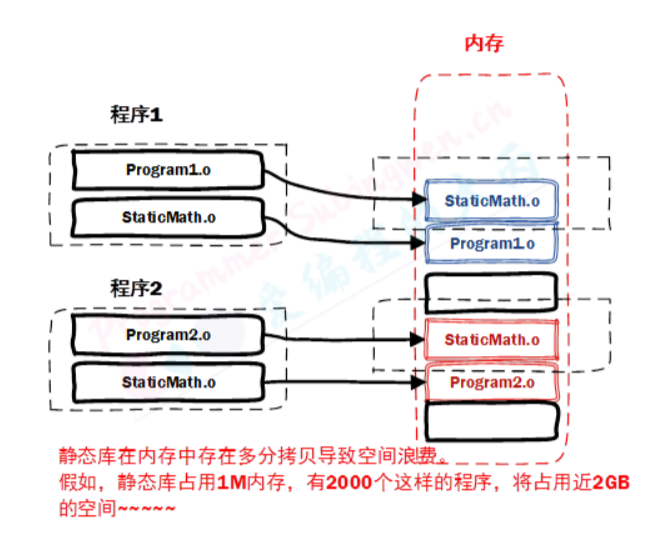
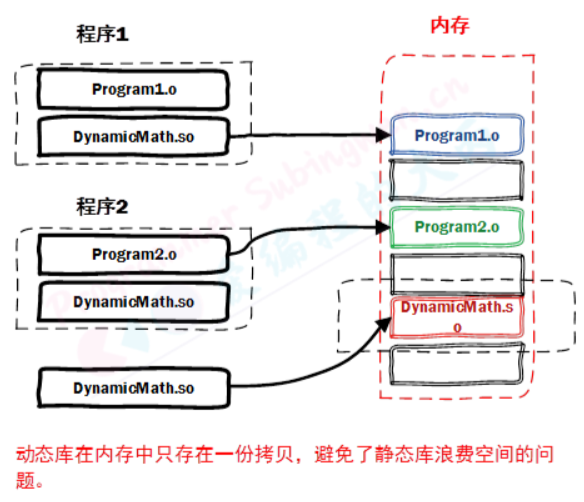

# 1 Linux目录

## 1.1 相对路径

相对路径：相对于当前文件的路径。在Linux中有两个表示路径的特殊符号：

- `./`：代表目前所在的目录，也可以使用`.`表示
- `../`：代表当前目录的上一层目录。也可以使用`..`表示

## 1.2 绝对路径

绝对路径：从系统磁盘起始节点开始描述的路径

- Llinux：起始节点为根目录。比如：`/root/work/mq`

# 2 命令解析器

`pwd`这个命令是怎么执行的？为什么`aabbcc`这个命令执行不了？

一个命令相当于一个可执行程序，在linux中输入`which pwd`，会出现：

```bash
/usr/bin/pwd
```

输入`echo $PATH`，会出现：

```
/usr/local/sbin:/usr/local/bin:/usr/sbin:/usr/bin:/root/bin
```

输入`pwd`时，linux会在上述目录下一个一个搜索，搜到就执行，搜不到就不执行。pwd这个可执行程序是在`/usr/bin/pwd`目录下。

如果自己的可执行程序想要全局访问，那么把可执行程序放到PATH目录下即可

# 3 文件类型

在linux中，一共有7种文件类型，这7种文件类型是根据属性进行划分的，而不是根据后缀划分的

- `-`：普通的文件
- `d`：目录（dirctory）
- `l`：软链接文件（link），相当于windows中的快捷方式
- `c`：字符设备（char）
- `b`：块设备（block）
- `p`：管道文件（pipe）
- `s`：本地套接字文件（socket）

# 4 文件权限

linux中不同的用户可以对文件拥有不同的操作权限，权限一共有四种：`读权限、写权限、执行权限、没有任何权限`

- 读权限：使用`r`表示，即`read`
- 写权限：使用`w`表示，即`write`
- 执行权限：使用`x`表示，即`excute`
- 没有任何权限：使用`-`表示


# 5 文件查看

**more**

more 文件名

- 回车：显示下一行
- 空格：向下滚动一屏
- b：返回上一屏
- q：退出more

**less**

less 文件名

- 回车：显示下一行
- 空格：向下滚动一屏
- b：返回上一屏
- 上下键：上下滚动
- G：跳到最后一行
- g：跳到第一行
- q：退出less

**head**：使用该命令可以查看文件头部的若干信息。

- 默认显示文件的前10行
- head 文件名
- 指定显示头部的前多少行
- head -行数 文件名

**tail**：使用该命令可以查看文件尾部的若干行信息

- 默认显示文件的后10行
- tail 文件名
- 指定显示尾部的多少行
- tail -行数 文件名

# 6 修改文件权限

**字母设定法**

语法格式：`chmod who [+ | - | =] 文件名`

- who：
  - u：user ，文件所有者
  - g：group，文件所属组用户
  - o：other，其它
  - a：all，以上三类人，u+g+o

- 对权限的操作：
  - +：添加权限
  - -：去除权限
  - =：覆盖权限
- mod：权限
  - r：read，读
  - w：write，写
  - x：execute，执行
  - -：没有权限

**数字设定法**

语法格式：`chomd [+ | - | =] mod文件名`

- 对权限的操作：
  - +：添加权限
  - -：去除权限
  - =：权限的覆盖，等号可以不写

- mod：权限描述，所有权限都放开是7
  - 4：read
  - 2：write
  - 1：execute
  - 0：没有权限

```
chmod 567 a.txt
第一个数字是文件所有者权限，5代表4+1，也就是对文件所有者开放：读+执行权限
第二个数字是文件所属组用户权限，6代表4+2，也就是对文件所有者开放：读+写权限
第三个用户是其它人权限：7代表4+2+1，也就是对其他人开放：读+写+执行权限
```

# 7 重定向

关于重定向使用最多的是`输出重定向`，就是修改输出的数据的位置。

- `>`：将文件内容写入到指定文件中，如果文件中已有数据，则会使用新数据覆盖原数据
- `>>`：将输出的内容追加到指定的文件尾部

```
echo 相当于在终端打印，类似printf，还有其它输出方式，比如 tail -f a.log
echo hello > tmp  // 如果tmp文件不存在，则创建，如果存在，则覆盖
echo 123 >> tmp  // 追加到尾部
```

# 8 用户添加和删除

**用户添加**

centos操作系统下：

sudo adduser 用户名

**用户删除**

userdel 用户名 -r

-r 可以一并删除用户的家目录，否则可能需要手动删除

**用户切换**

`su 用户名`：su只切换用户，不切换当前工作目录

`su - 用户名`：切换用户，并且把目录切换为当前用户的家目录


**修改用户密码**

修改自己的密码：`passwd`

修改别人的密码：`passwd 用户名`

普通用户修改别人的密码需要有sudo权限

centos给普通用户添加权限：

- 在root用户下，执行 `visudo`

- 找到：`root    ALL=(ALL)       ALL`
- 在下面加一行：`用户名       ALL=(ALL)       ALL`保存退出即可

# 9 文件搜索

## **9.1 find**

根据文件的属性，查找对应的磁盘文件，常用的属性：文件名、文件类型、文件大小、文件的目录

**按文件名字搜索：-name**

搜索格式：`find 搜索的路径 -name 要搜索的文件名`

```bash
# 按文件名搜索 -name
find . -name *.cpp # 在当前目录下搜索后缀名为cpp的文件
```

**按文件类型搜索： -type**

| 文件类型       | 类型的字符描述 |
| -------------- | -------------- |
| 普通的文件类型 | f              |
| 目录类型       | d              |
| 软连接类型     | l              |
| 字符设备类型   | c              |
| 块设备类型     | b              |
| 管道类型       | p              |
| 本地套接字类型 | s              |

搜索格式：`find 搜索的路径 -type 文件类型`

**按文件大小搜索：-size**

语法格式：`find 搜索的路径 -size [+ | -]文件大小`

- 文件的大小需要加单位
  - k（小写）
  - M（大写）
  - G（大写）

```
文件划分区间：
-size 4k：表示的区间为(4-1k,4k]
-size -4k：表示的区间[0k,4-1k]
-size +4k：表示的区间(4k,正无穷]
```

**基于目录层级搜索**

- `-maxdepth`：最多搜索到第多少层目录
- `-mindepth`：至少从第多少层开始搜索

举例：

```
find . -maxdepth 5 -name *.cpp # 最多搜索5层
find . -mindepth 5 -name *.cpp # 最少从第5层开始搜索
```

**find高级用法**

如果想找到一个文件之后进行某些操作，比如查看信息，可以在正常的搜索之后加上：`-exec 操作命令 {} \;` 或者`-ok 操作命令 {} \;` 

`-exec`：不和用户交互

`-ok`：和用户交互

举例：

```bash
find /work -name main.cpp -exec ls -l {} \;  
find /work -name main.cpp -ok ls -l {} \;
```

但上面这种写法比较繁琐，不好记，另外一种写法是 `|xargs`

```
find /work -name main.cpp |xargs ls -l;  
```

`xargs`的效率比使用`-exec`的效率高

- `-exec`：将`find`查询的结果逐条传递给后买你的`shell`命令
- `-xargs`：将`find`查询的结果一次性传递给后面的`shell`命令


## **9.2 grep**

grep命令用于查找文件里符合条件的字符串，常用参数：

- `-r`：如果需要搜素目录中的文件内容，需要进行递归操作，必须指定该参数
- `-i`：对应要搜索的关键字，忽略字符大小写的差别
- `-n`：在显示符合样式的那一行之前，标示出该行的行号

语法：`grep "搜索的内容" 搜索的路径/文件 参数`

举例：

```bash
grep "include" ./ main.cpp -rn
grep "include" main.cpp -rn
```

## **9.3 locate**


# 10 静态库动态库

## 10.1 静态库

- 在Linux中静态库以lib作为前缀, 以.a作为后缀, 中间是库的名字自己指定即可, 即: libxxx.a
- 在Windows中静态库一般以lib作为前缀, 以lib作为后缀, 中间是库的名字需要自己指定, 即: libxxx.lib

源码：

`add.cpp`

```c++
#include <stdio.h>
#include "head.h"

int add(int a, int b)
{
    return a+b;
}
```

`sub.cpp`

```c++
#include <stdio.h>
#include "head.h"

int subtract(int a, int b)
{
    return a-b;
}
```

`mult.cpp`

```c++
#include <stdio.h>
#include "head.h"

int multiply(int a, int b)
{
    return a*b;
}
```

`div.cpp`

```c++
#include <stdio.h>
#include "head.h"

double divide(int a, int b)
{
    return (double)a/b;
}
```

`head.h`

```c++
#ifndef _HEAD_H
#define _HEAD_H
// 加法
int add(int a, int b);
// 减法
int subtract(int a, int b);
// 乘法
int multiply(int a, int b);
// 除法
double divide(int a, int b);
#endif

```

测试程序`main`

```c++
#include <stdio.h>
#include "head.h"

int main()
{
    int a = 20;
    int b = 12;
    printf("a = %d, b = %d\n", a, b);
    printf("a + b = %d\n", add(a, b));
    printf("a - b = %d\n", subtract(a, b));
    printf("a * b = %d\n", multiply(a, b));
    printf("a / b = %f\n", divide(a, b));
    return 0;
}

```

目录结构：

```shell
.
|-- add.cpp
|-- div.cpp
|-- include
|   -- head.h
|-- main.cpp
|-- mult.cpp
-- sub.cpp
```

**制作静态库**：生成静态库，需要先对源文件进行汇编操作 (使用参数 -c) 得到二进制格式的目标文件 (.o 格式), 然后在通过 ar工具将目标文件打包就可以得到静态库文件了 (libxxx.a)。

- 将源文件汇编，生成二进制文件。`g++ add.cpp sub.cpp mult.cpp div.cpp -c`，生成报错：找不到`head.h`的头文件，因为`head.h`和其它源代码文件不在同一个目录下，所以找不到，解决方法：指定头文件目录：`g++ add.cpp sub.cpp mult.cpp div.cpp -c -I ./include/`，汇编结束后会生成源文件对应的二进制`.o`文件
- 将生成的目标文件通过`ar`工具打包生成静态库，使用`ar`工具：`ar rcs libcalc.a *.o`，生成`libcalc.a`

```shell
# ar工具的三个参数：
参数c：创建一个库，不管库是否存在，都将创建。
参数s：创建目标文件索引，这在创建较大的库时能加快时间。
参数r：在库中插入模块(替换)。默认新的成员添加在库的结尾处，如果模块名已经在库中存在，则替换同名的模块
```

- 发布静态库：静态库`libcalc.a`和库 对应的头文件`head.h`一并发布

**静态库的使用：**

得到一个可用的静态库之后，需要将其放到一个目录中，然后根据得到的头文件编写测试代码，对静态库中的函数进行调用。

```bash
.
|-- add.cpp
|-- add.o
|-- div.cpp
|-- div.o
|-- include
|   `-- head.h
|-- mult.cpp
|-- mult.o
|-- sub.cpp
|-- sub.o
`-- test
    |-- head.h
    |-- libcalc.a
    `-- main.cpp
```

- 编译测试程序：`g++ main.cpp -o main`，出现错误：

```c++
main.cpp:(.text+0x38): undefined reference to `add(int, int)'
main.cpp:(.text+0x58): undefined reference to `subtract(int, int)'
main.cpp:(.text+0x78): undefined reference to `multiply(int, int)'
main.cpp:(.text+0x98): undefined reference to `divide(int, int)'
```

这是因为程序在编译的时候没有找到这些函数的定义的位置，有引用但是没定义；解决方法：在编译的时候指定库文件的路径和名字：

`g++ main.cpp -o main -I ./ -lcalc`

```bash
# 编译的时候指定库信息
	-L: 指定库所在的目录(相对或者绝对路径)
	-l: 指定库的名字, 掐头(lib)去尾(.a) ==> calc
# -L -l, 参数和参数值之间可以有空格, 也可以没有  -L./ -lcalc
$ g++ main.c -o app -L ./ -l calc
```

- 执行之后生成可执行程序`main`

## 10.2 动态库

- 在Linux中动态库以lib作为前缀, 以.so作为后缀, 中间是库的名字自己指定即可, 即: libxxx.so
- 在Windows中动态库一般以lib作为前缀, 以dll作为后缀, 中间是库的名字需要自己指定, 即: libxxx.dll

**制作动态库**

生成动态链接库是直接使用gcc命令并且需要添加-fPIC（-fpic） 以及-shared 参数。

- 对源文件进行汇编生成二进制文件：`g++ *.cpp -c -fpic -I ./include/`，得到源文件的`.o`文件
- 将得到的`.o`文件打包成动态库：`g++ -shared *.o -o libcalc.so`，得到动态库文件`libcalc.so`
- 发布头文件和动态库

**使用动态库**

目录结构：

```shell
.
|-- head.h
|-- libcalc.so
`-- main.cpp
```

执行：`g++ main.cpp -o main -L ./ -lcalc`

生成可执行程序`main`，执行 `./main`

报错：g++通过指定的动态库信息生成了可执行程序，但是可执行程序运行却提示无法加载到动态库。

```shell
./main: error while loading shared libraries: libcalc.so: cannot open shared object file: No such file or directory
```

使用`ldd 可执行程序名`查看程序执行时能否找到所需要的动态库：`ldd main`

```shell
        linux-vdso.so.1 =>  (0x00007ffec878b000)
        libcalc.so => not found
        libstdc++.so.6 => /lib64/libstdc++.so.6 (0x00007f2b9fd84000)
        libm.so.6 => /lib64/libm.so.6 (0x00007f2b9fa82000)
        libgcc_s.so.1 => /lib64/libgcc_s.so.1 (0x00007f2b9f86c000)
        libc.so.6 => /lib64/libc.so.6 (0x00007f2b9f49e000)
        /lib64/ld-linux-x86-64.so.2 (0x00007f2ba008c000)
```

可以看到只有`libcalc.so`找不到

**找不到的原因**

库的工作原理：

- 静态库如何被加载？

在程序编译的最后一个阶段也就是链接阶段，提供的静态库会被打包到可执行程序中。当可执行程序被执行，静态库中的代码也会一并被加载到内存中，因此不会出现静态库找不到无法被加载的问题。

- 动态库如何被加载？在程序编译的最后一个阶段也就是链接阶段：
  - 在gcc命令中虽然指定了库路径(使用参数 -L ), 但是这个路径并没有记录到可执行程序中，只是检查了这个路径下的库文件是否存在。
  - 同样对应的动态库文件也没有被打包到可执行程序中，只是在可执行程序中记录了库的名字。

可执行程序被执行起来之后

- 程序执行的时候会先检测需要的动态库是否可以被加载，加载不到就会提示上边的错误信息
- 当动态库中的函数在程序中被调用了, 这个时候动态库才加载到内存，如果不被调用就不加载
- 动态库的检测和内存加载操作都是由动态链接器来完成的

动态链接器：

动态链接器是一个独立于应用程序的进程, 属于操作系统, 当用户的程序需要加载动态库的时候动态连接器就开始工作了，很显然动态连接器根本就不知道用户通过 gcc 编译程序的时候通过参数 -L指定的路径。

那么动态链接器是如何搜索某一个动态库的呢，在它内部有一个默认的搜索顺序，按照优先级从高到低的顺序分别是：

```shell
1.可执行文件内部的 DT_RPATH 段
2.系统的环境变量 LD_LIBRARY_PATH
3.系统动态库的缓存文件 /etc/ld.so.cache
4.存储动态库/静态库的系统目录 /lib/, /usr/lib等
```


按照以上四个顺序, 依次搜索, 找到之后结束遍历, 最终还是没找到, 动态链接器就会提示动态库找不到的错误信息

**解决方法**

方案1：将库路径添加到环境变量 `LD_LIBRARY_PATH` 中

- 找到相关的配置文件
  - 用户级别: ~/.bashrc —> 设置对当前用户有效
  - 系统级别: /etc/profile —> 设置对所有用户有效

- 使用 vim 打开配置文件, 在文件最后添加一行：

```shell
export LD_LIBRARY_PATH=$LD_LIBRARY_PATH:动态库的绝对路径
export LD_LIBRARY_PATH=$LD_LIBRARY_PATH:/work/dynamiclib/test
```

然后  执行`source .bashrc`使配置生效。使用命令 `echo $LD_LIBRARY_PATH` 可以查看环境变量的值

此时，重新执行`main`文件就可以

方案2：更新 /etc/ld.so.cache 文件

- 找到动态库所在的绝对路径（不包括库的名字）比如：`/work/dynamiclib/test`

- 使用vim 修改 /etc/ld.so.conf 这个文件, 将上边的路径添加到文件中(独自占一行)

```shell
# 1. 打开文件
$ sudo vim /etc/ld.so.conf
# 2. 添加动态库路径, 并保存退出
```

- 更新` /etc/ld.so.conf`中的数据到` /etc/ld.so.cache `中（这是个二进制文件，不能直接修改）

```shell
# 必须使用管理员权限执行这个命令
sudo ldconfig 
```

方案3：拷贝动态库文件到系统库目录 `/lib/ `或者 `/usr/lib` 中 (或者将库的软链接文件放进去)

```shell
# 库拷贝(不推荐)
sudo cp /xxx/xxx/libxxx.so /usr/lib

# 创建软连接
sudo ln -s /xxx/xxx/libxxx.so /usr/lib/libxxx.so
```

## 10.3 静态库和动态库的区别

静态库：编译器进行链接时，会把静态库中代码打包到可执行程序中（静态库和代码是一体的）

动态库：编译器进行链接时，动态库的代码不会被打包到可执行程序中，程序运行之后，动态库会被加载到内存中。

## 10.4 静态库和动态库的优缺点

比如要发布一个程序app，对于静态库场景：程序中需要把静态库包含进去，如果静态库中有代码变动，那么程序也要重新编译

对于动态库的场景：程序不用把动态库包含进去，如果动态库中有代码变动，那么只需要更新动态库，而不需要重新编译程序app

**静态库：**

- 优点：
  - 静态库被打包到应用程序中加载速度快
  - 发布程序无需提供依赖的静态库，移植方便
- 缺点：
  - 相同的库文件数据可能在内存中被加载多份, 消耗系统资源，浪费内存
  - 库文件更新需要重新编译项目文件, 生成新的可执行程序, 浪费时间（链接时完整地拷贝至可执行文件中，被多次使用就有多份拷贝，如果库更新，那么需要重新编译应用程序，也就是重新链接拷贝）。



**动态库：**

- 优点

  - 可实现不同进程间的资源共享
  - 动态库升级简单, 只需要替换库文件, 无需重新编译应用程序
  - 程序猿可以控制何时加载动态库, 不调用库函数动态库不会被加载

- 缺点

  - 加载速度比静态库慢, 以现在计算机的性能可以忽略
  - 发布程序需要提供依赖的动态库

  

# 11 压缩及解压缩

用到再看


**参考：**

https://www.bilibili.com/video/BV13U4y1p7kB?p=34&spm_id_from=pageDriver&vd_source=79a47c5035e6336414e7ccb0cf2a076d