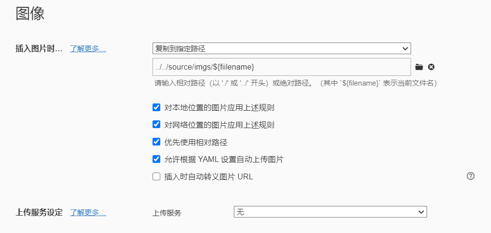

---

**生成及上传步骤**

- hexo clean
- rm -rf .deploy_git/
- git config --global core.autocrlf false

- 修改原始文件后生成：hexo g
- 随后输入命令上传：hexo d

 

 

**图片插入之后上传**

../../source/imgs/${fiilename}

主题：

https://hexo.fluid-dev.com/docs/

https://www.erenship.com/posts/40222.html