# 剑指Offer目录

## 数组与矩阵

- [3. 数组中重复的数字](https://github.com/CyC2018/CS-Notes/blob/master/notes/3. 数组中重复的数字.md)
- [4. 二维数组中的查找](https://github.com/CyC2018/CS-Notes/blob/master/notes/4. 二维数组中的查找.md)
- [5. 替换空格](https://github.com/CyC2018/CS-Notes/blob/master/notes/5. 替换空格.md)
- [29. 顺时针打印矩阵](https://github.com/CyC2018/CS-Notes/blob/master/notes/29. 顺时针打印矩阵.md)
- [50. 第一个只出现一次的字符位置](https://github.com/CyC2018/CS-Notes/blob/master/notes/50. 第一个只出现一次的字符位置.md)

## 栈队列堆

- [9. 用两个栈实现队列](https://github.com/CyC2018/CS-Notes/blob/master/notes/9. 用两个栈实现队列.md)
- [30. 包含 min 函数的栈](https://github.com/CyC2018/CS-Notes/blob/master/notes/30. 包含 min 函数的栈.md)
- [31. 栈的压入、弹出序列](https://github.com/CyC2018/CS-Notes/blob/master/notes/31. 栈的压入、弹出序列.md)
- [40. 最小的 K 个数](https://github.com/CyC2018/CS-Notes/blob/master/notes/40. 最小的 K 个数.md)
- [41.1 数据流中的中位数](https://github.com/CyC2018/CS-Notes/blob/master/notes/41.1 数据流中的中位数.md)
- [41.2 字符流中第一个不重复的字符](https://github.com/CyC2018/CS-Notes/blob/master/notes/41.2 字符流中第一个不重复的字符.md)
- [59. 滑动窗口的最大值](https://github.com/CyC2018/CS-Notes/blob/master/notes/59. 滑动窗口的最大值.md)

## 双指针

- [57.1 和为 S 的两个数字](https://github.com/CyC2018/CS-Notes/blob/master/notes/57.1 和为 S 的两个数字.md)
- [57.2 和为 S 的连续正数序列](https://github.com/CyC2018/CS-Notes/blob/master/notes/57.2 和为 S 的连续正数序列.md)
- [58.1 翻转单词顺序列](https://github.com/CyC2018/CS-Notes/blob/master/notes/58.1 翻转单词顺序列.md)
- [58.2 左旋转字符串](https://github.com/CyC2018/CS-Notes/blob/master/notes/58.2 左旋转字符串.md)

## 链表

- 
- 
- 
- 
- 
- 
- 
- [35. 复杂链表的复制](https://github.com/CyC2018/CS-Notes/blob/master/notes/35. 复杂链表的复制.md)
- 

## 树

- 
- 
- 
- 
- 
- 
- [32.2 把二叉树打印成多行](https://github.com/CyC2018/CS-Notes/blob/master/notes/32.2 把二叉树打印成多行.md)
- [32.3 按之字形顺序打印二叉树](https://github.com/CyC2018/CS-Notes/blob/master/notes/32.3 按之字形顺序打印二叉树.md)
- 
- 
- [36. 二叉搜索树与双向链表](https://github.com/CyC2018/CS-Notes/blob/master/notes/36. 二叉搜索树与双向链表.md)
- [37. 序列化二叉树](https://github.com/CyC2018/CS-Notes/blob/master/notes/37. 序列化二叉树.md)
- 
- 
- 
- 

## 贪心思想

- [14. 剪绳子](https://github.com/CyC2018/CS-Notes/blob/master/notes/14. 剪绳子.md)
- [63. 股票的最大利润](https://github.com/CyC2018/CS-Notes/blob/master/notes/63. 股票的最大利润.md)

## 二分查找

- [11. 旋转数组的最小数字](https://github.com/CyC2018/CS-Notes/blob/master/notes/11. 旋转数组的最小数字.md)
- [53. 数字在排序数组中出现的次数](https://github.com/CyC2018/CS-Notes/blob/master/notes/53. 数字在排序数组中出现的次数.md)

## 分治

- [16. 数值的整数次方](https://github.com/CyC2018/CS-Notes/blob/master/notes/16. 数值的整数次方.md)

## 搜索

- [12. 矩阵中的路径](https://github.com/CyC2018/CS-Notes/blob/master/notes/12. 矩阵中的路径.md)
- [13. 机器人的运动范围](https://github.com/CyC2018/CS-Notes/blob/master/notes/13. 机器人的运动范围.md)
- [38. 字符串的排列](https://github.com/CyC2018/CS-Notes/blob/master/notes/38. 字符串的排列.md)

## 排序

- [21. 调整数组顺序使奇数位于偶数前面](https://github.com/CyC2018/CS-Notes/blob/master/notes/21. 调整数组顺序使奇数位于偶数前面.md)
- [45. 把数组排成最小的数](https://github.com/CyC2018/CS-Notes/blob/master/notes/45. 把数组排成最小的数.md)
- [51. 数组中的逆序对](https://github.com/CyC2018/CS-Notes/blob/master/notes/51. 数组中的逆序对.md)

## 动态规划

- [10.1 斐波那契数列](https://github.com/CyC2018/CS-Notes/blob/master/notes/10.1 斐波那契数列.md)
- [10.2 矩形覆盖](https://github.com/CyC2018/CS-Notes/blob/master/notes/10.2 矩形覆盖.md)
- [10.3 跳台阶](https://github.com/CyC2018/CS-Notes/blob/master/notes/10.3 跳台阶.md)
- [10.4 变态跳台阶](https://github.com/CyC2018/CS-Notes/blob/master/notes/10.4 变态跳台阶.md)
- [42. 连续子数组的最大和](https://github.com/CyC2018/CS-Notes/blob/master/notes/42. 连续子数组的最大和.md)
- [47. 礼物的最大价值](https://github.com/CyC2018/CS-Notes/blob/master/notes/47. 礼物的最大价值.md)
- [48. 最长不含重复字符的子字符串](https://github.com/CyC2018/CS-Notes/blob/master/notes/48. 最长不含重复字符的子字符串.md)
- [49. 丑数](https://github.com/CyC2018/CS-Notes/blob/master/notes/49. 丑数.md)
- [60. n 个骰子的点数](https://github.com/CyC2018/CS-Notes/blob/master/notes/60. n 个骰子的点数.md)
- [66. 构建乘积数组](https://github.com/CyC2018/CS-Notes/blob/master/notes/66. 构建乘积数组.md)

## 数学

- [39. 数组中出现次数超过一半的数字](https://github.com/CyC2018/CS-Notes/blob/master/notes/39. 数组中出现次数超过一半的数字.md)
- [62. 圆圈中最后剩下的数](https://github.com/CyC2018/CS-Notes/blob/master/notes/62. 圆圈中最后剩下的数.md)
- [43. 从 1 到 n 整数中 1 出现的次数](https://github.com/CyC2018/CS-Notes/blob/master/notes/43. 从 1 到 n 整数中 1 出现的次数.md)

## 位运算

- [15. 二进制中 1 的个数](https://github.com/CyC2018/CS-Notes/blob/master/notes/15. 二进制中 1 的个数.md)
- [56. 数组中只出现一次的数字](https://github.com/CyC2018/CS-Notes/blob/master/notes/56. 数组中只出现一次的数字.md)

## 其它

- [17. 打印从 1 到最大的 n 位数](https://github.com/CyC2018/CS-Notes/blob/master/notes/17. 打印从 1 到最大的 n 位数.md)
- [19. 正则表达式匹配](https://github.com/CyC2018/CS-Notes/blob/master/notes/19. 正则表达式匹配.md)
- [20. 表示数值的字符串](https://github.com/CyC2018/CS-Notes/blob/master/notes/20. 表示数值的字符串.md)
- [44. 数字序列中的某一位数字](https://github.com/CyC2018/CS-Notes/blob/master/notes/44. 数字序列中的某一位数字.md)
- [46. 把数字翻译成字符串](https://github.com/CyC2018/CS-Notes/blob/master/notes/46. 把数字翻译成字符串.md)
- [61. 扑克牌顺子](https://github.com/CyC2018/CS-Notes/blob/master/notes/61. 扑克牌顺子.md)
- [64. 求 1+2+3+...+n](https://github.com/CyC2018/CS-Notes/blob/master/notes/64. 求 1+2+3+...+n.md)
- [65. 不用加减乘除做加法](https://github.com/CyC2018/CS-Notes/blob/master/notes/65. 不用加减乘除做加法.md)
- [67. 把字符串转换成整数](https://github.com/CyC2018/CS-Notes/blob/master/notes/67. 把字符串转换成整数.md)

# 0 已刷列表

| 题目                                                         | 类型 | 方法（可能还有更优解） | 备注         |
| ------------------------------------------------------------ | ---- | ---------------------- | ------------ |
| [25.合并两个排序的链表](https://www.nowcoder.com/practice/d8b6b4358f774294a89de2a6ac4d9337?tpId=13&tags=&title=&difficulty=0&judgeStatus=0&rp=0&sourceUrl=) | 链表 | 双指针，dummy节点      | 轻网科技一面 |
| [24.反转链表](https://www.nowcoder.com/practice/75e878df47f24fdc9dc3e400ec6058ca?tpId=13&tags=&title=&difficulty=0&judgeStatus=0&rp=0&sourceUrl=) | 链表 | 递归                   |              |
| [6. 从尾到头打印链表](https://www.nowcoder.com/practice/d0267f7f55b3412ba93bd35cfa8e8035?tpId=13&tqId=23278&ru=%2Fpractice%2Fd0267f7f55b3412ba93bd35cfa8e8035&qru=%2Fta%2Fcoding-interviews%2Fquestion-ranking&sourceUrl=) | 链表 | 递归/栈                |              |
| [52. 两个链表的第一个公共结点](https://www.nowcoder.com/practice/6ab1d9a29e88450685099d45c9e31e46?tpId=13&tqId=23257&ru=%2Fpractice%2Fd0267f7f55b3412ba93bd35cfa8e8035&qru=%2Fta%2Fcoding-interviews%2Fquestion-ranking&sourceUrl=) | 链表 | 双指针                 |              |
| [23. 链表中环的入口结点](https://www.nowcoder.com/practice/253d2c59ec3e4bc68da16833f79a38e4?tpId=13&tqId=23449&ru=%2Fpractice%2F6ab1d9a29e88450685099d45c9e31e46&qru=%2Fta%2Fcoding-interviews%2Fquestion-ranking&sourceUrl=) | 链表 | 双指针                 |              |
| [22. 链表中倒数第 K 个结点](https://www.nowcoder.com/practice/886370fe658f41b498d40fb34ae76ff9?tpId=13&tqId=1377477&ru=%2Fpractice%2F253d2c59ec3e4bc68da16833f79a38e4&qru=%2Fta%2Fcoding-interviews%2Fquestion-ranking&sourceUrl=) | 链表 | 双指针                 |              |
| [18.1. 删除链表的节点](https://www.nowcoder.com/practice/f9f78ca89ad643c99701a7142bd59f5d?tpId=13&tqId=2273171&ru=%2Fpractice%2F886370fe658f41b498d40fb34ae76ff9&qru=%2Fta%2Fcoding-interviews%2Fquestion-ranking&sourceUrl=) | 链表 | 双指针，dummy节点      |              |
| [18.2 删除链表中重复的结点](https://www.nowcoder.com/practice/fc533c45b73a41b0b44ccba763f866ef?tpId=13&tqId=23450&ru=%2Fpractice%2Ff9f78ca89ad643c99701a7142bd59f5d&qru=%2Fta%2Fcoding-interviews%2Fquestion-ranking&sourceUrl=) | 链表 | dummy节点              |              |
| [35. 复杂链表的复制](https://www.nowcoder.com/practice/f836b2c43afc4b35ad6adc41ec941dba?tpId=13&tqId=23254&ru=%2Fpractice%2Ffc533c45b73a41b0b44ccba763f866ef&qru=%2Fta%2Fcoding-interviews%2Fquestion-ranking&sourceUrl=) |      |                        |              |
| [55.1 二叉树的深度](https://www.nowcoder.com/practice/435fb86331474282a3499955f0a41e8b?tpId=13&tqId=23294&ru=%2Fpractice%2Ff836b2c43afc4b35ad6adc41ec941dba&qru=%2Fta%2Fcoding-interviews%2Fquestion-ranking&sourceUrl=) | 树   | 递归                   |              |
| [27. 二叉树的镜像](https://www.nowcoder.com/practice/a9d0ecbacef9410ca97463e4a5c83be7?tpId=13&tqId=1374963&ru=%2Fpractice%2Fa861533d45854474ac791d90e447bafd&qru=%2Fta%2Fcoding-interviews%2Fquestion-ranking&sourceUrl=) | 树   | 递归                   |              |
| [55.2 平衡二叉树](https://www.nowcoder.com/practice/8b3b95850edb4115918ecebdf1b4d222?tpId=13&tqId=23250&ru=%2Fpractice%2F7fe2212963db4790b57431d9ed259701&qru=%2Fta%2Fcoding-interviews%2Fquestion-ranking&sourceUrl=) | 树   | 递归+最大深度          |              |
| [28. 对称的二叉树]([判断对称二叉树](https://leetcode.cn/problems/dui-cheng-de-er-cha-shu-lcof/)) | 树   | 递归                   |              |
| [32.1 从上往下打印二叉树](https://www.nowcoder.com/practice/7fe2212963db4790b57431d9ed259701?tpId=13&tqId=23280&ru=%2Fpractice%2F6e196c44c7004d15b1610b9afca8bd88&qru=%2Fta%2Fcoding-interviews%2Fquestion-ranking&sourceUrl=) | 树   | 层序遍历               |              |
| [7 重建二叉树](https://www.nowcoder.com/practice/8a19cbe657394eeaac2f6ea9b0f6fcf6?tpId=13&tqId=23282&ru=%2Fpractice%2F7fe2212963db4790b57431d9ed259701&qru=%2Fta%2Fcoding-interviews%2Fquestion-ranking&sourceUrl=) | 树   | 递归                   |              |
| [86 在二叉树中找到两个节点的最近公共祖先](https://www.nowcoder.com/practice/e0cc33a83afe4530bcec46eba3325116?tpId=13&tqId=1024325&ru=%2Fpractice%2Fd9820119321945f588ed6a26f0a6991f&qru=%2Fta%2Fcoding-interviews%2Fquestion-ranking&sourceUrl=) | 树   | 递归                   |              |
| [68 二叉搜索树的最近公共祖先](https://www.nowcoder.com/practice/d9820119321945f588ed6a26f0a6991f?tpId=13&tqId=2290592&ru=%2Fpractice%2Fe0cc33a83afe4530bcec46eba3325116&qru=%2Fta%2Fcoding-interviews%2Fquestion-ranking&sourceUrl=) | 树   | 递归                   |              |
| [33 二叉搜索树的后序遍历序列](https://www.nowcoder.com/practice/a861533d45854474ac791d90e447bafd?tpId=13&tqId=23289&ru=%2Fpractice%2Fa861533d45854474ac791d90e447bafd&qru=%2Fta%2Fcoding-interviews%2Fquestion-ranking&sourceUrl=) | 树   | 递归                   |              |
| [54. 二叉查找树的第 K 个结点](https://www.nowcoder.com/practice/57aa0bab91884a10b5136ca2c087f8ff?tpId=13&tqId=2305268&ru=%2Fpractice%2Fe0cc33a83afe4530bcec46eba3325116&qru=%2Fta%2Fcoding-interviews%2Fquestion-ranking&sourceUrl=) | 树   | 递归                   |              |
| [26. 树的子结构](https://www.nowcoder.com/practice/6e196c44c7004d15b1610b9afca8bd88?tpId=13&tqId=23293&ru=%2Fpractice%2F57aa0bab91884a10b5136ca2c087f8ff&qru=%2Fta%2Fcoding-interviews%2Fquestion-ranking&sourceUrl=) | 树   | 递归                   |              |
| [8. 二叉树的下一个结点](https://www.nowcoder.com/practice/9023a0c988684a53960365b889ceaf5e?tpId=13&tqId=23451&ru=%2Fpractice%2Ff836b2c43afc4b35ad6adc41ec941dba&qru=%2Fta%2Fcoding-interviews%2Fquestion-ranking&sourceUrl=) | 树   | 递归/next指针          |              |
| [34. 二叉树中和为某一值的路径](https://leetcode.cn/problems/path-sum-ii/description/) | 树   | 递归、恢复现场         |              |
|                                                              |      |                        |              |
|                                                              |      |                        |              |
|                                                              |      |                        |              |
|                                                              |      |                        |              |
|                                                              |      |                        |              |
| [4. 二维数组中的查找](https://github.com/CyC2018/CS-Notes/blob/master/notes/4. 二维数组中的查找.md) |      |                        | 轻网科技一面 |


# 1 链表

## [剑指Offer25. 合并两个排序的链表](https://www.nowcoder.com/practice/d8b6b4358f774294a89de2a6ac4d9337?tpId=13&tags=&title=&difficulty=0&judgeStatus=0&rp=0&sourceUrl=)

**思路：**

- 根据两条链表创建两个指针，分别指向各自的头节点，同时定义一个头指针，用于表示合并之后的链表；
- 比较两条链表当前节点的值，将定义的节点指向节点值较小的链表。
- 更新头指针

**用到的技巧：**

- 虚拟头节点：dummy，当需要创造一条新链表的时候，可以使用虚拟头结点简化边界情况的处理。

```c++
/**
 * Definition for singly-linked list.
 * struct ListNode {
 *     int val;
 *     ListNode *next;
 *     ListNode() : val(0), next(nullptr) {}
 *     ListNode(int x) : val(x), next(nullptr) {}
 *     ListNode(int x, ListNode *next) : val(x), next(next) {}
 * };
 */
class Solution {
public:
    ListNode* mergeTwoLists(ListNode* list1, ListNode* list2) 
    {
        ListNode *dummy = new ListNode(-1), *p = dummy;
        ListNode *p1 = list1, *p2 = list2;
        while(p1 != nullptr && p2 != nullptr)
        {
            if(p1->val > p2->val)
            {
                p->next = p2;
                p2 = p2->next;
            }
            else
            {
                p->next = p1;
                p1 = p1->next;
            }
            p = p->next;
        }
        if(p1 == nullptr) p->next = p2;
        if(p2 == nullptr) p->next = p1;
        return dummy->next;
    }
};
```


## [剑指Offer24. 反转链表](https://www.nowcoder.com/practice/75e878df47f24fdc9dc3e400ec6058ca?tpId=13&tags=&title=&difficulty=0&judgeStatus=0&rp=0&sourceUrl=)

解法1：递归解法

- 递归的含义：输入一个头节点head，将以head为起点的链表反转，并返回反转之后的头节点

```c++
/**
 * struct ListNode {
 *	int val;
 *	struct ListNode *next;
 *	ListNode(int x) : val(x), next(nullptr) {}
 * };
 */
class Solution {
public:
    ListNode* ReverseList(ListNode* head) 
    {
        //base case
        if(head == nullptr || head->next == nullptr) return head;

        ListNode* last = ReverseList(head->next);
        head->next->next = head;
        head->next = nullptr;

        return last;
    }
};
```

解法2：迭代解法

- 按节点分别反转，比较容易理解

```c++
/**
 * struct ListNode {
 *	int val;
 *	struct ListNode *next;
 *	ListNode(int x) : val(x), next(nullptr) {}
 * };
 */
class Solution {
public:
    ListNode* ReverseList(ListNode* head) 
    {
        // write code here
        if(head == nullptr || head->next == nullptr) return head;
        ListNode* pre = nullptr;
        ListNode* cur = head;
        while(cur != nullptr)
        {
            ListNode* tmp = cur->next;
            cur->next = pre;
            pre = cur;
            cur = tmp;
        }

        return pre;
    }
};
```


**延伸问题**

**1 反转链表的前n个节点**

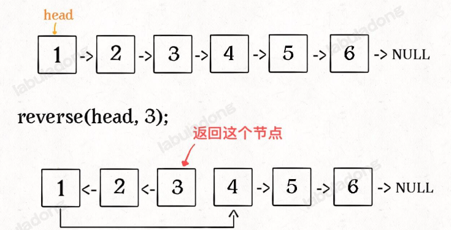

递归解法：

```c++

ListNode* successor = nullptr;

// 反转以 head 为起点的 n 个节点，返回新的头结点
ListNode* reverseN(ListNode* head, int n) {
    if (n == 1) {
        successor = head->next;
        return head;
    }
    ListNode* last = reverseN(head->next, n - 1);
    head->next->next = head;
    head->next = successor;
    return last;
}

```

**2 反转链表的一部分**

[反转链表 II](https://leetcode.cn/problems/reverse-linked-list-ii/)

```c++
/**
 * Definition for singly-linked list.
 * struct ListNode {
 *     int val;
 *     ListNode *next;
 *     ListNode() : val(0), next(nullptr) {}
 *     ListNode(int x) : val(x), next(nullptr) {}
 *     ListNode(int x, ListNode *next) : val(x), next(next) {}
 * };
 */
class Solution {
    ListNode* successor = nullptr;
public:
    // 反转以left和right区间内的链表，并返回反转之后的头节点
    ListNode* reverseBetween(ListNode* head, int left, int right) 
    {
        // left == 1, 相当于反转以头节点开头的前right个节点
        if(left == 1) return reverseN(head, right);
        head->next = reverseBetween(head->next, left - 1, right - 1);
        return head;
    }
    
// 反转以 head 为起点的 n 个节点，返回新的头结点
    ListNode* reverseN(ListNode* head, int n) {
        if (n == 1) {
            successor = head->next;
            return head;
        }
        ListNode* last = reverseN(head->next, n - 1);
        head->next->next = head;
        head->next = successor;
        return last;
    }
};
```


## [剑指Offer6. 从尾到头打印链表](https://www.nowcoder.com/practice/d0267f7f55b3412ba93bd35cfa8e8035?tpId=13&tqId=23278&ru=%2Fpractice%2Fd0267f7f55b3412ba93bd35cfa8e8035&qru=%2Fta%2Fcoding-interviews%2Fquestion-ranking&sourceUrl=)

刚看到这个题时的解题思路是结合前面的反转链表，将链表反转，然后使用一个vector接收反转后链表的值，虽然能通过，但是忽略了重要的一点：这种解法会改变原来的链表结构，题目应该是想要一种既能够从尾到头打印链表，又不改变原来链表结构的方法。

**解法1：反转链表解法**

```c++
/**
*  struct ListNode {
*        int val;
*        struct ListNode *next;
*        ListNode(int x) :
*              val(x), next(NULL) {
*        }
*  };
*/
class Solution {
public:
    vector<int> printListFromTailToHead(ListNode* head) 
    {
        vector<int> res;
        ListNode* last = reverse(head);
        while(last != nullptr)
        {
            res.push_back(last->val);
            last = last->next;
        }
        return res;
    }

    // 反转链表
    ListNode* reverse(ListNode* head)
    {
        if(head == nullptr || head->next == nullptr) return head;
        ListNode* last = reverse(head->next);
        head->next->next = head;
        head->next = nullptr;
        return last;
    }
};
```


**解法2：**使用栈

遍历链表是从头到尾，而打印链表是从尾到头，也就是第一个遍历的最后一个打印，最后一个遍历的第一个打印，那么就可以使用栈。

```c++
/**
*  struct ListNode {
*        int val;
*        struct ListNode *next;
*        ListNode(int x) :
*              val(x), next(NULL) {
*        }
*  };
*/
#include <stack>
class Solution {
public:
    vector<int> printListFromTailToHead(ListNode* head) 
    {
        stack<ListNode*> nodes;
        //向栈里存元素
        ListNode* tmp = head;
        while(tmp != nullptr)
        {
            nodes.push(tmp);
            tmp = tmp->next;
        }
        vector<int> res;
        while (!nodes.empty()) 
        {
            res.push_back(nodes.top()->val);  // 注意栈的top()方法
            nodes.pop();
        }
        return res;
    }
};

```


**解法3**：使用递归

递归的本质就是栈结构，如果能用栈结构解决，那么递归也能够解决。

但是递归方法不容易理解，看一遍题解才能写出来。

```c++
/**
*  struct ListNode {
*        int val;
*        struct ListNode *next;
*        ListNode(int x) :
*              val(x), next(NULL) {
*        }
*  };
*/
class Solution {
    
public:
    vector<int> printListFromTailToHead(ListNode* head) 
    {
        vector<int> res;
        func(head, res);
        return res;
    }

    void func(ListNode* head, vector<int>& res) // 需要加上&, 不加 & 就是值传递，实参会赋不上值
    {
        if(head != nullptr)
        {
            func(head->next, res);
            res.push_back(head->val);
        }
    }
};

```


## [剑指Offer52. 两个链表的第一个公共结点](https://www.nowcoder.com/practice/6ab1d9a29e88450685099d45c9e31e46?tpId=13&tqId=23257&ru=%2Fpractice%2Fd0267f7f55b3412ba93bd35cfa8e8035&qru=%2Fta%2Fcoding-interviews%2Fquestion-ranking&sourceUrl=)

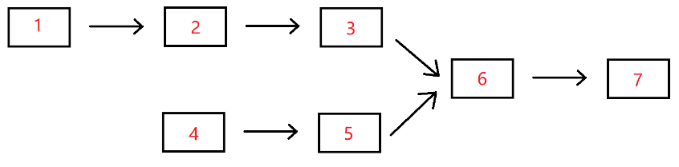

思路较简单：

- 定义两个指针*p1, *p2，分别指向两条链表的头节点p1指向head1, p2指向head2；
- 如果两个指针不相交，就一直往下走；
- 如果走到最后还不相交，那么让两个指针分别指向对方的头节点，即p1指向head2，p2指向head1；
- 如果两条链表有公共节点的话，第二遍就会相交，如果第二遍不相交，说明两条链表没有公共节点，那么两条链表就会都指向null

```c++
/*
struct ListNode {
	int val;
	struct ListNode *next;
	ListNode(int x) :
			val(x), next(NULL) {
	}
};*/
class Solution {
public:
    ListNode* FindFirstCommonNode( ListNode* pHead1, ListNode* pHead2) 
	{
        ListNode* p1 = pHead1;
        ListNode* p2 = pHead2;
		int count = 0;
		while(p1 != p2)
		{
			p1 = p1 == nullptr ? pHead2 : p1->next;
			p2 = p2 == nullptr ? pHead1 : p2->next;
		}
		return p1;
    }
};

```


## [剑指Offer23. 链表中环的入口结点](https://www.nowcoder.com/practice/253d2c59ec3e4bc68da16833f79a38e4?tpId=13&tqId=23449&ru=%2Fpractice%2F6ab1d9a29e88450685099d45c9e31e46&qru=%2Fta%2Fcoding-interviews%2Fquestion-ranking&sourceUrl=)

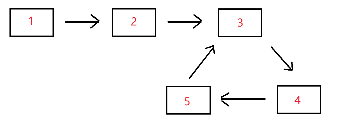

解法1：使用容器，思路简单，也很好实现

- 使用容器，保存的值唯一，依次遍历链表，如果容器中有当前节点，那么链表就是有环的，当前节点就是环的入口
- 如果遍历链表后走到了Null，说明链表没有环，返回Null

```c++

/*
struct ListNode {
    int val;
    struct ListNode *next;
    ListNode(int x) :
        val(x), next(NULL) {
    }
};
*/
#include <iterator>
#include <set>
class Solution {
public:
    ListNode* EntryNodeOfLoop(ListNode* pHead) 
    {
        //使用set保证节点唯一
        set<ListNode*> mySet;
        
        ListNode* p = pHead;
        while (p != nullptr) 
        {	
            //set中已经有当前元素，则返回
            if(mySet.find(p) != mySet.end())
            {
                return p;
            }
            // set中没有当前元素，就将元素放到set里
            mySet.insert(p);
            p = p->next;
        }
        // p走到了空节点，说明没有环
        return nullptr;
    }
};
```


解法2：快慢指针（**快慢指针是链表中常用的技巧**）：本题直接记流程，先不用管证明

- 确定是否有环：快指针F一次走两个，慢指针S一次走一个节点，如果有环，它们一定会在环上相遇。如果快指针走到了null，说明没有环
- 如果有环：快指针回到起点，慢指针不动，它们同时走，并且都是一次走一个节点，那么一定会在环的入口相遇

明白这个思路后，首先写出了下面这版代码：虽然能通过，但是感觉流程控制有点冗余不清晰，并且在24行的if里套了一个while，看起来有点奇怪。

```c++

/*
struct ListNode {
    int val;
    struct ListNode *next;
    ListNode(int x) :
        val(x), next(NULL) {
    }
};
*/
class Solution {
public:
    ListNode* EntryNodeOfLoop(ListNode* pHead) 
    {
        if(pHead == nullptr || pHead->next == nullptr || pHead->next->next == nullptr) return nullptr;
        ListNode* fast = pHead->next->next;
        ListNode* slow = pHead->next;
        while (fast->next != nullptr && fast->next->next != nullptr) 
        {
            fast = fast->next->next;
            slow = slow->next;
            if(fast == slow) break;
        }
        if(fast == slow)
        {
            fast = pHead;
            while(fast != slow)
            {
                fast = fast->next;
                slow = slow->next;
            }
            return fast;
        }
        return nullptr;
    }
};
```

改了一版之后：好多了

```c++

/*
struct ListNode {
    int val;
    struct ListNode *next;
    ListNode(int x) :
        val(x), next(NULL) {
    }
};
*/
class Solution {
public:
    ListNode* EntryNodeOfLoop(ListNode* pHead) 
    {
        if(pHead == nullptr || pHead->next == nullptr || pHead->next->next == nullptr) return nullptr;
        ListNode* fast = pHead->next->next;
        ListNode* slow = pHead->next;
        while(fast != slow)
        {
            if(fast->next == nullptr || fast->next->next == nullptr) return nullptr;
            fast = fast->next->next;
            slow = slow->next;
        }
        fast = pHead;
        while(fast != slow)
        {
            fast = fast->next;
            slow = slow->next;
        }
        return fast;
    }
};
```

## [剑指Offer22. 链表中倒数第 K 个结点](https://www.nowcoder.com/practice/886370fe658f41b498d40fb34ae76ff9?tpId=13&tqId=1377477&ru=%2Fpractice%2F253d2c59ec3e4bc68da16833f79a38e4&qru=%2Fta%2Fcoding-interviews%2Fquestion-ranking&sourceUrl=)

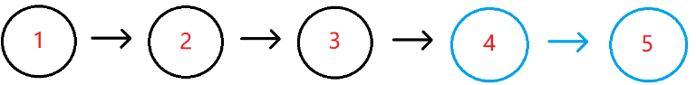

首先想到的思路是使用快慢指针，间隔为始终为k，当快指针走到尾部（空节点）时，返回慢指针：

```c++
/**
 * struct ListNode {
 *	int val;
 *	struct ListNode *next;
 *	ListNode(int x) : val(x), next(nullptr) {}
 * };
 */
class Solution {
public:
    /**
     * 代码中的类名、方法名、参数名已经指定，请勿修改，直接返回方法规定的值即可
     *
     * 
     * @param pHead ListNode类 
     * @param k int整型 
     * @return ListNode类
     */
    ListNode* FindKthToTail(ListNode* pHead, int k) 
    {
        // write code here
        ListNode* slow = pHead;
        ListNode* fast = pHead;
        while(k > 0)
        {
            if(fast != nullptr)
            {
                fast = fast->next;
                k--;
            }
            else 
            {
                return nullptr;
            }
        }
        while(fast != nullptr)
        {
            slow = slow->next;
            fast = fast->next;
        }
        return slow;
    }
};
```


## [剑指Offer18.1. 删除链表的节点](https://www.nowcoder.com/practice/f9f78ca89ad643c99701a7142bd59f5d?tpId=13&tqId=2273171&ru=%2Fpractice%2F886370fe658f41b498d40fb34ae76ff9&qru=%2Fta%2Fcoding-interviews%2Fquestion-ranking&sourceUrl=)

 想到的思路是使用双指针，fast和slow，两个同时往前走，如果fast遇到了需要删除的节点，那么让slow=fast->next，但是写的时候发现写不通（有可能是水平不够），如果定义了双指针，那么最终的返回值确定不了了，没有想到一个合适的办法能够返回整条删除节点之后的链表。于是转变思路，用虚拟头节点再创建一条链表，但这种方法不是在原链表删除的，代码如下：

```c++
/**
 * struct ListNode {
 *	int val;
 *	struct ListNode *next;
 *	ListNode(int x) : val(x), next(nullptr) {}
 * };
 */
class Solution {
public:
    /**
     * 代码中的类名、方法名、参数名已经指定，请勿修改，直接返回方法规定的值即可
     *
     * 
     * @param head ListNode类 
     * @param val int整型 
     * @return ListNode类
     */
    ListNode* deleteNode(ListNode* head, int val) 
    {
        if(head == nullptr) return nullptr;
        ListNode* dummy = new ListNode(-1);
        ListNode* p = dummy;
        ListNode* fast = head;
        while(fast->val != val)
        {
            p->next = fast;
            p = p->next;
            fast = fast->next;
            if(fast == nullptr) return nullptr;
        }
        p->next = fast->next;

        return dummy->next;
    }
};
```

如果要在原链表上删除，思路如下：

- 找到要删除的节点`i`及其下一节点`j`

- 将`j`的值复制到`i`上，然后将`i`指向`j`的下一节点

```c++
/**
 * struct ListNode {
 *	int val;
 *	struct ListNode *next;
 *	ListNode(int x) : val(x), next(nullptr) {}
 * };
 */
class Solution {
public:
    /**
     * 代码中的类名、方法名、参数名已经指定，请勿修改，直接返回方法规定的值即可
     *
     * 
     * @param head ListNode类 
     * @param val int整型 
     * @return ListNode类
     */
    ListNode* deleteNode(ListNode* head, int val) 
    {
        // write code here
        ListNode* p = head;
        while(p->val != val)
        {
            if(p->next == nullptr) return head;
            p = p->next;
        }

        p->val = p->next->val;
        p->next = p->next->next;
        return head;
    }
};
```


## [剑指Offer18.2 删除链表中重复的结点](https://www.nowcoder.com/practice/fc533c45b73a41b0b44ccba763f866ef?tpId=13&tqId=23450&ru=%2Fpractice%2Ff9f78ca89ad643c99701a7142bd59f5d&qru=%2Fta%2Fcoding-interviews%2Fquestion-ranking&sourceUrl=)

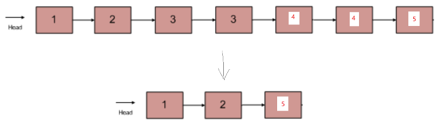

- 题目要求不保留重复的元素

```C++

/*
struct ListNode {
    int val;
    struct ListNode *next;
    ListNode(int x) :
        val(x), next(NULL) {
    }
};
*/
class Solution {
public:
    ListNode* deleteDuplication(ListNode* pHead) 
    {
        if(pHead == nullptr) return nullptr;
        ListNode* res = new ListNode(-1); // 虚拟节点，用于删除头元素
        res->next = pHead;
        ListNode* cur = res;
        while(cur->next != nullptr && cur->next->next != nullptr)
        {
            if(cur->next->val == cur->next->next->val)
            {
                int tmp = cur->next->val;
                while(cur->next != nullptr && cur->next->val == tmp) // 把重复元素都跳过
                {
                    cur->next = cur->next->next;
                }
            }
            else 
            {
                cur = cur->next;
            }
        }
        return res->next;
    }
};
```


**延伸题目**

[删除排序链表中的重复元素](https://leetcode.cn/problems/remove-duplicates-from-sorted-list/)

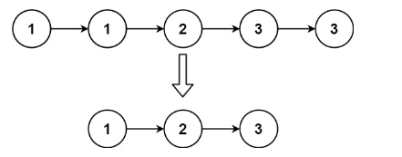

- 题目要求保留重复的元素

```c++
/**
 * Definition for singly-linked list.
 * struct ListNode {
 *     int val;
 *     ListNode *next;
 *     ListNode() : val(0), next(nullptr) {}
 *     ListNode(int x) : val(x), next(nullptr) {}
 *     ListNode(int x, ListNode *next) : val(x), next(next) {}
 * };
 */
class Solution {
public:
    ListNode* deleteDuplicates(ListNode* head) 
    {
        if(head == nullptr) return nullptr;
        ListNode* res = new ListNode(-1);
        res->next = head;
        ListNode* cur = res;
        while(cur->next != nullptr && cur->next->next != nullptr)
        {
            if(cur->next->val == cur->next->next->val)
            {
                cur->next = cur->next->next;
            }
            else
            {
                cur = cur->next;
            }
        }

        return res->next;
    }
};
```


## 链表补充题目

### [1 判断回文链表](https://leetcode.cn/problems/aMhZSa/description/)

思路：

- 使用栈存放链表元素
- 然后比较栈顶元素和链表元素的值是否一样
- 如果有不一样的节点值，说明不是回文，如果链表走到了Null节点或者栈为空，说明是回文

```c++
/**
 * Definition for singly-linked list.
 * struct ListNode {
 *     int val;
 *     ListNode *next;
 *     ListNode() : val(0), next(nullptr) {}
 *     ListNode(int x) : val(x), next(nullptr) {}
 *     ListNode(int x, ListNode *next) : val(x), next(next) {}
 * };
 */
class Solution {
public:
    bool isPalindrome(ListNode* head) 
    {
        stack<ListNode*> myStack;
        ListNode* p = head;
        while(p != nullptr)
        {
            myStack.push(p);
            p = p->next;
        }
        p = head;
        while(!myStack.empty())
        {   
            if(p->val != myStack.top()->val)
            {
                return false;
            }
            myStack.pop();
            p = p->next;
        }
        return true;
    }
};
```

另外一个思路：本题使用递归比较啰嗦，就当练习递归思想和vector用法了。

- 使用递归把元素放到vector里，递归函数调用结束后，vector存放的就是从尾到头的元素
- 比较链表和vector首元素的值是否相同

```c++
/**
 * Definition for singly-linked list.
 * struct ListNode {
 *     int val;
 *     ListNode *next;
 *     ListNode() : val(0), next(nullptr) {}
 *     ListNode(int x) : val(x), next(nullptr) {}
 *     ListNode(int x, ListNode *next) : val(x), next(next) {}
 * };
 */
class Solution {
public:
    bool isPalindrome(ListNode* head) 
    {
        vector<int> res;
        ListNode* p = head;
        reverse(p, res);
        p=head;
        while(!res.empty())
        {
            if(p->val != res.front())
            {
                return false;
            }
            p = p->next;
            res.erase(res.begin());
        }
        return true;
    }

    void reverse(ListNode* head, vector<int>& res)
    {
        if(head == nullptr) return;
        reverse(head->next,res);
        res.push_back(head->val);
    }

};
```


### [2 K个一组反转链表](https://leetcode.cn/problems/reverse-nodes-in-k-group/description/)


# 2 树

## [剑指Offer 55.1 二叉树的深度](https://www.nowcoder.com/practice/435fb86331474282a3499955f0a41e8b?tpId=13&tqId=23294&ru=%2Fpractice%2Ff836b2c43afc4b35ad6adc41ec941dba&qru=%2Fta%2Fcoding-interviews%2Fquestion-ranking&sourceUrl=)

简单递归问题。

```c++
/*
struct TreeNode {
	int val;
	struct TreeNode *left;
	struct TreeNode *right;
	TreeNode(int x) :
			val(x), left(NULL), right(NULL) {
	}
};*/
class Solution {
public:
	// 函数含义：给定一个节点，求出以这个节点为根节点的二叉树的最大深度
    int TreeDepth(TreeNode* pRoot) 
	{
		if(pRoot == nullptr) return 0;
		return max(TreeDepth(pRoot->left), TreeDepth(pRoot->right)) + 1;
    }
};

```


## [剑指Offer 27. 二叉树的镜像](https://www.nowcoder.com/practice/a9d0ecbacef9410ca97463e4a5c83be7?tpId=13&tqId=1374963&ru=%2Fpractice%2Fa861533d45854474ac791d90e447bafd&qru=%2Fta%2Fcoding-interviews%2Fquestion-ranking&sourceUrl=)

题意：

源二叉树：

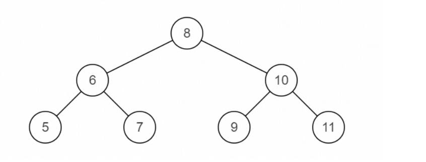

镜像后的二叉树

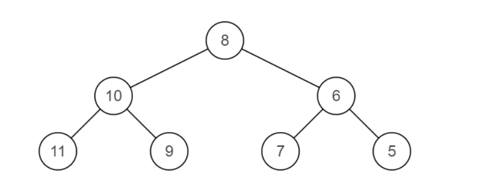

思路：递归，前序或者后序

- 明确递归函数的定义，然后应用于左右子树
- 在根节点完成镜像

```c++
/**
 * struct TreeNode {
 *	int val;
 *	struct TreeNode *left;
 *	struct TreeNode *right;
 *	TreeNode(int x) : val(x), left(nullptr), right(nullptr) {}
 * };
 */
class Solution {
public:
    /**
     * 代码中的类名、方法名、参数名已经指定，请勿修改，直接返回方法规定的值即可
     *
     * 
     * @param pRoot TreeNode类 
     * @return TreeNode类
     */
    // 递归含义：给定一个节点，返回以这个节点为根节点的二叉树的镜像
    TreeNode* Mirror(TreeNode* pRoot) 
    {
        // write code here
        if(pRoot == nullptr) return nullptr;
        // 镜像自己
        TreeNode* tmp = pRoot->left;;
        pRoot->left = pRoot->right;
        pRoot->right = tmp;
        
        Mirror(pRoot->left);  // 返回以左子树节点为根节点的二叉树的镜像
        Mirror(pRoot->right); // 返回以右子树节点为根节点的二叉树的镜像
        return pRoot;
    }
};
```


## [剑指Offer 55.2 平衡二叉树](https://www.nowcoder.com/practice/8b3b95850edb4115918ecebdf1b4d222?tpId=13&tqId=23250&ru=%2Fpractice%2F7fe2212963db4790b57431d9ed259701&qru=%2Fta%2Fcoding-interviews%2Fquestion-ranking&sourceUrl=)

平衡二叉树：它是一棵空树或它的左右两个子树的高度差的绝对值不超过1，并且左右两个子树都是一棵平衡二叉树。

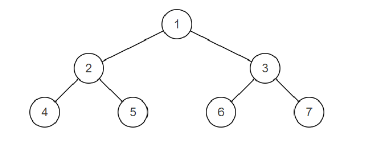

思路：想到的思路分别判断左右子树是否是平衡二叉树（递归），在判断自己是否是平衡二叉树，那么需要求二叉树的深度

```c++
/**
 * struct TreeNode {
 *	int val;
 *	struct TreeNode *left;
 *	struct TreeNode *right;
 *	TreeNode(int x) : val(x), left(nullptr), right(nullptr) {}
 * };
 */
class Solution {
public:
    /**
     * 代码中的类名、方法名、参数名已经指定，请勿修改，直接返回方法规定的值即可
     *
     * 
     * @param pRoot TreeNode类 
     * @return bool布尔型
     */
    // 递归含义：输入一个节点，返回以这个节点为根节点的树是否是平衡二叉树
    bool IsBalanced_Solution(TreeNode* pRoot) 
    {
        // write code here
        if(pRoot == nullptr) return true;
        bool a = IsBalanced_Solution(pRoot->left); // 左子树是否是平衡二叉树
        bool b = IsBalanced_Solution(pRoot->right); // 右子树是否是平衡二叉树
        return (abs(maxDepth(pRoot->left) - maxDepth(pRoot->right)) <= 1) && a && b ? true : false;
    }

    // 先求二叉树的最大深度
    int maxDepth(TreeNode* pRoot)
    {
        if(pRoot == nullptr) return 0;
        return max(maxDepth(pRoot->left), maxDepth(pRoot->right)) + 1;
    }
};
```


## [剑指Offer28. 对称的二叉树]([判断对称二叉树](https://leetcode.cn/problems/dui-cheng-de-er-cha-shu-lcof/))

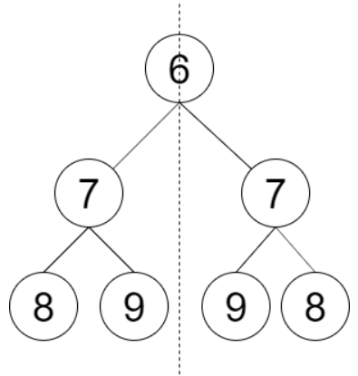

思路：

首先尝试了一下前中后序遍历的结果，发现中序遍历`8 7 9 6 9 7 8`是一个回文数

所以一个简单的解法就是把树按照中序遍历一下，放到一个容器中，判断这个容器里的数字是不是回文的就可以了

但是写完之后发现这个方法不可行，如果节点的值一样，并且有null的话，就不好判断了

**192 / 195 个通过的测试用例**

```c++
/**
 * Definition for a binary tree node.
 * struct TreeNode {
 *     int val;
 *     TreeNode *left;
 *     TreeNode *right;
 *     TreeNode() : val(0), left(nullptr), right(nullptr) {}
 *     TreeNode(int x) : val(x), left(nullptr), right(nullptr) {}
 *     TreeNode(int x, TreeNode *left, TreeNode *right) : val(x), left(left), right(right) {}
 * };
 */
class Solution {
public:
    bool checkSymmetricTree(TreeNode* root) 
    {
        vector<int> myVector;
        stack<int> myStack;
        middleIter(root, myVector, myStack);
        for(int it : myVector)
        {
            if(it != myStack.top())
            {
                return false;
            }
            myStack.pop();
        }
        return true;
    }

    void middleIter(TreeNode* root, vector<int>& myVector, stack<int>& myStack)
    {
        if(root == nullptr) return;
        middleIter(root->left, myVector, myStack);
        myVector.push_back(root->val);
        myStack.push(root->val);
        middleIter(root->right, myVector, myStack);
    }
};
```

另外一种解法，递归，虽然想到了，但是第一次没写出来，mirror理解不到位

```c++
/**
 * Definition for a binary tree node.
 * struct TreeNode {
 *     int val;
 *     TreeNode *left;
 *     TreeNode *right;
 *     TreeNode() : val(0), left(nullptr), right(nullptr) {}
 *     TreeNode(int x) : val(x), left(nullptr), right(nullptr) {}
 *     TreeNode(int x, TreeNode *left, TreeNode *right) : val(x), left(left), right(right) {}
 * };
 */
class Solution {
public:
    bool checkSymmetricTree(TreeNode* root) 
    {
        if(root == nullptr) return true;
        return mirror(root->left, root->right);
    }
    bool mirror(TreeNode* left, TreeNode* right)
    {
        if(left == nullptr && right == nullptr) return true;
        if(left == nullptr || right == nullptr) return false;
        return mirror(left->left, right->right) && mirror(left->right, right->left) && (left->val == right->val);
    }
};
```


## [剑指Offer 32.1 从上往下打印二叉树](https://www.nowcoder.com/practice/7fe2212963db4790b57431d9ed259701?tpId=13&tqId=23280&ru=%2Fpractice%2F6e196c44c7004d15b1610b9afca8bd88&qru=%2Fta%2Fcoding-interviews%2Fquestion-ranking&sourceUrl=)

二叉树的层序遍历：使用队列实现

```c++
/*
struct TreeNode {
	int val;
	struct TreeNode *left;
	struct TreeNode *right;
	TreeNode(int x) :
			val(x), left(NULL), right(NULL) {
	}
};*/
#include <queue>
class Solution {
public:
	
    vector<int> PrintFromTopToBottom(TreeNode* root) 
	{
		vector<int> res;
		if(root == nullptr) return res;
		queue<TreeNode*> q;
		q.push(root);
		TreeNode* cur;
		while(!q.empty())
		{
			cur = q.front();
			q.pop();
			res.push_back(cur->val);
			if(cur->left != nullptr) q.push(cur->left);
			if(cur->right != nullptr) q.push(cur->right);
		}
		return res;
    }
};

```


**拓展题目**

[102. 二叉树的层序遍历](https://leetcode.cn/problems/binary-tree-level-order-traversal/)

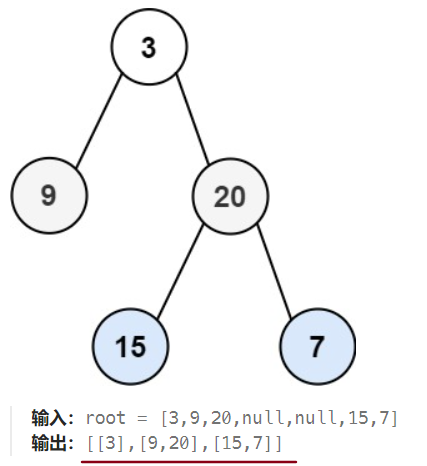

```c++
/**
 * Definition for a binary tree node.
 * struct TreeNode {
 *     int val;
 *     TreeNode *left;
 *     TreeNode *right;
 *     TreeNode() : val(0), left(nullptr), right(nullptr) {}
 *     TreeNode(int x) : val(x), left(nullptr), right(nullptr) {}
 *     TreeNode(int x, TreeNode *left, TreeNode *right) : val(x), left(left), right(right) {}
 * };
 */
class Solution {
public:
    vector<vector<int>> levelOrder(TreeNode* root) 
    {
        vector<vector<int>> res;
        if(root == nullptr) return res;
        queue<TreeNode*> q;
        TreeNode* cur;
        map<TreeNode*, int> myMap; //记录当前节点在第几层
        q.push(root);
        myMap[root] = 0;
        while(!q.empty())
        {
            cur = q.front();
            q.pop();
            int level = myMap[cur];
            if(myMap[cur] == res.size())
            {
                vector<int> tmp;
                res.push_back(tmp);
            }
            res[level].push_back(cur->val);
            if(cur->left != nullptr)
            {
                q.push(cur->left);
                myMap[cur->left] = level + 1;
            }
            if(cur->right != nullptr)
            {
                q.push(cur->right);
                myMap[cur->right] = level + 1;
            }
        }
        return res;
    }
};
```


## [剑指Offer 7 重建二叉树](https://www.nowcoder.com/practice/8a19cbe657394eeaac2f6ea9b0f6fcf6?tpId=13&tqId=23282&ru=%2Fpractice%2F7fe2212963db4790b57431d9ed259701&qru=%2Fta%2Fcoding-interviews%2Fquestion-ranking&sourceUrl=)

```c++
/**
 * struct TreeNode {
 *	int val;
 *	struct TreeNode *left;
 *	struct TreeNode *right;
 *	TreeNode(int x) : val(x), left(nullptr), right(nullptr) {}
 * };
 */
class Solution {
public:
    /**
     * 代码中的类名、方法名、参数名已经指定，请勿修改，直接返回方法规定的值即可
     *
     * 
     * @param preOrder int整型vector 
     * @param vinOrder int整型vector 
     * @return TreeNode类
     */
    TreeNode* reConstructBinaryTree(vector<int>& preOrder, vector<int>& vinOrder) 
    {
        // write code here
        return build(preOrder, 0, preOrder.size() - 1,
                     vinOrder, 0, vinOrder.size() - 1);

    }

    TreeNode* build(vector<int>& preOrder, int preStart, int preEnd, vector<int>& vinOrder, int inStart, int inEnd) 
    {
		// base case：要构建的是从[preStart, preEnd]之间的节点值，如果preStart>preEnd，说明preOrder全部都用完了
        if(preStart > preEnd) return nullptr; 
        int rootVal = preOrder[preStart];
        int rootIndex = 0;
        for(int i = 0; i < vinOrder.size(); i++)
        {
            if(vinOrder[i] == rootVal)
            {
                rootIndex = i;
                break;
            }
        }
        int leftSize = rootIndex - inStart;
        
        TreeNode* root = new TreeNode(rootVal);
        root->left = build(preOrder, preStart + 1, preStart + leftSize, 
                           vinOrder, inStart, rootIndex - 1);
        root->right = build(preOrder, preStart + leftSize + 1, preEnd, 
                           vinOrder, rootIndex + 1, inEnd);
        return root;
    }
};
```


## [剑指Offer 86 在二叉树中找到两个节点的最近公共祖先](https://www.nowcoder.com/practice/e0cc33a83afe4530bcec46eba3325116?tpId=13&tqId=1024325&ru=%2Fpractice%2Fd9820119321945f588ed6a26f0a6991f&qru=%2Fta%2Fcoding-interviews%2Fquestion-ranking&sourceUrl=)

两个节点存在两种关系

- 包含
- 分叉

```c++
/**
 * struct TreeNode {
 *	int val;
 *	struct TreeNode *left;
 *	struct TreeNode *right;
 *	TreeNode(int x) : val(x), left(nullptr), right(nullptr) {}
 * };
 */
class Solution {
public:
    /**
     * 代码中的类名、方法名、参数名已经指定，请勿修改，直接返回方法规定的值即可
     *
     * 
     * @param root TreeNode类 
     * @param o1 int整型 
     * @param o2 int整型 
     * @return int整型
     */
    int lowestCommonAncestor(TreeNode* root, int o1, int o2) 
    {
        // write code here
        if(root == nullptr)
        {
            return -1;
        }
        if(root->val == o1 || root ->val == o2)
        {
            return root->val;
        }
        int leftNum = lowestCommonAncestor(root->left, o1, o2);
        int rightNum = lowestCommonAncestor(root->right, o1, o2);
        //左子树也搜到，右子树也搜到，返回root
        if(leftNum != -1 && rightNum != -1)
        {
            return root->val;
        }
 		//都没搜到返回空
        if(leftNum == -1 && rightNum == -1)
        {
            return -1;
        }
        // 一个为空一个不为空，返回为不为空的那个
        return leftNum != -1 ? leftNum : rightNum;
    }
};
```


## [剑指Offer68 二叉搜索树的最近公共祖先](https://www.nowcoder.com/practice/d9820119321945f588ed6a26f0a6991f?tpId=13&tqId=2290592&ru=%2Fpractice%2Fe0cc33a83afe4530bcec46eba3325116&qru=%2Fta%2Fcoding-interviews%2Fquestion-ranking&sourceUrl=)

方法1：当作普通二叉树处理，但这不是题目想表达的意思

```c++
/**
 * struct TreeNode {
 *	int val;
 *	struct TreeNode *left;
 *	struct TreeNode *right;
 *	TreeNode(int x) : val(x), left(nullptr), right(nullptr) {}
 * };
 */
class Solution {
public:
    /**
     * 代码中的类名、方法名、参数名已经指定，请勿修改，直接返回方法规定的值即可
     *
     * 
     * @param root TreeNode类 
     * @param p int整型 
     * @param q int整型 
     * @return int整型
     */
    int lowestCommonAncestor(TreeNode* root, int p, int q) 
    {
        // write code here
        if(root == nullptr) return -1;
        if(root->val == p || root->val == q) return root->val;
        int leftNum = lowestCommonAncestor(root->left, p, q);
        int rightNum = lowestCommonAncestor(root->right, p, q);
        if(leftNum == -1 && rightNum == -1) return -1;
        if(leftNum != -1 && rightNum != -1) return root->val;
        return leftNum != -1 ? leftNum : rightNum;
    }
};
```


方法2：结合二叉搜索树的性质

```c++
/**
 * struct TreeNode {
 *	int val;
 *	struct TreeNode *left;
 *	struct TreeNode *right;
 *	TreeNode(int x) : val(x), left(nullptr), right(nullptr) {}
 * };
 */
#include <algorithm>
class Solution {
public:
    /**
     * 代码中的类名、方法名、参数名已经指定，请勿修改，直接返回方法规定的值即可
     *
     * 
     * @param root TreeNode类 
     * @param p int整型 
     * @param q int整型 
     * @return int整型
     */
    int lowestCommonAncestor(TreeNode* root, int p, int q) 
    {
        // 1. 如果先遇到了p，返回p
        // 2. 如果先遇到了q，返回q
        // p和q肯定区分较大值和较小值:
        // 3. 如果root大于最大值，root左移
        // 4. 如果root小于最小值，root右移
        // 5. 如果最小值<root<最大值，返回root自己
        while (root->val != q && root->val != p) 
        {
            if(root->val > min(p, q) && root->val < max(p, q))
            {
                break;
            }
            root = root->val > max(p, q) ? root->left : root->right;
        }
        return root->val;
    }
};
```


## [剑指Offer33. 二叉搜索树的后序遍历序列](https://www.nowcoder.com/practice/a861533d45854474ac791d90e447bafd?tpId=13&tqId=23289&ru=%2Fpractice%2Fa861533d45854474ac791d90e447bafd&qru=%2Fta%2Fcoding-interviews%2Fquestion-ranking&sourceUrl=)

二叉搜索树的最后一个节点是根节点

```c++
class Solution {
public:
    bool VerifySquenceOfBST(vector<int> sequence) 
    {
        if(sequence.empty()) return false;
        return func(sequence, 0, sequence.size() - 1);
    }

    bool func(vector<int>& sequence, int left, int right)
    {
        if(left >= right) return true;
        int rootVal = sequence[right];
        int p = left;
        // 找到第一个大于rootVal的位置，大于根节点的位置
        while (sequence[p] < rootVal) 
        {
            p++;
        }
        // (p) -- right 之间，rootVal的值是否小于这些值 --这个不用判断，因为P的取值已经决定p之前的值都是小于rootVal的
        // left -- (p-1) 之间，rootVal的值是否大于这些值
        for(int i = p; i < right; i++)
        {
            if(sequence[i] < rootVal) return false;
        }
        
        return func(sequence, left, p - 1) &&  func(sequence, p, right - 1);
    }
};
```


## [剑指Offer54. 二叉查找树的第 K 个结点](https://www.nowcoder.com/practice/57aa0bab91884a10b5136ca2c087f8ff?tpId=13&tqId=2305268&ru=%2Fpractice%2Fe0cc33a83afe4530bcec46eba3325116&qru=%2Fta%2Fcoding-interviews%2Fquestion-ranking&sourceUrl=)

遇到这个题想到一种最直接的方法是把二叉树的节点都放到vector里，然后返回vector的第`k-1`个元素

面向用例编程....

```c++
/**
 * struct TreeNode {
 *	int val;
 *	struct TreeNode *left;
 *	struct TreeNode *right;
 *	TreeNode(int x) : val(x), left(nullptr), right(nullptr) {}
 * };
 */
class Solution {
public:
    /**
     * 代码中的类名、方法名、参数名已经指定，请勿修改，直接返回方法规定的值即可
     *
     * 
     * @param proot TreeNode类 
     * @param k int整型 
     * @return int整型
     */
    int KthNode(TreeNode* proot, int k) 
    {
        // write code here
        if(proot == nullptr) return -1;
        vector<int> vec;
        func(proot, vec);
        if(k > vec.size() || k == 0) return -1;
        return vec[k - 1];
    }

    // 中序遍历二叉树，将节点值放到vector里
    void func(TreeNode* proot, vector<int>& vec)
    {
        if(proot == nullptr) return;
        func(proot->left, vec);
        vec.push_back(proot->val);
        func(proot->right, vec);
    }
};
```


看了官方题解才写出来的答案：

- 中序遍历并且使用一个变量`count`记录遍历到第几个了
- 如果`count == k` 说明找到了第`k`小的节点

```c++
/**
 * struct TreeNode {
 *	int val;
 *	struct TreeNode *left;
 *	struct TreeNode *right;
 *	TreeNode(int x) : val(x), left(nullptr), right(nullptr) {}
 * };
 */
class Solution {
public:
    /**
     * 
     * @param proot TreeNode类 
     * @param k int整型 
     * @return int整型
     */
    int count = 0;
    TreeNode* res = nullptr;
    int KthNode(TreeNode* proot, int k) 
    {
        // write code here
        if(proot == nullptr) return -1;
        midOrder(proot, k);
        if(res)
        {
            return res->val;
        }
        else 
        {
            return -1;
        }

    }

    void midOrder(TreeNode* proot, int k)
    {
        if(proot == nullptr) return;
        midOrder(proot->left, k);
        count++;
        if(count == k) res = proot;

        midOrder(proot->right, k);
    }

};
```


## [剑指Offer26. 树的子结构](https://www.nowcoder.com/practice/6e196c44c7004d15b1610b9afca8bd88?tpId=13&tqId=23293&ru=%2Fpractice%2F57aa0bab91884a10b5136ca2c087f8ff&qru=%2Fta%2Fcoding-interviews%2Fquestion-ranking&sourceUrl=)

```c++
/*
struct TreeNode {
	int val;
	struct TreeNode *left;
	struct TreeNode *right;
	TreeNode(int x) :
			val(x), left(NULL), right(NULL) {
	}
};*/
class Solution {
public:
	// 判断pRoot1是否包含pRoot2
	// 子问题：以每一个pRoot1的节点作为根节点，判断是否包含pRoot2的子结构
    bool HasSubtree(TreeNode* pRoot1, TreeNode* pRoot2) 
	{
		if(pRoot1 == nullptr || pRoot2 == nullptr) return false;
        // 1. 以pRoot1为根节点的树包含pRoot2
        // 2. pRoot1 的左子树包含pRoot2
        // 3. pRoot1 的右子树包含pRoot2
		return isSubTree(pRoot1, pRoot2) || HasSubtree(pRoot1->left, pRoot2) || HasSubtree(pRoot1->right, pRoot2);
    }

	// 判断以A为根节点的树，是否包含以B为根节点的树
	bool isSubTree(TreeNode* A, TreeNode* B)
	{
		if(B == nullptr) return true;
		if(A == nullptr) return false;
		return (A->val == B->val) && isSubTree(A->left, B->left) && isSubTree(A->right, B->right);
	}
};
```


## [剑指Offer8. 二叉树的下一个结点](https://www.nowcoder.com/practice/9023a0c988684a53960365b889ceaf5e?tpId=13&tqId=23451&ru=%2Fpractice%2Ff836b2c43afc4b35ad6adc41ec941dba&qru=%2Fta%2Fcoding-interviews%2Fquestion-ranking&sourceUrl=)

朴素解法：根据next指针一直向上找，找到整棵树的根节点，然后中序遍历，存到vector里，最后判断要找的值是哪个。

```c++
/*
struct TreeLinkNode {
    int val;
    struct TreeLinkNode *left;
    struct TreeLinkNode *right;
    struct TreeLinkNode *next;
    TreeLinkNode(int x) :val(x), left(NULL), right(NULL), next(NULL) {
        
    }
};
*/
class Solution {
public:
    TreeLinkNode* GetNext(TreeLinkNode* pNode) 
    {
        if(pNode == nullptr) return nullptr;
        TreeLinkNode* root = pNode;
        while(root->next != nullptr)
        {
            root = root->next;
        }
        vector<TreeLinkNode*> vec;
        inOrder(root, vec);
        for(int i = 0; i < vec.size(); i++)
        {
            if(vec[i] == pNode)
            {
                return vec[i + 1];
            }
        }
        return nullptr;

    }
    void inOrder(TreeLinkNode* root, vector<TreeLinkNode*>& vec)
    {
        if(root == nullptr) return;
        inOrder(root->left, vec);
        vec.push_back(root);
        inOrder(root->right, vec);
    }
};

```

进阶解法：看完题解才明白

- 当前节点有右子树
  - 找到右子树的最左节点
- 当前节点没有右子树
  - 当前节点为父节点的左节点，返回父节点
  - 当前节点为父节点的右节点，一直向上找，直到上级是上上级的左孩子，返回上上级

```c++
/*
struct TreeLinkNode {
    int val;
    struct TreeLinkNode *left;
    struct TreeLinkNode *right;
    struct TreeLinkNode *next;
    TreeLinkNode(int x) :val(x), left(NULL), right(NULL), next(NULL) {
    }
};
*/
class Solution {
public:
    TreeLinkNode* GetNext(TreeLinkNode* pNode) 
    {
        // 当前节点有右子树，找到右子树的最左节点
        if(pNode->right != nullptr)
        {
            pNode = pNode ->right;
            while(pNode->left != nullptr)
            {
                pNode = pNode->left;
            }
            return pNode;
        }
        else 
        {
            // 当前节点没有右子树
            // 1. 当前节点为父节点的左节点，返回父节点
            if(pNode->next != nullptr && pNode == pNode->next->left) return pNode->next;
            // 2.当前节点为父节点的右节点，一直向上找，直到上级是上上级的左孩子，返回上上级
            if(pNode->next != nullptr && pNode == pNode->next->right)
            {
                while(pNode->next != nullptr && pNode != pNode->next->left)
                {
                    pNode = pNode->next;
                }
                return pNode->next;
            }
        }
        return nullptr;
    }
};

```


## [剑指Offer34. 二叉树中和为某一值的路径](https://leetcode.cn/problems/path-sum-ii/description/)

递归+恢复现场

```c++
/**
 * Definition for a binary tree node.
 * struct TreeNode {
 *     int val;
 *     TreeNode *left;
 *     TreeNode *right;
 *     TreeNode() : val(0), left(nullptr), right(nullptr) {}
 *     TreeNode(int x) : val(x), left(nullptr), right(nullptr) {}
 *     TreeNode(int x, TreeNode *left, TreeNode *right) : val(x), left(left), right(right) {}
 * };
 */
class Solution {
public:
    vector<vector<int>> res;
    vector<int> path;
    vector<vector<int>> pathSum(TreeNode* root, int targetSum) 
    {
        if(root == nullptr) return res;
        func(root, targetSum);
        return res;
    }

    void func(TreeNode* root, int targetSum)
    {
        if(root == nullptr) return;
        path.push_back(root->val);
        targetSum -= root->val;
        if(targetSum == 0 && root->left == nullptr && root->right == nullptr)
        {
            res.push_back(path);
        }
        func(root->left, targetSum);
        func(root->right, targetSum);

        path.pop_back();
    }
};
```


**[路径总和](https://leetcode.cn/problems/path-sum/)**

```c++
/**
 * Definition for a binary tree node.
 * struct TreeNode {
 *     int val;
 *     TreeNode *left;
 *     TreeNode *right;
 *     TreeNode() : val(0), left(nullptr), right(nullptr) {}
 *     TreeNode(int x) : val(x), left(nullptr), right(nullptr) {}
 *     TreeNode(int x, TreeNode *left, TreeNode *right) : val(x), left(left), right(right) {}
 * };
 */
class Solution {
public:
    bool hasPathSum(TreeNode* root, int targetSum) 
    {
        if(root == nullptr) return false;
        if(root ->left == nullptr && root->right == nullptr) return targetSum - root->val == 0;
        return hasPathSum(root->left, targetSum-root->val) || hasPathSum(root->right, targetSum-root->val);
    }
};
```


**生活的不如意是理想存在的必要条件。**