# 一、操作系统概述

## 1 什么是操作系统

操作系统（Operation System），简称OS，是管理计算机**硬件**与**软件**资源的计算机**程序**。

> 操作系统是一个程序，用来管理计算机硬件与软件（是一个管理者的角色）

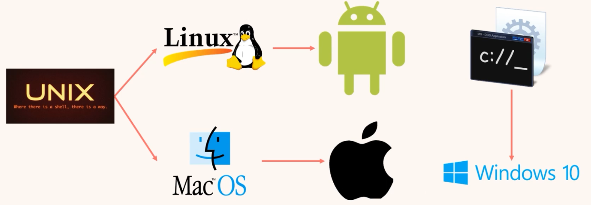

计算机系统的构成

- 用户
- 应用程序（应用程序都安装在了操作系统里）
- 操作系统（操作系统向应用程序提供服务（接口））
- 硬件（CPU、内存、键盘、鼠标）


虽然操作系统也是应用程序（软件），但是它和普通应用软件不一样，它是一种**系统软件**。

系统软件做了哪些事？

- 与硬件交互
- 对硬件资源（CPU、内存）共享进行调度管理（多个应用程序都想访问硬件资源，由系统软件进行调度）
- 解决并发操作处理中存在的协调问题
- 数据结构复杂，外部接口多样化，便于用户反复使用

既然操作系统是一种系统软件，那么操作系统做了哪些事？

- 管理与配置内存
- 决定系统资源供给的优先次序
- 控制输入设备与输出设备
- 操作网络与管理文件系统等基本事务
- 提供一个让用户与系统交互的操作界面

## 2 操作系统的目标和功能

### 1.2.1 OS的目标

**管理系统资源**

- 有效性
  - 提高系统资源利用率
  - 提高系统的吞吐量

**方便用户使用**

- 方便性

**作为扩充机器**

- 可扩充性（比如增加内存，随着硬件的法阵而发展，新的硬件也能支持）
- 开放性

### 1.2.2 OS的功能

**作为计算机系统硬件资源的管理者**

- 处理器管理
  - 进程控制
  - 进程同步
  - 进程通信
  - 调度
- 存储器管理
  - 内存分配
  - 内存保护
  - 地址映射
  - 内存扩充
- I/O设备管理
  - 缓冲管理
  - 设备分配
  - 设备处理
- 文件管理
  - 文件存储空间的管理
  - 目录管理
  - 文件的读/写管理和保护

**作为用户与计算机硬件系统之间的接口**


- 程序接口
- 命令接口
- GUI(Graphical User Interface，图形用户接口)

> 应用程序访问操作系统的接口, 这一过程叫做系统调用

**实现了对计算机硬件资源的抽象**


- 将具体的计算机硬件资源抽象成软件资源，方便用户使用
- 开放了简单的访问方式（操作系统对用户，对应用程序提供了接口），隐藏了实现细节（接口内部完成对硬件资源调用，这一过程不可见）
  - 举例：使用浏览器进行搜索

## 3 操作系统的特征

### 3.1 并发

**OS的并发性**

同一时间间隔内执行和调度多个程序的能力

- 宏观上，处理器同时执行多道程序
- 微观上，处理器在多道程序间高速切换（分时交替进行）
- 关注单个处理器同一时间段内处理任务数量的能力

相似概念：并行

- 并发：同一时间间隔（时间段）发生的事件数量
- 并行：同一时刻（时间点）发生的事件数量

### 3.2 共享

**OS的共享性**

即硬件资源共享，系统中的资源供多个并发执行的应用程序共同使用

- 同时访问方式：同一时间段允许多个程序同时访问共享资源
- 互斥共享方式：也叫独占式，允许多个程序在同一个共享资源上独立而互补干扰的工作

- 共享打印机、音频设备、视频设备

> 并发和共享互为前提
>
> - 共享性要求OS中同时运行着多道程序
>   - 若只有单道程序正在运行，则不存在共享的可能
> - 并发性难以避免的导致多道程序同时访问同一个资源
>   - 若多道程序无法共享部分资源（比如磁盘），则无法并发

### 3.3 虚拟

**OS的虚拟技术**

使用某种技术把一个物理实体变成多个逻辑上的对应物。按两个维度：

- 时分复用技术（TDM，Time Division Multiplexing）
  - 虚拟处理器技术：四核八线程
  - 虚拟设备技术：虚拟打印机
- 空分复用技术：（SDM，Space Division Multiplexing）
  - 虚拟磁盘技术：将一块硬盘虚拟出若干个卷
  - 虚拟存储器技术

### 3.4 异步

**OS的异步性（Asynchronism）**

多道程序环境下，多个程序并发执行；

单处理器环境下，多个程序分时交替执行；

- 程序执行的不可预知性
  - 获得运行的时机
  - 因何暂停
  - 每道程序需要多少时间
  - 不同程序的性能，比如计算多少，I/O多少
- 宏观上“一气呵成”，微观上“走走停停”

## 4 操作系统的发展与分类

五个阶段：

**手工操作阶段**

- 人工操作方式
- 脱机输入/输出方式

**批处理阶段**

- 单道批处理系统
- 多道批处理系统

**分时操作系统**

**实时操作系统**

**微机操作系统的发展**

## 5 操作系统的运行机制

几个基本概念：

内核程序 <---> 应用程序

核心态 <---> 用户态（CPU的运行模式。CPU从用户态切换到内核态只有一种方式：中断）

特权指令 <---> 非特权指令


### 5.1 时钟管理

**计时：提供系统时间**

**时钟中断：比如进程切换**


### 5.2 中断机制

**作用：**提高多道程序环境下CPU利用率

- 举例：在执行某一个程序时，需要I/O操作，在I/O操作的过程中，可以让CPU去执行其它的程序。

**分类：**

- 外中断：中断信号来源于->外部设备

- 内中断：中断信号来源于->当前指令

内中断的三种情况：内中断也叫做异常/陷入/例外

陷阱/陷入（Trap）：由应用程序主动引发

故障（fault）：由错误条件引发

终止（abort）：由致命错误引发

**中断处理过程：**

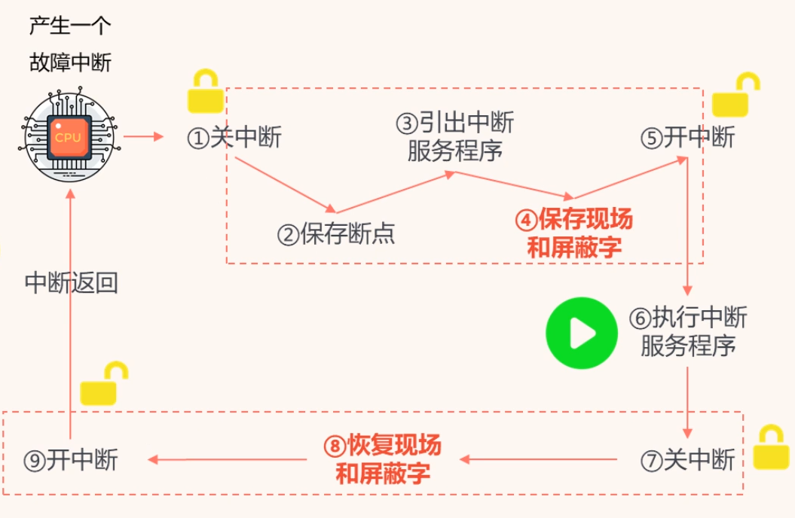

### 5.3 原语


- 原语是一个程序段
- 由若干条指令组成
- 用来完成某个特定操作
- 执行过程不会被中断（原子性，即不可中断，不是不可再分）

### 5.4 系统数据结构

进程管理：作业控制块、进程控制块

存储器管理：存储器分配与回收

设备管理：缓冲区、设备控制块


### 5.5 系统调用

由操作系统实现，给应用程序调用，即应用程序调用操作系统内核功能时进行的调用。

## 6 操作系统的体系结构


# 二、进程管理

## 1 什么是进程

### 1.1 进程的概念

进程是一个具有一定独立功能的程序关于某个数据集合的一次运行活动，是系统进行资源分配和调度的一个独立单位。

> 进程加载到内存中才会运行。

- 进程是`程序`的`一次执行`

  理解：程序没执行时没有进程，执行时才会产生进程。比如打开chrome浏览器，每打开一个页面都会产生一个进程。

  > an instance of a computer program that is being executed

- 进程是一个程序及其数据在处理器上顺序执行时所发生的`活动`

- 进程是程序在一个`数据集合`上运行的过程

- 进程是系统进行`资源分配和调度`的一个`基本单位`

  > 操作系统以进程为单位进行资源分配和调度。来一个进程，分配一些资源。

### 1.2 进程的结构和特征

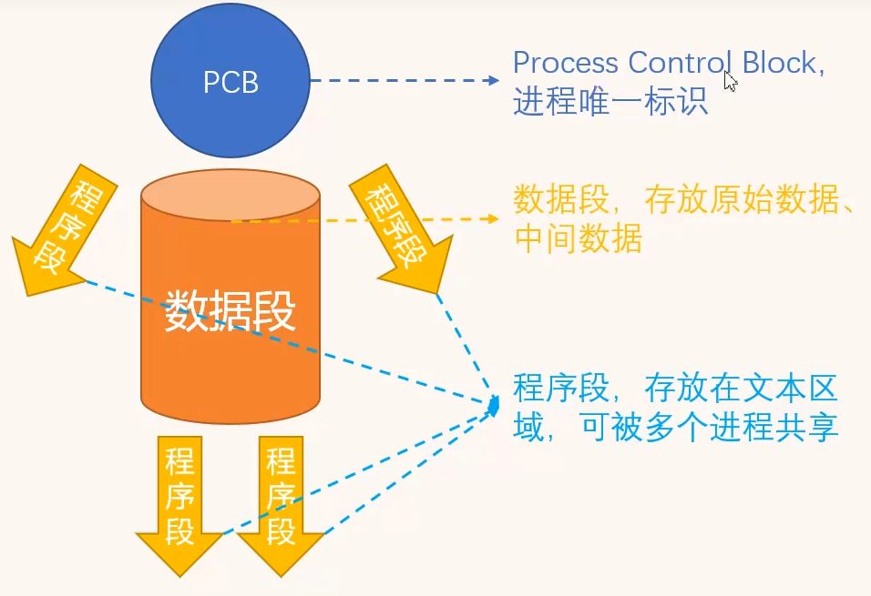 

**进程的结构：**

- 控制块（PCB，Process Control Block）。进程唯一标识。在基站前台敲PCB，可以看到各个进程
- 数据段，存放原始数据，中间数据
- 程序段，存放在文本区域，可被多个进程共享（同一个应用程序的多个进程之间是共享程序段的。比如打开chrome开了多个页面，一些基础程序是相同的，进程之间可共享，就不用再分配内存了）

**进程的特征：**

- 动态性：由创建而生，由撤销而亡
- 并发性：多个进程同时运行
- 独立性：独立资源分配（CPU、内存、I/O设备）
- 异步性：相互独立，互不干扰

### 1.3 进程与线程

**什么是线程？**

- Thread，进程的轻型实体，也叫“轻量级进程”，是一系列活动按事先设定好的顺序（代码顺序）依次执行的过程，是一系列指令的集合
- 是一条执行路径，不能单独存在，必须包含在进程中
- 线程是OS中运算调度的最小单位

举例：比如360杀毒应用程序运行时是一个进程，但是其中包含了很多小功能，也就是一系列指令的集合，这些就是线程 

**为什么引入线程？**

为了提高OS的并发性。

> 如果没有线程的概念，只有进程的概念的话：当某个应用程序运行时，如果这个应用程序想执行多个功能，那么就需要创建多个进程，成本很高

**线程的属性？**

- 轻型实体（相对于进程而言）
- 独立调度的基本单位
- 可并发执行
- 共享进程资源（线程的资源由进程管理）

**进程和线程的比较：**

- 调度：线程是资源调度的基本单位
- 拥有资源（CPU，寄存器，内存，I/O设备等等）：资源是分配给进程的
- 并发性
- 系统开销：线程切换比进程切换的开销要小很多
- 地址空间和其它资源：同一个进程中的多个线程，共享进程的内存空间（寄存器不共享）
- 通信

**线程的实现方式：**

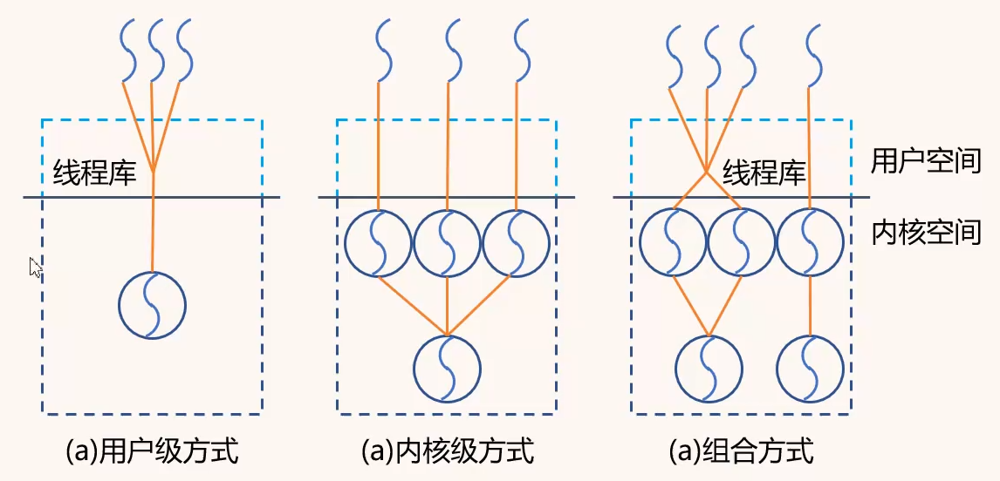

- 用户级线程：线程是在用户空间实现的（）
- 内核级线程：线程是在内核空间实现的

线程的实现是什么意思？

进程有PCB，是进程的唯一标识。线程也有类似概念，线程控制块。线程的实现就是线程控制块在用户空间实现的还是在内核空间实现的。

## 2 进程是怎么运行的

### 2.1 进程的状态

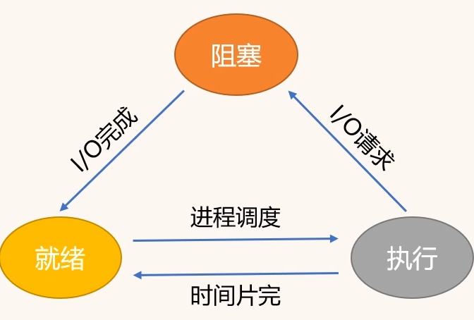

**就绪**（Ready）

可运行但未运行：没有CPU使用权，内存准备好了

**执行**

举例：执行状态需要进行I/O操作时会进入阻塞状态。可以理解为让其它硬件进行操作

**阻塞**

会有很多的阻塞队列，I/O请求相关的阻塞队列，或者其它的阻塞队列

从阻塞状态不能直接到执行状态，会先到就绪状态

**创建和终止状态**

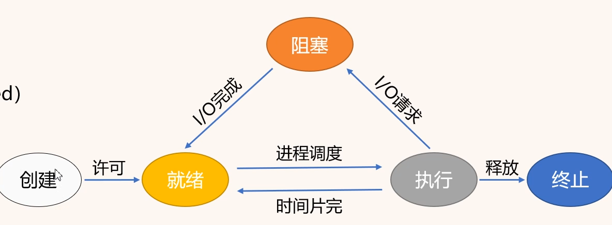


### 2.2 进程控制

OS对进程实现有效的管理，包括创建新进程，撤销已有进程、挂起、阻塞和唤醒、进程切换等多种操作。OS通过`原语`操作实现进程控制。

**原语的概念：**由若干条指令组成，完成特定的功能，是一种`原子`操作

**原语的特点：**

- 原子操作，要么全做，执行过程不会被中断

- 在内核态下执行，常驻内存，是内核程序
- 是内核三大支撑功能之一（中断处理、时钟管理、原语操作）

**进程控制相关原语：**可以看作是函数

- 创建原语：`create`
- 阻塞原语：`bolck`
- 唤醒原语：`wakeup`
- 撤销原语：`destroy`

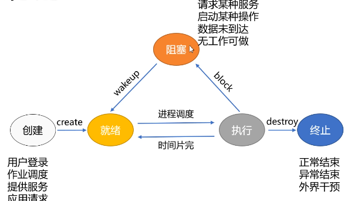

**进程控制的操作：**挂起与激活。

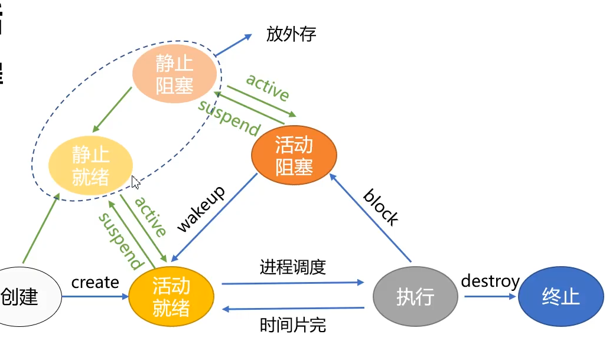

为了系统和用户用户观察和分析进程（查看CPU资源、内存等）

**挂起：**把进程数据从内存放到外存（磁盘）

挂起原语：`suspend`

- 静止就绪：放外存，不调度
- 静止阻塞：等待事件

**激活**

激活原语：`active`

- 活动就绪：等待调度
- 活动阻塞：等待唤醒


### 2.3 进程调度

根据一定的算法和原则将处理器资源进行重新分配的过程

**前提：**作业/进程数远远大于处理器数

**目的：**提高资源利用率，减少处理器空间时间

**调度程序：**一方面要满足特定系统用户的需求（快速响应），另一方面要考虑系统整体效率（系统平均周转时间）和调度算法本身的开销

**调度的层次：**

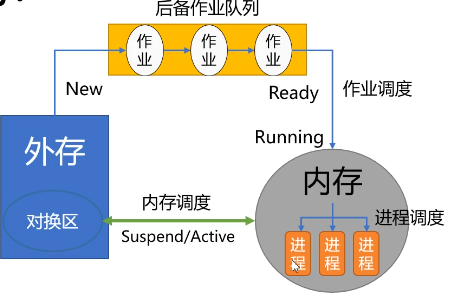

高级调度/作业调度：把外存中的应用程序加载到内存中作为进程。比如执行 `.exe`文件

- 把后备作业调入内存
- 只调入一次，调出一次

中级调度/内存调度

- 将进程调至外存，条件合适再调入内存
- 在内、外存对换区进行进程对换

低级调度/进程调度

- 从就绪队列选取进程分配给处理机
- 最基本的调度，频率非常高（相当于一个时间片完成）

**调度方式**

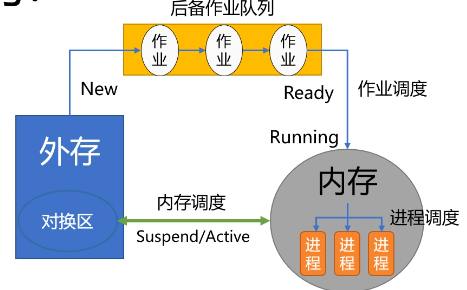

剥夺式/抢占式调度

- 立即暂定当前进程
- 分配处理机给另一个进程
- 原则：优先权/短进程优先/时间片原则（同时多个遵循多个原则）

非剥夺/非抢占式调度

- 若有进程请求执行
- 等待直到当前进程完成或阻塞
- 特点：适用于批处理系统，不适用分时/实时系统

**调度时机**

- 进程运行完毕

- 进程时间片用完
- 进程要求I/O操作
- 执行某种原语操作
- 高优先级进程申请运行（剥夺式调度）

**调度过程**

- 保存镜像：记录进程现场信息
- 调度算法：确定分配处理机的原则
- 进程切换：分配处理机给其它进程
- 处理机回收：从进程收回处理机

**调度算法指标**

- CPU利用率：忙碌时间/总时间
- 系统吞吐量：完成作业数/总时间
- 周转时间
- 等待时间
- 响应时间

### 2.4 调度算法


## 3  进程之间是怎么协作的？

### 3.1 进程通信

概念：进程通信即进程间的信息交换

- 进程是资源分配的基本单位，各进程内存空间彼此独立
- 一个进程不能随意访问其它进程的地址空间

同一个计算机内部有三种方式：

**共享存储**：收发双方不可见，存在安全隐患

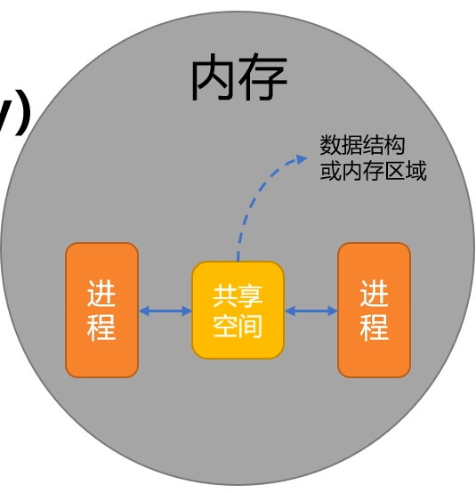

- 基于`共享数据结构`的通信方式
  - 多个进程供用某个数据结构（OS提供并控制）
  - 由用户（程序员）负责同步处理
  - 可以传递少量数据，效率低

- 基于`共享存储区`的通信方式
  - 多个进程共用内存中的一块存储区域
  - 由进程控制数据的形式和方式
  - 可以传递大量数据，效率高

**消息传递**：

- 直接通信：点到点发送
  - 发送和接收时指明双方进程的ID
  - 每个进程维护一个消息缓冲队列

  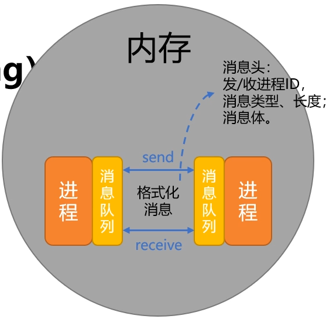

- 间接通信：广播信箱

  - 以信箱为媒介，作为中间实体
  - 发进程将消息发送到信箱，收进程从信箱读取
  - 可以广播，容易简历双向通信链

**管道通信**：就是用一个pipe文件操作

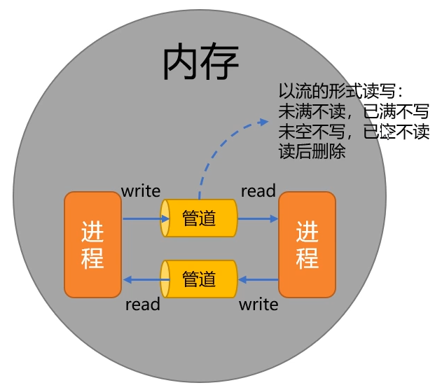

- 用于连接读/写进程的共享文件，pipe文件

- 本质是内存中固定大小的缓存区

- 同一时段只能单向通信（半双工通信），双工通信需要两个管道
- 以先进先出（FIFO）方式组织数据传输
- 通过系统调用read()/write()函数进行读写操作

> 还有其它通信方式如Socket编程、套接字等用于不同计算机通信

### 3.2 进程同步

**概念：**协调进程间的相互制约关系，使他们按照预期的方式执行的过程

**前提：**

- 进程是并发执行的，进程间存在着相互制约的关系
- 并发的进程对系统共享资源进行竞争
- 进程通信，过程中相互发送的信号称为消息或事件

**两种相互制约形式：**

- 间接相互制约关系（互斥）：进程排他性地访问共享资源
- 直接相互制约关系（同步）：进程间的合作，比如管道通信

**互斥访问过程**：互斥的访问临界资源

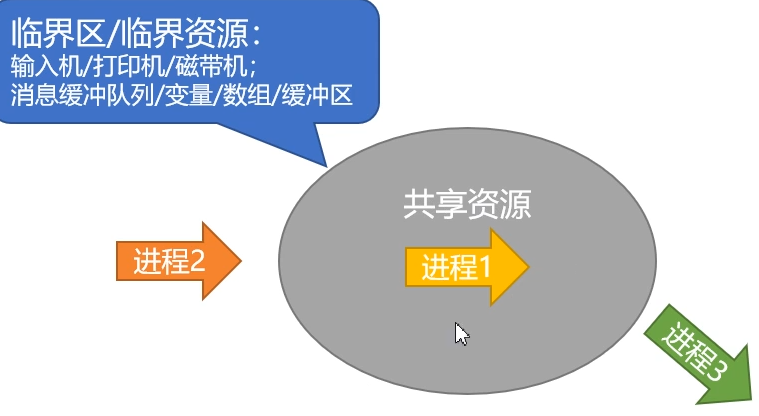

- 进入区：尝试进入临界区，成功则加锁(lock)
- 临界区：访问共享资源
- 退出区：解锁(unlock)，唤醒其它阻塞进程
- 剩余区：其它代码

> 临界区/临界资源：输入机/打印机/磁带机;消息缓冲队列/变量/数组/缓冲区

**互斥的访问原则**

- 空闲让进：临界区空闲，允许一个进程进入
- 忙则等待：临近区已有进程，其它进程等待，操作系统操作的是进程的PCB，此处是把进程的PCB放进队列（阻塞状态，阻塞队列）
- 有限等待：处于等待的进程，等待时间有限
- 让权等待：等待时应让出CPU执行权，防止”忙等待“（虽然在等待，但是没有让出CPU的执行权）

实现同步的方式：

**信号量**

PV操作：

- P操作：wait原语，进程等待
- V操作：signal原语，唤醒等待线程

整型信号量：违背”让权等待“，会发生忙等

记录型信号量：进程进入阻塞状态，不会忙等（加一个标志位，记录剩余资源数量）

**管程**

“管理进程”，即用于实现进程同步的工具。是由代表共享资源的数据结构和一组过程（进行PV操作的函数）组成的管理程序（封装）

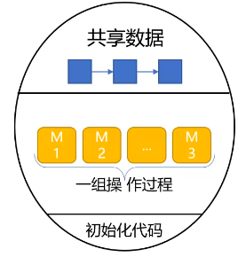

管程的组成：

- 管程名称
- 局部于莞城内部的共享数据结构
- 对该数据结构操作的一组过程（函数）
- 管程内共享数据的初始化语句

管程的特征：

- 是一个模块化的基本程序单位，可以单独编译
- 是一种抽象数据类型（类），包含数据和操作
- 信息掩蔽（封装），共享数据只能被管程内的过程访问

## 4 如何处理死锁问题

### 4.1 死锁的概念

**定义**：多个进程由于竞争资源而造成的阻塞现象，若无外力作用，这些进程将无法继续推进

**相似概念**：饥饿

等待时间过长以至于给进程推进和响应带来明显影响，“饿而不死”

**死锁产生的原因**：

- 系统资源的竞争：多个进程竞争共享资源
- 进程推进顺序非法

**死锁产生的必要条件：**

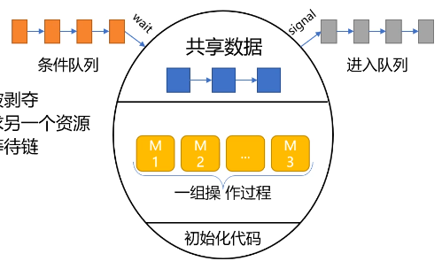

- 互斥条件：共享资源的排他性访问
- 不剥夺条件：访问时该共享资源不会被剥夺
- 请求并保持条件：保持当前资源时请求另一个资源
- 循环等待条件：存在共享资源的循环等待链

### 4.2 死锁的预防与处理

#### 死锁的预防

**破坏互斥条件**

- 将只能互斥访问的资源改为同时共享访问
- 将独占锁改为共享锁
- 注意：不是所有资源都能改成共享的

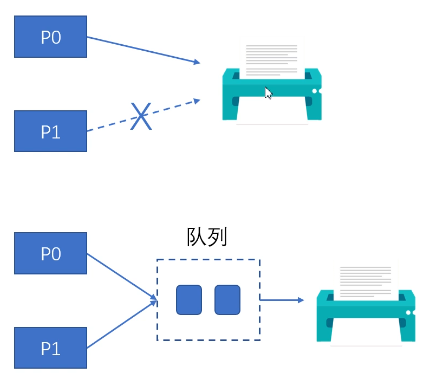

**破坏不剥夺条件**

- 请求新资源无法满足时必须释放已有资源
- 由OS协助强制剥夺某些进程持有的资源
- 实现复杂，代价高。此操作过多会导致原进程任务无法推进（原进程请求另一个资源时获取不到，会释放当前已有资源。等到下次执行时，会重新获取上一次已有的资源，这样就导致上一次的操作浪费，增加系统开销）

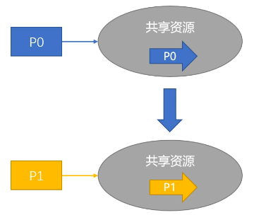

**破坏请求并保持条件**

- 进程开始运行时一次性申请所需资源
  - 资源浪费
  - 进程饥饿

- 阶段性请求和释放资源

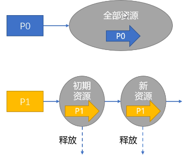

**破坏循环等待条件**

- 对所有资源现行排序，按序号请求资源
  - 请求时先低再高
  - 释放时先高再低
- 对资源的编号应相对稳定，限制了新设备增加
- 进程使用资源的顺序可能与系统编号顺序不同
- 限制了用户编程


#### 死锁的避免

系统安全状态

- 安全状态一定不会出现死锁
- 不安全状态可能出现死锁

安全性算法：**银行家算法**

- 系统预判进程请求是否导致不安全状态
- 是则拒绝请求，否则答应请求

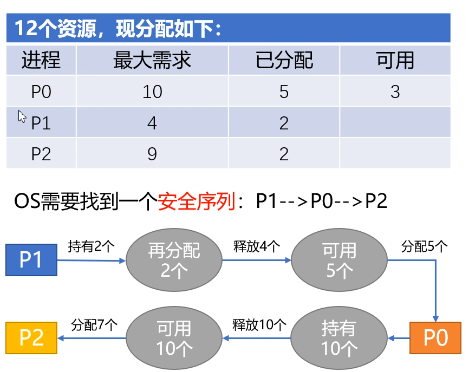

### 4.3 死锁的检测与解除

**死锁的检测**

- 需要一种数据结构，保存有关资源的请求和分配信息

- 提供一种算法，利用这些信息检测是否形成了死锁

资源分配图：两种资源、两种节点

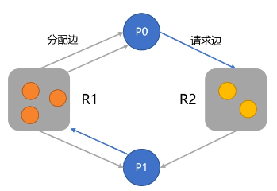

死锁定理：死锁状态的充分条件

- 当且仅当此状态下资源分配图是`不可完全简化`的
- 简化过程类似于图的拓扑排序算法

**死锁解除**

- 资源剥夺
  - 挂起死锁进程
  - 剥夺其资源
  - 将资源分配给其它（死锁）进程
- 撤销进程
- 进程回退
  - 回退到足以避免死锁的地步
  - 需要记录进程历史信息，设置还原点

# 三、内存管理

## 1 什么是内存管理

### 1.1 存储器的多层结构

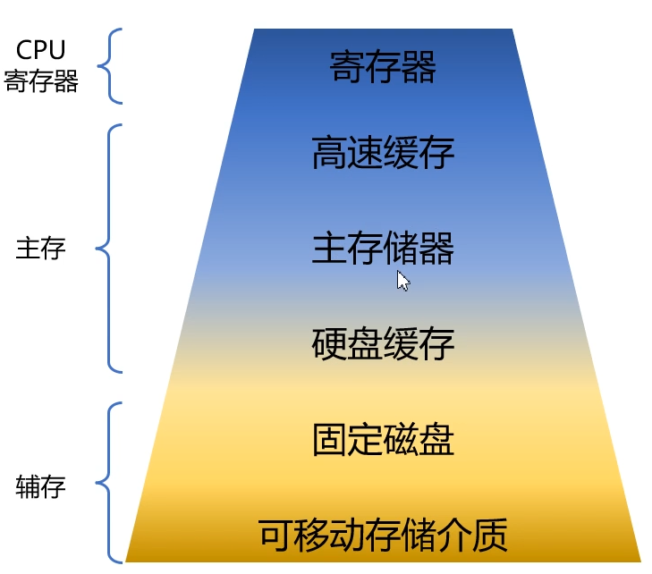

- CPU寄存器
- 高速缓存（独立硬件，不是内存条的一部分，效率比寄存器低，比主存储器高）
- 主存储器（内存条）
- 硬盘缓存（缓冲地带，做临时存储，从物理上是属于硬盘的一部分，进程suspend后放在外存，就是这里）
- 固定磁盘（磁盘）
- 可移动存储介质（U盘）

### 1.2 进程运行的基本原理

用户程序->进程：编译、链接、装入

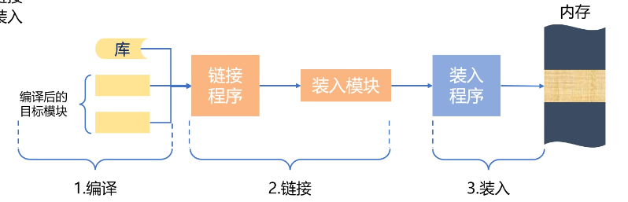

**编译**

程序员完成，将代码编译成二进制指令

**链接**

将编译生成的各个模块和底层函数库进行打包封装，生成可装入模块

- 静态链接
- 装入时动态链接
- 运行时动态链接

**装入**

- 绝对装入
- 可重定位装入
- 动态运行时装入

两个细节

- 逻辑地址（代码的地址）与物理地址（内存中的地址）：前面有程序已经装入了，但是写程序时是按0地址开始的，这样就导致在装入时需要加上起始量
- 内存保护（装入过程中，保护当前地址不受其它应用程序影响）

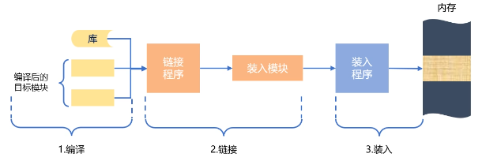

## 2 内存的分配

### 2.1 连续分配方式


**单一连续分配**

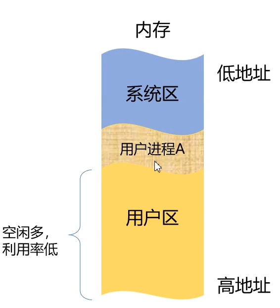

只有一个用户进程

**优点：**

- 实现简单
- 无外部碎片
- 不一定需要内存保护

**缺点：**

- 只能用于单用户、单任务OS

- 有内部碎片

- 存储器利用率低

**固定分区分配**


优点：

- 实现简单
- 无外部碎片

缺点：

- 较大用户程序时，需要采用覆盖技术，降低了性能
- 会产生内部碎片，利用率低

**动态分区分配**

- 怎么记录内存中的使用情况
  - 空闲分区表
  - 空闲分区链

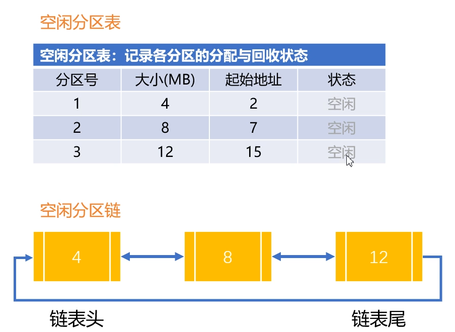

- 选择哪个分区给新进程

  常用算法：

  - 首次适应算法：从低地址查找合适空间
  - 最佳适应算法：优先使用最小空闲空间
  - 最大适应算法：优先使用最大连续空间
  - 临近适应算法：从上次查找出向后查找

- 已使用的分区怎么回收


### 2.2 非连续分配方式

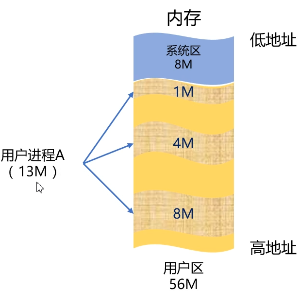

**基本分页存储管理方式**

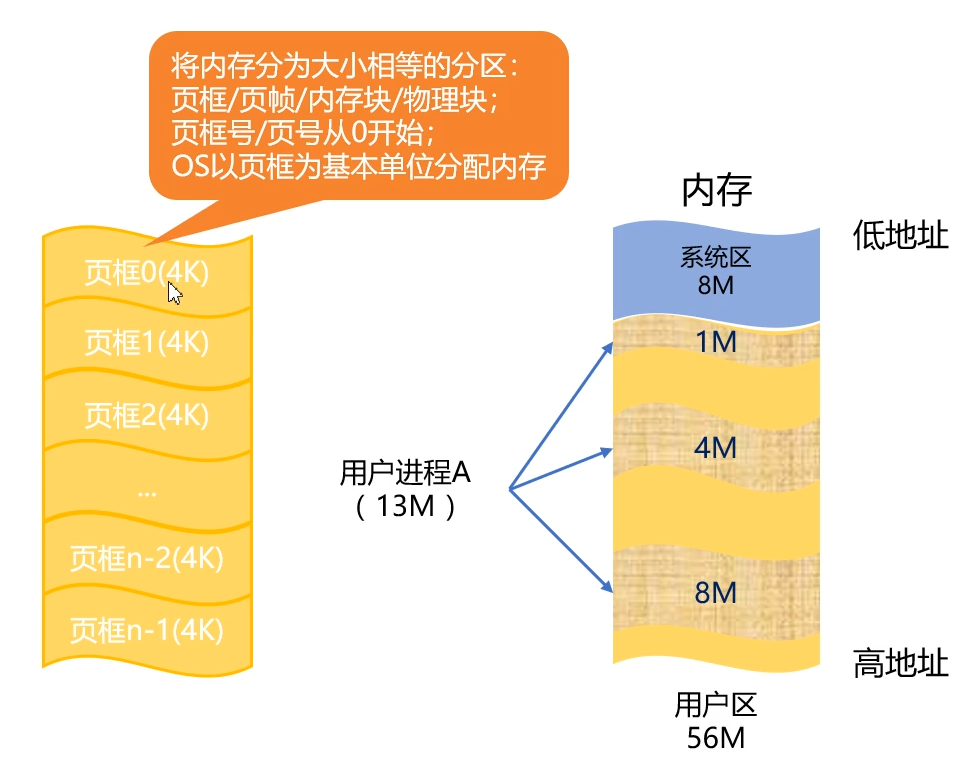

**将内存分为大小相等的分区：页/页框**

- 页框号从0开始

- OS以页框为基本单位分配内存

- 不会产生外部碎片，但会产生内部碎片，但一般一个进程产生的内部碎片大小不超过半个页框的大小，此处就是2K
- 逻辑地址和物理地址的对于关系存在于页表中，页表存在于进程的PCB中，使用基本地址变换机构进行逻辑地址和物理地址的转换

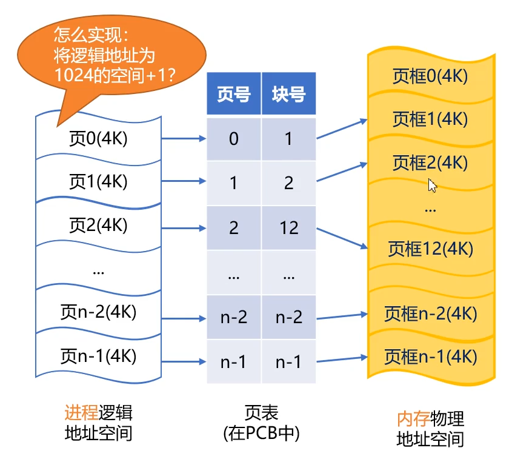

**基本分段存储管理方式**

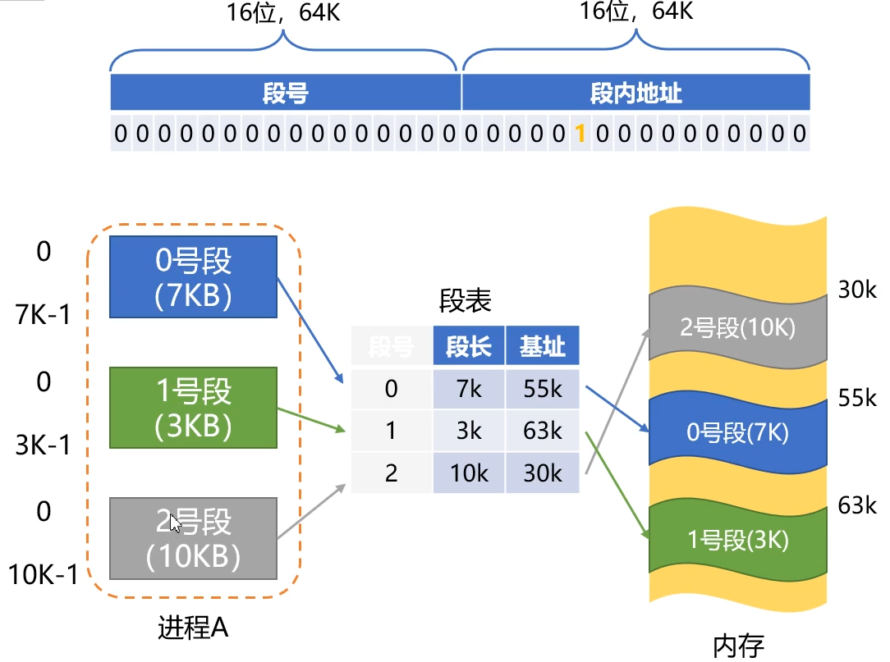

**段页式管理方式**


## 3 虚拟内存管理

### 3.1 虚拟内存的基本概念

具有请求调入和置换功能，从逻辑上对内存容量加以扩充的一种存储器系统

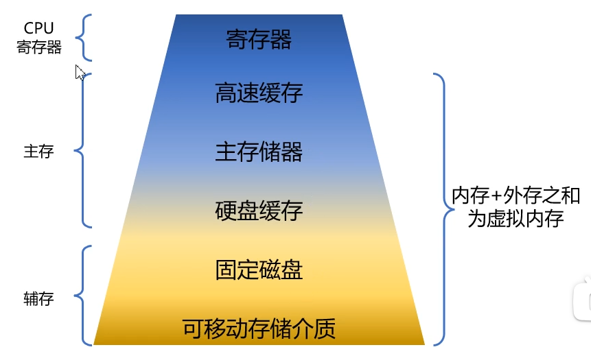

局部性原理：

- 时间局部性
- 空间局部性

虚拟内存的特征

- 多次性
- 对换性
- 虚拟性

### 3.2 虚拟内存的实现

**请求分页存储管理**

**请求分段存储管理**

**请求段页式存储管理**

# 四、进程线程相关

## 1 进程创建

`pid_t fork(void)`

- 函数的作用：用于创建子进程
- 返回值：
  - `fork()`的返回值会返回两次。一次是在父进程中，一次是在子进程中
  - 在父进程中返回创建的子进程的pid，在子进程中返回0
  - 如何区分父进程和子进程：通过`fork`的返回值
  - 在父进程中返回-1，表示创建子进程失败。并且设置errno。
  - 创建子进程失败的主要原因：（1）当前系统的进程数已经达到了系统规定的上限，这时errno的值被设置为EAGAIN；（2）系统内存不足，这时errno的值被设置为ENOMEN。

Linux 的 fork() 使用是通过写时拷贝实现。写时拷贝是一种可以推迟甚至避免拷贝数据的技术。内核并不复制整个进程的地址空间，而是让父子进程共享同一个地址空间。只有在写入时才会复制地址空间（重新开辟一块内存），从而使各个进程拥有自己的地址空间。即资源的复制只有在写入时才会进行，在此之前，只有以只读的方式进行。

fork() 之后的父子进程共享文件，此时的 fork() 产生的子进程与父进程相同的文件描述符指向相同的文件表，引用计数增加，共享文件偏移指针。

```c++
#include <unistd.h>

int main() 
{
    // 创建子进程
    pid_t pid = fork();

    // 判断是父进程还是子进程
    if(pid > 0)
    {
        // 如果大于0，返回的是创建的子进程的进程号，当前是父进程
        printf("pid: %d\n", getpid());
        printf("i am parent process, pid: %d, ppid: %d\n", getpid(), getppid());
    }
    else if(pid == 0)
    {
        // 当前子进程
        printf("i am child process, pid: %d, ppid: %d\n", getpid(), getppid());

    } 
    for(int i = 0; i < 10; i++)
    {
        printf("i: %d, pid: %d\n", i, getpid()); // 父进程和子进程谁执行这行代码，pid就是谁的
        sleep(1);
    }
    return 0;
}
```


# 五、面试题

## 1 进程和线程的联系和区别

**进程：**进程是程序的一次执行，是系统进行资源分配的一个基本单位。

**线程：**线程是进程当中的一条执行流程。同一个程序中的所有线程均会独立执行相同程序，且共享同一份全局内存区域（包括初始化数据段、未初始化数据段、堆内存段）

**联系：**同一个进程内多个线程之间共享代码段、数据段、打开的文件等资源，但每个线程各自都有一套独立的寄存器和栈，这样可以确保线程的控制流是相对独立的。 

**区别：**

- 调度：进程是资源（内存、打开的文件等）分配的单位，线程是CPU调度的单位；
- 资源：进程拥有一个完整的资源平台，而线程只独享必不可少的的资源，如栈和代码区
- 系统开销：线程能减少并发执行的时间和空间开销—创建或销毁进程时，系统都要为之分配或回收系统资源，如内存空间、I/O设备等，操作系统所付出的开销显著大于在创建或撤销线程时的开销，进程切换的开销也远大于线程切换的开销。


## 2 多个线程共享进程的哪部分数据

共享资源：

- 进程ID和父进程ID
- 进程组ID和会话ID
- 用户ID和用户组ID
- 文件描述符表
- 信号处置
- 文件系统的相关信息：文件权限掩码(umask)、当前工作目录
- 虚拟地址空间（除栈、`.text`）--> 虚拟地址空间中的栈和`.text`部分会分成多个小块，每个线程有属于自己的小块

非共享资源： 

- 线程ID
- 信号掩码
- 线程特有数据
- error变量
- 实时调度策略和优先级
- 栈，本地变量和函数的调用链接信息

## 3 虚拟地址空间（虚拟内存）

**为什么要有虚拟内存？**

为了解决内存系统面临的两个问题

- 内存资源永远都是稀缺的，当越来越多的进程需要越来越来内存时，某些进程会因为得不到内存而无法运行；
- 内存容易被破坏，一个进程可能误占用其他进程的内存空间

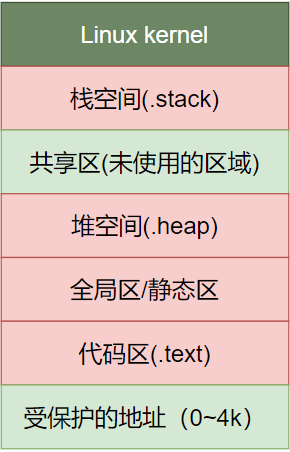

虚拟地址空间分为：内核空间、用户空间。其中用户空间又分为以下几个部分：

- 代码段(.text)：存放函数体（类的成员函数、全局函数）的二进制代码。

- 全局区/静态区：存放全局变量和静态（全局、局部）变量和字符串常量；

- 栈区(.stack )： 用来存放局部变量，函数的参数，返回值等，由编译器自动分配释放。如一个函数被调用后,产生的临时变量都会存到栈区的顶部,当函数完成后,会自动从顶部将刚使用的数据销毁。栈区的地址是从高地址向下增长的。

- 堆区(.heap):  用来动态内存分配，如 malloc, new 申请的内存，由程序员手动分配释放。程序中不释放，则程序结束时，由OS回收；据说这个和数据结构中的堆没有什么关系；堆区使用时地址向上增长。

  > 代码区和全局区/静态区在程序运行之前就有了，它们存在于C++的可执行文件中。总的来说，可以分为静态存储区（代码区，全局区）和动态区（栈区、堆区）。

**虚拟空间的大小：**

对于32位操作系统：它的虚拟地址空间为 4G（2的32次方），也就是说一个进程的最大地址空间为 4G，其中内核空间最多1G，用户空间最大3G。

对于64位操作系统：2的48次方，250TB，内核和用户空间分别占125TB

**如何查看linux操作系统是32位还是64位**

- 执行`getconf LONG_BIT`，输出32就是32位，输出64就是64位
- 执行`uname -m`，输出x86_64就是64位，输出i686或i386就是32位

**内核空间里有什么**

- 内存管理程序
- 进程管理程序
- 设备驱动程序
- VFS虚拟文件系统

**虚拟内存最终会被映射到物理内存，如何映射？**

主要有两种方式：内存分页、内存分段

## 4 内存分页


## 5 内存分段


## 6 进程的控制结构

每个进程都有一个进程控制块（PCB）作为进程的唯一标识

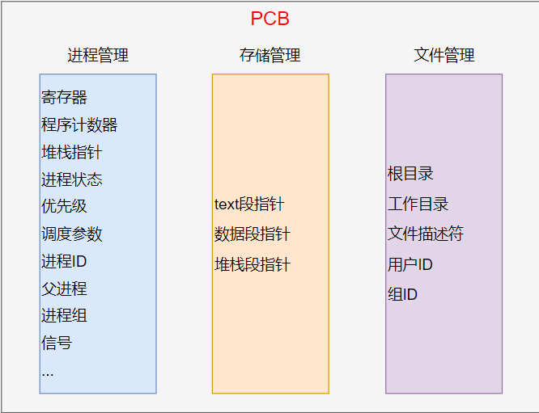

PCB之间通过链表连接在一起，形成各种队列：

- 就绪队列：把所有就绪状态的PCB链在一起
- 阻塞队列：把所有因等待某事件而处于等待的进程链在一起


## 6 进程的状态

当一个进程开始运行时，它可能会经历下面这几种状态：

- 运行态：该时刻进行占用CPU；
- 就绪态：可运行，由于其它进程处于运行态而暂时停止运行
- 阻塞态：该进程正在等待某一事件发生（如等待输入/输出操作的完成）而暂时停止运行，这时即使给它CPU控制权，它也无法运行
- 创建状态：进程正在被创建时的状态
- 结束状态：进程正在从系统中消失时的状态

注意：

- 只有就绪态和运行态可以相互转换，其它的都是单向转换。
  - 就绪状态的进程通过调度算法从而获得CPU时间，转为运行状态；
  - 运行状态的进程在分配给它的CPU时间片用完之后就会转为就绪状态，等待下一次调度。
- 阻塞状态是缺少需要的资源从而由运行状态转换而来，但是该资源不包括CPU时间，缺少CPU时间会从运行态转换为就绪态。

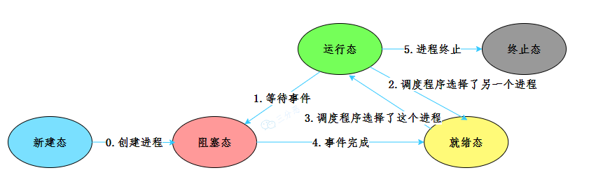


## 7 进程间切换

**为什么需要进程间切换**

从内存的角度来说，通过进程间切换，在有限的内存空间中可以尽可能运行多个进程。比如4G的虚拟内存，通过进程切换可以运行总共8G的程序

**进程间切换的场景**

- 时间片用完，强制进行上下文切换。
- 内存不足，将无用的进程交换出去挂起，待资源充足后再切换回来。
- 进程调用sleep函数进入睡眠状态，让出CPU，需要重新进行系统调度（对于线程也适用）。
- 有更高优先级的程序需要运行，当前进程需要让出CPU，确保高优先级进程能使用时间片。
- 发生硬件中断时，CPU立即处理相关中断服务程序，如键盘输入。

**进程间切换，切换的是什么**

- 存储进程的相关信息，如计数器、寄存器等，以便在切换回来时能正常加载。
- 更新进程的状态，如从运行态切换到就绪态等。
- 将当前进程放入就绪队列或阻塞队列中。
- 根据调度算法从就绪队列中选择一个进程加载并运行。
- 新进程将自己的堆栈信息加载到CPU的计数器和寄存器中，占用时间片。

## 8 线程间切换

**为什么需要多线程**

- 提高cpu利用率：当一个线程执行耗时操作（如网络请求，文件读写等）时，其它线程可以继续执行，避免程序因等待而被阻塞
- 便于数据共享：多线程可以共享同一进程的内存空间（除栈、.text段），使得线程之间可以方便地共享数据。

**线程间切换的场景**

- 多个线程属于不同的进程，线程切换等价于进程切换
- cpu时间片用完了
- 某个线程阻塞或睡眠

**线程间切换，切换的是什么**

线程的上下文切换得看是不是属于同一个进程：

- 当两个线程不属于同一个进程：则切换的过程和进程上下文切换一样
- 当两个线程属于同一个进程：因为虚拟内存是共享的，所以在切换时，虚拟内存这些资源就保持不动，只需要切换线程的私有数据、寄存器等不共享的数据

## 9 中断

**内中断**

内中断，也称为异常（Exception），是由CPU内部产生的中断。它通常代表了程序执行过程中的异常情况，例如零除错误、非法指令、内存访问冲突等。内中断的目的是通知操作系统出现了一个错误或异常情况，需要采取适当的措施来处理它。

内中断的处理：

- 中断发生：CPU执行指令时检测到异常情况。
- 保存上下文：操作系统保存当前程序的状态和寄存器值，以便稍后恢复。
- 中断处理程序执行：操作系统根据异常类型选择合适的中断处理程序进行处理。
- 恢复上下文：处理程序执行完毕后，操作系统恢复程序的状态和寄存器值。
- 继续执行：程序从中断发生的地方继续执行。

**外中断**

外中断是由CPU外部设备或其他硬件引发的中断。它们通常用于通知操作系统有一些外部事件需要处理，例如硬盘传输完成、键盘输入等。外中断的目的是使操作系统能够实时响应外部设备的状态变化。

外中断的处理：

- 中断发生：外部设备或硬件产生一个中断请求信号。
- 保存上下文：操作系统保存当前程序的状态和寄存器值。
- 中断处理程序执行：操作系统根据中断请求的来源选择合适的中断处理程序进行处理。
- 恢复上下文：处理程序执行完毕后，操作系统恢复程序的状态和寄存器值。
- 继续执行：程序从中断发生的地方继续执行。

**中断的作用：**

- 实时响应事件：中断使操作系统能够实时响应各种异步事件，而不必等待某个任务的完成。
- 错误处理：内中断用于处理程序执行过程中的异常情况，确保系统稳定性。
- 外设管理：外中断用于管理外部设备的状态变化，如输入/输出操作、网络通信等。
- 多任务调度：中断允许操作系统在多个任务之间进行切换和调度，以实现多任务并发执行


## 10 进程间数据共享：进程间通信

父子进程之间共享数据：读时共享，写时拷贝

- 读时共享、写时拷贝针对的是物理内存，只是在读时会有两个独立的虚拟内存空间，指向同一个物理内存。

非父子进程间共享数据：进程间通信

### 1 进程间通信的目的

进程是一个独立的资源分配单元，不同进程（这里所说的进程通常指的是用户进程）之间的资源是独立的，没有关联，不能在一个进程中直接访问另一个进程的资源。 

但进程不是孤立的，不同的进程需要进行信息的交互和状态的传递等，因此需要进程间通信( IPC：Inter Processes Communication )。 

进程间通信的目的：

- 数据传输：一个进程需要将它的数据发送给另一个进程。
- 通知事件：一个进程需要向另一个或一组进程发送消息，通知它（它们）发生了某种事件（如进程终止时要通知父进程）。 
- 资源共享：多个进程之间共享同样的资源。为了做到这一点，需要内核提供互斥和同步机制。
- 进程控制：有些进程希望完全控制另一个进程的执行（如 Debug 进程），此时控制进程希望能够拦截另一个进程的所有陷入和异常，并能够及时知道它的状态改变。

### 2 进程间通信方式


#### 1 匿名管道

 管道也叫无名（匿名）管道，它是 UNIX 系统 IPC（进程间通信）的最古老形式， 所有的 UNIX 系统都支持这种通信机制。 

举例：统计一个目录中文件的数目命令：ls | wc –l，为了执行该命令，shell 创建了两 个进程来分别执行 ls 和 wc。


**管道的特点**：

- 管道其实是一个在内核内存中维护的缓冲器，这个缓冲器的存储能力是有限的，不同的操作系统大小不一定相同。
- 管道拥有文件的特质：读操作、写操作，匿名管道没有文件实体，有名管道有文件实体， 但不存储数据。可以按照操作文件的方式对管道进行操作。
- 一个管道是一个字节流，使用管道时不存在消息或者消息边界的概念，从管道读取数据的进程可以读取任意大小的数据块，而不管写入进程写入管道的数据块的大小是多少。
- 通过管道传递的数据是顺序的，从管道中读取出来的字节的顺序和它们被写入管道的顺序是完全一样的。
- 在管道中的数据的传递方向是单向的，一端用于写入，一端用于读取，管道是半双工的。
- 从管道读数据是一次性操作，数据一旦被读走，它就从管道中被抛弃，释放空间以便写更多的数据，在管道中无法使用 lseek() 来随机的访问数据。
- 匿名管道只能在具有关系之间的进程（父进程与子进程，或者两个兄弟进程，具有亲缘关系）之间使用。


**为什么可以使用管道进行进程间通信**


左边为父进程的虚拟空间（内核空间+用户空间），右边是子进程的虚拟空间。

子进程创建之后，被拷贝一份数据，和父进程共享管道缓冲区。

父进程的5号文件操作符，对应管道的写端，6号文件操作符对应管道的读端。

那么拷贝出来的子进程的5号文件操作符，也就是对应管道的写端，6号文件操作符对应管道的读端。

那么父进程使用5号文件操作符向管道写入数据时，子进程的6号文件操作符就能够读取到数据，反之也一样。


**管道的数据结构**

环形队列


**管道的使用**

```c++
  /*
    #include <unistd.h>
    int pipe(int pipefd[2]);
        功能：创建一个匿名管道，用来进程间通信。
        参数：int pipefd[2] 这个数组是一个传出参数。
            pipefd[0] 对应的是管道的读端
            pipefd[1] 对应的是管道的写端
        返回值：
            成功 0
            失败 -1

    管道默认是阻塞的：如果管道中没有数据，read阻塞，如果管道满了，write阻塞

    注意：匿名管道只能用于具有关系的进程之间的通信（父子进程，兄弟进程）
    	一个进程要么只进行读，要么只进行写，用同一个管道并且同时进行读写时，会产生问题。
*/

// 需求：子进程发送数据给父进程，父进程读取到数据输出
#include <unistd.h>
#include <sys/types.h>
#include <stdio.h>
#include <stdlib.h>
#include <string.h>
using namespace std;

int main() {

    // 在fork之前创建管道，否则父进程和子进程之间用的不是同一个管道了，无法通信
    int pipefd[2];
    int ret = pipe(pipefd);
    if(ret == -1) {
        perror("pipe");
        exit(0);
    }

    // 创建子进程
    pid_t pid = fork();
    if(pid > 0) {
        // 父进程
        printf("i am parent process, pid : %d\n", getpid());

        // 关闭写端
        // close(pipefd[1]);
        
        // 从管道的读取端读取数据
        char buf[1024] = {0};
        while(1) {
            int len = read(pipefd[0], buf, sizeof(buf));
            printf("parent recv : %s, pid : %d\n", buf, getpid());
        }

    } else if(pid == 0){
        // 子进程
        printf("i am child process, pid : %d\n", getpid());
        // 关闭读端
        // close(pipefd[0]);

        char buf[1024] = {0};
        while(1) {
            // 向管道中写入数据
            const char * str = "hello,i am child";
            write(pipefd[1], str, strlen(str));
            sleep(1);
        }
        
    }
    return 0;
}
```

**管道的读写特点：**
使用管道时，需要注意以下几种特殊的情况（假设都是阻塞I/O操作）

- 所有的指向管道写端的文件描述符都关闭了（管道写端引用计数为0），有进程从管道的读端读数据，那么管道中剩余的数据被读取以后，再次read会返回0，就像读到文件末尾一样。

- 如果有指向管道写端的文件描述符没有关闭（管道的写端引用计数大于0），而持有管道写端的进程也没有往管道中写数据，这个时候有进程从管道中读取数据，那么管道中剩余的数据被读取后，再次read会阻塞，直到管道中有数据可以读了才读取数据并返回。

- 如果所有指向管道读端的文件描述符都关闭了（管道的读端引用计数为0），这个时候有进程向管道中写数据，那么该进程会收到一个信号SIGPIPE, 通常会导致进程异常终止。

- 如果有指向管道读端的文件描述符没有关闭（管道的读端引用计数大于0），而持有管道读端的进程也没有从管道中读数据，这时有进程向管道中写数据，那么在管道被写满的时候再次write会阻塞，直到管道中有空位置才能再次写入数据并返回。

**总结：**

- 读管道：
  - 管道中有数据，read返回实际读到的字节数。
  - 管道中无数据：
    - 写端被全部关闭，read返回0（相当于读到文件的末尾）
    - 写端没有完全关闭，read阻塞等待

- 写管道：
  - 管道读端全部被关闭，进程异常终止（进程收到SIGPIPE信号）
  - 管道读端没有全部关闭：
    - 管道已满，write阻塞
    - 管道没有满，write将数据写入，并返回实际写入的字节数


#### 2 有名管道

匿名管道，由于没有名字，只能用于亲缘关系的进程间通信。为了克服这个缺点，提出了有名管道（FIFO），也叫命名管道、FIFO文件。

有名管道（FIFO）不同于匿名管道之处在于它提供了一个路径名与之关联，以 FIFO  的文件形式存在于文件系统中，并且其打开方式与打开一个普通文件是一样的，这样即使与 FIFO 的创建进程不存在亲缘关系的进程，只要可以访问该路径，就能够彼此通过 FIFO 相互通信，因此，通过 FIFO 不相关的进程也能交换数据。

一旦打开了 FIFO，就能在它上面使用与操作匿名管道和其他文件的系统调用一样的 I/O系统调用了（如read()、write()和close()）。与管道一样，FIFO 也有一 个写入端和读取端，并且从管道中读取数据的顺序与写入的顺序是一样的。FIFO 的 名称也由此而来：先入先出

有名管道（FIFO)和匿名管道（pipe）有一些特点是相同的，不一样的地方在于： 

- FIFO 在硬盘中作为一个特殊文件存在，但 FIFO 中的内容却存放在内存中，并不存放在文件实体中。PIPE是存放在内存中的文件
- 当使用 FIFO 的进程退出后，FIFO 文件将继续保存在文件系统中以便以后使用。
- FIFO 有名字，不相关的进程可以通过打开有名管道进行通信。

**有名管道可以同时进行读写吗**

可以，但需要注意数据同步问题

**有名管道的使用**
创建fifo文件

- 通过命令：`mkfifo` 名字
- 通过函数：`int mkfifo(const char *pathname, mode_t mode);`
  - 参数：
    - pathname: 管道名称的路径
    - mode: 文件的权限 和 open 的 mode 是一样的是一个八进制的数
  - 返回值：成功返回0，失败返回-1，并设置错误号

**案例：**

读管道：

```c++
#include <stdio.h>
#include <sys/types.h>
#include <sys/stat.h>
#include <stdlib.h>
#include <unistd.h>
#include <fcntl.h>

// 从管道中读取数据
int main() {

    // 1.打开管道文件
    int fd = open("test", O_RDONLY);
    if(fd == -1) {
        perror("open");
        exit(0);
    }

    // 读数据
    while(1) {
        char buf[1024] = {0};
        int len = read(fd, buf, sizeof(buf));
        if(len == 0) {
            printf("写端断开连接了...\n");
            break;
        }
        printf("recv buf : %s\n", buf);
    }

    close(fd);

    return 0;
}
```

写管道

```c++
#include <stdio.h>
#include <sys/types.h>
#include <sys/stat.h>
#include <stdlib.h>
#include <unistd.h>
#include <fcntl.h>
#include <string.h>

// 向管道中写数据
int main() {

    // 1.判断文件是否存在
    int ret = access("test", F_OK);
    if(ret == -1) {
        printf("管道不存在，创建管道\n");
        
        // 2.创建管道文件
        ret = mkfifo("test", 0664);

        if(ret == -1) {
            perror("mkfifo");
            exit(0);
        }
    }

    // 3.以只写的方式打开管道
    int fd = open("test", O_WRONLY);
    if(fd == -1) {
        perror("open");
        exit(0);
    }

    // 写数据
    for(int i = 0; i < 100; i++) {
        char buf[1024];
        sprintf(buf, "hello, %d\n", i);
        printf("write data : %s\n", buf);
        write(fd, buf, strlen(buf));
        sleep(1);
    }

    close(fd);

    return 0;
}
```

**总结：**

- 一个为只读而打开一个管道的进程会阻塞，直到另外一个进程为只写打开管道
- 一个为只写而打开一个管道的进程会阻塞，直到另外一个进程为只读打开管道

读管道：

- 管道中有数据，read返回实际读到的字节数
- 管道中无数据：
  - 管道写端被全部关闭，read返回0，（相当于读到文件末尾）
  - 写端没有全部被关闭，read阻塞等待

写管道：

- 管道读端被全部关闭，进行异常终止（收到一个SIGPIPE信号）
- 管道读端没有全部关闭：
  - 管道已经满了，write会阻塞
  - 管道没有满，write将数据写入，并返回实际写入的字节数。

**管道的缺点：**管道的效率低，不适合进程间频繁地交换数据。

#### 3 消息队列

消息队列是保存在内核中的消息链表，按照消息的类型进行消息传递，具有较高的可靠性和稳定性。

缺点：消息体有一个最大长度的限制，不适合比较大的数据传输；存在用户态于内核态之间的数据拷贝开销。

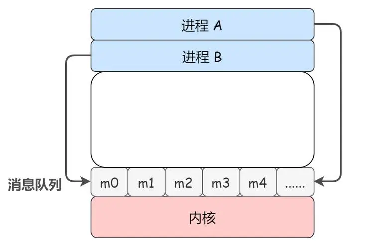

##### 写进程

消息队列通过`msgsnd`函数发送消息，其声明为：

```c++
int  msgsnd(int msgid, const void *msg_ptr, size_t msg_sz, int msgflg);
```

- `int msgid`：消息队列标识符，由`msgget`函数返回

  - `msgget`函数：创建一个消息队列，返回以key命名的消息队列的标识符 `int msgget(key_t key, int msgflg);`

    - `key`：某个消息队列的名字，`key`如何获取？

      - 通过宏定义`key`值
      - 通过`ftok`函数生成`key`值

      ```c++
      // 函数ftok把一个已存在的路径名和一个整数标识符转换成一个key_t值
      // ftok函数将通过对pathname的索引节点号（inode number）与proj_id进行异或操作生成一个唯一的键值。返回的键值类型是key_t，通常是一个长整型
      key_t ftok(const char *pathname, int proj_id);  // 声明
      key = 123;  // 获取方法1
      key = ftok("progfile", 65);  // 获取方法2
      ```

    - `msgflg`举例说明

      ```
      IPC_CREAT	如果消息队列对象不存在，则创建之，否则则进行打开操作
      IPC_EXCL	如果消息对象不存在则创建之，否则产生一个错误并返回
      ```

- `const void *msg_ptr`：是一个指针，指针指向准备发送的消息

- `size_t msg_sz`：是`msg_ptr`指向的消息长度，消息缓冲区结构体中`mtext`的大小，不包括数据的类型

- `int msgflg`：控制着当前消息队列满或到达系统上限时将要发生的事情

  ```c++
  msgflg = IPC_NOWAIT 表示队列满不等待，返回EAGAIN错误
  ```

返回值：

- 成功返回0
- 失败返回-1

##### 读进程

使用`msgrcv`函数进行读数据，其声明为：

```c++
int  msgrcv(int msgid, void *msg_ptr, size_t msgsz, long int msgtype, int msgflg);
```

- `int msgid`：由`msgget`函数返回的消息队列标识码，`msgget`函数用法同写进程
- `void *msg_ptr`：是一个指针，指针指向准备接收的消息
- `size_t msgsz`：是`msg_ptr`指向的消息长度，消息缓冲区结构体中`mtext`的大小,不包括数据的类型
- `long int msgtype`：它可以实现接收优先级的简单形式
  - `msgtype=0`返回队列第一条信息
  - `msgtype>0`返回队列第一条类型等于`msgtype`的消息
  - `msgtype<0`返回队列第一条类型小于等于`msgtype`绝对值的消息
- `int msgflg`：控制着队列中没有相应类型的消息可供接收时将要发生的事
  - `msgflg=IPC_NOWAIT`，队列没有可读消息不等待，返回`ENOMSG`错误。
  - `msgflg=MSG_NOERROR`，消息大小超过`msgsz`时被截断

返回值：

- 成功返回实际放到接收缓冲区里去的字符个数
- 失败，则返回-1

##### 消息队列的控制函数

函数声明：

```c++
int  msgctl(int msqid, int command, strcut msqid_ds *buf);
```

- `msqid`： 由`msgget`函数返回的消息队列标识码
- `command`：是将要采取的动作,（有三个可取值）分别如下

```bash
IPC_STAT：获取消息队列的状态信息，将 msqid_ds 结构体填充到 buf 中。
IPC_SET：设置消息队列的权限，从 buf 结构体中读取权限信息。
IPC_RMID：删除消息队列，释放相关资源。
```

- `buf`：保存消息队列信息的结构体指针，通常是结构体 `msqid_ds` 的指针，用于传递或接收消息队列的属性信息。

返回值：

- 操作成功，返回0
- 失败，返回-1


##### 查看消息队列

- `ipcs -q`：命令查看已经创建的消息队列，包括他的key值信息，id信息，拥有者信息，文件权限信息，已使用的字节数，和消息条数。

- `ipcrm -Q加消息队列的key值`，用来删除一个消息队列。

##### 消息队列实验

读进程：

```c++
#include <stdio.h> 
#include <sys/ipc.h> 
#include <sys/msg.h> 
  
//消息结构体
struct mesg_buffer { 
    long mesg_type; 
    char mesg_text[100]; 
} message; 
  
int main() { 
    key_t key; 
    int msgid; 
  
    //函数ftok把一个已存在的路径名和一个整数标识符转换成一个key_t值，称为IPC键值
    key = ftok("progfile", 65); 
  
    // 创建一个新的或打开一个已经存在的消息队列，返回其id
    msgid = msgget(key, 0666 | IPC_CREAT); 
  
    // 接收消息
    msgrcv(msgid, &message, sizeof(message), 1, 0); 
  
    // 显示消息 
    printf("收到的消息为: %s \n",  message.mesg_text); 
  
    // to destroy the message queue 
    msgctl(msgid, IPC_RMID, NULL); 
  
    return 0; 
}
```

写进程

```c++
#include<stdio.h>
#include<sys/ipc.h>
#include<sys/msg.h>

struct msg_buffer{
	long mesg_type;
	char mesg_text[100];
}message;

int main(){
	key_t key; 
    int msgid; 
  
    //函数ftok把一个已存在的路径名和一个整数标识符转换成一个key_t值
    key = ftok("progfile", 65); 
  
    // msgget：创建一个消息队列，返回以key命名的消息队列的标识符
    msgid = msgget(key, 0666 | IPC_CREAT); 
    message.mesg_type = 1; 
  
    printf("写入的数据为: "); 
    gets(message.mesg_text); 
  
    //发送消息
    msgsnd(msgid, &message, sizeof(message), 0); 
  
    printf("发送的消息为: %s \n", message.mesg_text); 
  
    return 0; 
}
```

分别编译：

```bash
g++ read.cpp -o r.out
g++ write.cpp -o w.out
```

得到两个文件：`r.out`和`w.out`，运行


#### 4 共享内存

允许两个或多个进程共享一个给定的内存区，一个进程写入的东西，其它进程马上就能看到。

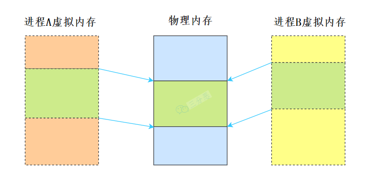

缺点：当多进程竞争同一个共享资源时，会造成数据错乱的问题，需要通过信号量完成数据的同步。

#### 5 信号量

它本质上是一个计数器，用来控制对共享资源的访问数量。具体方法如下：

1. **初始化**：设置信号量的初始值，这个值表示资源的可用数量。
2. **P操作（请求）**：线程在访问共享资源前调用P操作，如果信号量的值大于0，则减少1并获得资源；如果为0，则线程阻塞，等待资源可用。
3. **V操作（释放）**：线程在使用完共享资源后调用V操作，增加信号量的值，表示资源已释放，等待的其他线程可以继续获取资源。

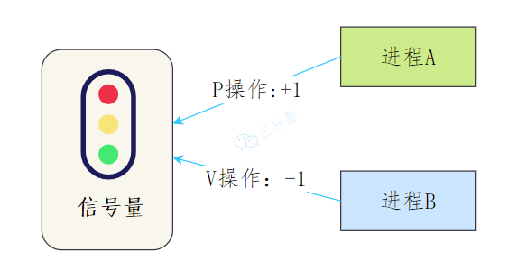

#### 6 Socket

提供网络通信的端点，可以让不同机器上运行的进程之间进行双向通信

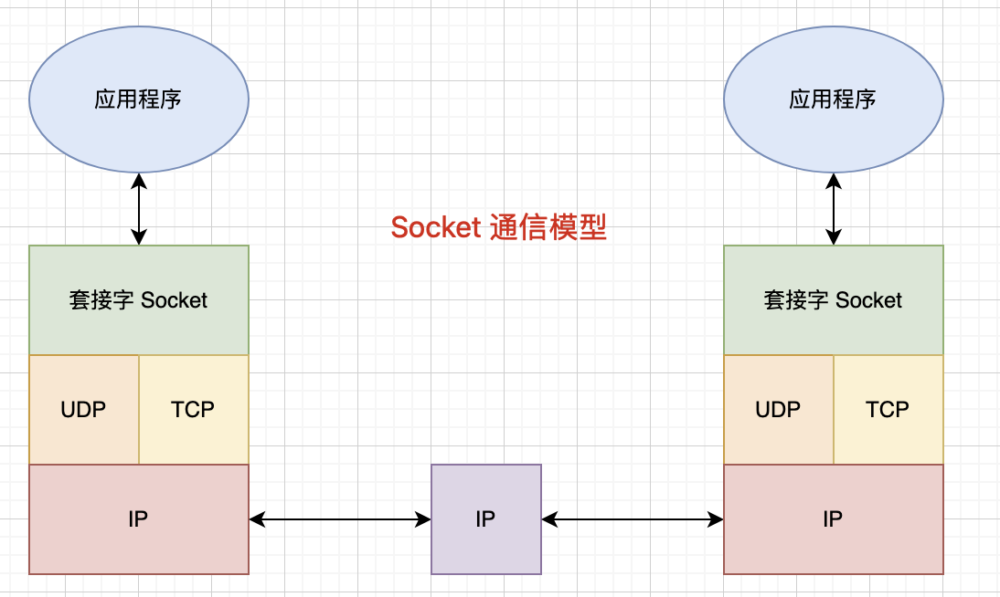

**Socket案例1**：只通信一次版本

服务端：

```c++
#include <stdio.h>
#include <arpa/inet.h>
#include <string.h>
#include <sys/types.h>
#include <sys/socket.h>
#include <unistd.h>
#include <strings.h>
#include <string>

int main()
{   
    //1. 创建套接字 int socket(int domain, int type, int protocol);
    /*
        功能：创建一个套接字
        参数：
            第一个参数：地址族，AF_INET标识IPV4地址族
            第二个参数：通信过程中使用的协议类型
                SOCK_STREAM，流式协议
                SOCK_DGRAM，报式协议
            第三个参数：具体的协议，一般传0
                如果第二个参数是 SOCK_STREAM，那么传0后默认表示TCP
                如果第二个参数是 SOCK_DGRAM，那么传0后默认表示UDP
        返回值：
            成功：返回文件描述符，文件描述操作的就是内核中的缓冲区
            失败：返回-1
    */
    int lfd = socket(AF_INET, SOCK_STREAM, 0);
    if (lfd == -1) {
        perror("Socket creation failed");
        return 1; // 返回错误码
    }

    // 2.绑定 int bind(int socketfd, const struct sockaddr *addr, socklen_t addrlen);
    /*
        功能：将创建套接字返回的文件描述符和本地的IP+端口进行绑定
        参数：
            socketfd：通过socket函数得到的文件描述符
            addr：需要绑定的socket地址，这个地址封装了ip和端口号信息
            addrlen：第二个参数结构体所占的结构体大小
        返回值：
            成功：0
            失败：-1
    */
    struct sockaddr_in  saddr;
    memset(&saddr, 0, sizeof(saddr));
    saddr.sin_family = AF_INET;
    saddr.sin_addr.s_addr = htonl(INADDR_ANY);
    saddr.sin_port = htons(9999); // 主机字节序转换成网络序
    int ret = bind(lfd, (struct sockaddr *)&saddr, sizeof(saddr));
    if(ret == -1)
    {
        perror("Socket bind failed");
        return 1; // 返回错误码
    }

    // 3. 监听 int listen(int sockfd, int backlog);
    /*
        功能：监听前面创建的socket上有没有客户端接入
        参数：
            sockfd，前面创建的文件描述符
            backlog，未连接和已连接之和的最大限制值（监听的时候有未连接和已连接的队列）不能超过 /proc/sys/net/core/somaxconn
        返回值：
            成功：0
            失败：-1
    */
    ret = listen(lfd, 5);
    if(ret == -1)
    {
        perror("Socket listen failed");
        return 1; // 返回错误码
    }

    // 4. 接收客户端连接 int accept(int sockfd, struct sockaddr *addr, socklen_t *addrlen);
    /*
        功能：接收客户端连接，阻塞函数
        参数：
            sockfd：用于监听的文件描述符
            addr：记录了连接成功后客户端的地址信息（IP+端口）
            addrlen：第二个参数的内存大小
        返回值：
            成功：返回用于通信的文件描述符
            失败：-1
    */
        struct sockaddr_in clientaddr;
        socklen_t slen = sizeof(clientaddr);
        int cfd = accept(lfd, (struct sockaddr *) &clientaddr, &slen);
        if(cfd == -1)
        {
            perror("Socket accept failed");
            return 1; // 返回错误码
        }
        // 输出客户端的信息
        char clientIP[16];
        inet_ntop(AF_INET, &clientaddr.sin_addr.s_addr, clientIP, sizeof(clientIP)); // 网络字节序转换为主机字节序
        unsigned short clientPort = ntohs(clientaddr.sin_port);
        printf("client ip is: %s, port is: %d\n", clientIP, clientPort);
        
        // 5. 通信
        // 获取客户端的数据
        char recvBuf[1024] = {0};
        int len = read(cfd, recvBuf, sizeof(recvBuf));
        if(len == -1) // 读取失败
        {
            perror("Socket read failed");
            return 1; // 返回错误码
        }
        else if(len > 0) //读取成功
        {
            printf("recv client data : %s\n", recvBuf);
        }
        else if(len == 0) //客户端断开连接
        {
            printf("client close");
        }

        // 给客户端发送数据
        const char * data = "hello, i am server";
        write(cfd, (void *)data, strlen(data));

        //关闭文件描述符
        close(cfd);
        close(lfd);

    return 0;
}
```

客户端：

```c++
#include <stdio.h>
#include <arpa/inet.h>
#include <string.h>
#include <sys/types.h>
#include <sys/socket.h>
#include <unistd.h>
#include <strings.h>
#include <string>


int main()
{
    // 1. 创建套接字
    int cfd = socket(AF_INET, SOCK_STREAM, 0);
    if (cfd == -1) {
        perror("Socket creat failed");
        return 1; // 返回错误码
    }

    // 2. 连接服务器 int connect(int sockfd, const struct sockaddr *addr, socklen_t addrlen);
    /*
        作用：客户端连接服务器
        参数：
            sockfd: 用于通信的文件描述符
            addr: 客户端要连接的服务器的信息
            addrlen: 第二个参数的内存大小
        返回值：
            成功：0
            失败：-1
    */
    struct sockaddr_in serverAddr;
    serverAddr.sin_family = AF_INET;
    inet_pton(AF_INET, "10.2.20.15", &serverAddr.sin_addr.s_addr);
    serverAddr.sin_port = htons(9999);

    int ret = connect(cfd, (sockaddr *)&serverAddr, sizeof(serverAddr));
    if (ret == -1) {
        perror("Socket connect failed");
        return 1; // 返回错误码
    }

    // 通信
    const char * data = "hello, i am client";
    write(cfd, (void *)data, strlen(data));

    char recvBuf[1024] = {0};
    int len = read(cfd, recvBuf, sizeof(recvBuf));
    if(len == -1) // 读取失败
    {
        perror("Socket read failed");
        return 1; // 返回错误码
    }
    else if(len > 0) //读取成功
    {
        printf("recv server data : %s\n", recvBuf);
    }
    else if(len == 0) //客户端断开连接
    {
        printf("server close\n");
    }

    close(cfd);

    return 0;
}
```

**Socket案例2**：一直通信版本

服务器端：

```c++
#include <stdio.h>
#include <arpa/inet.h>
#include <string.h>
#include <sys/types.h>
#include <sys/socket.h>
#include <unistd.h>
#include <strings.h>
#include <string>


int main()
{   
    int lfd = socket(AF_INET, SOCK_STREAM, 0);
    if (lfd == -1) {
        perror("Socket creation failed");
        return 1; // 返回错误码
    }

    struct sockaddr_in  saddr;
    memset(&saddr, 0, sizeof(saddr));
    saddr.sin_family = AF_INET;
    saddr.sin_addr.s_addr = htonl(INADDR_ANY);
    saddr.sin_port = htons(9999); // 主机字节序转换成网络序
    int ret = bind(lfd, (struct sockaddr *)&saddr, sizeof(saddr));
    if(ret == -1)
    {
        perror("Socket bind failed");
        return 1; // 返回错误码
    }

    ret = listen(lfd, 5);
    if(ret == -1)
    {
        perror("Socket listen failed");
        return 1; // 返回错误码
    }
        struct sockaddr_in clientaddr;
        socklen_t slen = sizeof(clientaddr);
        int cfd = accept(lfd, (struct sockaddr *) &clientaddr, &slen);
        if(cfd == -1)
        {
            perror("Socket accept failed");
            return 1; // 返回错误码
        }
        // 输出客户端的信息
        char clientIP[16];
        inet_ntop(AF_INET, &clientaddr.sin_addr.s_addr, clientIP, sizeof(clientIP)); // 网络字节序转换为主机字节序
        unsigned short clientPort = ntohs(clientaddr.sin_port);
        printf("client ip is: %s, port is: %d\n", clientIP, clientPort);

        // 5. 通信
        // 获取客户端的数据
        while(1)
        {
            char recvBuf[1024] = {0};
            int len = read(cfd, recvBuf, sizeof(recvBuf));
            if(len == -1) // 读取失败
            {
                perror("Socket read failed");
                return 1; // 返回错误码
            }
            else if(len > 0) //读取成功
            {
                printf("recv client data : %s\n", recvBuf);
            }
            else if(len == 0) //客户端断开连接
            {
                printf("client close");
                break;
            }

            // 给客户端发送数据
            const char * data = "hello, i am server";
            write(cfd, (void *)data, strlen(data));
        }

        //关闭文件描述符
        close(cfd);
        close(lfd);

    return 0;
}
```

客户端：

```c++
#include <stdio.h>
#include <arpa/inet.h>
#include <string.h>
#include <sys/types.h>
#include <sys/socket.h>
#include <unistd.h>
#include <strings.h>
#include <string>


int main()
{
    // 1. 创建套接字
    int cfd = socket(AF_INET, SOCK_STREAM, 0);
    if (cfd == -1) {
        perror("Socket creat failed");
        return 1; // 返回错误码
    }

    struct sockaddr_in serverAddr;
    serverAddr.sin_family = AF_INET;
    inet_pton(AF_INET, "10.2.20.15", &serverAddr.sin_addr.s_addr);
    serverAddr.sin_port = htons(9999);

    int ret = connect(cfd, (sockaddr *)&serverAddr, sizeof(serverAddr));
    if (ret == -1) {
        perror("Socket connect failed");
        return 1; // 返回错误码
    }

    // 通信
    while(1)
    {
        const char * data = "hello, i am client";
        write(cfd, (void *)data, strlen(data));
        sleep(1);
        char recvBuf[1024] = {0};
        int len = read(cfd, recvBuf, sizeof(recvBuf));
        if(len == -1) // 读取失败
        {
            perror("Socket read failed");
            return 1; // 返回错误码
        }
        else if(len > 0) //读取成功
        {
            printf("recv server data : %s\n", recvBuf);
        }
        else if(len == 0) //服务器断开连接
        {
            printf("server close\n");
            break;
        }
    }

    close(cfd);

    return 0;
}
```

**Socket案例3：**多进程实现并发服务器

服务器端：

```c++
#include <stdio.h>
#include <arpa/inet.h>
#include <string.h>
#include <sys/types.h>
#include <sys/socket.h>
#include <unistd.h>
#include <strings.h>
#include <string>

int main()
{   
    //1. 创建套接字 int socket(int domain, int type, int protocol);
    int lfd = socket(AF_INET, SOCK_STREAM, 0);
    if (lfd == -1) {
        perror("Socket creation failed");
        return 1; // 返回错误码
    }

    // 2.绑定 int bind(int socketfd, const struct sockaddr *addr, socklen_t addrlen);
    struct sockaddr_in  saddr;
    memset(&saddr, 0, sizeof(saddr));
    saddr.sin_family = AF_INET;
    saddr.sin_addr.s_addr = htonl(INADDR_ANY);
    saddr.sin_port = htons(9999); // 主机字节序转换成网络序
    int ret = bind(lfd, (struct sockaddr *)&saddr, sizeof(saddr));
    if(ret == -1)
    {
        perror("Socket bind failed");
        return 1; // 返回错误码
    }

    // 3. 监听 int listen(int sockfd, int backlog);
    ret = listen(lfd, 5);
    if(ret == -1)
    {
        perror("Socket listen failed");
        return 1; // 返回错误码
    }

    while(1)
    {
        // 4. 接收客户端连接 int accept(int sockfd, struct sockaddr *addr, socklen_t *addrlen);
        struct sockaddr_in clientaddr;
        socklen_t slen = sizeof(clientaddr);
        int cfd = accept(lfd, (struct sockaddr *) &clientaddr, &slen);
        if(cfd == -1)
        {
            perror("Socket accept failed");
            return 1; // 返回错误码
        }

        pid_t pid = fork();  // 创建子进程进行通信
        if(pid == 0)
        {
            // 输出客户端的信息
            char clientIP[16];
            inet_ntop(AF_INET, &clientaddr.sin_addr.s_addr, clientIP, sizeof(clientIP)); // 网络字节序转为主机字节序
            unsigned short clientPort = ntohs(clientaddr.sin_port);
            printf("client ip is: %s, port is: %d\n", clientIP, clientPort);
            // 5. 通信
            // 获取客户端的数据
            while(1)
            {
                char recvBuf[1024] = {0};
                int len = read(cfd, recvBuf, sizeof(recvBuf));
                if(len == -1) // 读取失败
                {
                    perror("Socket read failed");
                    return 1; // 返回错误码
                }
                else if(len > 0) //读取成功
                {
                    printf("recv client data : %s\n", recvBuf);
                }
                else if(len == 0) //客户端断开连接
                {
                    printf("client close");
                    break;
                }
                // 给客户端发送数据
                // const char * data = "hello, i am server";
                write(cfd, recvBuf, strlen(recvBuf) + 1);
            }
            //关闭文件描述符
            close(cfd);
        }
    }

    close(lfd);

    return 0;
}
```

客户端：

```c++
#include <stdio.h>
#include <arpa/inet.h>
#include <string.h>
#include <sys/types.h>
#include <sys/socket.h>
#include <unistd.h>
#include <strings.h>
#include <string>


int main()
{
    // 1. 创建套接字
    int cfd = socket(AF_INET, SOCK_STREAM, 0);
    if (cfd == -1) {
        perror("Socket creat failed");
        return 1; // 返回错误码
    }

    // 2. 连接服务器 int connect(int sockfd, const struct sockaddr *addr, socklen_t addrlen);
    struct sockaddr_in serverAddr;
    serverAddr.sin_family = AF_INET;
    inet_pton(AF_INET, "10.2.20.15", &serverAddr.sin_addr.s_addr);
    serverAddr.sin_port = htons(9999);

    int ret = connect(cfd, (sockaddr *)&serverAddr, sizeof(serverAddr));
    if (ret == -1) {
        perror("Socket connect failed");
        return 1; // 返回错误码
    }

    // 通信
    char recvBuf[1024] = {0};
    int i = 0;
    while(1)
    {
        sprintf(recvBuf, "data: %d", i++);
        write(cfd, recvBuf, strlen(recvBuf) + 1);
        sleep(1);
        int len = read(cfd, recvBuf, sizeof(recvBuf));
        if(len == -1) // 读取失败
        {
            perror("Socket read failed");
            return 1; // 返回错误码
        }
        else if(len > 0) //读取成功
        {
            printf("recv server data : %s\n", recvBuf);
        }
        else if(len == 0) //服务器断开连接
        {
            printf("server close\n");
            break;
        }
    }

    close(cfd);

    return 0;
}
```

### 3  进程间通信方式、优缺点、适用场景

| 通信方式 | 优点                                         | 缺点                                                         | 适用场景                                                     |
| -------- | -------------------------------------------- | ------------------------------------------------------------ | ------------------------------------------------------------ |
| 管道     | 简单方便                                     | 数据是单向通信                                               | 父子进程间通信                                               |
| 有名管道 | 可以实现任意关系的进程间的通信               | 长期存于系统中，使用不当容易出错                             | 任意进程间的通信                                             |
| 消息队列 | 异步通信                                     | 消息体有最大长度的限制（4M/5M）<br />存在用户态于内核态之间的数据拷贝开销 | 异步通信，使得发送消息的组件不需要等待接收消息的组件处理完毕 |
| 共享内存 | 访问快，无须复制，信息量大                   | 存在读写操作的同步问题                                       | 配合信号量使用                                               |
| 信号量   | 可以实现线程同步                             | 操作分散、会导致难以维护                                     | 配合共享内存、互斥锁使用，在多线程，进程间通信场景下         |
| Socket   | 可以实现不同主机间的通信，可以加密，安全性高 | 编程复杂，需要处理的场景多（网络中断、数据的接收和发送）     | 不同主机通信                                                 |
| 信号     |                                              |                                                              | 用于通知接收进程某个事件发生                                 |


## 11 线程间数据共享：线程同步

- 线程属于不同进程：相当于进程间通信

- 线程属于同一个进程，由于虚拟内存空间是共享的（除栈、.text），需要考虑**线程同步**，以保证多个线程访问同一份数据时的数据安全。

### 互斥锁（互斥量）

**含义：**

- 为避免线程更新共享变量时出现问题，可以使用互斥量（mutex 是 mutual exclusion 的缩写）来确保同时仅有一个线程可以访问某项共享资源。可以使用互斥量来保证对任意共享资源的原子访问。

- 互斥量有两种状态：已锁定（locked）和未锁定（unlocked）。任何时候，至多只有一 个线程可以锁定该互斥量。试图对已经锁定的某一互斥量再次加锁，将可能阻塞线程或者报 错失败，具体取决于加锁时使用的方法。

- 一旦线程锁定互斥量，随即成为该互斥量的所有者，只有所有者才能给互斥量解锁。一般情 况下，对每一共享资源（可能由多个相关变量组成）会使用不同的互斥量，每一线程在访问 同一资源时将采用如下协议：
  - 针对共享资源锁定互斥量 
  - 访问共享资源
  - 对互斥量解锁

**原理：**

如果多个线程试图执行这一块代码（一个**临界区**），事实上只有一个线程能够持有该互斥量（其他线程将遭到阻塞），即同时只有一个线程能够进入这段代码区域，如下图所示：

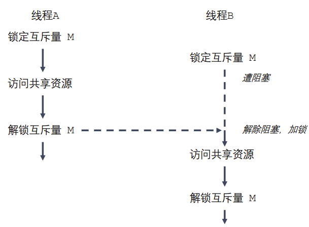

> 多线程编程时需要准确找到临界区

**用法：**相关API，实现在库里

```c++
互斥量的类型 pthread_mutex_t
    int pthread_mutex_init(pthread_mutex_t *restrict mutex, const pthread_mutexattr_t *restrict attr);
- 初始化互斥量
    - 参数 ：
        - mutex ： 需要初始化的互斥量变量
        - attr ： 互斥量相关的属性，NULL
        - restrict : C语言的修饰符，被修饰的指针，不能由另外的一个指针进行操作。
        pthread_mutex_t *restrict mutex = xxx;
pthread_mutex_t * mutex1 = mutex;

int pthread_mutex_destroy(pthread_mutex_t *mutex);
- 释放互斥量的资源

int pthread_mutex_lock(pthread_mutex_t *mutex);
- 加锁，阻塞的，如果有一个线程加锁了，那么其他的线程只能阻塞等待

int pthread_mutex_trylock(pthread_mutex_t *mutex);
- 尝试加锁，如果加锁失败，不会阻塞，会直接返回。

int pthread_mutex_unlock(pthread_mutex_t *mutex);
- 解锁
```

```c++
#include <stdio.h>
#include <pthread.h>
#include <unistd.h>

// 全局变量，所有的线程都共享这一份资源。
int tickets = 1000;

// 创建一个互斥量
pthread_mutex_t mutex;

void * sellticket(void * arg) {

    // 卖票
    while(1) {

        // 加锁
        pthread_mutex_lock(&mutex);

        if(tickets > 0) {
            usleep(60000);
            printf("%ld 正在卖第 %d 张门票\n", pthread_self(), tickets);
            tickets--;
        }else {
            // 解锁
            pthread_mutex_unlock(&mutex);
            break;
        }

        // 解锁
        pthread_mutex_unlock(&mutex);
    }
    return NULL;
}  

int main() {

    // 初始化互斥量
    pthread_mutex_init(&mutex, NULL);

    // 创建3个子线程
    pthread_t tid1, tid2, tid3;
    pthread_create(&tid1, NULL, sellticket, NULL);
    pthread_create(&tid2, NULL, sellticket, NULL);
    pthread_create(&tid3, NULL, sellticket, NULL);

    // 回收子线程的资源,如果线程正在用，这个函数阻塞
    pthread_join(tid1, NULL);
    pthread_join(tid2, NULL);
    pthread_join(tid3, NULL);

    pthread_exit(NULL); // 退出主线程

    // 释放互斥量资源
    pthread_mutex_destroy(&mutex);

    return 0;
}
```

### 死锁

**含义：**

在两个或者多个并发线程中，如果每个线程持有某种资源，而又等待其它线程释放它或者它们现在保持着的资源，在未改变这种状态之前都不能向前推进，称这一组线程产生了死锁。通俗的讲就是两个或多个线程无期限的阻塞、相互等待的一种状态。

**死锁产生的场景：**

- 多线程多锁，抢占锁资源

**怎么检测死锁**


**死锁产生的条件：**针对多线程多锁，抢占锁资源场景下

- 互斥条件：共享资源的排他性访问
- 不可剥夺条件：访问时该共享资源不会被剥夺
- 请求并保持条件：保持当前资源时请求另一个资源
- 循环等待条件：存在共享资源的循环等待链

**避免死锁：**

- 消除互斥条件：将独享的资源改成共享的，但是很多情况下，资源是无法改成共享的。

- 消除不可剥夺条件：占用部分资源的线程进一步申请其它资源时，如果申请不到，可以主动释放它占有的资源

- 消除请求并保持条件：一个线程一次请求其所需要的所有资源/或者阶段性请求释放资源

- 消除循环等待条件：对资源按序申请。所谓按序申请，是指资源是有线性顺序的，申请的时候可以先申请资源序号小的，再申请资源序号大的，这样线性化后就不存在循环了。

**死锁场景举例：**

```c++
// 全局变量，所有的线程都共享这一份资源。
int tickets = 1000;

// 创建一个互斥量
pthread_mutex_t mutex;

void * sellticket(void * arg) {
    // 卖票
    while(1) {
        // 加锁
        pthread_mutex_lock(&mutex);
        pthread_mutex_lock(&mutex); // 场景2：对同一资源（临界区）重复加锁
        if(tickets > 0) {
            usleep(60000);
            printf("%ld 正在卖第 %d 张门票\n", pthread_self(), tickets);
            tickets--;
        }else {
            // 解锁
            pthread_mutex_unlock(&mutex);
            break;
        }
        // 解锁
        pthread_mutex_unlock(&mutex); 
        // pthread_mutex_unlock(&mutex);  // 场景1：忘记释放锁
    }
    return NULL;
}
int main() {
	...
    return 0;
}
```

场景3：多线程多锁，抢占锁资源

```c++
#include <stdio.h>
#include <pthread.h>
#include <unistd.h>

// 创建2个互斥量
pthread_mutex_t mutex1, mutex2;

void * workA(void * arg) {
	// 线程tid1拿到了mutex1之后想再拿mutex2
    pthread_mutex_lock(&mutex1);
    sleep(1);
    pthread_mutex_lock(&mutex2);
	
    printf("workA....\n"); // 假设在访问临界区资源

    pthread_mutex_unlock(&mutex2);
    pthread_mutex_unlock(&mutex1);
    return NULL;
}

void * workB(void * arg) {
    // 线程tid2拿到了mutex2之后想再拿mutex1
    pthread_mutex_lock(&mutex2);
    sleep(1);
    pthread_mutex_lock(&mutex1);

    printf("workB....\n"); // 假设在访问临界区资源

    pthread_mutex_unlock(&mutex1);
    pthread_mutex_unlock(&mutex2);

    return NULL;
}

int main() {

    // 初始化互斥量
    pthread_mutex_init(&mutex1, NULL);
    pthread_mutex_init(&mutex2, NULL);

    // 创建2个子线程，线程tid1执行workA，线程tid2执行workB
    pthread_t tid1, tid2;
    pthread_create(&tid1, NULL, workA, NULL);
    pthread_create(&tid2, NULL, workB, NULL);

    // 回收子线程资源
    pthread_join(tid1, NULL);
    pthread_join(tid2, NULL);

    // 释放互斥量资源
    pthread_mutex_destroy(&mutex1);
    pthread_mutex_destroy(&mutex2);

    return 0;
}
```

### 读写锁

**含义：**

当有一个线程已经持有互斥锁时，互斥锁将所有试图进入临界区的线程都阻塞住。但是考虑一种情形，当前持有互斥锁的线程只是要读访问共享资源，而同时有其它几个线程也想读取这个共享资源，但是由于互斥锁的排它性，所有其它线程都无法获取锁，也就无法读 访问共享资源了，但是实际上多个线程同时读访问共享资源并不会导致问题。

- 在对数据的读写操作中，更多的是读操作，写操作较少，例如对数据库数据的读写应用。 为了满足当前能够允许多个读出，但只允许一个写入的需求，线程提供了读写锁来实现。
- 读写锁的特点：
  - 如果有其它线程读数据，则允许其它线程执行读操作，但不允许写操作。
  - 如果有其它线程写数据，则其它线程都不允许读、写操作。
  - 写是独占的，写的优先级高

**使用**：相关API

```c++
读写锁的类型 pthread_rwlock_t
int pthread_rwlock_init(pthread_rwlock_t *restrict rwlock, const pthread_rwlockattr_t *restrict attr);
int pthread_rwlock_destroy(pthread_rwlock_t *rwlock);
int pthread_rwlock_rdlock(pthread_rwlock_t *rwlock);
int pthread_rwlock_tryrdlock(pthread_rwlock_t *rwlock);
int pthread_rwlock_wrlock(pthread_rwlock_t *rwlock);
int pthread_rwlock_trywrlock(pthread_rwlock_t *rwlock);
int pthread_rwlock_unlock(pthread_rwlock_t *rwlock);
```

**举例：**

```c++
#include <stdio.h>
#include <pthread.h>
#include <unistd.h>

// 创建一个共享数据
int num = 1;

pthread_rwlock_t rwlock;

void * writeNum(void * arg) {

    while(1) {
        pthread_rwlock_wrlock(&rwlock);
        num++;
        printf("++write, tid : %ld, num : %d\n", pthread_self(), num);
        pthread_rwlock_unlock(&rwlock);
        usleep(100);
    }
    return NULL;
}

void * readNum(void * arg) {

    while(1) {
        pthread_rwlock_rdlock(&rwlock);
        printf("===read, tid : %ld, num : %d\n", pthread_self(), num);
        pthread_rwlock_unlock(&rwlock);
        usleep(100);
    }

    return NULL;
}

int main() {

   pthread_rwlock_init(&rwlock, NULL);

    // 创建3个写线程，5个读线程
    pthread_t wtids[3], rtids[5];
    for(int i = 0; i < 3; i++) {
        pthread_create(&wtids[i], NULL, writeNum, NULL);
    }

    for(int i = 0; i < 5; i++) {
        pthread_create(&rtids[i], NULL, readNum, NULL);
    }

    // 设置线程分离
    for(int i = 0; i < 3; i++) {
       pthread_detach(wtids[i]);
    }

    for(int i = 0; i < 5; i++) {
         pthread_detach(rtids[i]);
    }
    pthread_rwlock_destroy(&rwlock);
    pthread_exit(NULL);
    return 0;
}
```

### 条件变量

**含义：**条件变量不是锁，是为了控制线程是否阻塞，可以配合互斥量实现同步

**操作：**

```c++
条件变量的类型 pthread_cond_t
    
int pthread_cond_init(pthread_cond_t *restrict cond, const pthread_condattr_t *restrict attr);
int pthread_cond_destroy(pthread_cond_t *cond);
int pthread_cond_wait(pthread_cond_t *restrict cond, pthread_mutex_t *restrict mutex);
- 等待，调用了该函数，线程会阻塞。
    
int pthread_cond_timedwait(pthread_cond_t *restrict cond, pthread_mutex_t *restrict mutex, const struct timespec *restrict abstime);
- 等待多长时间，调用了这个函数，线程会阻塞，直到指定的时间结束。
    
int pthread_cond_signal(pthread_cond_t *cond);
- 唤醒一个或者多个等待的线程
    
int pthread_cond_broadcast(pthread_cond_t *cond);
- 唤醒所有的等待的线程
```

**举例：**

```c++
#include <stdio.h>
#include <pthread.h>
#include <stdlib.h>
#include <unistd.h>

// 创建一个互斥量
pthread_mutex_t mutex;
// 创建条件变量
pthread_cond_t cond;

struct Node{
    int num;
    struct Node *next;
};

// 头结点
struct Node * head = NULL;

void * producer(void * arg) {

    // 不断的创建新的节点，添加到链表中
    while(1) {
        pthread_mutex_lock(&mutex); // 加互斥锁
        
        struct Node * newNode = (struct Node *)malloc(sizeof(struct Node));
        newNode->next = head;
        head = newNode;
        newNode->num = rand() % 1000;
        printf("add node, num : %d, tid : %ld\n", newNode->num, pthread_self());
        
        // 只要生产了一个，就通知消费者消费
        pthread_cond_signal(&cond);

        pthread_mutex_unlock(&mutex); //解互斥锁
        usleep(100);
    }

    return NULL;
}

void * customer(void * arg) {

    while(1) {
        pthread_mutex_lock(&mutex); // 加互斥锁
        // 保存头结点的指针
        struct Node * tmp = head;
        // 判断是否有数据
        if(head != NULL) {
            // 有数据
            head = head->next;
            printf("del node, num : %d, tid : %ld\n", tmp->num, pthread_self());
            free(tmp);
            pthread_mutex_unlock(&mutex);
            usleep(100);
        } else {
            // 没有数据，需要等待
            // 【重要】：当这个函数调用阻塞的时候，会对互斥锁进行解锁，当不阻塞的时候，继续向下执行，会重新加锁。
            pthread_cond_wait(&cond, &mutex);

            pthread_mutex_unlock(&mutex); //解互斥锁
        }
    }
    return  NULL;
}

int main() {

    pthread_mutex_init(&mutex, NULL);
    pthread_cond_init(&cond, NULL);

    // 创建5个生产者线程，和5个消费者线程
    pthread_t ptids[5], ctids[5];

    for(int i = 0; i < 5; i++) {
        pthread_create(&ptids[i], NULL, producer, NULL);
        pthread_create(&ctids[i], NULL, customer, NULL);
    }

    for(int i = 0; i < 5; i++) {
        pthread_detach(ptids[i]);
        pthread_detach(ctids[i]);
    }

    while(1) {
        sleep(10);
    }

    pthread_mutex_destroy(&mutex);
    pthread_cond_destroy(&cond);

    pthread_exit(NULL);

    return 0;
}

```

### 信号量

含义：通过信号量的等待（P操作）还有释放（V操作）来保证线程间对资源的同步访问

操作：

```c++
信号量的类型 sem_t
int sem_init(sem_t *sem, int pshared, unsigned int value);
- 初始化信号量
    - 参数：
    - sem : 信号量变量的地址
    - pshared : 0 用在线程间 ，非0 用在进程间
    - value : 信号量中的值

int sem_destroy(sem_t *sem);
- 释放资源

int sem_wait(sem_t *sem);
- 对信号量加锁，调用一次对信号量的值-1，如果值为0，就阻塞

int sem_trywait(sem_t *sem);

int sem_timedwait(sem_t *sem, const struct timespec *abs_timeout);
int sem_post(sem_t *sem);
- 对信号量解锁，调用一次对信号量的值+1

int sem_getvalue(sem_t *sem, int *sval);
```

**举例**

```c++
#include <stdio.h>
#include <pthread.h>
#include <stdlib.h>
#include <unistd.h>
#include <semaphore.h>

// 创建一个互斥量
pthread_mutex_t mutex;
// 创建两个信号量
sem_t psem;
sem_t csem;

struct Node{
    int num;
    struct Node *next;
};

// 头结点
struct Node * head = NULL;

void * producer(void * arg) {

    // 不断的创建新的节点，添加到链表中
    while(1) {
        sem_wait(&psem); // 对于生产者，wait是等待信号量大于0  psem--
        pthread_mutex_lock(&mutex); // 加互斥锁
        struct Node * newNode = (struct Node *)malloc(sizeof(struct Node));
        newNode->next = head;
        head = newNode;
        newNode->num = rand() % 1000;
        printf("add node, num : %d, tid : %ld\n", newNode->num, pthread_self());
        pthread_mutex_unlock(&mutex); // 解互斥锁
        sem_post(&csem); // 通知消费者，去消费 csem++
    }

    return NULL;
}

void * customer(void * arg) {

    while(1) {
        sem_wait(&csem); // 对于消费者，wait是等待生产者生产 csem--
        pthread_mutex_lock(&mutex); // 加互斥锁
        // 保存头结点的指针
        struct Node * tmp = head;
        head = head->next;
        printf("del node, num : %d, tid : %ld\n", tmp->num, pthread_self());
        free(tmp);
        pthread_mutex_unlock(&mutex); // 解互斥锁
        sem_post(&psem); // 通知生产者，去生产 psem++
       
    }
    return  NULL;
}

int main() {

    pthread_mutex_init(&mutex, NULL);
    sem_init(&psem, 0, 8);
    sem_init(&csem, 0, 0);

    // 创建5个生产者线程，和5个消费者线程
    pthread_t ptids[5], ctids[5];

    for(int i = 0; i < 5; i++) {
        pthread_create(&ptids[i], NULL, producer, NULL);
        pthread_create(&ctids[i], NULL, customer, NULL);
    }

    for(int i = 0; i < 5; i++) {
        pthread_detach(ptids[i]);
        pthread_detach(ctids[i]);
    }

    while(1) {
        sleep(10);
    }

    pthread_mutex_destroy(&mutex);

    pthread_exit(NULL);

    return 0;
}

```


## 12 孤儿进程

**产生：**父进程运行结束，但子进程还在运行（未运行结束），这样的子进程就称为孤儿进程 （Orphan Process）。

**处理：**孤儿进程将被`init`进程（进程ID为1的进程）所收养，并由`init`进程对它们完成状态收集工作。这样，当一个孤儿进程结束了其生命周期的时候，init 进程就会回收它的资源。

 因此孤儿进程并不会有什么危害。

## 13 僵尸进程

**产生：**每个进程结束之后，都会释放自己地址空间中的用户区数据，内核区的PCB（进程控制块）没有办法自己释放掉，需要父进程去释放。

进程终止时，如果父进程未回收子进程的资源，子进程残留资源（PCB）存放于内核中，变成僵尸进程。

僵尸进程不能被 `kill -9` 杀死，这样就会导致一个问题，如果父进程不调用 wait()  或 waitpid() 的话，那么保留的那段信息就不会释放，其进程号就会一直被占用， 但是系统所能使用的进程号是有限的，如果大量的产生僵尸进程，将因为没有可用的进程号而导致系统不能产生新的进程，此即为僵尸进程的危害，应当避免。

## 14 如何避免僵尸进程：进程回收

**父进程调用wait()或waitpid()**

- 父进程可以通过调用wait或waitpid得到它的退出状态同时彻底清除掉这个进程。 
- wait() 和 waitpid() 函数的功能一样，区别在于，wait() 函数会阻塞， waitpid() 可以设置不阻塞，waitpid() 还可以指定等待哪个子进程结束。
- 注意：一次wait或waitpid调用只能清理一个子进程，清理多个子进程应使用循环。

**通过信号处理：signal(SIGCHLD,SIG_IGN)**

子进程退出时，会向父进程发出`SIGCHLD`信号，如果设置此信号为忽略，可让内核把僵尸子进程转交给`init`进程去处理。


## 15 进程退出的方式

- `main`函数自然返回
- 调用`exit`函数，属于C的库函数
- 调用`_exit`函数，属于系统调用
- 发送信号：SIGINT（ctrl+c）（2号信号）

**`exit`和`_exit`的区别：**

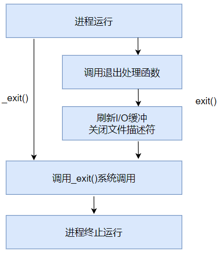

## 16 创建线程

  一般情况下,main函数所在的线程我们称之为主线程（main线程），其余创建的线程称之为子线程。  程序中默认只有一个线程，pthread_create()函数调用，2个线程。

  函数声明：`int pthread_create(pthread_t *thread, const pthread_attr_t *attr,  void *(*start_routine) (void *), void *arg);`

- 功能：创建一个子线程
- 参数
  - thread：传出参数，线程创建成功后，子线程的线程ID被写到该变量中。
  - attr : 设置线程的属性，一般使用默认值，NULL
  - start_routine : 函数指针，这个函数是子线程需要处理的逻辑代码
  - arg : 给第三个参数使用，传参

- 返回值：
  - 成功：0
  - 失败：返回错误号。

```c++
#include <stdio.h>
#include <pthread.h>
#include <string.h>
#include <unistd.h>

void * callback(void * arg) {
    printf("child thread...\n");
    printf("arg value: %d\n", *(int *)arg);
    return NULL;
}

int main() {

    pthread_t tid;

    int num = 10;

    // 创建一个子线程
    int ret = pthread_create(&tid, NULL, callback, (void *)&num);

    if(ret != 0) {
        char * errstr = strerror(ret);
        printf("error : %s\n", errstr);
    } 

    for(int i = 0; i < 5; i++) {
        printf("%d\n", i);
    }

    sleep(1);

    return 0;   // exit(0);
}
```


## 17 回收线程

### 终止线程：`pthread_exit`

`void pthread_exit(void *retval);`

- 功能：终止一个线程，在哪个线程中调用，就表示终止哪个线程
- 参数：
  - retval：需要传递一个指针，作为一个返回值，交给pthread_join()。

```c++
#include <stdio.h>
#include <pthread.h>
#include <string.h>

void * callback(void * arg) {
    printf("child thread id : %ld\n", pthread_self());
    return NULL;    // pthread_exit(NULL);
} 

int main() {

    // 创建一个子线程
    pthread_t tid;
    int ret = pthread_create(&tid, NULL, callback, NULL);

    if(ret != 0) {
        char * errstr = strerror(ret);
        printf("error : %s\n", errstr);
    }

    // 主线程
    for(int i = 0; i < 5; i++) {
        printf("%d\n", i);
    }
    
    printf("tid : %ld, main thread id : %ld\n", tid ,pthread_self()); // 功能：获取当前的线程的线程ID

    // 让主线程退出,当主线程退出时，不会影响其他正常运行的线程。
    pthread_exit(NULL);

    printf("main thread exit\n");

    return 0;   // exit(0);
}
```

### 连接已终止的线程：`pthread_join`

> 任何线程都可以连接其它线程并回收资源，不过一般都是用父线程连接子线程并回收资源

 ` int pthread_join(pthread_t thread, void **retval);`

- 功能：和一个已经终止的线程进行连接
  - 回收子线程的资源
  - 这个函数是阻塞函数，调用一次只能回收一个子线程
  - 一般在主线程中使用

- 参数：
  - thread：需要回收的子线程的ID
  - retval: 接收子线程退出时的返回值

- 返回值：
  - 0 : 成功
  - 非0 : 失败，返回的错误号

```c++
#include <stdio.h>
#include <pthread.h>
#include <string.h>
#include <unistd.h>

int value = 10;

void * callback(void * arg) {
    printf("child thread id : %ld\n", pthread_self());
    pthread_exit((void *)&value);   // return (void *)&value; 子线程返回一个值
} 

int main() {

    // 创建一个子线程
    pthread_t tid;
    int ret = pthread_create(&tid, NULL, callback, NULL);

    // 判断线程是否创建成功
    if(ret != 0) {
        char * errstr = strerror(ret);
        printf("error : %s\n", errstr);
    }

    // 主线程
    for(int i = 0; i < 5; i++) {
        printf("%d\n", i);
    }

    printf("tid : %ld, main thread id : %ld\n", tid ,pthread_self());

    // 主线程调用pthread_join()回收子线程的资源
    int * thread_retval;
    ret = pthread_join(tid, (void **)&thread_retval); // 父线程接收子线程的返回值

    if(ret != 0) {
        char * errstr = strerror(ret);
        printf("error : %s\n", errstr);
    }

    printf("exit data : %d\n", *thread_retval);

    printf("回收子线程资源成功！\n");

    // 让主线程退出,当主线程退出时，不会影响其他正常运行的线程。
    pthread_exit(NULL);

    return 0; 
}

```

`pthread_join`：等待一个线程的结束，也就是主线程中要是加了这段代码，就会在该位置卡住，直到这个线程执行完毕才往下走。

`pthread_exit`：用于强制退出一个线程（非执行完毕退出），一般用于线程内部。

**结合用法：**

一般都是pthread_exit在线程内退出，然后返回一个值。这个时候就跳到主线程的pthread_join了（因为一直在等你结束），这个返回值会直接送到pthread_join，实现了主与分线程的通信

### 线程分离：`pthread_detach`

 `int pthread_detach(pthread_t thread);`

- 功能：分离一个线程。被分离的线程在终止的时候，会自动释放资源返回给系统。
  - 不能多次分离，会产生不可预料的行为。
  - 不能去连接一个已经分离的线程，会报错。

- 参数：需要分离的线程的ID

- 返回值：
  - 成功：0
  - 失败：返回错误号

```c++
#include <stdio.h>
#include <pthread.h>
#include <string.h>
#include <unistd.h>

void * callback(void * arg) {
    printf("chid thread id : %ld\n", pthread_self());
    return NULL;
}

int main() {

    // 创建一个子线程
    pthread_t tid;

    int ret = pthread_create(&tid, NULL, callback, NULL);

    // 输出主线程和子线程的id
    printf("tid : %ld, main thread id : %ld\n", tid, pthread_self());

    // 设置子线程分离,子线程分离后，子线程结束时对应的资源就不需要主线程释放
    ret = pthread_detach(tid);
    if(ret != 0) {
        char * errstr = strerror(ret);
        printf("error2 : %s\n", errstr);
    }

    pthread_exit(NULL);

    return 0;
}
```


## 18 回调函数

将函数作为一个变量传入到别人的函数中，当调用别人的函数时，到了一个特定点，就会调用自己的函数

实现用底层的库调用上层的函数的效果，如创建线程的函数：

`int pthread_create(pthread_t *thread, const pthread_attr_t *attr,  void *(*start_routine) (void *), void *arg);`


## 19 同步、异步

**同步** ：两个事物相互依赖，并且一个事物必须以依赖于另一事物的执行结果。比如在事物 `A->B` 事件模型中，你需要先完成事物 A 才能执行事物 B。也就是说，同步调用在被调用者未处理完请求之前，调用不返回，调用者会一直等待结果的返回。

**异步** ：两个事物完全独立，一个事物的执行不需要等待另外一个事物的执行。也就是说，异步调用会立刻返回响应，但是不需要等待结果返回，当结果返回的时候通过回调函数或者其他方式带着调用结果再做相关事情。

**什么时候用同步？**

适用于简单的顺序执行任务，不涉及耗时操作和并发需求的场景，如计算简单数据等

**什么时候用异步？**

适用于耗时操作和需要并发执行多个任务的场景，如网络请求、数据库查询、磁盘读取等

- I/O操作
- 网页请求
- 数据库查询

## 20 阻塞、非阻塞

阻塞与非阻塞指的是**单个线程内**遇到同步等待时，是否在原地不做任何操作

- 阻塞：调用IO方法的线程进入阻塞状态
- 非阻塞：不会改变线程的状态，程序会继续往下执行，通过返回值判断是否有数据发过来     

同步、异步指的是一个线程执行的是否依赖另一个线程的执行结果

同步阻塞相当于只有一个线程，而且该线程处于阻塞（Blocked）状态，同步非阻塞相当于只有一个线程，而且该线程处于运行（Running）状态。异步阻塞相当于有多个线程，而且所有线程都处于阻塞（Blocked）状态，异步非阻塞相当于有多个线程，而且所有线程都在正常运行。

## 21 系统调用和库函数的区别

| 库函数                 | 系统调用                                           |
| ---------------------- | -------------------------------------------------- |
| 调用函数库中的一个程序 | 调用系统内核的服务                                 |
| 属于过程调用，开销较小 | 需要切换到内核上下文环境中然后再切换回来，开销较大 |
| 在用户空间执行         | 在内核空间执行                                     |


## 21 进程调度算法


## 22 多进程调试

使用 GDB 调试的时候，GDB 默认只能跟踪一个进程，可以在 fork 函数调用之前，通过指令设置 GDB 调试工具跟踪父进程或者是跟踪子进程，默认跟踪父进程。 

设置调试父进程或者子进程：`set follow-fork-mode [parent（默认）| child] `

设置调试模式：`set detach-on-fork [on | off] `

默认为 on，表示调试当前进程的时候，其它的进程继续运行，如果为 off，调试当前进程的时候，其它进程被 GDB 挂起。 

查看调试的进程：`info inferiors`

切换当前调试的进程：`inferior id `

使进程脱离 GDB 调试：`detach inferiors id`


## 23 多线程调试


## ///////////////////////////////////////////////////

## 1 什么是操作系统

操作系统是一种运行在`内核态`的软件

它是应用程序和硬件之间的媒介，向应用程序提供硬件的抽象，以及管理硬件资源。

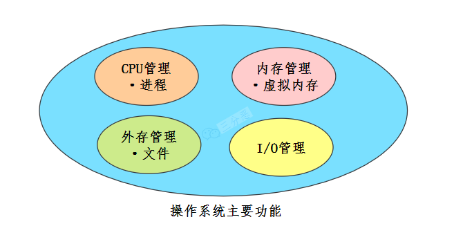

## 2 操作系统有哪些功能

操作系统最主要的功能： 

- 处理器(cpu)管理：CPU的管理和分配，主要是指进程管理
- 内存管理：内存的分配和管理，主要利用了虚拟内存的方式
- 外存管理：外存（磁盘等）的分配和管理
- I/O管理：对输入/输出设备的统一管理

除此之外，还有防止非法操作和入侵的安全性管理。


## 3 什么是内核

内核是计算机程序，它是操作系统的核心，提供了操作系统最核心的能力，可以控制操作系统中所有的内容（CPU、内存、硬盘等硬件）


## 4 内核态和用户态

内核具有很高的权限，可以控制CPU、内存、硬盘等硬件，考虑到权限控制，大多数操作系统把内存分成了两个区域：

- 内核空间：这个内存空间只有内核程序可以访问
- 用户空间：这个内存空间专门给应用程序使用，权限比较小

用户空间的代码只能访问一个局部的内存空间，而内核空间的代码可以访问所有内存空间。所以，当程序使用用户空间时，就说该程序在`用户态`执行，当程序使用内核空间时，程序在`内核态`执行。

## 5 内核态和用户态切换

用户态进入到内核态有三种情况：

- 系统调用（主动请求）：当应用程序使用系统调用时，会产生一个中断。发生中断后，CPU会中断当前在执行的用户程序，转而跳转到中断处理程序，也就是开始执行内核程序。内核处理完后，主动触发中断，把CPU执行权限交回给用户程序，回到用户态继续工作。

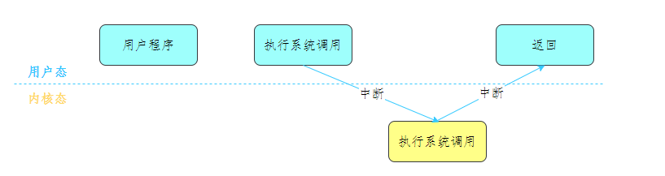

- 异常（被动）：当程序在用户态下运行时，发生了某些异常，这时会从用户程序切换到内核中处理该异常的程序，也就是切换到了内核态
- 外设产生中断（被动）：外设发出中断信号，当中断发生后，当前运行的进程暂停运行，并且操作系统内核对中断进程处理，如果中断之前CPU执行的是用户态程序，就相当于从用户态切换到了内核态。
  - 举例：硬盘读写操作完成，系统会切换到硬盘读写的中断处理程序中执行后续操作

## 6 外中断和异常有什么区别？

外中断是指由CPU执行指令以外的事件引起，如I/O完成中断，表示设备输入/输出处理已经完成，处理器能够发送下一个输入/输出请求。此外还有时钟中断、控制台中断等。

异常是由CPU产生的，如非法操作码、地址越界、算术溢出、除0等。


## 6 并行和并发

**并发：**并发就是在一段时间内，多个任务都会被处理；但是在某一时刻，只有一个任务在执行。

- 单核处理器做到的并发，其实就是利用时间片的轮转。例如有两个进程A和B，A运行一个时间片后，切换到B，B运行一个时间片后又切换到A。因为切换速度足够快，所以宏观上表现为在一段时间内能同时运行多个程序。

**并行：**在同一时刻，有多个任务在执行。

- 如果是在一个处理器：这需要多核处理器才能完成，在微观上就能同时执行多个任务。
- 如果是在不同处理器：这个是物理上的多个进程同时进行

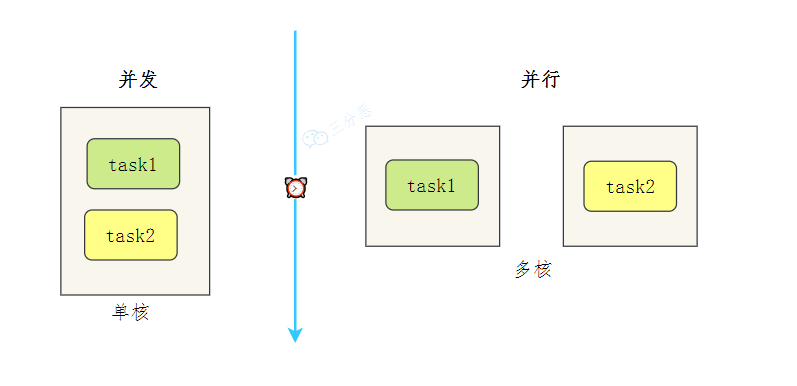

## 7 进程的上下文切换

对于单核单线程CPU来说，在某一时刻只能执行一条CPU指令。上下文切换就是一种将CPU资源从一个进程分配给另一个进程的机制。在切换的过程中，操作系统需要先存储当前进程的状态（包括内存空间的指针，当前执行完的指令等等），再读入下一个进程的状态，然后执行此进程。

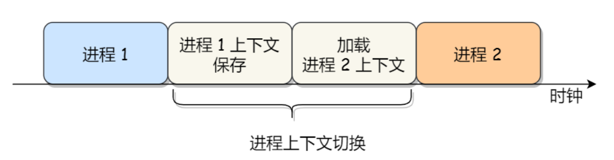

## 8 进程有哪些状态

当一个进程开始运行时，它可能会经历下面这几种状态：

- 运行态：该时刻进行占用CPU；
- 就绪态：可运行，由于其它进程处于运行态而暂时停止运行
- 阻塞态：该进程正在等待某一事件发生（如等待输入/输出操作的完成）而暂时停止运行，这时即使给它CPU控制权，它也无法运行
- 创建状态：进程正在被创建时的状态
- 结束状态：进程正在从系统中消失时的状态

注意：

- 只有就绪态和运行态可以相互转换，其它的都是单向转换。就绪状态的进程通过调度算法从而获得CPU时间，转为运行状态；运行状态的进程在分配给它的CPU时间片用完之后就会转为就绪状态，等待下一次调度。

- 阻塞状态是缺少需要的资源从而由运行状态转换而来，但是该资源不包括CPU时间，缺少CPU时间会从运行态转换为就绪态。


## 9 进程如何控制

操作系统对进程的进行控制，包括创建新进程，撤销已有进程、挂起、阻塞和唤醒、进程切换等多种操作。通过`原语`操作实现进程控制。

原语：由若干条指令组成，完成特定的功能，是一种原子操作（做就全做，执行过程不会被中断）

进程控制相关原语：

- 创建：`create`
- 阻塞：`bolck`
- 唤醒：`wakeup`
- 撤销：`destroy`


## 10 僵尸进程

每个进程结束之后，都会释放自己地址空间中的用户区数据，内核区的PCB（进程控制块）没有办法自己释放掉，需要父进程去释放。

进程终止时，父进程尚未回收，子进程残留资源（PCB）存放于内核中，变成僵尸进程。

僵尸进程不能被 kill -9 杀死，这样就会导致一个问题，如果父进程不调用 wait()  或 waitpid() 的话，那么保留的那段信息就不会释放，其进程号就会一直被占用， 但是系统所能使用的进程号是有限的，如果大量的产生僵尸进程，将因为没有可用的进程号而导致系统不能产生新的进程，此即为僵尸进程的危害，应当避免。

**如何避免僵尸进程**


## 11 孤儿进程

一个父进程退出，而它的一个或多个子进程还在运行，那么这些子进程将成为孤儿进程。孤儿进程将被`init`进程（进程ID为1的进程）所收养，并由`init`进程对它们完成状态收集工作。因为孤儿进程会被`init`进程收养，所以孤儿进程不会对系统造成危害


## 12 进程有哪些调度算法

**先来先服务**

也成为先进先出（FIFO）。进程按照请求CPU的顺序进行调度。这种方式易于实现，但可能会导致较短的进程等待较长进程执行完成，从而产生”饥饿“现象。

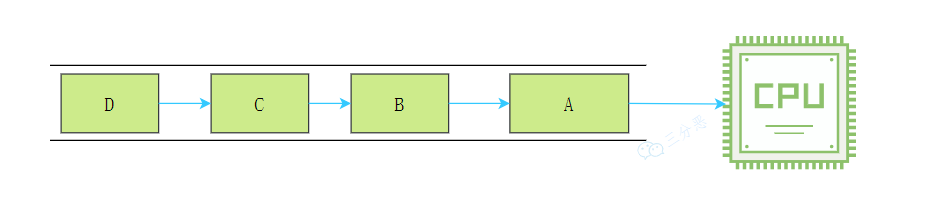

**短作业优先**

选择预计运行时间最短的进程优先执行。这种方式可以减少平均等待时间和响应时间，但缺点是很难准确预知进程的执行时间，并且可能因为短作业一直在执行，导致长作业持续被推迟执行。


**优先级调度**

在这种调度方式中，每个进程都被分配一个有优先级。CPU首先分配给优先级最高的进程。优先级调度可以是抢占式或非抢占式的。在非抢占式优先级调度中，进程一旦开始执行将一直运行直到完成。在抢占式优先级调度中，更高优先级的进程可以中断正在执行的低优先级进程。

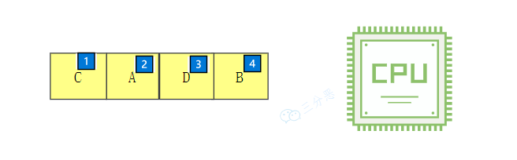

**时间片轮转**

时间片轮转调度为每个进程分配一个固定的时间端，成为时间片，进程可以在这个时间片内运行。如果进程在时间片结束时还没有完成，它将被放回队列的末尾。时间片轮转是公平的调度方式，可以保证所有的进程得到公平的CPU时间，适用于共享系统。

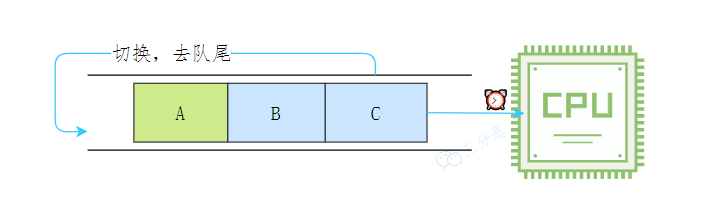

**最短剩余时间优先**

短作业优先的一种改进形式，它是抢占式的。即如果一个新进程的预计执行时间比当前运行进程的剩余时间短，调度器将暂停当前的进程，并切换到新进程。这种方法也可以最小化平均等待时间，但同样面临预测执行时间的困难。

**多级反馈队列**


## 13 进程间通信

### 1 进程间通信的目的

进程是一个独立的资源分配单元，不同进程（这里所说的进程通常指的是用户进程）之间的资源是独立的，没有关联，不能在一个进程中直接访问另一个进程的资源。 

但进程不是孤立的，不同的进程需要进行信息的交互和状态的传递等，因此需要进程间通信( IPC：Inter Processes Communication )。 

进程间通信的目的：

- 数据传输：一个进程需要将它的数据发送给另一个进程。
- 通知事件：一个进程需要向另一个或一组进程发送消息，通知它（它们）发生了某种事件（如进程终止时要通知父进程）。 
- 资源共享：多个进程之间共享同样的资源。为了做到这一点，需要内核提供互斥和同 步机制。
- 进程控制：有些进程希望完全控制另一个进程的执行（如 Debug 进程），此时控制进程希望能够拦截另一个进程的所有陷入和异常，并能够及时知道它的状态改变。

### 2 进程间通信方式


#### 1 匿名管道

 管道也叫无名（匿名）管道，它是 UNIX 系统 IPC（进程间通信）的最古老形式， 所有的 UNIX 系统都支持这种通信机制。 

举例：统计一个目录中文件的数目命令：ls | wc –l，为了执行该命令，shell 创建了两 个进程来分别执行 ls 和 wc。


**管道的特点**：

- 管道其实是一个在内核内存中维护的缓冲器，这个缓冲器的存储能力是有限的，不同的 操作系统大小不一定相同。
- 管道拥有文件的特质：读操作、写操作，匿名管道没有文件实体，有名管道有文件实体， 但不存储数据。可以按照操作文件的方式对管道进行操作。
- 一个管道是一个字节流，使用管道时不存在消息或者消息边界的概念，从管道读取数据 的进程可以读取任意大小的数据块，而不管写入进程写入管道的数据块的大小是多少。
- 通过管道传递的数据是顺序的，从管道中读取出来的字节的顺序和它们被写入管道的顺 序是完全一样的。
- 在管道中的数据的传递方向是单向的，一端用于写入，一端用于读取，管道是半双工的。
- 从管道读数据是一次性操作，数据一旦被读走，它就从管道中被抛弃，释放空间以便写 更多的数据，在管道中无法使用 lseek() 来随机的访问数据。
- 匿名管道只能在具有关系之间的进程（父进程与子进程，或者两个兄弟进程，具有亲缘关系）之间使用。

**半双工和全双工的概念**

1. **半双工**（Half Duplex）：
   - 数据可以在两个方向传输，但不能同时进行。即在一个**时刻**接口只能接收或者发送数据，例如对讲机。
2. **全双工**（Full Duplex）：
   - 数据可以在两个方向同时传输。即在同一时刻，双方都可以发送和接收数据，例如电话通话


**为什么可以使用管道进行进程间通信**


左边为父进程的虚拟空间（内核空间+用户空间），右边是父进程创建出来的子进程的虚拟空间。

子进程创建之后，被拷贝一份数据，和父进程共享管道缓冲区。

父进程的5号文件操作符，对应管道的写端，6号文件操作符对应管道的读端。

那么拷贝出来的子进程的5号文件操作符，也就是对应管道的写端，6号文件操作符对应管道的读端。

那么父进程使用5号文件操作符向管道写入数据时，子进程的6号文件操作符就能够读取到数据，反之也一样。


**管道的数据结构**

环形队列


**管道的使用**

```c++
  /*
    #include <unistd.h>
    int pipe(int pipefd[2]);
        功能：创建一个匿名管道，用来进程间通信。
        参数：int pipefd[2] 这个数组是一个传出参数。
            pipefd[0] 对应的是管道的读端
            pipefd[1] 对应的是管道的写端
        返回值：
            成功 0
            失败 -1

    管道默认是阻塞的：如果管道中没有数据，read阻塞，如果管道满了，write阻塞

    注意：匿名管道只能用于具有关系的进程之间的通信（父子进程，兄弟进程）
    	一个进程要么只进行读，要么只进行写，用同一个管道并且同时进行读写时，会产生问题。
*/

// 需求：子进程发送数据给父进程，父进程读取到数据输出
#include <unistd.h>
#include <sys/types.h>
#include <stdio.h>
#include <stdlib.h>
#include <string.h>
using namespace std;

int main() {

    // 在fork之前创建管道，否则父进程和子进程之间用的不是同一个管道了，无法通信
    int pipefd[2];
    int ret = pipe(pipefd);
    if(ret == -1) {
        perror("pipe");
        exit(0);
    }

    // 创建子进程
    pid_t pid = fork();
    if(pid > 0) {
        // 父进程
        printf("i am parent process, pid : %d\n", getpid());

        // 关闭写端
        // close(pipefd[1]);
        
        // 从管道的读取端读取数据
        char buf[1024] = {0};
        while(1) {
            int len = read(pipefd[0], buf, sizeof(buf));
            printf("parent recv : %s, pid : %d\n", buf, getpid());
            
            // 向管道中写入数据
            // const char * str = "hello,i am parent";
            // write(pipefd[1], str, strlen(str));
            // sleep(1);
        }

    } else if(pid == 0){
        // 子进程
        printf("i am child process, pid : %d\n", getpid());
        // 关闭读端
        // close(pipefd[0]);

        char buf[1024] = {0};
        while(1) {
            // 向管道中写入数据
            const char * str = "hello,i am child";
            write(pipefd[1], str, strlen(str));
            sleep(1);

            // 从管道中读数据
            // int len = read(pipefd[0], buf, sizeof(buf));
            // printf("child recv : %s, pid : %d\n", buf, getpid());
            // bzero(buf, 1024);
        }
        
    }
    return 0;
}
```

**管道的读写特点：**
使用管道时，需要注意以下几种特殊的情况（假设都是阻塞I/O操作）

- 所有的指向管道写端的文件描述符都关闭了（管道写端引用计数为0），有进程从管道的读端读数据，那么管道中剩余的数据被读取以后，再次read会返回0，就像读到文件末尾一样。

- 如果有指向管道写端的文件描述符没有关闭（管道的写端引用计数大于0），而持有管道写端的进程
  也没有往管道中写数据，这个时候有进程从管道中读取数据，那么管道中剩余的数据被读取后，
  再次read会阻塞，直到管道中有数据可以读了才读取数据并返回。

- 如果所有指向管道读端的文件描述符都关闭了（管道的读端引用计数为0），这个时候有进程
  向管道中写数据，那么该进程会收到一个信号SIGPIPE, 通常会导致进程异常终止。

- 如果有指向管道读端的文件描述符没有关闭（管道的读端引用计数大于0），而持有管道读端的进程
  也没有从管道中读数据，这时有进程向管道中写数据，那么在管道被写满的时候再次write会阻塞，
  直到管道中有空位置才能再次写入数据并返回。

**总结：**

- 读管道：
  - 管道中有数据，read返回实际读到的字节数。
  - 管道中无数据：
    - 写端被全部关闭，read返回0（相当于读到文件的末尾）
    - 写端没有完全关闭，read阻塞等待

- 写管道：
  - 管道读端全部被关闭，进程异常终止（进程收到SIGPIPE信号）
  - 管道读端没有全部关闭：
    - 管道已满，write阻塞
    - 管道没有满，write将数据写入，并返回实际写入的字节数


#### 2 有名管道

匿名管道，由于没有名字，只能用于亲缘关系的进程间通信。为了克服这个缺点，提出了有名管道（FIFO），也叫命名管道、FIFO文件。

有名管道（FIFO）不同于匿名管道之处在于它提供了一个路径名与之关联，以 FIFO  的文件形式存在于文件系统中，并且其打开方式与打开一个普通文件是一样的，这样 即使与 FIFO 的创建进程不存在亲缘关系的进程，只要可以访问该路径，就能够彼此 通过 FIFO 相互通信，因此，通过 FIFO 不相关的进程也能交换数据。

一旦打开了 FIFO，就能在它上面使用与操作匿名管道和其他文件的系统调用一样的 I/O系统调用了（如read()、write()和close()）。与管道一样，FIFO 也有一 个写入端和读取端，并且从管道中读取数据的顺序与写入的顺序是一样的。FIFO 的 名称也由此而来：先入先出

有名管道（FIFO)和匿名管道（pipe）有一些特点是相同的，不一样的地方在于： 

- FIFO 在文件系统中作为一个特殊文件存在，但 FIFO 中的内容却存放在内存中，并不存放在文件实体中。
- 当使用 FIFO 的进程退出后，FIFO 文件将继续保存在文件系统中以便以后使用。
- FIFO 有名字，不相关的进程可以通过打开有名管道进行通信。

**有名管道的使用**
创建fifo文件

- 通过命令：`mkfifo` 名字
- 通过函数：`int mkfifo(const char *pathname, mode_t mode);`
  - 参数：
    - pathname: 管道名称的路径
    - mode: 文件的权限 和 open 的 mode 是一样的是一个八进制的数
  - 返回值：成功返回0，失败返回-1，并设置错误号

```c++
#include <stdio.h>
#include <sys/types.h>
#include <sys/stat.h>
#include <stdlib.h>
#include <unistd.h>

int main() {
    // 判断文件是否存在
    int ret = access("fifo1", F_OK);
    if(ret == -1) {
        printf("管道不存在，创建管道\n");
        
        ret = mkfifo("fifo1", 0664);

        if(ret == -1) {
            perror("mkfifo");
            exit(0);
        }
    }
    return 0;
}
```

**案例：**

读管道：

```c++
#include <stdio.h>
#include <sys/types.h>
#include <sys/stat.h>
#include <stdlib.h>
#include <unistd.h>
#include <fcntl.h>

// 从管道中读取数据
int main() {

    // 1.打开管道文件
    int fd = open("test", O_RDONLY);
    if(fd == -1) {
        perror("open");
        exit(0);
    }

    // 读数据
    while(1) {
        char buf[1024] = {0};
        int len = read(fd, buf, sizeof(buf));
        if(len == 0) {
            printf("写端断开连接了...\n");
            break;
        }
        printf("recv buf : %s\n", buf);
    }

    close(fd);

    return 0;
}
```

写管道

```c++
#include <stdio.h>
#include <sys/types.h>
#include <sys/stat.h>
#include <stdlib.h>
#include <unistd.h>
#include <fcntl.h>
#include <string.h>

// 向管道中写数据
int main() {

    // 1.判断文件是否存在
    int ret = access("test", F_OK);
    if(ret == -1) {
        printf("管道不存在，创建管道\n");
        
        // 2.创建管道文件
        ret = mkfifo("test", 0664);

        if(ret == -1) {
            perror("mkfifo");
            exit(0);
        }       
    }

    // 3.以只写的方式打开管道
    int fd = open("test", O_WRONLY);
    if(fd == -1) {
        perror("open");
        exit(0);
    }

    // 写数据
    for(int i = 0; i < 100; i++) {
        char buf[1024];
        sprintf(buf, "hello, %d\n", i);
        printf("write data : %s\n", buf);
        write(fd, buf, strlen(buf));
        sleep(1);
    }

    close(fd);

    return 0;
}
```

**总结：**

- 一个为只读而打开一个管道的进程会阻塞，直到另外一个进程为只写打开管道
- 一个为只写而打开一个管道的进程会阻塞，直到另外一个进程为只读打开管道

读管道：

- 管道中有数据，read返回实际读到的字节数
- 管道中无数据：
  - 管道写端被全部关闭，read返回0，（相当于读到文件末尾）
  - 写端没有全部被关闭，read阻塞等待

写管道：

- 管道读端被全部关闭，进行异常终止（收到一个SIGPIPE信号）
- 管道读端没有全部关闭：
  - 管道已经满了，write会阻塞
  - 管道没有满，write将数据写入，并返回实际写入的字节数。

**管道的缺点：**管道的效率低，不适合进程间频繁地交换数据。

#### 3 消息队列

消息队列是保存在内核中的消息链表，按照消息的类型进行消息传递，具有较高的可靠性和稳定性。

缺点：消息体有一个最大长度的限制，不适合比较大的数据传输；存在用户态于内核态之间的数据拷贝开销。

**消息队列序列化和反序列化**

序列化(Serialization)是一种将对象以一连串的字节描述的过程

在传输protobuf接口文件时，发送消息时需要将消息序列化，调用SerializeToString

接收消息时需要将消息反序列化，调用ParseFromString


##### 写进程

消息队列通过`msgsnd`函数发送消息，其声明为：

```c++
int  msgsnd(int msgid, const void *msg_ptr, size_t msg_sz, int msgflg);
```

- `int msgid`：消息队列标识符，由`msgget`函数返回

  - `msgget`函数：创建一个消息队列，返回以key命名的消息队列的标识符 `int msgget(key_t key, int msgflg);`

    - `key`：某个消息队列的名字，`key`如何获取？

      - 通过宏定义`key`值
      - 通过`ftok`函数生成`key`值

      ```c++
      // 函数ftok把一个已存在的路径名和一个整数标识符转换成一个key_t值
      // ftok函数将通过对pathname的索引节点号（inode number）与proj_id进行异或操作生成一个唯一的键值。返回的键值类型是key_t，通常是一个长整型
      key_t ftok(const char *pathname, int proj_id);  // 声明
      key = 123;  // 获取方法1
      key = ftok("progfile", 65);  // 获取方法2
      ```

    - `msgflg`举例说明

      ```bash
      IPC_CREAT	如果消息队列对象不存在，则创建之，否则则进行打开操作
      IPC_EXCL	如果消息对象不存在则创建之，否则产生一个错误并返回
      ```

- `const void *msg_ptr`：是一个指针，指针指向准备发送的消息

- `size_t msg_sz`：是`msg_ptr`指向的消息长度，消息缓冲区结构体中`mtext`的大小,不包括数据的类型

- `int msgflg`：控制着当前消息队列满或到达系统上限时将要发生的事情

  ```c++
  msgflg = IPC_NOWAIT 表示队列满不等待，返回EAGAIN错误
  ```

返回值：

- 成功返回0
- 失败返回-1

##### 读进程

使用`msgrcv`函数进行读数据，其声明为：

```c++
int  msgrcv(int msgid, void *msg_ptr, size_t msgsz, long int msgtype, int msgflg);
```

- `int msgid`：由`msgget`函数返回的消息队列标识码，`msgget`函数用法同写进程
- `void *msg_ptr`：是一个指针，指针指向准备接收的消息
- `size_t msgsz`：是`msg_ptr`指向的消息长度，消息缓冲区结构体中`mtext`的大小,不包括数据的类型
- `long int msgtype`：它可以实现接收优先级的简单形式
  - `msgtype=0`返回队列第一条信息
  - `msgtype>0`返回队列第一条类型等于`msgtype`的消息
  - `msgtype<0`返回队列第一条类型小于等于`msgtype`绝对值的消息
- `int msgflg`：控制着队列中没有相应类型的消息可供接收时将要发生的事
  - `msgflg=IPC_NOWAIT`，队列没有可读消息不等待，返回`ENOMSG`错误。
  - `msgflg=MSG_NOERROR`，消息大小超过`msgsz`时被截断

返回值：

- 成功返回实际放到接收缓冲区里去的字符个数
- 失败，则返回-1

##### 消息队列的控制函数

函数声明：

```c++
int  msgctl(int msqid, int command, strcut msqid_ds *buf);
```

- `msqid`： 由`msgget`函数返回的消息队列标识码
- `command`：是将要采取的动作,（有三个可取值）分别如下

```bash
IPC_STAT：获取消息队列的状态信息，将 msqid_ds 结构体填充到 buf 中。
IPC_SET：设置消息队列的权限，从 buf 结构体中读取权限信息。
IPC_RMID：删除消息队列，释放相关资源。
```

- `buf`：保存消息队列信息的结构体指针，通常是结构体 `msqid_ds` 的指针，用于传递或接收消息队列的属性信息。

返回值：

- 操作成功，返回0
- 失败，返回-1


##### 查看消息队列

- `ipcs -q`：命令查看已经创建的消息队列，包括他的key值信息，id信息，拥有者信息，文件权限信息，已使用的字节数，和消息条数。

- `ipcrm -Q加消息队列的key值`，用来删除一个消息队列。

##### 消息队列实验

读进程：

```c++
#include <stdio.h> 
#include <sys/ipc.h> 
#include <sys/msg.h> 
  
//消息结构体
struct mesg_buffer { 
    long mesg_type; 
    char mesg_text[100]; 
} message; 
  
int main() { 
    key_t key; 
    int msgid; 
  
    //函数ftok把一个已存在的路径名和一个整数标识符转换成一个key_t值，称为IPC键值
    key = ftok("progfile", 65); 
  
    // 创建一个新的或打开一个已经存在的消息队列，返回其id
    msgid = msgget(key, 0666 | IPC_CREAT); 
  
    // 接收消息
    msgrcv(msgid, &message, sizeof(message), 1, 0); 
  
    // 显示消息 
    printf("收到的消息为: %s \n",  message.mesg_text); 
  
    // to destroy the message queue 
    msgctl(msgid, IPC_RMID, NULL); 
  
    return 0; 
}
```

写进程

```c++
#include<stdio.h>
#include<sys/ipc.h>
#include<sys/msg.h>

struct msg_buffer{
	long mesg_type;
	char mesg_text[100];
}message;

int main(){
	key_t key; 
    int msgid; 
  
    //函数ftok把一个已存在的路径名和一个整数标识符转换成一个key_t值
    key = ftok("progfile", 65); 
  
    // msgget：创建一个消息队列，返回以key命名的消息队列的标识符
    msgid = msgget(key, 0666 | IPC_CREAT); 
    message.mesg_type = 1; 
  
    printf("写入的数据为: "); 
    gets(message.mesg_text); 
  
    //发送消息
    msgsnd(msgid, &message, sizeof(message), 0); 
  
    printf("发送的消息为: %s \n", message.mesg_text); 
  
    return 0; 
}
```

分别编译：

```bash
g++ read.cpp -o r.out
g++ write.cpp -o w.out
```

得到两个文件：`r.out`和`w.out`，运行


#### 4 共享内存

允许两个或多个进程共享一个给定的内存区，一个进程写入的东西，其它进程马上就能看到。


缺点：当多进程竞争同一个共享资源时，会造成数据错乱的问题。

#### 5 信号量

信号量可以理解为红绿灯，红灯停（信号量为零），绿灯行（信号量非零）。它本质上是一个计数器，用来控制对共享资源的访问数量。


#### 6 Socket

提供网络通信的端点，可以让不同机器上运行的进程之间进行双向通信


## 14 异步和同步

**同步：**同步就是顺序执行，执行完一个再执行下一个，需要等待、协调运行。

**异步：**异步和同步是相对的，异步就是彼此独立，在等待某事件的过程中继续做自己的事，不需要等待这一事件完成后再工作。


## 15 阻塞和非阻塞

**阻塞：**简单说就是发出一个请求不能立刻返回响应，要等所有的逻辑全处理完才能返回响应。

**非阻塞：**发出一个请求立刻返回应答，不用等处理完所有逻辑。

阻塞与非阻塞指的是`单个线程内`遇到同步等待时，是否在原地不做任何操作。

简单理解概念：

- 同步阻塞：只有一个线程，而且该线程处于阻塞状态
- 同步非阻塞：只有一个线程，而且该线程处于运行状态
- 异步阻塞：有多个线程，所有线程都处于阻塞状态
- 异步非阻塞：有多个线程，所有线程都在正常运行


## 16 进程和线程的联系/区别

**进程：**进程是程序的一次执行，是系统进行资源分配和的一个基本单位。

**线程：**线程是进程当中的一条执行流程

**联系：**同一个进程内多个线程之间共享代码段、数据段、打开的文件等资源，但每个线程各自都有一套独立的寄存器和栈，这样可以确保线程的控制流是相对独立的。

**区别：**

- 调度：进程是资源（内存、打开的文件等）分配的单位，线程是CPU调度的单位；
- 资源：进程拥有一个完整的资源平台，而线程只独享必不可少的的资源，如栈
- 系统开销：线程能减少并发执行的时间和空间开销—创建或撤销进程时，系统都要为之分配或回收系统资源，如内存空间、I/O设备等，操作系统所付出的开销显著大于在创建或撤销线程时的开销，进程切换的开销也远大于线程切换的开销。


## 17 线程的上下文切换

线程的上下文切换得看是不是属于同一个进程：

- 当两个线程不属于同一个进程：则切换的过程和进程上下文切换一样
- 当两个线程属于同一个进程：因为虚拟内存是共享的，所以在切换时，虚拟内存这些资源就保持不动，只需要切换线程的私有数据、寄存器等不共享的数据


## 18 线程的实现方式

主要有三种线程的实现方式：

**内核态线程实现：**在内核空间实现的线程，由内核直接管理线程

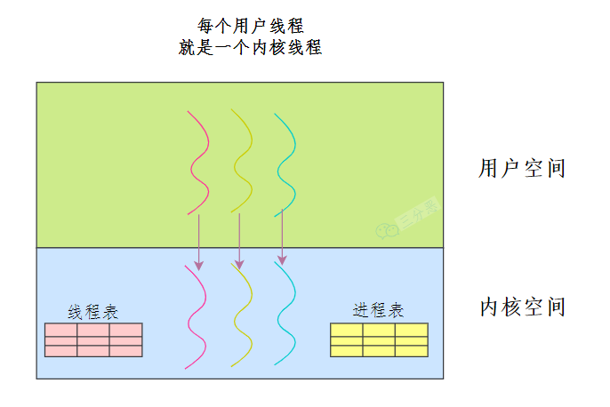

**用户态线程实现：**在用户空间实现线程，不需要内核的参与，内核对线程无感知

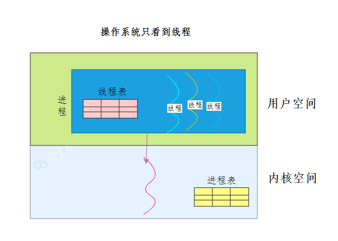

**混合线程实现：**用户态的执行系统负责进程内部线程在非阻塞时的切换；内核态的操作系统负责阻塞线程时的切换。即同时实现内核态和用户态线程管理。其中内核态线程数量较少，而用户态线程数量较多。每个内核态线程可以服务一个或多个用户态线程。

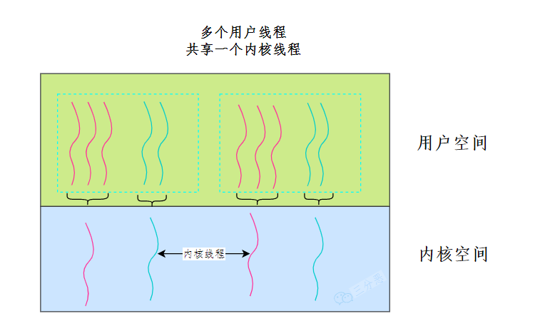

## 19


## 20 


## 21 


## 22 


## 23


## 24 存储器的结构


- CPU寄存器
- 高速缓存（独立硬件，不是内存条的一部分，效率比寄存器低，比主存储器高）
- 主存储器（内存条）
- 硬盘缓存（缓冲地带，做临时存储，从物理上是属于硬盘的一部分，进程suspend后放在外存，就是这里）
- 固定磁盘（磁盘）
- 可移动存储介质（U盘）


## 25 什么是虚拟内存


如果两个进程都直接操作物理内存，这种情况下同时运行两个程序是不可能的，如果第一个程序在0x1234位置上写入了数据，将会擦掉另一个程序在该位置上写入的数据。如何避免？

可以把进程所使用的地址隔离开来，即让操作系统为每个进程分配独立的一套虚拟地址，互不干涉。操作系统负责虚拟地址和物理内存的映射。

**虚拟内存：**操作系统的一种机制，将不同进程的虚拟内存地址和不同内存的物理内存地址映射起来

如果程序要访问虚拟地址的时候，由操作系统转换成不同的物理地址，这样不同的进程运行的时候，写入的是不同的物理地址，就不会冲突了。

- 虚拟内存地址：程序所使用的内存地址
- 物理内存地址：实际存在硬件里面的空间地址

**操作系统是如何管理虚拟地址与物理地址之间的关系？**

主要有两种方式：内存分段、内存分页


## 26 内存分段

程序是由若干个逻辑分段组成的，可由代码分段、数据分段、栈段、堆段组成。不同的段是有不同的属性的，所以就用分段的形式把这些段分离出来。

分段机制下的虚拟地址由两部分组成：段选择因子和段内偏移量

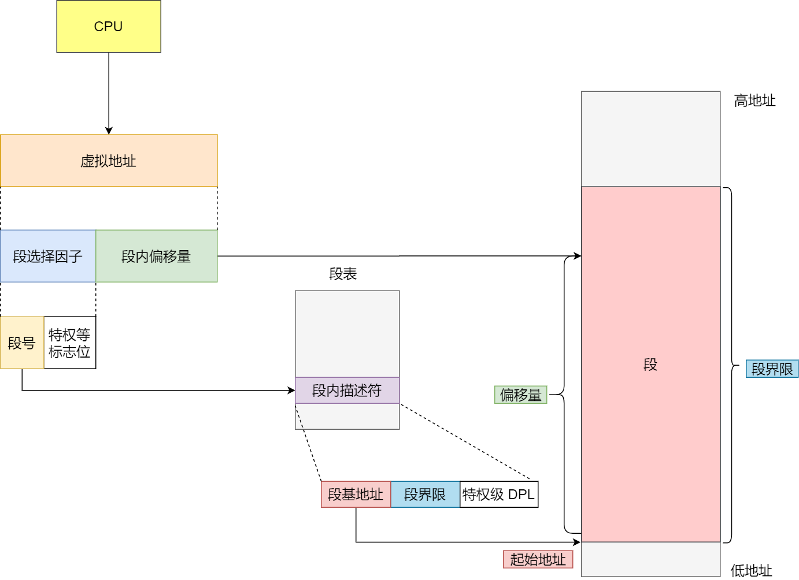

段选择因子：保存在段寄存器里面。段选择因子里面最重要的就是段号，用作段表的索引。段表里面保存的是这个段的基地址、段的界限和特权等级等。

段内偏移量应该位于0和段界限之间，如果段内偏移量是合法的，就将段基地址加上段内偏移量得到物理内存地址。

分段机制会把程序的虚拟地址分成4个段，每个段在段表中有一个项，在这一项找到段的基地址，再加上偏移量，于是就能找到物理内存中的地址：

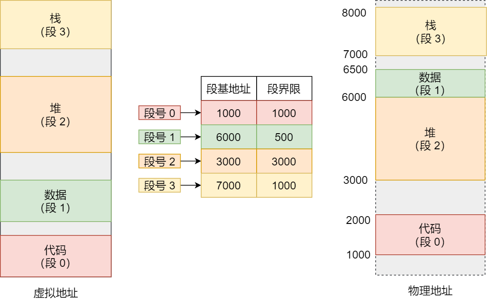

如果要访问段 3 中偏移量 500 的虚拟地址，我们可以计算出物理地址为，段 3 基地址 7000 + 偏移量 500 = 7500。

分段的缺点：

- 内存碎片的问题
- 内存交换的效率低的问题

**为什么会产生内存碎片问题？**

举个例子。假设有 1G 的物理内存，用户执行了多个程序，其中：

- 游戏占用了 512MB 内存
- 浏览器占用了 128MB 内存
- 音乐占用了 256 MB 内存。

这个时候，如果我们关闭了浏览器，则空闲内存还有 1024 - 512 - 256 = 256MB。

如果这个 256MB 不是连续的，被分成了两段 128 MB 内存，这就会导致没有空间再打开一个 200MB 的程序

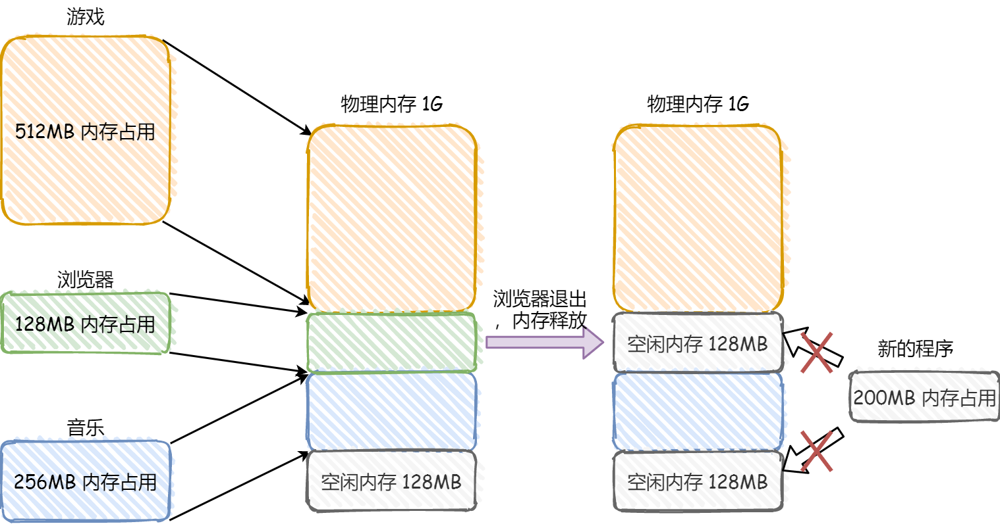

内存碎片主要分为：内部内存碎片、外部内存碎片

- 内部内存碎片：内部碎片是由于系统分配给进程的空间大于其所申请的大小，处于区域内部的内存，占有这些区域或页面的进程并不使用这个存储块。而在进程占有这块内存时，系统无法利用它。直到进程释放它或进程结束时，系统才有可能利用这块内存。

- 外部内存碎片：外部碎片是指还没有被分配出去（不属于任何进程），但由于太小了无法分配给申请内存空间的新进程的内存空闲区域。

内存分段管理可以做到段根据实际需求分配内存，所以有多少需求就分配多大内存，所以不会出现内部内存碎片。

但是由于每个段的长度不固定，所以多个段未必能刚好使用所有的内存空间，会产生多个不连续的内存，导致新的程序无法被装载，所以会出现外部内存碎片的问题。

解决外部内存碎片问题的方法就是内存交换。

可以把音乐程序占用的那 256MB 内存写到硬盘上，然后再从硬盘上读回来到内存里。不过再读回的时候，我们不能装载回原来的位置，而是紧紧跟着那已经被占用了的 512MB 内存后面。这样就能空缺出连续的 256MB 空间，于是新的 200MB 程序就可以装载进来。

这个内存交换空间，在 Linux 系统里，也就是我们常看到的 Swap 空间，这块空间是从硬盘划分出来的，用于内存与硬盘的空间交换。

**分段为什么会导致内存交换效率低的问题？**

因为硬盘的访问速度要比内存慢多了，每一次内存交换，都需要把一大段连续的内存数据写到硬盘上。

为了解决内存分段的外部内存碎片和内存交换效率低的问题，就出现了内存分页

> 理解：把内存分成代码段、数据段、堆段、栈段，每一次执行程序时就分别申请各个段的一部分


## 27 内存分页  

 

## 28 虚拟技术

虚拟技术就是把一个物理实体转换为多个逻辑实体。

主要有两种虚拟技术：时分复用技术（时间）、空分复用技术（空间）

多进程与多线程：多个进程能在同一个处理器上并发执行使用了时分复用技术，让每个进程轮流占用处理器，每次只执行一小个时间片并快速切换。

虚拟内存使用了空分复用技术：它将物理内存抽象为逻辑上的地址空间，每个进程都有自己的地址空间。地址空间的页被映射到物理内存，地址空间的页并不需要全部在物理内存中，当使用到一个没有在物理内存的页时，执行页面置换算法，将该页置换到内存中。

虚拟内存的目的：虚拟内存的目的是为了让物理内存扩充成更大的逻辑内存，从而让程序获得更多的可用内存。

为了更好的管理内存，操作系统将内存抽象成地址空间，每个程序拥有自己的地址空间，这个地址空间被分割成多个块，每一块称为一页。

这些页被映射到物理内存，但不需要映射到连续的物理内存，也不需要所有页都必须在物理内存中。当程序引用到不在物理内存中的页时，由硬件执行映射，将缺失的部分装入物理内存并重新执行失败的指令。

> 虚拟内存可以实现程序不用将地址空间中的每一页都映射到物理内存，也就是说一个程序不需要全部调入内存就可以运行。


## 29 逻辑地址和物理地址

举例：编译时只需要确定变量x存放的相对地址是100（相对于进程在内存中的起始地址而言的地址）。CPU想要访问x在内存中的实际存放位置，只需要用进程的起始地址+100即可。相对地址又称为逻辑地址，绝对地址又称为物理地址。

## 30 内存覆盖

由于程序运行时并非任何时候都要访问程序及数据的所有部分，所以可以把用户空间分成为一个固定区和若干个覆盖区。将经常活跃的部分放在固定区，其余部分按照调用关系分段，首先将那些即将要访问的段放入覆盖区，其它段放在外存中，在需要调用前，系统将其调入覆盖区，替换覆盖区中原有的段。

特点：无须将一个进程的全部信息装入内存中才能运行。但是当同时运行的代码量大于主存时仍不能运行。

## 31 内存交换

内存空间紧张时，系统将内存中某些进程暂时换出外存，把外村中某些已具备运行条件的进程换入内存。（进程在内存与磁盘空间动态调度）

**什么时候会进行内存交换：**

内存交换通常在许多进程运行且内存紧张时进行，系统负荷降低时暂停。

**内存交换和覆盖有什么区别**

交换技术主要是在不同进程（或作业）之间进行，而覆盖则用于同一进程或程序中。

## 32 进程同步解决了什么问题


## 33 进程同步的方法


## 34 线程同步解决了什么问题

线程的主要优势在于，能够通过全局变量来共享信息。不过，这种便捷的共享是有代价的：必须确保多个线程不会同时修改同一变量，或者某一线程不会读取正在由其他线程修改的变量。

- 临界区是指访问某一共享资源的代码片段，并且这段代码的执行应为原子操作，也就是同时访问同一共享资源的其他线程不应终端该片段的执行。
- 线程同步：即当有一个线程在对内存进行操作时，其他线程都不可以对这个内存地址进行操作，直到该线程完成操作，其他线程才能对该内存地址进行操作，而其他线程则处 于等待状态。

> 线程同步解决了多个线程同时访问同一块内存(同一个变量)引发的数据安全问题。


## 35 线程同步的方法

### 互斥锁（互斥量）

**含义：**

- 为避免线程更新共享变量时出现问题，可以使用互斥量（mutex 是 mutual exclusion 的缩写）来确保同时仅有一个线程可以访问某项共享资源。可以使用互斥量来保证对任意共 享资源的原子访问。

- 互斥量有两种状态：已锁定（locked）和未锁定（unlocked）。任何时候，至多只有一 个线程可以锁定该互斥量。试图对已经锁定的某一互斥量再次加锁，将可能阻塞线程或者报 错失败，具体取决于加锁时使用的方法。

- 一旦线程锁定互斥量，随即成为该互斥量的所有者，只有所有者才能给互斥量解锁。一般情 况下，对每一共享资源（可能由多个相关变量组成）会使用不同的互斥量，每一线程在访问 同一资源时将采用如下协议：
  - 针对共享资源锁定互斥量 
  - 访问共享资源
  - 对互斥量解锁

**原理：**

如果多个线程试图执行这一块代码（一个**临界区**），事实上只有一个线程能够持有该互斥量（其他线程将遭到阻塞），即同时只有一个线程能够进入这段代码区域，如下图所示：


> 多线程编程时需要准确找到临界区

**用法：**相关API，实现在库里

```c++
互斥量的类型 pthread_mutex_t
    int pthread_mutex_init(pthread_mutex_t *restrict mutex, const pthread_mutexattr_t *restrict attr);
- 初始化互斥量
    - 参数 ：
    - mutex ： 需要初始化的互斥量变量
    - attr ： 互斥量相关的属性，NULL
    - restrict : C语言的修饰符，被修饰的指针，不能由另外的一个指针进行操作。
        pthread_mutex_t *restrict mutex = xxx;
pthread_mutex_t * mutex1 = mutex;

int pthread_mutex_destroy(pthread_mutex_t *mutex);
- 释放互斥量的资源

int pthread_mutex_lock(pthread_mutex_t *mutex);
- 加锁，阻塞的，如果有一个线程加锁了，那么其他的线程只能阻塞等待

int pthread_mutex_trylock(pthread_mutex_t *mutex);
- 尝试加锁，如果加锁失败，不会阻塞，会直接返回。

int pthread_mutex_unlock(pthread_mutex_t *mutex);
- 解锁
```

```c++
#include <stdio.h>
#include <pthread.h>
#include <unistd.h>

// 全局变量，所有的线程都共享这一份资源。
int tickets = 1000;

// 创建一个互斥量
pthread_mutex_t mutex;

void * sellticket(void * arg) {

    // 卖票
    while(1) {

        // 加锁
        pthread_mutex_lock(&mutex);

        if(tickets > 0) {
            usleep(60000);
            printf("%ld 正在卖第 %d 张门票\n", pthread_self(), tickets);
            tickets--;
        }else {
            // 解锁
            pthread_mutex_unlock(&mutex);
            break;
        }

        // 解锁
        pthread_mutex_unlock(&mutex);
    }
    return NULL;
}  

int main() {

    // 初始化互斥量
    pthread_mutex_init(&mutex, NULL);

    // 创建3个子线程
    pthread_t tid1, tid2, tid3;
    pthread_create(&tid1, NULL, sellticket, NULL);
    pthread_create(&tid2, NULL, sellticket, NULL);
    pthread_create(&tid3, NULL, sellticket, NULL);

    // 回收子线程的资源,如果线程正在用，这个函数阻塞
    pthread_join(tid1, NULL);
    pthread_join(tid2, NULL);
    pthread_join(tid3, NULL);

    pthread_exit(NULL); // 退出主线程

    // 释放互斥量资源
    pthread_mutex_destroy(&mutex);

    return 0;
}
```

### 死锁

**含义：**

在两个或者多个并发线程中，如果每个线程持有某种资源，而又等待其它线程释放它或者它们现在保持着的资源，在未改变这种状态之前都不能向前推进，称这一组线程产生了死锁。通俗的讲就是两个或多个线程无期限的阻塞、相互等待的一种状态。

**死锁产生的场景：**

- 忘记释放锁
- 重复加锁
- 多线程多锁，抢占锁资源

**怎么检测死锁**


**死锁产生的条件：**针对多线程多锁，抢占锁资源场景下

- 互斥条件：共享资源的排他性访问
- 不可剥夺条件：访问时该共享资源不会被剥夺
- 请求并保持条件：保持当前资源时请求另一个资源
- 循环等待条件：存在共享资源的循环等待链

**避免死锁：**

- 消除互斥条件：将独享的资源改成共享的，但是很多情况下，资源是无法改成共享的。

- 消除不可剥夺条件：占用部分资源的线程进一步申请其它资源时，如果申请不到，可以主动释放它占有的资源

- 消除请求并保持条件：一个线程一次请求其所需要的所有资源/或者阶段性请求释放资源

- 消除循环等待条件：对资源按序申请。所谓按序申请，是指资源是有线性顺序的，申请的时候可以先申请资源序号小的，再申请资源序号大的，这样线性化后就不存在循环了。

**死锁场景举例：**

```c++
// 全局变量，所有的线程都共享这一份资源。
int tickets = 1000;

// 创建一个互斥量
pthread_mutex_t mutex;

void * sellticket(void * arg) {
    // 卖票
    while(1) {
        // 加锁
        pthread_mutex_lock(&mutex);
        pthread_mutex_lock(&mutex); // 场景2：对同一资源（临界区）重复加锁
        if(tickets > 0) {
            usleep(60000);
            printf("%ld 正在卖第 %d 张门票\n", pthread_self(), tickets);
            tickets--;
        }else {
            // 解锁
            pthread_mutex_unlock(&mutex);
            break;
        }
        // 解锁
        pthread_mutex_unlock(&mutex); 
        // pthread_mutex_unlock(&mutex);  // 场景1：忘记释放锁
    }
    return NULL;
}
int main() {
	...
    return 0;
}
```

场景3：多线程多锁，抢占锁资源

```c++
#include <stdio.h>
#include <pthread.h>
#include <unistd.h>

// 创建2个互斥量
pthread_mutex_t mutex1, mutex2;

void * workA(void * arg) {
	// 线程tid1拿到了mutex1之后想再拿mutex2
    pthread_mutex_lock(&mutex1);
    sleep(1);
    pthread_mutex_lock(&mutex2);
	
    printf("workA....\n"); // 假设在访问临界区资源

    pthread_mutex_unlock(&mutex2);
    pthread_mutex_unlock(&mutex1);
    return NULL;
}

void * workB(void * arg) {
    // 线程tid2拿到了mutex2之后想再拿mutex1
    pthread_mutex_lock(&mutex2);
    sleep(1);
    pthread_mutex_lock(&mutex1);

    printf("workB....\n"); // 假设在访问临界区资源

    pthread_mutex_unlock(&mutex1);
    pthread_mutex_unlock(&mutex2);

    return NULL;
}

int main() {

    // 初始化互斥量
    pthread_mutex_init(&mutex1, NULL);
    pthread_mutex_init(&mutex2, NULL);

    // 创建2个子线程，线程tid1执行workA，线程tid2执行workB
    pthread_t tid1, tid2;
    pthread_create(&tid1, NULL, workA, NULL);
    pthread_create(&tid2, NULL, workB, NULL);

    // 回收子线程资源
    pthread_join(tid1, NULL);
    pthread_join(tid2, NULL);

    // 释放互斥量资源
    pthread_mutex_destroy(&mutex1);
    pthread_mutex_destroy(&mutex2);

    return 0;
}
```

### 读写锁

**含义：**

当有一个线程已经持有互斥锁时，互斥锁将所有试图进入临界区的线程都阻塞住。但是考虑一种情形，当前持有互斥锁的线程只是要读访问共享资源，而同时有其它几个线程也想读取这个共享资源，但是由于互斥锁的排它性，所有其它线程都无法获取锁，也就无法读 访问共享资源了，但是实际上多个线程同时读访问共享资源并不会导致问题。

- 在对数据的读写操作中，更多的是读操作，写操作较少，例如对数据库数据的读写应用。 为了满足当前能够允许多个读出，但只允许一个写入的需求，线程提供了读写锁来实现。
- 读写锁的特点：
  - 如果有其它线程读数据，则允许其它线程执行读操作，但不允许写操作。
  - 如果有其它线程写数据，则其它线程都不允许读、写操作。
  - 写是独占的，写的优先级高

**使用**：相关API

```c++
读写锁的类型 pthread_rwlock_t
int pthread_rwlock_init(pthread_rwlock_t *restrict rwlock, const pthread_rwlockattr_t *restrict attr);
int pthread_rwlock_destroy(pthread_rwlock_t *rwlock);
int pthread_rwlock_rdlock(pthread_rwlock_t *rwlock);
int pthread_rwlock_tryrdlock(pthread_rwlock_t *rwlock);
int pthread_rwlock_wrlock(pthread_rwlock_t *rwlock);
int pthread_rwlock_trywrlock(pthread_rwlock_t *rwlock);
int pthread_rwlock_unlock(pthread_rwlock_t *rwlock);
```

**举例：**

```c++
#include <stdio.h>
#include <pthread.h>
#include <unistd.h>

// 创建一个共享数据
int num = 1;

pthread_rwlock_t rwlock;

void * writeNum(void * arg) {

    while(1) {
        pthread_rwlock_wrlock(&rwlock);
        num++;
        printf("++write, tid : %ld, num : %d\n", pthread_self(), num);
        pthread_rwlock_unlock(&rwlock);
        usleep(100);
    }
    return NULL;
}

void * readNum(void * arg) {

    while(1) {
        pthread_rwlock_rdlock(&rwlock);
        printf("===read, tid : %ld, num : %d\n", pthread_self(), num);
        pthread_rwlock_unlock(&rwlock);
        usleep(100);
    }

    return NULL;
}

int main() {

   pthread_rwlock_init(&rwlock, NULL);

    // 创建3个写线程，5个读线程
    pthread_t wtids[3], rtids[5];
    for(int i = 0; i < 3; i++) {
        pthread_create(&wtids[i], NULL, writeNum, NULL);
    }

    for(int i = 0; i < 5; i++) {
        pthread_create(&rtids[i], NULL, readNum, NULL);
    }

    // 设置线程分离
    for(int i = 0; i < 3; i++) {
       pthread_detach(wtids[i]);
    }

    for(int i = 0; i < 5; i++) {
         pthread_detach(rtids[i]);
    }
    pthread_rwlock_destroy(&rwlock);
    pthread_exit(NULL);
    return 0;
}
```

### 条件变量

**含义：**条件变量不是锁，是为了控制线程是否阻塞，可以配合互斥量实现同步

**操作：**

```c++
条件变量的类型 pthread_cond_t
    
int pthread_cond_init(pthread_cond_t *restrict cond, const pthread_condattr_t *restrict attr);
int pthread_cond_destroy(pthread_cond_t *cond);
int pthread_cond_wait(pthread_cond_t *restrict cond, pthread_mutex_t *restrict mutex);
- 等待，调用了该函数，线程会阻塞。
    
int pthread_cond_timedwait(pthread_cond_t *restrict cond, pthread_mutex_t *restrict mutex, const struct timespec *restrict abstime);
- 等待多长时间，调用了这个函数，线程会阻塞，直到指定的时间结束。
    
int pthread_cond_signal(pthread_cond_t *cond);
- 唤醒一个或者多个等待的线程
    
int pthread_cond_broadcast(pthread_cond_t *cond);
- 唤醒所有的等待的线程
```

**举例：**

```c++
#include <stdio.h>
#include <pthread.h>
#include <stdlib.h>
#include <unistd.h>

// 创建一个互斥量
pthread_mutex_t mutex;
// 创建条件变量
pthread_cond_t cond;

struct Node{
    int num;
    struct Node *next;
};

// 头结点
struct Node * head = NULL;

void * producer(void * arg) {

    // 不断的创建新的节点，添加到链表中
    while(1) {
        pthread_mutex_lock(&mutex); // 加互斥锁
        
        struct Node * newNode = (struct Node *)malloc(sizeof(struct Node));
        newNode->next = head;
        head = newNode;
        newNode->num = rand() % 1000;
        printf("add node, num : %d, tid : %ld\n", newNode->num, pthread_self());
        
        // 只要生产了一个，就通知消费者消费
        pthread_cond_signal(&cond);

        pthread_mutex_unlock(&mutex); //解互斥锁
        usleep(100);
    }

    return NULL;
}

void * customer(void * arg) {

    while(1) {
        pthread_mutex_lock(&mutex); // 加互斥锁
        // 保存头结点的指针
        struct Node * tmp = head;
        // 判断是否有数据
        if(head != NULL) {
            // 有数据
            head = head->next;
            printf("del node, num : %d, tid : %ld\n", tmp->num, pthread_self());
            free(tmp);
            pthread_mutex_unlock(&mutex);
            usleep(100);
        } else {
            // 没有数据，需要等待
            // 【重要】：当这个函数调用阻塞的时候，会对互斥锁进行解锁，当不阻塞的，继续向下执行，会重新加锁。
            pthread_cond_wait(&cond, &mutex);

            pthread_mutex_unlock(&mutex); //解互斥锁
        }
    }
    return  NULL;
}

int main() {

    pthread_mutex_init(&mutex, NULL);
    pthread_cond_init(&cond, NULL);

    // 创建5个生产者线程，和5个消费者线程
    pthread_t ptids[5], ctids[5];

    for(int i = 0; i < 5; i++) {
        pthread_create(&ptids[i], NULL, producer, NULL);
        pthread_create(&ctids[i], NULL, customer, NULL);
    }

    for(int i = 0; i < 5; i++) {
        pthread_detach(ptids[i]);
        pthread_detach(ctids[i]);
    }

    while(1) {
        sleep(10);
    }

    pthread_mutex_destroy(&mutex);
    pthread_cond_destroy(&cond);

    pthread_exit(NULL);

    return 0;
}

```

### 信号量

含义：通过信号量的等待（P操作）还有释放（V操作）来保证线程间对资源的同步访问

操作：

```c++
信号量的类型 sem_t
int sem_init(sem_t *sem, int pshared, unsigned int value);
- 初始化信号量
    - 参数：
    - sem : 信号量变量的地址
    - pshared : 0 用在线程间 ，非0 用在进程间
    - value : 信号量中的值

int sem_destroy(sem_t *sem);
- 释放资源

int sem_wait(sem_t *sem);
- 对信号量加锁，调用一次对信号量的值-1，如果值为0，就阻塞

int sem_trywait(sem_t *sem);

int sem_timedwait(sem_t *sem, const struct timespec *abs_timeout);
int sem_post(sem_t *sem);
- 对信号量解锁，调用一次对信号量的值+1

int sem_getvalue(sem_t *sem, int *sval);
```

**举例**

```c++
#include <stdio.h>
#include <pthread.h>
#include <stdlib.h>
#include <unistd.h>
#include <semaphore.h>

// 创建一个互斥量
pthread_mutex_t mutex;
// 创建两个信号量
sem_t psem;
sem_t csem;

struct Node{
    int num;
    struct Node *next;
};

// 头结点
struct Node * head = NULL;

void * producer(void * arg) {

    // 不断的创建新的节点，添加到链表中
    while(1) { 
        sem_wait(&psem); // 对于生产者，wait是等待信号量大于0  psem--
        pthread_mutex_lock(&mutex); // 加互斥锁
        struct Node * newNode = (struct Node *)malloc(sizeof(struct Node));
        newNode->next = head;
        head = newNode;
        newNode->num = rand() % 1000;
        printf("add node, num : %d, tid : %ld\n", newNode->num, pthread_self());
        pthread_mutex_unlock(&mutex); // 解互斥锁
        sem_post(&csem); // 通知消费者，去消费 csem++
    }

    return NULL;
}

void * customer(void * arg) {

    while(1) {
        sem_wait(&csem); // 对于消费者，wait是等待生产者生产 csem--
        pthread_mutex_lock(&mutex); // 加互斥锁
        // 保存头结点的指针
        struct Node * tmp = head;
        head = head->next;
        printf("del node, num : %d, tid : %ld\n", tmp->num, pthread_self());
        free(tmp);
        pthread_mutex_unlock(&mutex); // 解互斥锁
        sem_post(&psem); // 通知生产者，去生产 psem++
       
    }
    return  NULL;
}

int main() {

    pthread_mutex_init(&mutex, NULL);
    sem_init(&psem, 0, 8);
    sem_init(&csem, 0, 0);

    // 创建5个生产者线程，和5个消费者线程
    pthread_t ptids[5], ctids[5];

    for(int i = 0; i < 5; i++) {
        pthread_create(&ptids[i], NULL, producer, NULL);
        pthread_create(&ctids[i], NULL, customer, NULL);
    }

    for(int i = 0; i < 5; i++) {
        pthread_detach(ptids[i]);
        pthread_detach(ctids[i]);
    }

    while(1) {
        sleep(10);
    }

    pthread_mutex_destroy(&mutex);

    pthread_exit(NULL);

    return 0;
}

```


参考：

https://segmentfault.com/a/1190000022478666