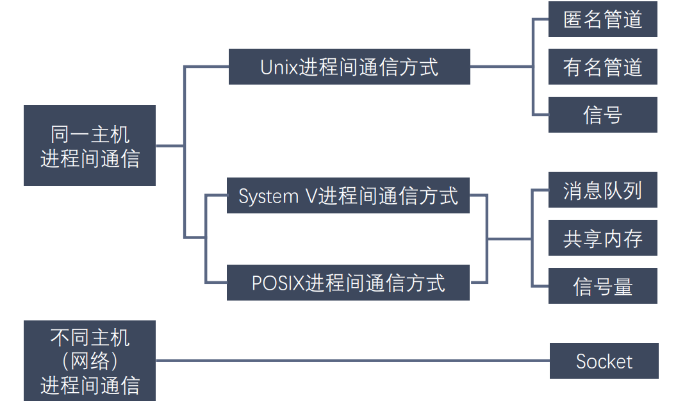
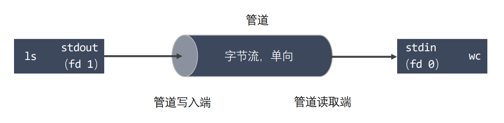
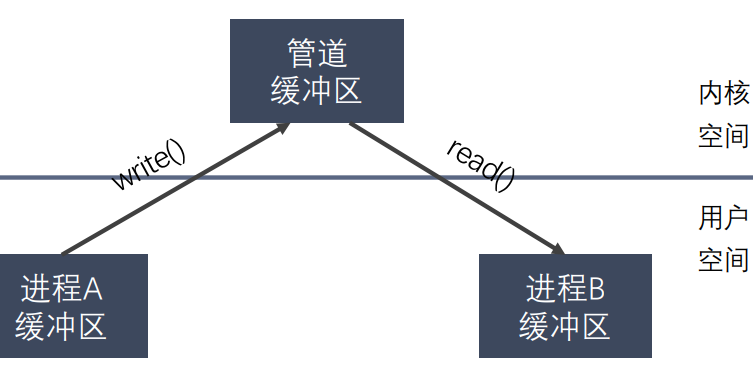
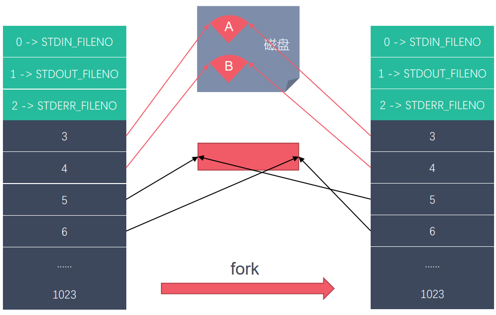
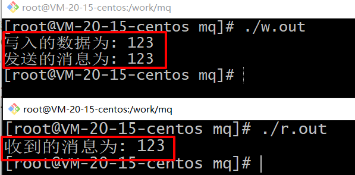

# 1 进程间通信的目的

进程是一个独立的资源分配单元，不同进程（这里所说的进程通常指的是用户进程）之间的资源是独立的，没有关联，不能在一个进程中直接访问另一个进程的资源。 

但进程不是孤立的，不同的进程需要进行信息的交互和状态的传递等，因此需要进程间通信( IPC：Inter Processes Communication )。 

进程间通信的目的：

- 数据传输：一个进程需要将它的数据发送给另一个进程。
- 通知事件：一个进程需要向另一个或一组进程发送消息，通知它（它们）发生了某种事件（如进程终止时要通知父进程）。 
- 资源共享：多个进程之间共享同样的资源。为了做到这一点，需要内核提供互斥和同 步机制。
- 进程控制：有些进程希望完全控制另一个进程的执行（如 Debug 进程），此时控制进程希望能够拦截另一个进程的所有陷入和异常，并能够及时知道它的状态改变。

# 2 进程间通信方式




## 1 匿名管道

 管道也叫无名（匿名）管道，它是 UNIX 系统 IPC（进程间通信）的最古老形式， 所有的 UNIX 系统都支持这种通信机制。 

举例：统计一个目录中文件的数目命令：ls | wc –l，为了执行该命令，shell 创建了两 个进程来分别执行 ls 和 wc。



**管道的特点**：

- 管道其实是一个在内核内存中维护的缓冲器，这个缓冲器的存储能力是有限的，不同的 操作系统大小不一定相同。
- 管道拥有文件的特质：读操作、写操作，匿名管道没有文件实体，有名管道有文件实体， 但不存储数据。可以按照操作文件的方式对管道进行操作。
- 一个管道是一个字节流，使用管道时不存在消息或者消息边界的概念，从管道读取数据 的进程可以读取任意大小的数据块，而不管写入进程写入管道的数据块的大小是多少。
- 通过管道传递的数据是顺序的，从管道中读取出来的字节的顺序和它们被写入管道的顺 序是完全一样的。
- 在管道中的数据的传递方向是单向的，一端用于写入，一端用于读取，管道是半双工的。
- 从管道读数据是一次性操作，数据一旦被读走，它就从管道中被抛弃，释放空间以便写 更多的数据，在管道中无法使用 lseek() 来随机的访问数据。
- 匿名管道只能在具有关系之间的进程（父进程与子进程，或者两个兄弟进程，具有亲缘关系）之间使用。



**为什么可以使用管道进行进程间通信**



左边为父进程的虚拟空间（内核空间+用户空间），右边是父进程创建出来的子进程的虚拟空间。

子进程创建之后，被拷贝一份数据，和父进程共享管道缓冲区。

父进程的5号文件操作符，对应管道的写端，6号文件操作符对应管道的读端。

那么拷贝出来的子进程的5号文件操作符，也就是对应管道的写端，6号文件操作符对应管道的读端。

那么父进程使用5号文件操作符向管道写入数据时，子进程的6号文件操作符就能够读取到数据，反之也一样。


**管道的数据结构**

环形队列


**管道的使用**

```c++
  /*
    #include <unistd.h>
    int pipe(int pipefd[2]);
        功能：创建一个匿名管道，用来进程间通信。
        参数：int pipefd[2] 这个数组是一个传出参数。
            pipefd[0] 对应的是管道的读端
            pipefd[1] 对应的是管道的写端
        返回值：
            成功 0
            失败 -1

    管道默认是阻塞的：如果管道中没有数据，read阻塞，如果管道满了，write阻塞

    注意：匿名管道只能用于具有关系的进程之间的通信（父子进程，兄弟进程）
    	一个进程要么只进行读，要么只进行写，用同一个管道并且同时进行读写时，会产生问题。
*/

// 需求：子进程发送数据给父进程，父进程读取到数据输出
#include <unistd.h>
#include <sys/types.h>
#include <stdio.h>
#include <stdlib.h>
#include <string.h>
using namespace std;

int main() {

    // 在fork之前创建管道，否则父进程和子进程之间用的不是同一个管道了，无法通信
    int pipefd[2];
    int ret = pipe(pipefd);
    if(ret == -1) {
        perror("pipe");
        exit(0);
    }

    // 创建子进程
    pid_t pid = fork();
    if(pid > 0) {
        // 父进程
        printf("i am parent process, pid : %d\n", getpid());

        // 关闭写端
        // close(pipefd[1]);
        
        // 从管道的读取端读取数据
        char buf[1024] = {0};
        while(1) {
            int len = read(pipefd[0], buf, sizeof(buf));
            printf("parent recv : %s, pid : %d\n", buf, getpid());
            
            // 向管道中写入数据
            // const char * str = "hello,i am parent";
            // write(pipefd[1], str, strlen(str));
            // sleep(1);
        }

    } else if(pid == 0){
        // 子进程
        printf("i am child process, pid : %d\n", getpid());
        // 关闭读端
        // close(pipefd[0]);

        char buf[1024] = {0};
        while(1) {
            // 向管道中写入数据
            const char * str = "hello,i am child";
            write(pipefd[1], str, strlen(str));
            sleep(1);

            // 从管道中读数据
            // int len = read(pipefd[0], buf, sizeof(buf));
            // printf("child recv : %s, pid : %d\n", buf, getpid());
            // bzero(buf, 1024);
        }
        
    }
    return 0;
}
```

**管道的读写特点：**
使用管道时，需要注意以下几种特殊的情况（假设都是阻塞I/O操作）

- 所有的指向管道写端的文件描述符都关闭了（管道写端引用计数为0），有进程从管道的读端读数据，那么管道中剩余的数据被读取以后，再次read会返回0，就像读到文件末尾一样。

- 如果有指向管道写端的文件描述符没有关闭（管道的写端引用计数大于0），而持有管道写端的进程
  也没有往管道中写数据，这个时候有进程从管道中读取数据，那么管道中剩余的数据被读取后，
  再次read会阻塞，直到管道中有数据可以读了才读取数据并返回。

- 如果所有指向管道读端的文件描述符都关闭了（管道的读端引用计数为0），这个时候有进程
  向管道中写数据，那么该进程会收到一个信号SIGPIPE, 通常会导致进程异常终止。

- 如果有指向管道读端的文件描述符没有关闭（管道的读端引用计数大于0），而持有管道读端的进程
  也没有从管道中读数据，这时有进程向管道中写数据，那么在管道被写满的时候再次write会阻塞，
  直到管道中有空位置才能再次写入数据并返回。

**总结：**

- 读管道：
  - 管道中有数据，read返回实际读到的字节数。
  - 管道中无数据：
    - 写端被全部关闭，read返回0（相当于读到文件的末尾）
    - 写端没有完全关闭，read阻塞等待

- 写管道：
  - 管道读端全部被关闭，进程异常终止（进程收到SIGPIPE信号）
  - 管道读端没有全部关闭：
    - 管道已满，write阻塞
    - 管道没有满，write将数据写入，并返回实际写入的字节数


## 2 有名管道

匿名管道，由于没有名字，只能用于亲缘关系的进程间通信。为了克服这个缺点，提出了有名管道（FIFO），也叫命名管道、FIFO文件。

有名管道（FIFO）不同于匿名管道之处在于它提供了一个路径名与之关联，以 FIFO  的文件形式存在于文件系统中，并且其打开方式与打开一个普通文件是一样的，这样 即使与 FIFO 的创建进程不存在亲缘关系的进程，只要可以访问该路径，就能够彼此 通过 FIFO 相互通信，因此，通过 FIFO 不相关的进程也能交换数据。

一旦打开了 FIFO，就能在它上面使用与操作匿名管道和其他文件的系统调用一样的 I/O系统调用了（如read()、write()和close()）。与管道一样，FIFO 也有一 个写入端和读取端，并且从管道中读取数据的顺序与写入的顺序是一样的。FIFO 的 名称也由此而来：先入先出

有名管道（FIFO)和匿名管道（pipe）有一些特点是相同的，不一样的地方在于： 

- FIFO 在文件系统中作为一个特殊文件存在，但 FIFO 中的内容却存放在内存中，并不存放在文件实体中。
- 当使用 FIFO 的进程退出后，FIFO 文件将继续保存在文件系统中以便以后使用。
- FIFO 有名字，不相关的进程可以通过打开有名管道进行通信。

**有名管道的使用**
创建fifo文件

- 通过命令：`mkfifo` 名字
- 通过函数：`int mkfifo(const char *pathname, mode_t mode);`
  - 参数：
       - pathname: 管道名称的路径
    - mode: 文件的权限 和 open 的 mode 是一样的是一个八进制的数
  - 返回值：成功返回0，失败返回-1，并设置错误号

```c++
#include <stdio.h>
#include <sys/types.h>
#include <sys/stat.h>
#include <stdlib.h>
#include <unistd.h>

int main() {
    // 判断文件是否存在
    int ret = access("fifo1", F_OK);
    if(ret == -1) {
        printf("管道不存在，创建管道\n");
        
        ret = mkfifo("fifo1", 0664);

        if(ret == -1) {
            perror("mkfifo");
            exit(0);
        }
    }
    return 0;
}
```

**案例：**

读管道：

```c++
#include <stdio.h>
#include <sys/types.h>
#include <sys/stat.h>
#include <stdlib.h>
#include <unistd.h>
#include <fcntl.h>

// 从管道中读取数据
int main() {

    // 1.打开管道文件
    int fd = open("test", O_RDONLY);
    if(fd == -1) {
        perror("open");
        exit(0);
    }

    // 读数据
    while(1) {
        char buf[1024] = {0};
        int len = read(fd, buf, sizeof(buf));
        if(len == 0) {
            printf("写端断开连接了...\n");
            break;
        }
        printf("recv buf : %s\n", buf);
    }

    close(fd);

    return 0;
}
```

写管道

```c++
#include <stdio.h>
#include <sys/types.h>
#include <sys/stat.h>
#include <stdlib.h>
#include <unistd.h>
#include <fcntl.h>
#include <string.h>

// 向管道中写数据
int main() {

    // 1.判断文件是否存在
    int ret = access("test", F_OK);
    if(ret == -1) {
        printf("管道不存在，创建管道\n");
        
        // 2.创建管道文件
        ret = mkfifo("test", 0664);

        if(ret == -1) {
            perror("mkfifo");
            exit(0);
        }       
    }

    // 3.以只写的方式打开管道
    int fd = open("test", O_WRONLY);
    if(fd == -1) {
        perror("open");
        exit(0);
    }

    // 写数据
    for(int i = 0; i < 100; i++) {
        char buf[1024];
        sprintf(buf, "hello, %d\n", i);
        printf("write data : %s\n", buf);
        write(fd, buf, strlen(buf));
        sleep(1);
    }

    close(fd);

    return 0;
}
```

**总结：**

- 一个为只读而打开一个管道的进程会阻塞，直到另外一个进程为只写打开管道
- 一个为只写而打开一个管道的进程会阻塞，直到另外一个进程为只读打开管道

读管道：

- 管道中有数据，read返回实际读到的字节数
- 管道中无数据：
  - 管道写端被全部关闭，read返回0，（相当于读到文件末尾）
  - 写端没有全部被关闭，read阻塞等待

写管道：

- 管道读端被全部关闭，进行异常终止（收到一个SIGPIPE信号）
- 管道读端没有全部关闭：
  - 管道已经满了，write会阻塞
  - 管道没有满，write将数据写入，并返回实际写入的字节数。


## 3 消息队列

### 消息队列解决了什么问题

**解耦**

**有序性**

**异步处理**

**削峰**


### 写进程

消息队列通过`msgsnd`函数发送消息，其声明为：

```c++
int  msgsnd(int msgid, const void *msg_ptr, size_t msg_sz, int msgflg);
```

- `int msgid`：消息队列标识符，由`msgget`函数返回

  - `msgget`函数：创建一个消息队列，返回以key命名的消息队列的标识符 `int msgget(key_t key, int msgflg);`

    - `key`：某个消息队列的名字，`key`如何获取？

      - 通过宏定义`key`值
      - 通过`ftok`函数生成`key`值

      ```c++
      // 函数ftok把一个已存在的路径名和一个整数标识符转换成一个key_t值
      // ftok函数将通过对pathname的索引节点号（inode number）与proj_id进行异或操作生成一个唯一的键值。返回的键值类型是key_t，通常是一个长整型
      key_t ftok(const char *pathname, int proj_id);  // 声明
      key = 123;  // 获取方法1
      key = ftok("progfile", 65);  // 获取方法2
      ```

    - `msgflg`举例说明

      ```bash
      IPC_CREAT	如果消息队列对象不存在，则创建之，否则则进行打开操作
      IPC_EXCL	如果消息对象不存在则创建之，否则产生一个错误并返回
      ```

- `const void *msg_ptr`：是一个指针，指针指向准备发送的消息

- `size_t msg_sz`：是`msg_ptr`指向的消息长度，消息缓冲区结构体中`mtext`的大小,不包括数据的类型

- `int msgflg`：控制着当前消息队列满或到达系统上限时将要发生的事情

  ```c++
  msgflg = IPC_NOWAIT 表示队列满不等待，返回EAGAIN错误
  ```

返回值：

- 成功返回0
- 失败返回-1

### 读进程

使用`msgrcv`函数进行读数据，其声明为：

```c++
int  msgrcv(int msgid, void *msg_ptr, size_t msgsz, long int msgtype, int msgflg);
```

- `int msgid`：由`msgget`函数返回的消息队列标识码，`msgget`函数用法同写进程
- `void *msg_ptr`：是一个指针，指针指向准备接收的消息
- `size_t msgsz`：是`msg_ptr`指向的消息长度，消息缓冲区结构体中`mtext`的大小,不包括数据的类型
- `long int msgtype`：它可以实现接收优先级的简单形式
  - `msgtype=0`返回队列第一条信息
  - `msgtype>0`返回队列第一条类型等于`msgtype`的消息
  - `msgtype<0`返回队列第一条类型小于等于`msgtype`绝对值的消息
- `int msgflg`：控制着队列中没有相应类型的消息可供接收时将要发生的事
  - `msgflg=IPC_NOWAIT`，队列没有可读消息不等待，返回`ENOMSG`错误。
  - `msgflg=MSG_NOERROR`，消息大小超过`msgsz`时被截断

返回值：

- 成功返回实际放到接收缓冲区里去的字符个数
- 失败，则返回-1

### 消息队列的控制函数

函数声明：

```c++
int  msgctl(int msqid, int command, strcut msqid_ds *buf);
```

- `msqid`： 由`msgget`函数返回的消息队列标识码
- `command`：是将要采取的动作,（有三个可取值）分别如下

```bash
IPC_STAT：获取消息队列的状态信息，将 msqid_ds 结构体填充到 buf 中。
IPC_SET：设置消息队列的权限，从 buf 结构体中读取权限信息。
IPC_RMID：删除消息队列，释放相关资源。
```

- `buf`：保存消息队列信息的结构体指针，通常是结构体 `msqid_ds` 的指针，用于传递或接收消息队列的属性信息。

返回值：

- 操作成功，返回0
- 失败，返回-1


### 查看消息队列

- `ipcs -q`：命令查看已经创建的消息队列，包括他的key值信息，id信息，拥有者信息，文件权限信息，已使用的字节数，和消息条数。

- `ipcrm -Q加消息队列的key值`，用来删除一个消息队列。

### 消息队列实验

读进程：

```c++
#include <stdio.h> 
#include <sys/ipc.h> 
#include <sys/msg.h> 
  
//消息结构体
struct mesg_buffer { 
    long mesg_type; 
    char mesg_text[100]; 
} message; 
  
int main() { 
    key_t key; 
    int msgid; 
  
    //函数ftok把一个已存在的路径名和一个整数标识符转换成一个key_t值，称为IPC键值
    key = ftok("progfile", 65); 
  
    // 创建一个新的或打开一个已经存在的消息队列，返回其id
    msgid = msgget(key, 0666 | IPC_CREAT); 
  
    // 接收消息
    msgrcv(msgid, &message, sizeof(message), 1, 0); 
  
    // 显示消息 
    printf("收到的消息为: %s \n",  message.mesg_text); 
  
    // to destroy the message queue 
    msgctl(msgid, IPC_RMID, NULL); 
  
    return 0; 
}
```

写进程

```c++
#include<stdio.h>
#include<sys/ipc.h>
#include<sys/msg.h>

struct msg_buffer{
	long mesg_type;
	char mesg_text[100];
}message;

int main(){
	key_t key; 
    int msgid; 
  
    //函数ftok把一个已存在的路径名和一个整数标识符转换成一个key_t值
    key = ftok("progfile", 65); 
  
    // msgget：创建一个消息队列，返回以key命名的消息队列的标识符
    msgid = msgget(key, 0666 | IPC_CREAT); 
    message.mesg_type = 1; 
  
    printf("写入的数据为: "); 
    gets(message.mesg_text); 
  
    //发送消息
    msgsnd(msgid, &message, sizeof(message), 0); 
  
    printf("发送的消息为: %s \n", message.mesg_text); 
  
    return 0; 
}
```

分别编译：

```bash
g++ read.cpp -o r.out
g++ write.cpp -o w.out
```

得到两个文件：`r.out`和`w.out`，运行




